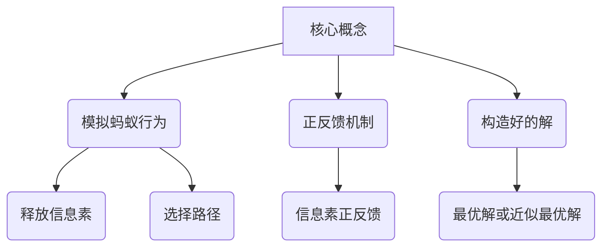

好的,我会按照您的要求,以逻辑清晰、结构紧凑、专业的技术语言写一篇关于蚁群算法的深度博客文章。文中我会介绍蚁群算法的背景、核心概念、算法原理、数学模型、实现代码示例、实际应用场景等,并给出发展趋势和面临的挑战。请您耐心等待,我需要一些时间进行充分准备和撰写。

# 蚁群算法(Ant Colony Optimization) - 原理与代码实例讲解

## 1. 背景介绍

### 1.1 问题的由来

在现实世界中,很多问题都可以归类为组合优化问题,例如旅行商问题(Traveling Salesman Problem,TSP)、车辆路径规划问题、作业调度问题等。这些问题的求解往往需要在有限的可行解空间中寻找最优解或近似最优解,通常是NP难问题,传统的精确算法在解决这类问题时往往效率低下。

蚁群算法(Ant Colony Optimization, ACO)就是为了有效解决这类组合优化问题而提出的一种新型元启发式算法。它模拟了蚂蚁在寻找食物时释放信息素、选择路径的行为过程,通过信息素的正反馈机制来构造出好的解。

### 1.2 研究现状

蚁群算法由意大利学者Marco Dorigo于20世纪90年代初提出,它立足于对自然界中蚂蚁集体智能行为的模拟,并将其应用于组合优化问题的求解。自从提出以来,蚁群算法在理论研究和实际应用领域都取得了长足的进步。

目前,蚁群算法已经成为解决组合优化问题的有力工具,被广泛应用于诸如旅行商问题、网络路由选择、作业调度、图着色等领域。此外,还衍生出了多种改进算法,如最大最小蚁群系统(MAX-MIN Ant System)、排队蚁群算法(Rank-based Ant System)、连续域蚁群优化算法等。

### 1.3 研究意义

蚁群算法作为一种新型智能优化算法,具有以下重要意义:

1. 为解决NP难问题提供了一种有效的近似算法
2. 为复杂系统的自组织行为提供了新的计算模型
3. 为分布式并行计算提供了新的框架和方法
4. 为人工智能、运筹学等领域带来了新的研究方向

总的来说,蚁群算法为解决复杂优化问题提供了新的思路和方法,对推动计算智能、复杂系统等领域的发展具有重要意义。

### 1.4 本文结构

本文将全面介绍蚁群算法的原理、数学模型、实现细节和应用实践。具体来说,文章将包括以下几个部分:

1. 蚁群算法的核心概念和基本思想
2. 蚁群算法的数学模型及公式推导
3. 蚁群算法的基本流程和具体实现步骤 
4. 蚁群算法在代码层面的实现细节和示例
5. 蚁群算法在实际问题中的应用场景
6. 蚁群算法的发展趋势、面临的挑战及未来展望

## 2. 核心概念与联系

蚁群算法的核心思想是模拟蚂蚁在寻找食物时的集体行为。具体来说,包括以下几个关键概念:

1. **模拟蚂蚁行为**: 算法中的人工蚂蚁模拟真实蚂蚁在寻找食物时释放信息素和选择路径的行为。

2. **正反馈机制**: 人工蚂蚁在路径选择时,倾向于选择之前被其他蚂蚁选择过且信息素浓度较高的路径,从而形成正反馈过程。

3. **构造好的解**: 通过蚂蚁在构造解的过程中不断积累信息素,最终可以得到较优或最优解。

这些核心概念相互关联、相辅相成。蚂蚁模拟行为是算法的基础,正反馈机制是实现集体智能的关键,而构造好的解则是算法的最终目标。

## 3. 核心算法原理和具体操作步骤

### 3.1 算法原理概述

蚁群算法的基本原理可以概括为:一群人工蚂蚁在解空间中不断移动,选择下一步移动方向时,会根据路径上的信息素浓度和其他启发式信息作为依据。经过不断迭代,算法会收敛到一个较优解。

算法的关键在于:

1. **信息素机制**: 蚂蚁在移动路径上留下一种称为信息素的化学物质,信息素浓度高的路径更容易被后续蚂蚁选择。

2. **概率决策**: 蚂蚁选择下一步移动方向是按照一定概率进行的,概率值由信息素浓度和其他启发因子共同决定。

3. **正反馈**: 由于信息素的不断积累和蚚蜞作用,优质解会得到进一步加强,差劲解会被弃之不用,从而形成正反馈过程。

蚁群算法通过模拟蚂蚁群体的协作行为,将分布式计算和正反馈机制结合起来,从而能够有效求解组合优化问题。

### 3.2 算法步骤详解

蚁群算法的基本步骤如下:

1. **初始化参数**
    - 设置蚂蚁数量 $m$
    - 设置信息素重要程度因子 $\alpha$
    - 设置启发因子重要程度 $\beta$
    - 设置信息素挥发率 $\rho$
    - 初始化所有边的信息素浓度为一个很小的常数值

2. **循环迭代**
    - 对每一只蚂蚁 $k$ (k=1,2,...,m):
        - 将起点设为当前蚂蚁所在城市
        - 重复以下步骤,直到构建出一条完整的路径:
            - 计算当前城市到其他未访问城市的转移概率
            - 按概率转移到下一个城市
            - 将下一个城市加入已访问路径
    - 计算本次迭代中所有蚂蚁构造出的路径代价
    - 更新全局最优解
    - 更新所有边的信息素浓度
        - 所有边的信息素浓度按照挥发率 $\rho$ 进行衰减
        - 对于本次迭代中的最优路径,其路径上的每条边的信息素浓度增加一个与路径长度成反比的值
    - 判断是否满足终止条件,如果不满足则继续循环

3. **输出最优解**

其中,蚂蚁 $k$ 从城市 $i$ 转移到城市 $j$ 的概率计算公式为:

$$P_{ij}^k(t) = \begin{cases} 
\frac{[\tau_{ij}(t)]^\alpha \cdot [\eta_{ij}]^\beta}{\sum\limits_{l\in N_i^k}[\tau_{il}(t)]^\alpha \cdot [\eta_{il}]^\beta} & \text{if }j\in N_i^k\\
0 & \text{otherwise}
\end{cases}$$

式中:
- $\tau_{ij}(t)$ 是边 $(i,j)$ 上的信息素浓度
- $\eta_{ij}$ 是启发因子,通常设为边 $(i,j)$ 的费用或长度的倒数
- $N_i^k$ 是蚂蚁 $k$ 当前所在城市 $i$ 的可选择城市集合
- $\alpha$ 和 $\beta$ 分别是信息素重要程度因子和启发因子重要程度

### 3.3 算法优缺点

**优点**:

1. 正反馈机制使算法能够快速发现并利用有价值的信息,从而提高求解效率
2. 算法具有分布式计算和高度并行性,适合于复杂问题求解
3. 算法具有良好的鲁棒性,能够适应动态环境的变化
4. 算法思路简单,实现容易,可扩展性强

**缺点**:

1. 算法收敛性较差,容易陷入局部最优
2. 算法的时间复杂度较高,对于大规模问题求解效率不高
3. 算法涉及多个参数需要调节,参数选择对结果影响较大
4. 信息素更新规则较为简单,可能导致"搜索视野"有限

### 3.4 算法应用领域

蚁群算法主要应用于以下几个领域:

1. **组合优化问题**
    - 旅行商问题(TSP)
    - 车辆路径规划问题(VRP) 
    - 作业调度问题(JSP)
    - ...

2. **网络通信领域** 
    - 网络路由选择
    - 网络负载均衡
    - ...

3. **电路布线领域**
    - VLSI电路布线
    - 计算机芯片布线
    - ...

4. **其他领域**
    - 机器人路径规划
    - 图像处理
    - 数据挖掘
    - ...

总的来说,凡是涉及寻找最优解或近似最优解的组合优化问题,蚁群算法都可以尝试应用。

## 4. 数学模型和公式详细讲解举例说明

### 4.1 数学模型构建

为了形式化描述蚁群算法,我们需要构建一个数学模型。假设要解决的是旅行商问题(TSP),给定一个完全图 $G=(V,E)$,其中 $V=\{1,2,...,n\}$ 是城市集合, $E=\{(i,j)|i,j\in V,i\neq j\}$ 是连接城市的边集合。每条边 $(i,j)$ 都有一个长度 $d_{ij}$ 表示两个城市之间的距离。

蚂蚁 $k$ 从城市 $i$ 转移到城市 $j$ 的概率由如下公式给出:

$$P_{ij}^k(t) = \begin{cases} 
\frac{[\tau_{ij}(t)]^\alpha \cdot [\eta_{ij}]^\beta}{\sum\limits_{l\in N_i^k}[\tau_{il}(t)]^\alpha \cdot [\eta_{il}]^\beta} & \text{if }j\in N_i^k\\
0 & \text{otherwise}
\end{cases}$$

其中:

- $\tau_{ij}(t)$ 表示时刻 $t$ 时,边 $(i,j)$ 上的信息素浓度
- $\eta_{ij}=\frac{1}{d_{ij}}$ 是启发因子,取边长度的倒数
- $\alpha$ 和 $\beta$ 分别是信息素重要程度因子和启发因子重要程度
- $N_i^k$ 是蚂蚁 $k$ 当前所在城市 $i$ 的可选择城市集合

信息素的更新规则为:

$$\tau_{ij}(t+1) = (1-\rho)\tau_{ij}(t) + \Delta\tau_{ij}$$

其中:

- $\rho$ 是信息素挥发率,用于避免无限累积
- $\Delta\tau_{ij}$ 是本次迭代中所有蚂蚁在边 $(i,j)$ 上留下的新信息素总量

具体来说,如果本次迭代中最优路径 $T^+$ 经过了边 $(i,j)$,则:

$$\Delta\tau_{ij} = \sum_{\substack{k=1\\T^k=T^+}}^m \frac{Q}{L^k}$$

这里 $Q$ 是一个常数,称为信息素增量常数; $L^k$ 是蚂蚁 $k$ 构造出的路径长度。如果 $(i,j)$ 不在最优路径上,则 $\Delta\tau_{ij}=0$。

### 4.2 公式推导过程

我们来推导一下蚂蚁 $k$ 从城市 $i$ 转移到城市 $j$ 的概率公式是如何得到的。

首先,我们希望概率值与边 $(i,j)$ 上的信息素浓度 $\tau_{ij}$ 和启发因子 $\eta_{ij}$ 成正比。同时,为了体现信息素和启发因子的相对重要性,我们