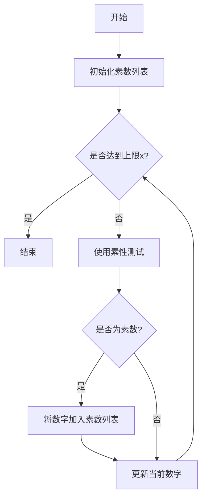
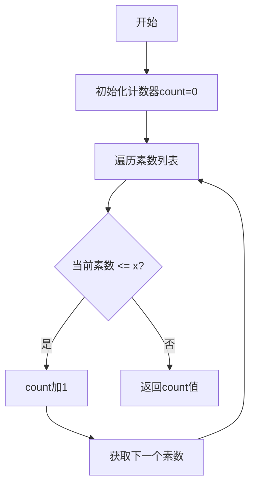

# 解析数论基础：第三章 F函数

## 1. 背景介绍

### 1.1 问题的由来

在数论领域中,素数的分布一直是一个备受关注的问题。虽然素数的分布看似随机无序,但事实上它们遵循着一些深层次的规律。其中,F函数是研究素数分布的一个重要工具,它描述了素数在自然数序列中的分布情况。

F函数的概念源于18世纪著名数论家欧拉(Euler)的工作。欧拉发现,素数的分布似乎遵循一种特殊的模式,即在某些区间内,素数的出现频率比其他区间要高。这种现象引发了人们对素数分布规律的探索。

### 1.2 研究现状

自欧拉之后,数学家们对F函数进行了深入的研究。19世纪,黎曼(Riemann)提出了著名的黎曼假设,试图描述素数的分布规律。黎曼假设虽然至今未被完全证实,但它为F函数的研究奠定了坚实的理论基础。

20世纪,随着计算机的发展,人们可以更加高效地计算和分析F函数的值。数论家们发现,F函数不仅与素数分布有关,还与其他数论问题密切相关,如加密算法、哈希函数等。

近年来,F函数在密码学、随机数生成等领域得到了广泛应用。同时,对F函数的理论研究也取得了一些新的进展,如F函数的分布性质、平均值估计等。

### 1.3 研究意义

深入研究F函数对于数论、密码学等领域具有重要意义:

1. **理解素数分布规律**:F函数描述了素数在自然数序列中的分布情况,研究F函数有助于揭示素数分布背后的深层次规律。

2. **密码学应用**:F函数在密码学中有广泛应用,如生成大素数、设计加密算法等,对于保证信息安全至关重要。

3. **随机数生成**:F函数的分布性质可用于生成高质量的伪随机数序列,在蒙特卡罗模拟、密码学等领域有重要应用。

4. **解决数论难题**:F函数与许多著名的数论猜想和难题密切相关,如黎曼假设、哥德巴赫猜想等,研究F函数有助于解决这些长期悬而未决的问题。

### 1.4 本文结构

本文将全面介绍F函数的相关理论和应用。首先阐述F函数的核心概念和与其他数论概念的联系;然后详细讲解F函数的算法原理、数学模型及公式推导;接着通过代码实例展示F函数的实际应用;最后探讨F函数在密码学、随机数生成等领域的应用场景,并总结F函数研究的未来发展趋势和面临的挑战。

## 2. 核心概念与联系

F函数是数论中一个基础且重要的概念,它与素数分布、算术函数、解析数论等多个概念密切相关。

**F函数的定义**:设$\pi(x)$表示小于或等于x的素数个数,则F函数定义为:

$$
F(x) = \pi(x) - \operatorname{li}(x)
$$

其中,$\operatorname{li}(x)$是对数积分函数,是素数分布的主要渐进项。F函数描述了实际素数个数与对数积分函数之间的差异。

**与素数分布的联系**:F函数直接反映了素数在自然数序列中的分布情况。当F(x)为正值时,表示小于x的素数个数多于对数积分函数的预测值;当F(x)为负值时,表示素数个数少于预测值。

**与算术函数的联系**:F函数与其他重要的算术函数有着内在联系,如莫比乌斯函数、切比雪夫函数等。研究F函数有助于深入理解这些算术函数的性质。

**与解析数论的联系**:F函数是解析数论的核心概念之一。解析数论利用复变函数和积分变换等分析工具研究整数的性质,F函数的研究对于解决黎曼假设等著名数论难题至关重要。

**与随机数理论的联系**:F函数的分布性质与随机过程密切相关,可用于生成高质量的伪随机数序列,在蒙特卡罗模拟、密码学等领域有重要应用。

综上所述,F函数是数论的基石,它与素数分布、算术函数、解析数论、随机数理论等多个领域紧密相连,对于数学理论和实际应用都有重要意义。

## 3. 核心算法原理与具体操作步骤

### 3.1 算法原理概述

计算F函数的核心算法是基于素数的生成和统计。具体来说,算法分为以下几个主要步骤:

1. **生成素数序列**:首先需要生成一个给定范围内的素数序列,常用的方法有埃拉托斯特尼筛法、Miller-Rabin素性测试等。

2. **计算$\pi(x)$值**:统计小于等于x的素数个数,即$\pi(x)$的值。

3. **计算$\operatorname{li}(x)$值**:对数积分函数$\operatorname{li}(x)$是素数分布的主要渐进项,需要对其进行数值计算。

4. **计算F(x)值**:根据定义$F(x) = \pi(x) - \operatorname{li}(x)$计算F函数的值。

该算法的时间复杂度主要取决于素数生成的效率。使用高效的素数生成算法(如埃拉托斯特尼筛法的优化版本)可以大幅提高F函数计算的速度。

### 3.2 算法步骤详解

我们将详细介绍F函数计算算法的每一个步骤。

#### 步骤1:生成素数序列



首先需要生成一个给定范围[2,x]内的素数序列。这里我们使用经典的Miller-Rabin素性测试算法,它的正确性概率很高,且时间复杂度为$O(\log^3 n)$。

算法流程:
1) 初始化一个空的素数列表
2) 从2开始,对每个数字进行素性测试
3) 如果是素数,将其加入素数列表
4) 继续检测下一个数字,直到达到上限x

生成素数序列是整个算法的基础,直接影响后续计算的效率和准确性。

#### 步骤2:计算$\pi(x)$值



计算$\pi(x)$的值,即小于等于x的素数个数。这一步骤非常简单,只需遍历之前生成的素数序列,统计小于等于x的素数个数即可。

算法流程:
1) 初始化一个计数器count=0
2) 遍历素数序列
3) 如果当前素数小于等于x,则count加1
4) 继续遍历下一个素数
5) 遍历结束后,count的值即为$\pi(x)$

该步骤的时间复杂度为$O(k)$,其中k为素数序列的长度。通常k远小于x,因此计算$\pi(x)$的效率非常高。

#### 步骤3:计算$\operatorname{li}(x)$值

对数积分函数$\operatorname{li}(x)$是素数分布的主要渐进项,定义为:

$$
\operatorname{li}(x) = \int_0^x \frac{dt}{\ln t}
$$

由于$\operatorname{li}(x)$无已知的解析表达式,因此需要使用数值计算的方法求解。常用的方法有:

1. **级数展开法**:将$\operatorname{li}(x)$展开为级数形式,取前几项进行近似计算。
2. **数值积分法**:使用数值积分方法(如梯形法、Simpson法等)对$\operatorname{li}(x)$进行近似计算。
3. **有理函数插值法**:构造有理函数逼近$\operatorname{li}(x)$,然后对有理函数进行快速计算。

这些方法各有优劣,需要根据精度要求和计算效率进行权衡选择。例如,级数展开法精度较低但计算速度快;数值积分法精度较高但计算量较大;有理函数插值法则是精度和效率的权衡。

无论采用何种方法,计算$\operatorname{li}(x)$都需要一定的数值计算技巧,是整个算法的关键和难点所在。

#### 步骤4:计算F(x)值

```mermaid
graph TD
    A[开始] --> B[计算pi(x)值]
    B --> C[计算li(x)值]
    C --> D[计算F(x)=pi(x)-li(x)]
    D --> E[输出F(x)值]
    E[结束]
```

最后一步,根据定义$F(x) = \pi(x) - \operatorname{li}(x)$计算F函数的值。这一步非常简单,只需将前两步的计算结果代入公式即可。

算法流程:
1) 计算$\pi(x)$值
2) 计算$\operatorname{li}(x)$值
3) 计算$F(x) = \pi(x) - \operatorname{li}(x)$
4) 输出F(x)的值

该步骤的时间复杂度为$O(1)$,是整个算法的最后一步。

### 3.3 算法优缺点

该算法计算F函数值的优点是:

1. **原理简单**:算法原理基于F函数的定义,思路清晰易懂。
2. **模块化设计**:算法分为独立的模块(生成素数、计算$\pi(x)$、计算$\operatorname{li}(x)$等),便于优化和维护。
3. **可扩展性强**:可以方便地集成其他素数生成算法、数值计算方法等,提高整体效率。

但该算法也存在一些缺点:

1. **计算$\operatorname{li}(x)$困难**:对数积分函数$\operatorname{li}(x)$无解析解,需要使用数值计算方法近似求解,存在一定的精度损失。
2. **效率受限于素数生成**:当x值很大时,生成素数序列的效率将成为算法的瓶颈。
3. **内存占用较大**:需要存储完整的素数序列,对内存的占用较大。

总的来说,该算法实现了F函数的基本计算,具有一定的局限性。在一些特殊场景下(如需要高精度、大范围计算等),可能需要使用其他更加高级的算法。

### 3.4 算法应用领域

计算F函数值的算法在以下几个领域有着广泛的应用:

1. **解析数论**:F函数是解析数论的核心概念之一,研究F函数的性质和分布对于解决黎曼假设等著名数论难题至关重要。

2. **素数分布研究**:F函数直接反映了素数在自然数序列中的分布情况,对于研究素数分布规律、验证相关猜想具有重要意义。

3. **密码学**:F函数在密码学中有广泛应用,如生成大素数、设计加密算法等,保证了信息系统的安全性。

4. **随机数生成**:F函数的分布性质与随机过程密切相关,可用于生成高质量的伪随机数序列,应用于蒙特卡罗模拟、密码学等领域。

5. **算术函数研究**:F函数与其他重要的算术函数(如莫比乌斯函数、切比雪夫函数等)存在内在联系,研究F函数有助于深入理解这些函数的性质。

总之,F函数计算算法是数论、密码学等领域的基础工具,对于理论研究和实际应用都有重要意义。

## 4. 数学模型和公式详细讲解与