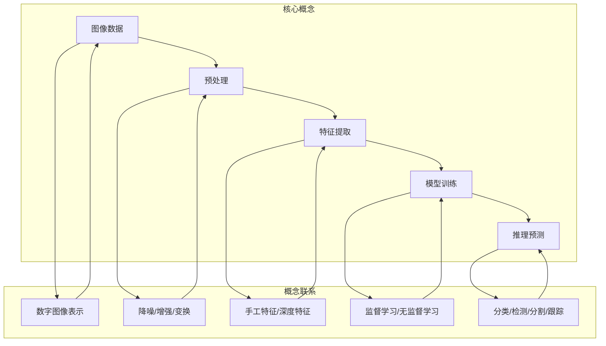

# 计算机视觉 原理与代码实例讲解

## 1. 背景介绍

### 1.1 问题的由来

在当今科技快速发展的时代,计算机视觉(Computer Vision)已经成为人工智能领域中一个非常重要和热门的研究方向。计算机视觉旨在使机器能够从数字图像或视频中获取有意义的高层次信息,并实现对视觉数据的理解和分析,从而模拟和仿真人类视觉系统的功能。

计算机视觉技术的起源可以追溯到20世纪60年代,当时的一些先驱者开始探索如何使用数字计算机来解释和处理图像数据。随着硬件计算能力的不断提高和算法的持续创新,计算机视觉技术得到了长足的发展,并被广泛应用于多个领域,如机器人视觉、无人驾驶、医疗成像分析、安防监控等。

### 1.2 研究现状

近年来,随着深度学习(Deep Learning)技术的兴起,计算机视觉领域取得了突破性的进展。基于卷积神经网络(Convolutional Neural Network, CNN)的深度学习模型在图像分类、目标检测、语义分割等任务中展现出了强大的能力,大大超越了传统的手工设计特征的方法。

除了CNN之外,循环神经网络(Recurrent Neural Network, RNN)、生成对抗网络(Generative Adversarial Network, GAN)等深度学习模型也被广泛应用于视频理解、图像生成等计算机视觉任务中。同时,注意力机制(Attention Mechanism)、图神经网络(Graph Neural Network)等新兴技术也为计算机视觉带来了新的发展机遇。

### 1.3 研究意义

计算机视觉技术的发展对于推动人工智能的进步具有重要意义。视觉是人类获取外界信息的主要渠道之一,视觉理解和分析能力是实现通用人工智能(Artificial General Intelligence, AGI)的关键组成部分。因此,深入研究计算机视觉原理并提出有效的算法模型和系统实现,对于推动人工智能技术的发展具有重要意义。

此外,计算机视觉技术在诸多领域都有广泛的应用前景,如自动驾驶、机器人视觉、医疗影像分析、安防监控等,这些应用将极大地提高生产效率、改善生活质量、提升社会运行效率。因此,计算机视觉技术的研究不仅具有重要的理论意义,同时也具有巨大的应用价值。

### 1.4 本文结构  

本文将全面介绍计算机视觉的核心原理和代码实现细节。文章首先阐述计算机视觉的背景和研究现状,然后深入探讨核心概念、算法原理和数学模型,并结合实际案例进行详细讲解。接下来,文章将提供完整的代码实例,并对代码实现进行逐行解析。最后,文章将分析计算机视觉的实际应用场景,介绍相关工具和学习资源,并对未来发展趋势和面临的挑战进行展望。

通过本文的学习,读者将能够全面掌握计算机视觉的理论基础和实践技能,为将来在相关领域的学习、研究和工作奠定坚实的基础。

## 2. 核心概念与联系

计算机视觉系统通常包括以下核心概念和处理流程:

1. **图像数据**:  计算机视觉的输入是数字图像或视频数据,通常以矩阵或张量的形式表示。
2. **预处理**:  对原始图像数据进行预处理,如降噪、增强对比度、几何变换等,以提高后续处理的效果。
3. **特征提取**:  从预处理后的图像中提取有意义的特征,可以是手工设计的特征(如SIFT、HOG等),也可以是通过深度学习网络自动学习的特征。
4. **模型训练**:  基于提取的特征,使用监督学习或无监督学习等机器学习方法训练视觉模型。
5. **推理预测**:  将训练好的视觉模型应用于新的输入图像,对图像进行分类、目标检测、语义分割、目标跟踪等任务的推理预测。

上述核心概念相互关联、环环相扣。数字图像表示是计算机视觉的基础;预处理有助于提高图像质量和后续处理的效果;特征提取旨在从图像中获取有意义的模式信息;模型训练则将这些特征信息映射到所需的视觉任务;最终,推理预测将训练好的模型应用于实际场景,完成相应的视觉理解和分析任务。

## 3. 核心算法原理 & 具体操作步骤  

### 3.1 算法原理概述

计算机视觉领域存在多种经典算法,它们的原理各不相同,但都旨在从图像数据中提取有用信息并完成特定的视觉任务。以下是一些核心算法的原理概述:

1. **卷积神经网络(CNN)**: CNN是深度学习中最成功的算法之一,它通过多层卷积、池化和全连接操作自动学习图像的层次特征表示,并将其应用于图像分类、目标检测等任务。CNN的关键在于权值共享和局部连接,使其能够有效捕获图像的空间和结构信息。

2. **区域卷积神经网络(R-CNN)**: R-CNN系列算法(如Fast R-CNN、Faster R-CNN等)是目标检测领域的经典算法,它们将目标检测任务分解为两个子任务:先生成候选区域,再对每个区域进行目标分类和边界框回归。这种两阶段方法显著提高了检测精度。

3. **掩码区域卷积神经网络(Mask R-CNN)**: 在R-CNN的基础上,Mask R-CNN引入了一个分支用于同时预测每个目标实例的掩码(语义分割),从而实现了精确的实例分割。

4. **U-Net**: U-Net是一种广泛应用于医学图像分割的卷积网络,它采用对称的编码器-解码器结构,通过跨层连接有效融合不同尺度的特征,从而获得高质量的分割结果。

5. **光流估计算法**: 光流估计是视频理解和运动分析的关键技术,常用算法包括Lucas-Kanade、Horn-Schunck等,它们通过求解光流方程来估计图像序列中每个像素的运动矢量。

6. **图割算法**: 图割算法(如Normalized Cut、GrabCut等)通过将图像建模为加权无向图,并最小化相应的切割代价函数,从而实现图像分割。这种基于图论的方法具有很强的理论基础。

7. **SLAM(同步定位与映射)**: SLAM是机器人导航和增强现实等领域的核心技术,它通过融合视觉、惯性和其他传感器数据,同时估计机器人在未知环境中的位置和构建环境地图。

上述算法只是计算机视觉领域的一小部分代表性算法,实际上还有许多其他重要算法,如SIFT、HOG、YOLO、SSD、Transformer等,它们各自具有不同的原理和适用场景。

### 3.2 算法步骤详解

以卷积神经网络(CNN)为例,我们详细介绍其算法原理和具体操作步骤:

1. **卷积(Convolution)操作**:
   - 原理: 卷积操作通过滑动卷积核(小矩阵)在输入特征图上进行元素级乘积和求和,从而提取局部特征。
   - 步骤:
     1) 初始化卷积核权重(可训练参数)
     2) 在输入特征图上滑动卷积核,对每个局部区域进行元素级乘积和求和
     3) 生成新的特征图,即卷积的输出

2. **激活函数(Activation Function)**:
   - 原理: 激活函数引入非线性,增强网络的表达能力。常用的激活函数包括ReLU、Sigmoid、Tanh等。
   - 步骤: 对卷积输出的特征图逐元素应用激活函数

3. **池化(Pooling)操作**:
   - 原理: 池化操作通过下采样特征图,实现了平移不变性和降低计算复杂度。常用的池化操作包括最大池化和平均池化。
   - 步骤:
     1) 在输入特征图上滑动池化窗口
     2) 对每个窗口内的元素进行最大值或平均值计算
     3) 生成下采样后的特征图

4. **全连接层(Fully Connected Layer)**:
   - 原理: 全连接层将前面卷积层学习到的高级特征映射到最终的输出,如分类或回归任务。
   - 步骤:
     1) 将卷积层输出的特征图展平为一维向量
     2) 通过全连接权重矩阵和偏置项进行仿射变换
     3) 对变换后的向量应用激活函数(如Softmax)

5. **损失函数(Loss Function)和优化**:
   - 原理: 通过定义合适的损失函数,并使用优化算法(如梯度下降)最小化损失函数,从而训练CNN模型的参数。
   - 步骤:
     1) 计算模型输出与真实标签之间的损失
     2) 通过反向传播计算模型参数的梯度
     3) 使用优化算法(如SGD、Adam等)更新模型参数

上述步骤通过前馈和反向传播的交替迭代,最终得到训练好的CNN模型,该模型可以应用于图像分类、目标检测等计算机视觉任务。

### 3.3 算法优缺点

CNN算法具有以下优点:

1. **自动特征学习**: CNN能够自动从原始图像数据中学习层次化的特征表示,而无需人工设计特征。
2. **平移不变性**: 卷积操作和池化操作赋予了CNN一定的平移不变性,使其对目标位置的微小变化具有鲁棒性。
3. **参数共享**: 卷积核在整个输入特征图上共享参数,大大减少了模型参数量,提高了计算效率。
4. **端到端训练**: CNN可以直接从原始图像数据端到端地训练,无需分阶段处理或人工特征提取。

CNN算法也存在一些缺点:

1. **需要大量训练数据**: CNN模型通常包含大量参数,需要大量标注好的训练数据来有效训练,否则容易出现过拟合。
2. **对旋转和缩放不鲁棒**: CNN对目标的旋转和缩放变换不太鲁棒,需要进行数据增强或设计更复杂的网络结构。
3. **对遮挡和形变敏感**: CNN在处理目标遮挡和形变时表现较差,需要引入注意力机制或其他技术来提高鲁棒性。
4. **黑盒模型**: CNN是一种端到端的黑盒模型,很难解释其内部特征表示和决策过程,缺乏可解释性。

总的来说,CNN是一种强大的视觉模型,但也存在一些局限性。研究人员正在不断探索新的网络结构和训练策略,以提高CNN在各种视觉任务上的性能和鲁棒性。

### 3.4 算法应用领域

CNN及其变体算法在计算机视觉领域有广泛的应用,包括但不限于:

1. **图像分类**: 将图像分类到预定义的类别中,如ImageNet图像分类挑战赛。
2. **目标检测**: 在图像中定位并识别出感兴趣的目标,如人脸、车辆、行人等。
3. **语义分割**: 对图像中的每个像素进行分类,将图像分割成不同的语义区域。
4. **实例分割**: 在语义分割的基础上,进一步区分同一类别的不同实例。
5. **视频理解**: 应用于视