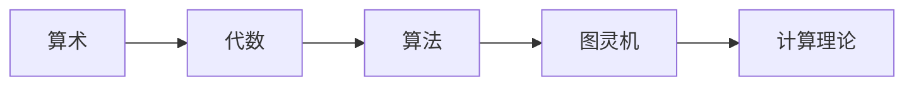
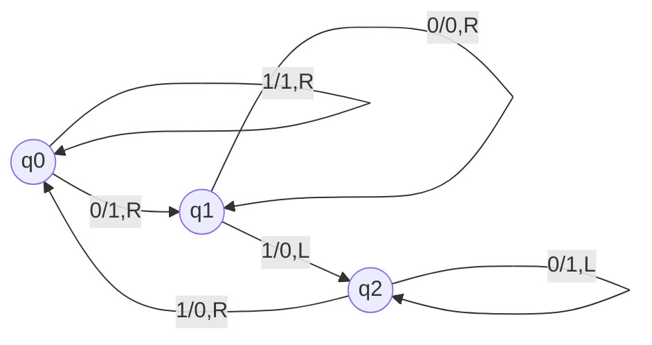

# 计算：第一部分 计算的诞生 第 2 章 计算之术

关键词：计算、算术、代数、算法、图灵机、计算机

## 1. 背景介绍
### 1.1 问题的由来
计算是人类文明进步的重要推动力,从古至今,人们都在探索更高效、更精确的计算方法。从古代的结绳记事、算筹到如今的计算机,计算技术经历了漫长的演变历程。那么,计算的本质是什么?人类又是如何一步步发展出现代计算机的?这些问题值得我们深入探讨。

### 1.2 研究现状
当前,计算理论已经成为计算机科学的核心分支之一。图灵机作为计算模型奠定了现代计算理论的基础。许多科学家如冯·诺依曼、香农等都对计算理论做出了开创性贡献。如今,量子计算、生物计算、分子计算等新兴计算范式不断涌现,计算科学仍在快速发展。

### 1.3 研究意义
深入理解计算的本质和发展历程,对于我们掌握计算机科学的理论基础、把握未来计算技术发展方向具有重要意义。只有厘清计算的核心概念和原理,我们才能在此基础上开创性的新计算模型和算法,推动人工智能等前沿领域的突破。

### 1.4 本文结构
本文将从以下几个方面展开论述：首先介绍计算的核心概念及其相互联系;然后重点阐述计算理论的奠基石——图灵机模型的原理和运作机制;接着从数学角度对计算可计算性、复杂度等理论进行公式化描述,并辅以案例讲解;进一步,本文将实践演示图灵机的代码实现;同时探讨计算理论在密码学、人工智能等领域的应用;最后总结计算科学的发展趋势和面临的挑战。

## 2. 核心概念与联系
要理解计算的本质,首先要厘清几个核心概念:

- 算术(Arithmetic):研究数量关系和演算方法,是计算的基础。
- 代数(Algebra):用符号表示数,研究符号间抽象关系,是算术的拓展。
- 算法(Algorithm):对运算过程的形式化描述,是计算的灵魂。
- 图灵机(Turing Machine):抽象计算模型,证明了"可计算"的边界。
- 计算理论(Theory of Computation):研究计算本质、能力与局限的学科。

它们的相互联系如下:



算术奠定了计算的数学基础,代数用符号简化了运算描述,算法用形式语言刻画了运算过程,图灵机用数学模型定义了计算边界,计算理论则从宏观研究计算本质。它们环环相扣,共同构筑了计算科学大厦。

## 3. 核心算法原理 & 具体操作步骤
### 3.1 算法原理概述
算法是计算的核心,它用确定的形式化步骤描述了问题的求解过程。一个好的算法应该具备以下特点:

1. 有穷性:算法必须在执行有限个步骤后终止。
2. 确定性:每个步骤必须被精确定义,不能有歧义。
3. 输入:算法有0个或多个输入。 
4. 输出:算法至少有1个输出。
5. 可行性:算法的每个步骤在有限时间内完成。

只有满足以上条件,一个算法才是良构的,可以用来指导计算机解决问题。

### 3.2 算法步骤详解
以欧几里得算法(辗转相除法)求两个正整数最大公约数为例,我们详细说明算法的步骤:

1. 输入两个正整数 $a$ 和 $b$
2. 如果 $b=0$,则输出 $a$,算法结束
3. 否则,计算 $a$ 除以 $b$ 的余数 $r$,令 $a=b$,$b=r$,返回步骤2
4. 输出 $a$,即为所求最大公约数

可以看到,该算法用4个确定步骤描述了求解过程,满足算法的定义。

### 3.3 算法优缺点
以上述欧几里得算法为例,它的优点是:

- 原理简单,容易理解和实现
- 步骤确定,没有二义性
- 运行时间与输入大小呈对数关系,效率较高

但它也有局限:

- 只适用于正整数
- 没有考虑溢出问题

因此在实际使用时,还需要根据具体问题做必要改进和补充。

### 3.4 算法应用领域
算法在计算机科学各领域都有广泛应用,例如:

- 在人工智能中,机器学习算法如神经网络、SVM等是核心
- 在密码学中,RSA、DES等加密算法是安全基石
- 在计算生物学中,DNA序列比对、蛋白质结构预测等都要用到专门算法
- 在计算机图形学中,光线追踪、纹理映射等算法创造了精彩的视觉效果

可以说,算法是计算机科学之魂,是解决问题的利器。

## 4. 数学模型和公式 & 详细讲解 & 举例说明
### 4.1 数学模型构建
图灵机是刻画"什么是可计算的"这一根本问题的数学模型,它的形式定义为:

$$TM = \langle Q,\Gamma,\blank,\Sigma,\delta,q_0,F \rangle$$

其中:
- $Q$是有限状态集
- $\Gamma$是有限磁带字母表
- $\blank \in \Gamma$是空白符 
- $\Sigma \subseteq \Gamma \setminus \{\blank\}$是输入字母表
- $\delta: Q \times \Gamma \rightarrow Q \times \Gamma \times \{L,R\}$是转移函数
- $q_0 \in Q$是初始状态
- $F \subseteq Q$是接受状态集

直观地说,一个图灵机包含一条无限长磁带和一个读写头,磁带被划分为一个个方格,每个方格可以存储一个磁带字符。读写头可以在磁带上左右移动,读取和改写方格内容。机器运行时,根据当前状态和读写头读入的字符,从转移函数获知下一步动作(改写内容、移动方向、状态变更),不断重复直到到达接受状态。

### 4.2 公式推导过程
图灵机状态转移可以用数学公式刻画如下:

$$\delta(q_i, a_i) = (q_j, a_j, D)$$

表示当前状态为$q_i$、读写头读入字符为$a_i$时,将字符改写为$a_j$,读写头方向移动为$D$,下一状态为$q_j$。

例如转移函数定义:
$$
\begin{aligned}
\delta(q_0, 0) &= (q_1, 1, R) \\
\delta(q_0, 1) &= (q_0, 1, R) \\
\delta(q_1, 0) &= (q_1, 0, R) \\
\delta(q_1, 1) &= (q_0, 1, L) \\
\end{aligned}
$$

### 4.3 案例分析与讲解
下面我们用一个具体的二进制加法图灵机为例说明其工作过程:



该图灵机能够计算两个二进制数之和,其工作原理为:

1. 初始状态为$q_0$,两个加数在磁带最左端,中间用1个0隔开,其余位置写0。读写头位于最左端。
2. 若读入0,改写为1,右移,进入状态$q_1$;若读入1,保持1不变,右移,状态不变。
3. 若读入0,保持0不变,右移,状态不变;若读入1,改写为0,左移,进入状态$q_2$。
4. 若读入0,改写为1,左移,状态不变;若读入1,改写为0,右移,回到$q_0$。
5. 反复上述过程,直到读写头移动到磁带最右端的空白符,结果就保存在磁带上。

例如,计算$11+01$:
初始:
```
1 1 0 0 1 0 0 0 ...
^
q0
```

结束:
```
0 0 1 0 0 0 0 0 ...
            ^
          q0
```

磁带上结果为100,正确完成了二进制加法。

### 4.4 常见问题解答
问:图灵机能计算任何函数吗?
答:不能。图灵机只能计算部分可计算函数。停机问题等就被证明是不可计算的。

问:图灵机与现代计算机有何区别?
答:图灵机是理论模型,它假设有无限长存储带,并不考虑硬件实现。现代计算机受限于有限的物理资源,但在计算能力上与图灵机等价。冯诺依曼体系结构是图灵机思想在现实中的具体实现。

## 5. 项目实践：代码实例和详细解释说明
### 5.1 开发环境搭建
我们使用Python语言实现一个简单的图灵机模拟器。推荐使用Jupyter Notebook作为开发环境,以便边写代码边观察执行结果。

首先导入必要的工具包:

```python
# 导入进度条库
from tqdm import tqdm
```

### 5.2 源代码详细实现
定义图灵机类:

```python
class TuringMachine:
    def __init__(self, states, symbols, blank, input_symbols, 
                 transition, start, accept, reject):
        """
        初始化图灵机
        :param states: 状态集合,如 {'q0', 'q1', 'q2', 'qf'}
        :param symbols: 磁带字母表,如 {'0', '1', '_'}
        :param blank: 空白符
        :param input_symbols: 输入字母表
        :param transition: 转移函数
        :param start: 初始状态
        :param accept: 接受状态集
        :param reject: 拒绝状态集
        """
        self.states = states
        self.symbols = symbols
        self.blank = blank
        self.input_symbols = input_symbols
        self.transition = transition
        self.start = start
        self.accept = accept
        self.reject = reject
        
    def run(self, tape, max_steps=1000, verbose=False):
        """
        运行图灵机
        :param tape: 输入磁带
        :param max_steps: 最大运行步数
        :param verbose: 是否打印每步结果
        :return: 接受/拒绝/超时
        """
        state = self.start
        head = 0
        
        for _ in tqdm(range(max_steps)):
            if verbose: 
                print(f'State={state}, Tape={tape}, Head={head}')
                
            if state in self.accept:
                if verbose: print('Accepted')
                return 'Accepted'
            if state in self.reject:
                if verbose: print('Rejected')
                return 'Rejected'
            
            char = tape[head]
            state, new_char, direction = self.transition[(state, char)]
            tape[head] = new_char
            head += 1 if direction == 'R' else -1
            
        if verbose: print('Timeout')
        return 'Timeout'
```

### 5.3 代码解读与分析
上述代码定义了一个通用的图灵机类。

- `__init__`方法初始化图灵机的各项参数,包括状态集、磁带字母表、输入字母表、转移函数等。
- `run`方法模拟图灵机的运行过程。它从初始状态和磁带头位置开始,根据当前状态和磁带符号查询转移函数,执行相应的动作(改写、移动、状态转移),直到到达接受状态、拒绝状态或者超过最大步数。

可以看到,代码完全模拟了图灵机的数学定义,是对计算理论的忠实实现。

### 5.4 运行结果展示
下面我们用之前的二进制加法图灵机为例,测试代码运行结果:

```python
# 定义二进制加法图灵机
states = {'q0', 'q1', 'q2'}
symbols = {'0', '1', '_'}
blank = '_'
input_symbols = {'0', '1'}

transition = {
    ('q0',