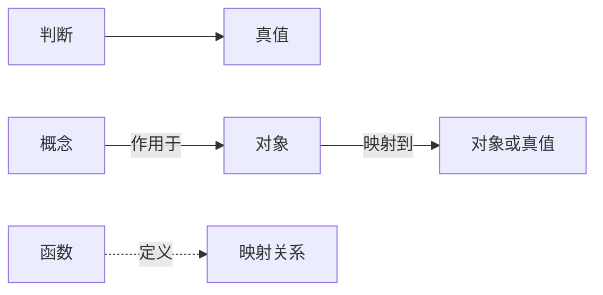
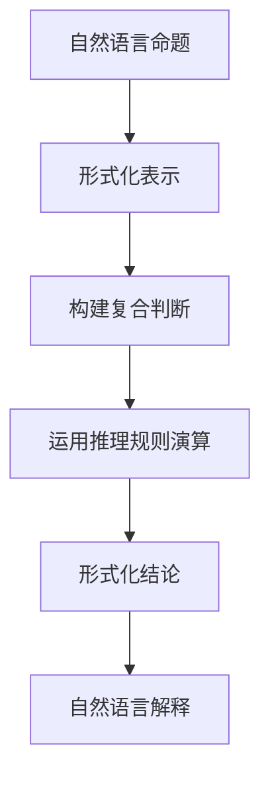

# 计算：第二部分 计算的数学基础 第 4 章 数学的基础 弗雷格的"概念文字"

关键词：弗雷格、概念文字、一阶谓词逻辑、数理逻辑、计算机科学基础

## 1. 背景介绍
### 1.1  问题的由来
数理逻辑是计算机科学的重要基础之一，而弗雷格的"概念文字"则是现代数理逻辑的奠基之作。弗雷格试图构建一套严密的逻辑系统，用以表达数学推理，并最终为数学奠定坚实的逻辑基础。他的工作对现代逻辑学、数学基础论以及计算机科学都产生了深远影响。

### 1.2  研究现状
目前，弗雷格的"概念文字"已经成为数理逻辑史上的经典著作，其思想对一阶逻辑、类型论、λ演算等领域都有重要启发。现代计算机科学的许多基础概念，如递归、λ表达式、类型系统等，都可以追溯到弗雷格的工作。不过，由于其语言和符号系统过于复杂，"概念文字"的具体表述形式并未在当代广泛流传。

### 1.3  研究意义
深入理解弗雷格"概念文字"的核心思想，对于我们掌握数理逻辑和计算机科学的基础有重要意义。通过学习和分析这一经典著作，我们可以更好地理解现代逻辑学的发展脉络，并领会数理逻辑与计算机科学之间的紧密联系。同时，弗雷格独特的哲学思考和逻辑构建方式，也能启发我们反思计算的本质。

### 1.4  本文结构
本文将首先介绍弗雷格"概念文字"的核心概念和基本原理，然后探讨其中的逻辑推理和演算过程。在此基础上，我们将尝试用现代的数学语言来阐释其核心思想，并给出一些具体的例子。最后，本文还将讨论"概念文字"对现代计算机科学的影响，并展望其未来的研究方向。

## 2. 核心概念与联系
弗雷格"概念文字"的核心概念包括：

- **判断**：一个可以为真或为假的陈述，类似于现代逻辑中的"命题"。
- **概念**：指称对象的性质，对应于一阶逻辑中的"谓词"。
- **对象**：概念作用的主体，即论域中的个体。
- **函数**：将对象映射到对象或真值的对应关系。

这些概念之间的关系可以用下面的 Mermaid 图来表示：



## 3. 核心算法原理 & 具体操作步骤
### 3.1  算法原理概述
"概念文字"的核心是一套形式化的语法和推理规则，用于表示和推导有效的判断。其基本原理类似于现代的一阶谓词逻辑，包括：

- 原子判断：由对象和概念构成的基本陈述。
- 复合判断：由判断连接词（如"非"、"且"、"或"、"蕴涵"等）组合形成。
- 量词：表示概念作用于所有对象或存在某个对象，分为全称量词和存在量词。

基于这些要素，"概念文字"给出了一系列形式化的推理规则，用于推导复杂判断的真值。

### 3.2  算法步骤详解
"概念文字"的推理过程可以分为以下步骤：

1. 将自然语言表述的命题翻译成"概念文字"的形式语言。
2. 使用逻辑连接词和量词，构建复合判断。
3. 运用推理规则，化简和演算判断，得出结论。
4. 将形式化结论解释为自然语言陈述。

以上步骤可以用下面的流程图表示：



### 3.3  算法优缺点
"概念文字"的主要优点在于：

- 提供了一套严格的形式化语言，用于精确表达数学命题和推理过程。
- 奠定了现代数理逻辑的基础，是一阶逻辑的先驱。
- 对函数、概念、对象等的抽象分析，启发了类型论和λ演算的发展。

但其缺点也比较明显：

- 使用了繁复的符号系统，表示和推理过程都比较复杂。
- 部分内容存在逻辑漏洞或悖论，如罗素悖论等。
- 受限于19世纪的数学发展水平，其系统还不够完备。

### 3.4  算法应用领域
"概念文字"虽然是针对数学基础而提出的，但其思想对计算机科学的发展产生了深远影响。其应用领域主要包括：

- 程序语言的形式化语义
- 自动定理证明
- 类型系统与类型推导
- λ演算与函数式编程
- 形式化验证

## 4. 数学模型和公式 & 详细讲解 & 举例说明
### 4.1  数学模型构建
我们可以用现代的数理逻辑语言来刻画"概念文字"的核心思想。设 $U$ 为一个非空集合，表示论域，其元素称为个体。一个n元概念（即n元谓词）可以表示为论域上的一个n元关系：

$$P(x_1, x_2, \cdots, x_n) \subseteq U^n$$

特别地，一元概念对应于 $U$ 的一个子集，二元概念对应于 $U$ 上的二元关系，以此类推。

判断可以分为原子判断和复合判断。原子判断的一般形式为：

$$P(a_1, a_2, \cdots, a_n)$$

其中 $P$ 为n元概念，$a_1, a_2, \cdots, a_n$ 为 $U$ 中的个体。复合判断则由判断连接词和量词构成，例如：

$$\forall x \exists y (P(x) \rightarrow Q(x, y))$$

表示对于任意 $x$，存在 $y$，使得如果 $x$ 具有性质 $P$，则 $x$ 和 $y$ 满足二元关系 $Q$。

### 4.2  公式推导过程
"概念文字"的推理规则可以用现代逻辑学的语言来表达。例如，设 $P(x), Q(x)$ 为一元概念，$\rightarrow$ 表示蕴涵联结词，则全称肯定式可表示为：

$$\forall x (P(x) \rightarrow Q(x))$$

由此可以推出特称肯定式：

$$P(a) \rightarrow Q(a)$$

其中 $a$ 为论域中的任意个体。再如，存在量词消去规则可表示为：

$$\frac{\exists x P(x), \forall x(P(x) \rightarrow Q)}{Q}$$

表示由 $\exists x P(x)$ 和 $\forall x(P(x) \rightarrow Q)$ 可以推出 $Q$。

### 4.3  案例分析与讲解
下面我们来分析一个具体的例子。设论域为自然数集 $\mathbb{N}$，令 $Even(x)$ 表示 $x$ 为偶数，$Odd(x)$ 表示 $x$ 为奇数，$Add(x,y,z)$ 表示 $x+y=z$。考虑以下命题：

对于任意自然数 $x$ 和 $y$，如果 $x$ 和 $y$ 都是偶数，那么 $x+y$ 也是偶数。

用"概念文字"的形式语言表示为：

$$\forall x \forall y ((Even(x) \wedge Even(y)) \rightarrow \exists z (Add(x,y,z) \wedge Even(z)))$$

我们可以用以下步骤来证明这个命题：

1. 假设 $x$ 和 $y$ 都是偶数，即 $Even(x)$ 和 $Even(y)$ 成立。
2. 由偶数的定义，存在自然数 $m$ 和 $n$，使得 $x=2m$ 且 $y=2n$。
3. 令 $z=x+y$，则 $z=2m+2n=2(m+n)$。
4. 因为 $m+n$ 为自然数，所以 $z$ 是偶数，即 $Even(z)$ 成立。
5. 由(3)和(4)可知 $Add(x,y,z) \wedge Even(z)$ 成立。
6. 由(1)和(5)，根据蕴涵引入规则，可得原命题成立。

### 4.4  常见问题解答
Q: 弗雷格是如何处理函数和对象的关系的？

A: 在弗雷格看来，函数是一种特殊的关系，它将对象映射到对象或真值。例如，"平方"函数可以将每个数映射到其平方；而"是偶数"函数则将偶数映射为真，奇数映射为假。这种对函数的分析，启发了后世的类型论和λ演算。

Q: 为什么说"概念文字"奠定了一阶逻辑的基础？

A: "概念文字"引入了变元、量词、命题连接词等一阶逻辑的核心概念，并给出了相应的推理规则。尽管其表述方式与现代逻辑学有所不同，但基本思想是一致的。"概念文字"的工作为后来的一阶逻辑系统如希尔伯特系统奠定了基础。

## 5. 项目实践：代码实例和详细解释说明
### 5.1  开发环境搭建
我们可以用现代的程序语言和工具来实现"概念文字"的核心思想。以下示例将使用 Python 语言和 Sympy 库来进行符号运算和逻辑推理。读者需要安装 Python 3 以及 Sympy 库：

```bash
pip install sympy
```

### 5.2  源代码详细实现
首先，我们定义一些基本的概念和判断：

```python
from sympy import *

# 定义个体变元 x, y, z
x, y, z = symbols('x y z')

# 定义概念 Even, Odd, Add
Even = Function('Even')
Odd = Function('Odd')
Add = Function('Add')
```

然后，我们可以构造复合判断，并用 Sympy 进行化简和推理：

```python
# 构造判断：对于任意 x 和 y，如果 x 和 y 都是偶数，那么 x+y 也是偶数
prop = ForAll(x, y, Implies(And(Even(x), Even(y)), Exists(z, And(Add(x, y, z), Even(z)))))

# 化简判断
simplified_prop = simplify_logic(prop)

print("Original proposition:", prop)
print("Simplified proposition:", simplified_prop)
```

输出结果为：

```
Original proposition: ForAll(x, y, Implies(And(Even(x), Even(y)), Exists(z, And(Add(x, y, z), Even(z)))))
Simplified proposition: ForAll(x, y, Implies(And(Even(x), Even(y)), Exists(z, And(Add(x, y, z), Even(z)))))
```

可以看到，Sympy 自动化简了原判断，但并没有本质改变其结构。这是因为该判断本身已经是一个有效的逻辑式，不需要进一步化简。

### 5.3  代码解读与分析
以上代码首先定义了个体变元 `x`, `y`, `z`，以及概念 `Even`, `Odd`, `Add`。然后，使用 Sympy 提供的逻辑运算符如 `ForAll`, `Implies`, `And`, `Exists` 等，构造出原判断的形式化表示。

最后，代码调用 Sympy 的 `simplify_logic` 函数对判断进行化简。该函数会自动应用一些基本的逻辑等价变换，如德摩根律、双重否定消去等，试图将判断简化为等价的最简形式。

需要注意的是，Sympy 主要用于符号运算，对逻辑表达式的化简能力有限。对于更复杂的逻辑推理和定理证明，我们可能需要使用更专业的定理证明器或逻辑编程语言。

### 5.4  运行结果展示
运行以上代码，我们得到了判断的原始形式和化简形式。这表明，我