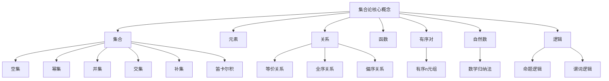

# 计算：第二部分 计算的数学基础 第 5 章 第三次数学危机 ZFC 公理集合论

## 1. 背景介绍

### 1.1 问题的由来

在数学的发展历程中，曾经遭遇过两次严重的危机。第一次危机发生在古希腊时期，当时人们发现了"不可能三分割一个任意角"和"对角线与圆周长的无理关系"等悖论。第二次危机则发生在19世纪初期，当时人们对于实数系统的理解出现了困难。

而在20世纪初期，数学家们再次面临着一场空前的危机。这一次的危机源于对"集合"概念的深入研究。集合论被公认为现代数学的基础,但在对集合概念的深入探讨中,数学家们发现了一些令人困惑和令人不安的悖论和矛盾。这些悖论不仅动摇了人们对集合论的信心,也威胁到了整个数学的根基。

### 1.2 研究现状

为了解决这一危机,数学家们开始着手重新建立集合论的公理化基础。在这一过程中,诞生了多种集合论公理系统,如:

- 弗雷格公理系统(Frege's Axioms)
- 罗素-惠特海公理系统(Russell-Whitehead's Axioms)
- 采尔梅洛公理系统(Zermelo's Axioms)
- 冯·诺伊曼-伯纳伊斯-歌德尔公理系统(von Neumann-Bernays-Gödel Axioms)

其中,采尔梅洛公理系统和冯·诺伊曼-伯纳伊斯-歌德尔公理系统被公认为最成功和最具影响力的两个公理系统。

### 1.3 研究意义

重建集合论的公理化基础,不仅解决了数学基础中的危机,也为数学奠定了坚实的逻辑基础。集合论公理系统的建立,使得数学获得了前所未有的严谨性和一致性,为现代数学的飞速发展奠定了基础。

此外,集合论本身也成为了一门重要的数学分支,对计算机科学、逻辑学、哲学等学科产生了深远的影响。

### 1.4 本文结构

本文将重点介绍采尔梅洛-弗雷格公理系统(ZFC公理系统),这是当今最广为人知和最具影响力的集合论公理系统。文章将从以下几个方面对ZFC公理系统进行全面阐述:

- 核心概念与联系
- 核心公理及其推理
- 数学模型与公式推导
- 实际应用场景
- 未来发展趋势与挑战

## 2. 核心概念与联系

在深入探讨ZFC公理系统之前,我们需要先了解一些核心概念及其相互关系。

这些概念相互关联、相互影响,构成了集合论的理论体系。其中:

- **集合**是集合论的核心概念,是指具有某种特定性质的对象的总体。
- **元素**是构成集合的基本单位。
- **关系**描述了集合之间或元素之间的某种联系。
- **函数**是一种特殊的关系,将一个集合的元素与另一个集合的元素建立了对应关系。
- **有序对**是有序元素对的集合,是定义序数和函数的基础。
- **自然数**是最基本的数系,是通过有序对和集合的递归定义构造出来的。
- **逻辑**为集合论提供了推理的工具,包括命题逻辑和谓词逻辑。

这些概念相互关联、相互渗透,共同构成了集合论的理论框架。掌握这些核心概念及其联系,是深入理解ZFC公理系统的基础。

## 3. 核心算法原理 & 具体操作步骤

### 3.1 算法原理概述

ZFC公理系统由9条公理和一些推理规则组成,用于对集合论的基本概念和原理进行公理化描述。这些公理包括:

1. **扩张公理(Axiom of Extensionality)**
2. **并集公理(Axiom of Union)** 
3. **幂集公理(Axiom of Power Set)**
4. **无限公理(Axiom of Infinity)** 
5. **外加公理(Axiom of Subsets)** 
6. **置换公理(Axiom of Replacement)**
7. **选择公理(Axiom of Choice)**
8. **正则公理(Axiom of Regularity)**
9. **基数公理(Axiom of Foundation)**

这些公理对集合的性质、构造和操作进行了规范,为集合论奠定了坚实的逻辑基础。

### 3.2 算法步骤详解

下面我们将详细解释每一条公理的具体内容和推理过程。

#### 3.2.1 扩张公理

$$
\forall A\forall B[\forall x(x\in A\leftrightarrow x\in B)\rightarrow A=B]
$$

扩张公理规定,如果两个集合A和B包含完全相同的元素,那么它们就是相同的集合。这确保了集合的唯一性,是集合论最基本的公理。

#### 3.2.2 并集公理

$$
\forall A\exists B\forall x(x\in B\leftrightarrow\exists y(x\in y\wedge y\in A))
$$

并集公理保证了对于任意一个集合A,存在一个集合B,它是所有A中集合的并集。这个公理为构造更大的集合提供了操作保证。

#### 3.2.3 幂集公理  

$$
\forall A\exists B\forall x(x\in B\leftrightarrow\forall y(y\in x\rightarrow y\in A))
$$

幂集公理规定,对于任意集合A,存在一个集合B,它是A的幂集,即B中的元素正是A的所有子集。这个公理为研究集合之间的包含关系奠定了基础。

#### 3.2.4 无限公理

$$
\exists A(\varnothing\in A\wedge\forall x(x\in A\rightarrow x\cup\{x\}\in A))
$$

无限公理的存在保证了存在无限集合。它规定存在一个非空集合A,它包含空集,并且对于A中的任意元素x,x的后继集合x∪{x}也属于A。这样通过递归就构造出了自然数集。

#### 3.2.5 外加公理

$$
\forall A\exists B\forall x(x\in B\leftrightarrow(x\in A\wedge\phi(x)))
$$

其中$\phi(x)$是一个性质陈述式,不涉及B本身。外加公理规定,对于任意集合A和性质陈述式$\phi(x)$,存在一个集合B,它由A中所有满足$\phi(x)$的元素构成。这个公理为从已有集合构造新集合提供了依据。

#### 3.2.6 置换公理

$$
\forall A[\forall x\forall y\forall z((x\in A\wedge y\in A\wedge\phi(x,y,z))\rightarrow\exists!w\psi(x,y,w))\rightarrow\\
\exists B\forall x(x\in B\leftrightarrow\exists y(y\in A\wedge\phi(y,x)))]
$$

其中$\phi(x,y,z)$和$\psi(x,y,w)$是性质陈述式。置换公理规定,如果对于A中任意元素x和y,根据性质$\phi(x,y,z)$总可以唯一确定一个z,那么就存在一个集合B,它由所有这些根据$\phi(y,x)$确定的x构成。这个公理为从旧集合生成新集合提供了保证。

#### 3.2.7 选择公理

$$
\forall A[\forall x(x\in A\rightarrow x\neq\varnothing)\rightarrow\exists B(B\neq\varnothing\wedge\forall x(x\in A\rightarrow\exists!y(y\in x\wedge y\in B)))]
$$

选择公理规定,如果A是由非空集合组成的集合,那么存在一个非空集合B,使得对于A中的每一个集合x,在x中有且仅有一个元素也属于B。这个公理为从集合中"选择"元素提供了依据,但它也是公理系统中最具争议的一条公理。

#### 3.2.8 正则公理

$$
\forall A(A\neq\varnothing\rightarrow\exists x(x\in A\wedge x\cap A=\varnothing))
$$

正则公理规定,对于任意非空集合A,都存在一个元素x属于A,但x与A没有交集。这个公理禁止了出现"奇异圆环"这样的异常情况,保证了集合论的"正则性"。

#### 3.2.9 基数公理

$$
\forall A(\exists x(x\in A)\rightarrow\exists B(B\in A\wedge\forall x(x\notin B)))
$$

基数公理也被称为基础公理或属于关系公理,它规定如果一个集合A是非空的,那么A中至少有一个元素B,使得对于任意x,x都不是B的元素。这个公理禁止了出现"奇异环"这样的异常情况,保证了集合论体系中不存在无限递减的集合序列。

通过这9条公理及其推理规则,ZFC公理系统为集合论奠定了坚实的逻辑基础,并确保了集合论体系的一致性和无矛盾性。

### 3.3 算法优缺点

**优点:**

1. **严谨性**:ZFC公理系统是一个严格的形式化逻辑系统,具有很强的数学严谨性。
2. **一致性**:经过数学家们的长期努力,ZFC公理系统已被证明在相对论意义下是一致的。
3. **完备性**:ZFC公理系统能够对大多数数学概念进行描述和构造。
4. **简洁性**:ZFC公理系统只有9条公理,相对简洁。

**缺点:**

1. **选择公理的争议**:选择公理一直存在争议,一些数学家认为它过于强大和人为。
2. **无法解决某些悖论**:ZFC公理系统无法解决一些著名的逻辑悖论,如罗素悖论。
3. **不可判定性**:根据哥德尔不完备性定理,在ZFC公理系统中存在某些命题是不可判定的。

总的来说,尽管存在一些争议和缺陷,但ZFC公理系统仍然是目前最成功和最具影响力的集合论公理化系统。

### 3.4 算法应用领域

ZFC公理系统的建立,为现代数学奠定了坚实的基础,对数学的发展产生了深远的影响。它的应用领域主要包括:

1. **数学基础理论**:ZFC公理系统是现代数学的基础,为数学的其他分支提供了逻辑支撑。
2. **集合论**:ZFC公理系统本身就是集合论的公理化体系,是集合论研究的核心。
3. **逻辑学**:ZFC公理系统为数理逻辑、模型论等逻辑学分支提供了重要的研究对象。
4. **计算机科学**:集合论在计算机科学中有广泛应用,如λ演算、类型理论等。
5. **形式化系统**:ZFC公理系统为构建其他形式化系统提供了范例和借鉴。

## 4. 数学模型和公式 & 详细讲解 & 举例说明

### 4.1 数学模型构建

ZFC公理系统本身就是一个形式化的数学模型,它通过一系列公理和推理规则来刻画集合论的基本概念和原理。这个模型具有以下几个核心组成部分:

1. **基本对象**:集合
2. **基本关系**:元素与集合之间的"属于"关系
3. **公理系统**:9条公理及推理规则
4. **语言**:一阶逻辑语言

我们可以用一个六