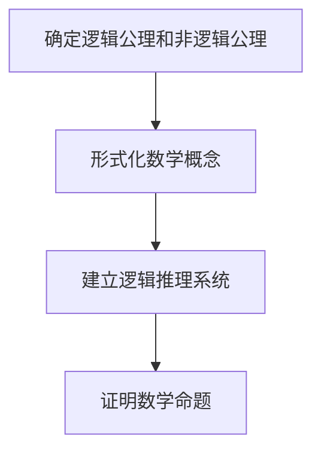

# 计算：第二部分 计算的数学基础 第 5 章 第三次数学危机 逻辑主义进路

## 1. 背景介绍

### 1.1 问题的由来

在19世纪末和20世纪初,数学基础遭遇了严重的危机。这场危机源于对经典数学中一些基本概念的质疑,如无穷小、连续性和实数等。当时的数学家们意识到,这些概念的定义存在着模糊和矛盾之处,需要对其进行更加严格和精确的阐释。

这场危机被称为"第三次数学危机",前两次危机分别是:

1. 非欧几里德几何的发现,动摇了欧几里得几何公理系统的地位。
2. 无理数和虚数的发现,扩展了数的概念。

第三次危机促使数学家们重新审视数学的基础,试图在更加坚实的逻辑基础上重建整个数学体系。这场危机催生了几种主要的基础主义学派,其中最著名的是逻辑主义和构造主义。

### 1.2 研究现状

面对第三次数学危机,数学家们提出了多种解决方案,试图在更加坚实的逻辑基础上重建整个数学体系。其中,逻辑主义和构造主义是两个最具影响力的学派。

逻辑主义的主要代表人物是戈特洛布·弗雷格(Gottlob Frege)和伯特兰·罗素(Bertrand Russell)。他们认为,整个数学可以被还原为纯粹的逻辑,并且试图用逻辑原理来定义和证明数学概念。

另一方面,构造主义的代表人物包括л·布劳威尔(L.E.J. Brouwer)和阿隆佐·邱奇(Alonzo Church)等。他们认为,数学对象只有在被"构造"出来时才是存在的,反对无穷集合和非构造性的推理方法。

两个学派都做出了重要贡献,但也都遇到了一些困难和局限性。逻辑主义遇到了罗素悖论等逻辑悖论,而构造主义则过于严格,限制了数学的发展空间。

### 1.3 研究意义

第三次数学危机及其产生的逻辑主义和构造主义,对于数学乃至整个科学发展产生了深远的影响。

首先,它们促进了对数学基础的反思和重建,推动了数学逻辑和元数学的发展。逻辑主义试图用逻辑原理来定义和证明数学概念,构造主义则强调对数学对象的有效构造,这些都为数学注入了新的活力。

其次,这些学派的理念也影响了计算机科学和人工智能的发展。计算机程序的设计和验证需要严格的逻辑推理,而构造主义的观点也体现在一些函数式编程语言中。

最后,第三次数学危机引发的讨论和争论,促进了人们对数学本质和方法论的深入思考,拓宽了数学的视野和发展方向。

### 1.4 本文结构

本文将详细探讨第三次数学危机中的逻辑主义进路。文章首先介绍逻辑主义的核心概念和与其他学派的联系,然后深入阐述逻辑主义的核心算法原理和数学模型,并通过实例和代码实践加以说明。接下来,文章将讨论逻辑主义在实际应用中的场景,并推荐相关的工具和资源。最后,本文将总结逻辑主义的发展趋势和面临的挑战,并对其未来前景进行展望。

## 2. 核心概念与联系

逻辑主义(Logicism)是19世纪末20世纪初兴起的一种数学基础理论,它试图将整个数学还原为逻辑学的一个分支。逻辑主义的核心观点是:所有的数学真理都可以被推导出来,并且只需要使用一些逻辑原理和少数非逻辑公理。

逻辑主义的主要代表人物包括:

- 戈特洛布·弗雷格(Gottlob Frege,1848-1925)
- 伯特兰·罗素(Bertrand Russell,1872-1970)
- 朗格·罗素(Frank P. Ramsey,1903-1930)

弗雷格是逻辑主义的开创者,他在著作《算术的基础原理》中试图用纯粹的逻辑来定义和证明数学概念,包括自然数、算术运算等。罗素则与怀特海合作,发现了著名的"罗素悖论",并与怀特海一起撰写了巨著《数学原理》,试图在逻辑主义的基础上重建整个数学。

逻辑主义与其他数学基础理论有着密切的联系:

- 与经验主义形成鲜明对比,后者认为数学知识来源于经验。
- 与构造主义有一定的渊源,但构造主义更加强调对数学对象的有效构造。
- 与形式主义有相似之处,都强调对数学概念的严格定义和形式化推理,但形式主义并不要求将数学还原为逻辑。

总的来说,逻辑主义旨在用逻辑学的方法来重建数学的基础,为数学注入更严谨的逻辑思维,这种尝试虽然最终未能完全实现,但对于数学乃至整个理性思维的发展产生了深远的影响。

## 3. 核心算法原理 & 具体操作步骤

### 3.1 算法原理概述

逻辑主义试图将整个数学还原为逻辑学,其核心算法原理就是利用一系列逻辑原理和推理规则,从有限的逻辑公理和非逻辑公理出发,推导出所有数学命题。

这个过程可以概括为以下几个关键步骤:

1. **确定逻辑公理和非逻辑公理**:首先需要确定一组基本的逻辑公理,如同一性公理、选择公理等,以及少数非逻辑公理,如无穷公理。
2. **形式化数学概念**:将数学中的基本概念,如自然数、实数、集合等,使用精确的逻辑符号和语法加以定义。
3. **建立逻辑推理系统**:构建一套完备的逻辑推理规则和演绎系统,用于从公理出发推导新的命题。
4. **证明数学命题**:利用推理系统,从公理出发,通过一系列逻辑步骤,证明所需的数学命题。

这个过程看似简单,但在实践中却存在着巨大的困难和挑战,需要解决诸如逻辑悖论、无穷集合的处理等棘手问题。

### 3.2 算法步骤详解

我们来详细解释一下逻辑主义算法的具体操作步骤:

1. **确定逻辑公理和非逻辑公理**

首先需要确定一组基本的逻辑公理,它们被认为是不证自明的逻辑真理,例如:

- 同一性公理: $\forall x (x = x)$
- 选择公理: $\forall x \exists y (y \in x \vee y \notin x)$
- 其他逻辑公理,如化简公理、引入公理等

此外,还需要引入少数非逻辑公理,如无穷公理,用于处理无穷集合的情况。

2. **形式化数学概念**

接下来,需要将数学中的基本概念使用精确的逻辑符号和语法加以定义,例如:

- 自然数: $0 = \emptyset, n + 1 = n \cup \{n\}$
- 实数: $\mathbb{R} = \{x | x \text{ 是由有理数构造的戴德金切割}\}$
- 集合: $x \in y \Leftrightarrow \forall z (z \in x \Rightarrow z \in y)$

这些定义需要严格遵循逻辑原则,避免出现任何模糊或循环。

3. **建立逻辑推理系统**

然后,需要构建一套完备的逻辑推理规则和演绎系统,用于从公理出发推导新的命题。这通常包括:

- 命题逻辑的推理规则,如模拟推理、假言推理等。
- 谓词逻辑的推理规则,如全称实例化、存在体化等。
- 等同推理规则,用于等价命题的推导。
- 其他高阶逻辑推理规则。

这些推理规则需要被证明是可靠和完备的,能够保证从真前提出发推导出的结论都是真命题。

4. **证明数学命题**

最后,利用建立的逻辑推理系统,从公理出发,通过一系列逻辑步骤,证明所需的数学命题。例如,证明 $2 + 2 = 4$ 的步骤可能是:

$$
\begin{aligned}
(1)&\quad 0 \in \mathbb{N}&&\text{公理}\\
(2)&\quad \forall x (x \in \mathbb{N} \Rightarrow x^{+} \in \mathbb{N})&&\text{公理}\\
(3)&\quad 1 \in \mathbb{N}&&\text{由 (1)、(2) 推得}\\
(4)&\quad 2 \in \mathbb{N}&&\text{由 (3)、(2) 推得}\\
(5)&\quad 2^{+} \in \mathbb{N}&&\text{由 (4)、(2) 推得}\\
(6)&\quad 2 + 1 = 2^{+}&&\text{定义}\\
(7)&\quad 2 + 1 = 3&&\text{由 (5)、(6) 推得}\\
&\vdots&&\\
(n)&\quad 2 + 2 = 4&&\text{经过一系列逻辑步骤推得}
\end{aligned}
$$

这个过程需要非常严格的逻辑推理,每一步都必须合乎逻辑规则,否则就会导致错误的结论。

### 3.3 算法优缺点

逻辑主义算法的优点主要包括:

1. **严谨性**:整个推导过程都建立在坚实的逻辑基础之上,每一步都必须合乎逻辑规则,避免了任何模糊或循环的定义。
2. **统一性**:试图将整个数学统一到逻辑学的框架之下,为数学注入了新的活力和发展方向。
3. **简洁性**:从少数公理出发,就可以推导出整个数学体系,体现了极大的简洁性和优雅性。

但是,逻辑主义算法也存在一些明显的缺点和局限性:

1. **困难性**:将整个数学形式化并用逻辑严格推导是一个极其艰巨的任务,实际操作中存在巨大的困难。
2. **悖论问题**:在推导过程中,可能会遇到罗素悖论等逻辑悖论,这给逻辑主义算法带来了根本性的挑战。
3. **表达能力**:纯粹的逻辑语言可能无法完全表达数学中的所有概念和思想,存在着表达能力的局限。
4. **构造性缺失**:逻辑主义算法缺乏对数学对象的有效构造,这在一定程度上限制了它的发展空间。

总的来说,尽管逻辑主义算法具有一定的优点,但它也存在着一些无法回避的缺陷和局限性,这使得它最终未能完全实现将数学还原为逻辑的目标。

### 3.4 算法应用领域

尽管逻辑主义算法在重建整个数学体系的雄心壮志上未能完全实现,但它的核心思想和方法在许多领域都产生了深远的影响和应用。

1. **数理逻辑**

数理逻辑是研究形式语言、形式系统和推理规则的一门学科,它直接继承了逻辑主义的思想,试图用严格的逻辑方法来研究数学的基础问题。

2. **计算机科学**

计算机程序的设计和验证需要严格的逻辑推理,因此逻辑主义的思想在计算机科学中得到了广泛应用。例如,在程序正确性验证、形式化方法等领域,都需要借助逻辑推理和形式化语言。

3. **人工智能**

人工智能