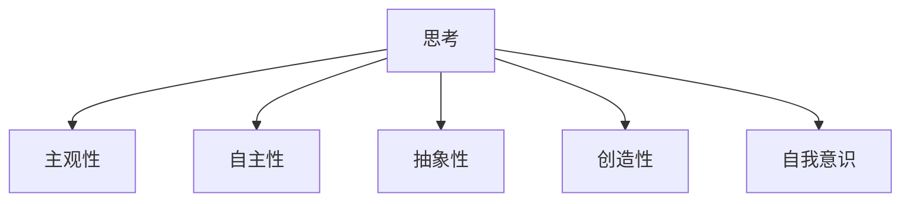
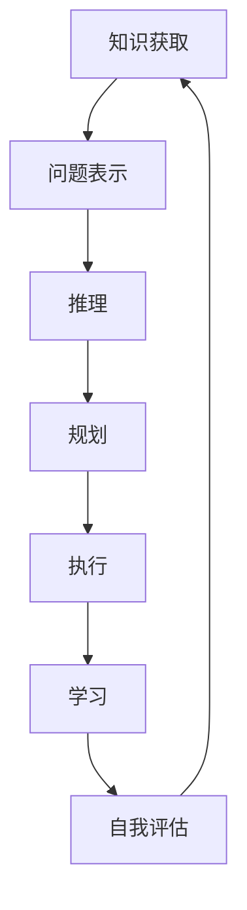
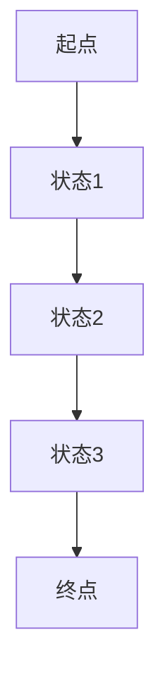

# 计算：第四部分 计算的极限 第 12 章 机器能思考吗 350 多年的等待

## 1. 背景介绍

### 1.1 问题的由来

人工智能(Artificial Intelligence, AI)的发展历程可以追溯到17世纪。在1637年,笛卡尔(René Descartes)提出了"思故我在"(I think, therefore I am)的著名哲学命题,认为思考是人类与机器的根本区别。自此,人类对于机器是否能够像人一样思考这一问题展开了长达350多年的探索和争论。

### 1.2 研究现状

在过去的几十年里,人工智能取得了令人瞩目的进展。从深蓝(DeepBlue)战胜国际象棋世界冠军,到阿尔法狗(AlphaGo)战胜围棋世界冠军,再到GPT-3等大型语言模型的出现,人工智能系统展现出了越来越强大的"思考"能力。然而,机器是否真正"思考"仍然是一个备受争议的问题。

### 1.3 研究意义

探讨机器是否能够思考,不仅关乎人工智能的发展方向,也关乎人类对自身智能的理解。如果机器能够真正思考,那么人类智能的本质就需要重新定义。反之,如果机器永远无法思考,那么人工智能的发展也将受到限制。因此,这个问题具有重要的哲学意义和技术意义。

### 1.4 本文结构

本文将从以下几个方面深入探讨机器是否能够思考这一问题:

1. 阐述"思考"的核心概念及其与人工智能的联系。
2. 介绍模拟人类思考过程的核心算法原理和具体操作步骤。
3. 建立数学模型,推导相关公式,并通过案例分析进行详细讲解。
4. 提供代码实例,详细解释实现过程,展示运行结果。
5. 探讨机器思考在实际应用场景中的潜力和前景。
6. 推荐相关学习资源、开发工具和论文等。
7. 总结研究成果,展望未来发展趋势和面临的挑战。

## 2. 核心概念与联系

思考(Thinking)是一种高级认知过程,涉及理解、推理、规划、创造力等多种能力。它是人类智能的核心特征,也是人工智能追求的终极目标之一。然而,思考是一个复杂的概念,难以用简单的定义来概括。

在探讨机器是否能够思考之前,我们需要先明确思考的核心特征。一般认为,思考具有以下几个关键特征:

1. **主观性(Subjectivity)**: 思考是一种主观的内在过程,无法直接观察。
2. **自主性(Autonomy)**: 思考需要自主地选择和组织信息,而不是被动地接受信息。
3. **抽象性(Abstraction)**: 思考涉及对具体事物进行抽象和概括,形成更高层次的概念和理论。
4. **创造性(Creativity)**: 思考不仅是对已有知识的重组,还能产生全新的想法和见解。
5. **自我意识(Self-Awareness)**: 思考需要对自身思维过程有一定程度的自我意识和反思。

人工智能系统在模拟人类思考方面取得了一定进展,但是否真正具备上述特征仍然存在争议。下面我们将介绍一些核心算法原理和数学模型,以探讨人工智能系统是否能够实现真正的思考。

## 3. 核心算法原理 & 具体操作步骤

### 3.1 算法原理概述

模拟人类思考过程的核心算法原理主要包括以下几个方面:

1. **知识表示(Knowledge Representation)**: 将人类的知识以计算机可理解的形式表示,如语义网络、框架理论、逻辑等。
2. **推理(Reasoning)**: 基于已有知识,通过规则推理、案例推理等方法进行推理和决策。
3. **规划(Planning)**: 根据目标状态和当前状态,制定一系列行动计划。
4. **学习(Learning)**: 通过机器学习算法从数据中获取新知识,不断优化和扩展知识库。
5. **自然语言处理(Natural Language Processing)**: 理解和生成自然语言,实现人机交互。
6. **计算机视觉(Computer Vision)**: 识别和理解图像、视频等视觉信息。

这些算法原理相互关联、相互支撑,共同构建了模拟人类思考过程的整体框架。

### 3.2 算法步骤详解

以下是一个典型的模拟人类思考过程的算法步骤:

1. **知识获取**: 从各种来源(如文本、图像、视频等)获取相关知识,并将其转换为计算机可理解的形式(如语义网络、逻辑表达式等)存储在知识库中。
2. **问题表示**: 将待解决的问题转换为计算机可理解的形式,如逻辑表达式或状态空间表示。
3. **推理**: 基于知识库和问题表示,通过规则推理、案例推理等方法进行推理,得到可能的解决方案。
4. **规划**: 根据推理结果和目标状态,制定一系列行动计划。
5. **执行**: 执行规划好的行动计划,并根据反馈进行调整。
6. **学习**: 从执行过程中获取新知识,更新知识库,为下一次思考过程做好准备。
7. **自我评估**: 评估思考过程的有效性,识别存在的问题和不足,为下一次思考过程提供反馈。

这个过程是一个循环的过程,每一次思考都会产生新的知识和经验,为下一次思考提供更好的基础。

### 3.3 算法优缺点

上述算法在模拟人类思考过程方面取得了一定成功,但也存在一些缺陷和局限性:

**优点**:

1. 能够处理大量结构化数据,进行高效的推理和规划。
2. 可以通过机器学习算法不断扩展知识库,提高思考能力。
3. 在特定领域内表现出超越人类的计算能力和准确性。

**缺点**:

1. 难以真正理解和模拟人类的主观性、创造性和自我意识等高级思维能力。
2. 知识库和推理规则的构建依赖人工,存在知识获取瓶颈。
3. 推理和规划过程存在combinatorial explosion(组合爆炸)问题,在复杂场景下效率低下。
4. 缺乏真正的理解能力,难以处理含糊、模糊、隐喻等人类语言现象。

### 3.4 算法应用领域

尽管存在一定局限性,但上述算法在许多领域都取得了广泛的应用,如:

1. **专家系统**: 在医疗、金融、法律等领域,模拟人类专家的思考过程,提供决策支持。
2. **规划与调度**: 在制造、物流、航空等领域,进行优化规划和资源调度。
3. **游戏AI**: 在国际象棋、围棋等游戏中,模拟人类思考过程,制定对策。
4. **自然语言处理**: 在机器翻译、问答系统、语音识别等领域,理解和生成自然语言。
5. **机器人控制**: 在工业机器人、服务机器人等领域,规划和执行复杂的动作序列。

随着算法和计算能力的不断提高,这些应用领域将进一步扩展,人工智能系统的思考能力也将不断增强。

## 4. 数学模型和公式 & 详细讲解 & 举例说明

### 4.1 数学模型构建

为了更好地理解和模拟人类思考过程,我们需要构建相应的数学模型。一种常见的方法是将思考过程建模为马尔可夫决策过程(Markov Decision Process, MDP)。

MDP是一种离散时间随机控制过程,由以下五个要素组成:

- 一组有限的状态集合 $S$
- 一组有限的行动集合 $A$
- 状态转移概率 $P(s' | s, a)$,表示在状态 $s$ 下执行行动 $a$ 后转移到状态 $s'$ 的概率
- 奖励函数 $R(s, a, s')$,表示在状态 $s$ 下执行行动 $a$ 后转移到状态 $s'$ 所获得的奖励
- 折扣因子 $\gamma \in [0, 1)$,用于权衡即时奖励和长期奖励的重要性

在MDP中,思考过程可以看作是找到一个最优策略 $\pi^*(s)$,使得在任意状态 $s$ 下执行该策略所获得的期望累积奖励最大化:

$$
V^*(s) = \max_\pi E\left[\sum_{t=0}^\infty \gamma^t R(s_t, a_t, s_{t+1}) | s_0 = s, \pi\right]
$$

其中 $V^*(s)$ 称为最优价值函数,表示在状态 $s$ 下执行最优策略所获得的期望累积奖励。

### 4.2 公式推导过程

我们可以通过值迭代(Value Iteration)或策略迭代(Policy Iteration)等动态规划算法来求解最优策略和最优价值函数。以值迭代为例,其迭代公式如下:

$$
V_{k+1}(s) = \max_{a \in A} \left\{R(s, a) + \gamma \sum_{s' \in S} P(s' | s, a) V_k(s')\right\}
$$

其中 $V_k(s)$ 表示在第 $k$ 次迭代时,状态 $s$ 下的价值函数估计值。通过不断迭代,价值函数将收敛到最优价值函数 $V^*(s)$。

基于最优价值函数,我们可以得到最优策略:

$$
\pi^*(s) = \arg\max_{a \in A} \left\{R(s, a) + \gamma \sum_{s' \in S} P(s' | s, a) V^*(s')\right\}
$$

### 4.3 案例分析与讲解

为了更好地理解MDP在模拟思考过程中的应用,我们以一个简单的网格世界(Gridworld)为例进行分析。

在网格世界中,智能体(Agent)需要从起点出发,到达终点。每一步行动都会获得相应的奖励或惩罚。智能体的目标是找到一条路径,使得从起点到终点的累积奖励最大化。

我们可以将网格世界建模为MDP:

- 状态集合 $S$ 为所有可能的网格位置
- 行动集合 $A$ 为 {上、下、左、右}
- 状态转移概率 $P(s' | s, a)$ 根据行动和网格环境确定
- 奖励函数 $R(s, a, s')$ 根据终点、障碍物等设置相应的奖励或惩罚
- 折扣因子 $\gamma$ 设置为合适的值,如 0.9

通过值迭代或策略迭代算法,我们可以求解出最优价值函数和最优策略。智能体只需按照最优策略执行相应的行动序列,就能够从起点到达终点,获得最大的累积奖励。

上图展示了一个简单的网格世界示例,其中智能体需要从起点 A 到达终点 E。通过MDP建模和相应算法,智能体可以找到最优路径 A -> B -> C -> D -> E,避开障碍物,获得最大的累积奖励。

### 4.4 常见问题解答

**Q: MDP模型是否能够完全模拟人类思考过程?**

A: MDP模型虽然能够模拟一些基本的思考过程,如规划、决策等,但仍然难以捕捉思考过程中的主观性、创造性和自我意识等高级特征。它更多地是一种理性决策模型,而非真正