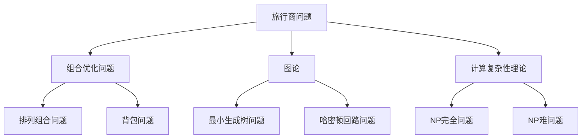
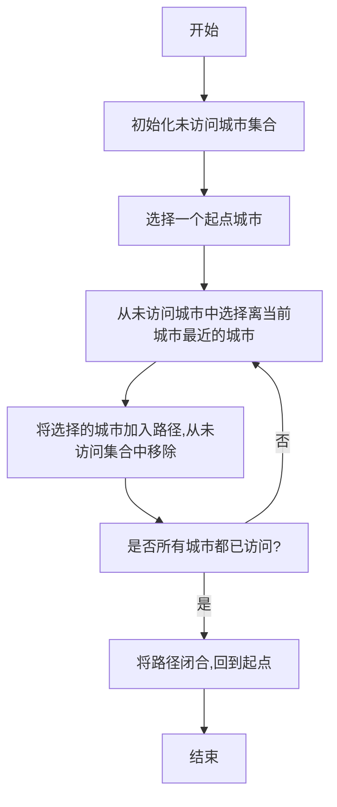
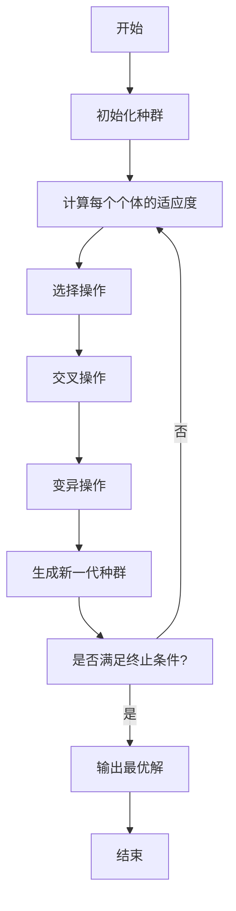

# 计算：第四部分 计算的极限 第 9 章 计算复杂性 旅行商问题

## 1. 背景介绍

### 1.1 问题的由来

旅行商问题(Traveling Salesman Problem, TSP)是一个经典的组合优化问题,源于19世纪的一个关于旅行商路线规划的实际问题。问题的描述是:给定一组城市和每对城市之间的距离,求解一条访问每个城市一次并回到起点的最短路径。

这个看似简单的问题,实际上隐藏着巨大的计算复杂度。当城市数量增加时,可能的路径组合将呈指数级增长,使得穷举所有路径变得不切实际。因此,旅行商问题被视为NP难问题(Non-deterministic Polynomial problem),是计算复杂性理论中最具代表性的问题之一。

### 1.2 研究现状

旅行商问题广泛存在于现实生活中,如物流运输路线规划、计算机芯片布线、基因排序等领域。因此,它一直是计算机科学和运筹学等领域的研究热点。

目前,对于小规模的旅行商问题实例,可以使用精确算法(如分支定界法、动态规划等)求解最优解。但对于大规模实例,由于计算量的指数级增长,精确算法往往无法在可接受的时间内得到最优解。因此,研究人员开发了各种启发式算法和近似算法,如遗传算法、模拟退火算法、蚁群算法等,以求在合理时间内得到较优的近似解。

### 1.3 研究意义

旅行商问题不仅是一个经典的组合优化问题,更是计算复杂性理论的基石。研究它有着重要的理论意义和应用价值:

- 理论意义:旅行商问题是NP难问题的代表,研究它有助于探索NP难问题的本质,推动计算复杂性理论的发展。
- 应用价值:许多现实问题都可以转化为旅行商问题,求解这一问题将为众多领域带来效益,如降低运输成本、优化芯片布线、提高基因测序效率等。

### 1.4 本文结构

本文将全面介绍旅行商问题的核心概念、算法原理、数学模型、代码实现、应用场景等内容。首先阐述问题的基本概念和与其他问题的联系;然后详细讲解经典算法的原理和操作步骤,并给出数学模型和公式推导;接着通过代码示例展示具体的实现细节;最后探讨旅行商问题在实际中的应用,并对未来的发展趋势和挑战进行展望。

## 2. 核心概念与联系

旅行商问题是一个典型的组合优化问题,它与图论、计算复杂性理论等领域密切相关。下面我们来探讨它的核心概念及与其他问题的联系。

1. **组合优化问题**: 旅行商问题属于组合优化问题的一种,需要从有限的可行解空间中寻找最优解。它与其他著名的组合优化问题(如排列组合问题、背包问题等)有一定的相似性。

2. **图论**: 旅行商问题可以用加权无向图来表示,每个城市对应一个顶点,两个城市之间的距离对应一条边的权重。求解最短路径实际上是在图中寻找一条权重最小的哈密顿回路(经过每个顶点一次并回到起点)。因此,它与最小生成树问题、哈密顿回路问题等图论问题有着密切的联系。

3. **计算复杂性理论**: 旅行商问题被证明是NP难问题,这意味着如果能够在多项式时间内解决它,那么所有NP问题都可以在多项式时间内解决。因此,它在计算复杂性理论中占有重要地位,是研究NP完全问题的典型代表。

综上所述,旅行商问题不仅本身具有重要的理论意义和应用价值,而且与组合优化、图论、计算复杂性等多个领域紧密相连,是计算机科学中一个富有挑战性的经典问题。

## 3. 核心算法原理 & 具体操作步骤

### 3.1 算法原理概述

由于旅行商问题的NP难性质,对于大规模实例,精确算法(如穷举、动态规划等)的计算复杂度将呈指数级增长,因此在可接受的时间内无法求解。为此,研究人员提出了多种启发式算法和近似算法,以期在合理时间内得到较优的近似解。这些算法主要基于以下两种思路:

1. **构造法算法**: 从一个初始解出发,通过局部优化操作(如交换、插入、反转等)不断改进当前解,直到满足某个停止条件。代表算法有贪心算法、2-opt算法等。

2. **基于群智能的算法**: 模拟自然界中群体行为的优化过程,通过模拟多个个体之间的竞争和协作,逐步演化出较优解。代表算法有遗传算法、蚂蚁群算法、模拟退火算法等。

下面我们将重点介绍两种经典算法的原理和具体步骤:贪心算法和遗传算法。

### 3.2 算法步骤详解

#### 3.2.1 贪心算法

贪心算法是一种构造法算法,其基本思路是从起点出发,每次选择当前最优(即离当前城市最近)的未访问城市,直到访问完所有城市并回到起点。具体步骤如下:

1. 初始化一个未访问城市的集合,包含所有城市。
2. 任意选择一个城市作为起点。
3. 从未访问城市集合中,选择离当前城市最近的城市,将其加入路径,并从未访问集合中移除。
4. 重复步骤3,直到所有城市都被访问。
5. 将路径闭合,即从最后一个城市返回起点,形成一条完整的回路。

贪心算法的优点是实现简单、计算效率较高。但由于其贪婪的本性,很容易陷入局部最优解,无法保证得到全局最优解。

#### 3.2.2 遗传算法

遗传算法是一种基于群智能的算法,它模拟自然界中生物进化的过程,通过选择、交叉和变异等操作,逐代产生新的解集,最终得到较优解。具体步骤如下:

1. **初始化种群**:随机生成一定数量的个体(路径),作为初始种群。
2. **计算适应度**:对每个个体计算其适应度(路径长度的倒数),适应度越高,表示该个体越优秀。
3. **选择操作**:根据个体的适应度,使用赌轮盘法等策略,选择若干个体作为父代。
4. **交叉操作**:随机选取两个父代个体,在某个位置交换它们的部分路径,生成两个新的子代个体。
5. **变异操作**:以一定的小概率对子代个体的路径进行变异,如交换两个城市的位置。
6. **生成新一代种群**:将经过交叉和变异的子代个体加入新的种群中。
7. **终止条件判断**:若满足终止条件(如达到最大迭代次数或适应度收敛),则输出当前种群中最优个体作为近似解;否则返回步骤2,对新一代种群进行迭代。

遗传算法通过模拟自然选择和遗传机制,可以有效地在解空间中进行全局搜索,避免陷入局部最优解。但它也存在一些缺陷,如参数设置的敏感性、收敛速度较慢等。

### 3.3 算法优缺点

上述两种算法各有优缺点,具体如下:

**贪心算法**:
- 优点:
  - 实现简单,计算效率高。
  - 对于某些特殊情况,可以得到最优解。
- 缺点:
  - 由于贪婪的本性,很容易陷入局部最优解。
  - 无法保证得到全局最优解。

**遗传算法**:
- 优点:
  - 具有全局寻优能力,不易陷入局部最优解。
  - 可以处理各种约束条件和复杂问题。
  - 易于并行计算,提高计算效率。
- 缺点:
  - 参数设置(如种群大小、交叉概率等)对算法性能影响较大。
  - 收敛速度较慢,需要较多的迭代次数。
  - 无法保证得到最优解,只能获得较优的近似解。

综合来看,贪心算法适用于小规模问题或对求解时间要求较高的场景,而遗传算法更适合处理大规模、复杂的旅行商问题实例。在实际应用中,需要根据具体问题的特点和要求,选择合适的算法或算法组合。

### 3.4 算法应用领域

旅行商问题及其求解算法在许多领域都有广泛的应用,例如:

- **物流运输规划**:确定卡车、飞机等运输工具的最优路线,以降低运输成本。
- **计算机芯片布线**:在芯片上寻找最短的布线路径,以减小芯片面积和功耗。
- **机器人路径规划**:为机器人规划最优的运动路径,以提高效率和节省能源。
- **基因测序**:确定基因片段的最佳排列顺序,以提高基因测序的准确性和效率。
- **3D打印路径优化**:规划3D打印机的最优打印路径,以减少打印时间和材料浪费。
- **巡游问题**:为警车、环卫车等规划最优的巡游路线,以提高工作效率。

除此之外,旅行商问题及其算法还可应用于无线传感器网络节点布置、计算机视觉模式识别、数据聚类分析等诸多领域。可以说,它是一个具有广泛应用价值的经典问题。

## 4. 数学模型和公式 & 详细讲解 & 举例说明

### 4.1 数学模型构建

为了形式化描述旅行商问题,我们可以使用图论和线性代数的知识构建其数学模型。假设有n个城市,每对城市之间的距离已知,用$d_{ij}$表示城市i和城市j之间的距离,其中$d_{ij} = d_{ji}$且$d_{ii} = 0$。

我们引入决策变量$x_{ij}$,其中$x_{ij} = 1$表示在最优路径中包含了从城市i到城市j的路径,否则$x_{ij} = 0$。那么旅行商问题可以表示为:

$$
\begin{aligned}
\min \quad & \sum_{i=1}^{n} \sum_{j=1}^{n} d_{ij} x_{ij} \\
\text{s.t.} \quad & \sum_{j=1}^{n} x_{ij} = 1, \quad \forall i \in \{1, 2, \ldots, n\} \\
& \sum_{i=1}^{n} x_{ij} = 1, \quad \forall j \in \{1, 2, \ldots, n\} \\
& \