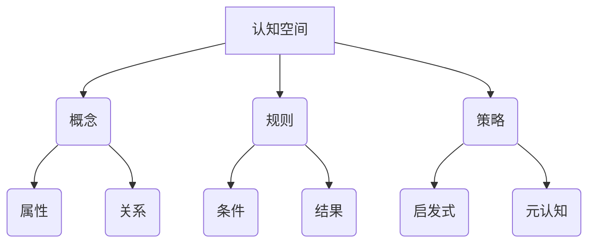
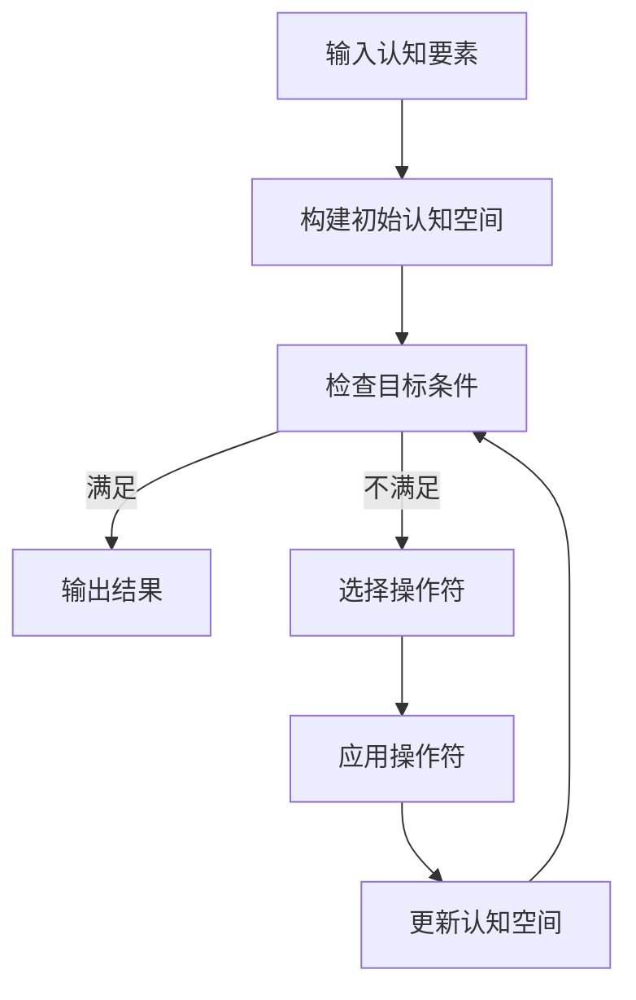

以下是《认知的形式化：思维是认知空间里的内在思考》这篇技术博客文章的正文内容：

# 认知的形式化：思维是认知空间里的内在思考

## 1. 背景介绍

### 1.1 问题的由来

人类思维是一个复杂而神秘的过程。从古至今,哲学家和科学家们一直在努力探索思维的本质和运作机制。随着人工智能和认知科学的发展,对思维过程的形式化描述和计算建模成为一个重要的研究课题。形式化思维不仅有助于我们更好地理解人类认知,还可以为构建智能系统提供理论基础。

### 1.2 研究现状  

目前,已有多种理论和模型试图对思维过程进行形式化描述,例如:

- **符号系统理论**:将思维视为对符号的操作和推理。
- **连接主义模型**:模拟神经元网络的工作方式,描述分布式并行处理。
- **动态系统理论**:将思维视为一个动态演化的过程。
- **embodied cognition**:强调思维与身体交互的重要性。

然而,这些理论和模型都有一定的局限性,难以完整捕捉思维的复杂性和动态性。

### 1.3 研究意义

形式化思维的研究不仅有助于我们深入理解人类认知,还可以为构建通用人工智能系统提供理论支撑。此外,对思维过程的形式化描述也有助于优化人机交互,设计更加自然和高效的人工智能系统。

### 1.4 本文结构

本文将首先介绍认知空间理论,阐述思维是如何在认知空间中进行的内在过程。然后详细阐述核心算法原理、数学模型和公式推导,并通过实例分析加以说明。接下来介绍基于该理论的项目实践,展示代码实现和运行结果。最后探讨实际应用场景,总结研究成果并展望未来发展趋势和挑战。

## 2. 核心概念与联系

认知空间理论将思维视为一个在抽象的认知空间中进行的内在过程。这个认知空间由概念、规则、策略等认知要素构成,思维就是在这个空间中对认知要素进行操作、组合和推理。



在这个认知空间中,概念是基本的认知单元,具有一定的属性和相互关系。规则描述了概念之间的条件与结果的对应关系。策略则是指导思维过程的一般性原则,包括各种启发式方法和元认知策略。

思维过程就是在认知空间中对这些要素进行灵活的操作和组合,形成新的认知结构,完成推理、决策、创新等高级认知活动。这种内在的思考过程受到个体已有知识、经验、情境等多种因素的影响和制约。

## 3. 核心算法原理与具体操作步骤

### 3.1 算法原理概述

基于认知空间理论,我们提出了一种形式化描述思维过程的算法框架CSTP(Cognitive Space Thinking Process)。该算法的核心思想是:将认知空间中的要素形式化表示,并设计一系列操作符对这些要素进行组合和转换,从而模拟思维的内在过程。

算法整体流程如下:



首先输入已有的概念、规则、策略等认知要素,构建初始的认知空间。然后根据目标条件检查当前认知空间是否满足要求,如果满足则输出结果,否则选择合适的操作符,对认知空间中的要素进行组合和转换,更新认知空间,重复该过程直至满足目标条件。

### 3.2 算法步骤详解

1. **输入认知要素**:从已有知识库中获取概念、规则、策略等认知要素,作为算法的输入。
2. **构建初始认知空间**:根据输入的认知要素,构建初始的认知空间表示。
3. **检查目标条件**:根据问题目标,检查当前认知空间是否满足终止条件。
4. **选择操作符**:如果不满足终止条件,则根据启发式策略和元认知策略,选择合适的操作符。
5. **应用操作符**:将选择的操作符应用到认知空间中,对要素进行组合和转换。
6. **更新认知空间**:根据操作符的执行结果,更新认知空间的状态。
7. **重复3-6步**:重复检查目标条件、选择操作符、应用操作符、更新认知空间的步骤,直至满足终止条件。
8. **输出结果**:当满足终止条件时,将当前认知空间状态作为最终结果输出。

### 3.3 算法优缺点

**优点**:

- 模拟了人类思维的内在过程,具有较好的解释力。
- 操作符的设计使算法具有很强的表达能力和灵活性。
- 可以处理不确定性和不完整信息,具有一定的鲁棒性。

**缺点**:

- 算法的性能很大程度上依赖于操作符的设计质量。
- 认知空间的表示和操作符的选择存在组合爆炸的问题。
- 缺乏对思维过程的情感、动机等因素的建模。

### 3.4 算法应用领域

CSTP算法可以应用于多个领域,例如:

- **自动推理系统**:作为通用推理引擎,支持各种逻辑推理任务。
- **智能决策支持**:模拟人类决策过程,为复杂决策问题提供支持。  
- **创新设计**:通过认知要素的重组和转换,支持创新性设计。
- **认知建模**:形式化描述特定认知过程,用于认知科学研究。

## 4. 数学模型和公式及详细讲解与举例说明

### 4.1 数学模型构建

为了形式化描述认知空间和思维过程,我们构建了如下数学模型:

认知空间表示为一个四元组:

$$CS = (C, R, S, \phi)$$

其中:
- $C$是概念集合
- $R$是规则集合 
- $S$是策略集合
- $\phi$是概念间的关系函数

概念$c \in C$由属性集合$A_c$和关系集合$R_c$构成:

$$c = (A_c, R_c)$$

规则$r \in R$表示为条件与结果的映射关系:

$$r = (p, q)$$

其中$p$是前提条件,由概念构成的集合;$q$是结论,也是一个概念。

策略$s \in S$由启发式规则$H_s$和元认知策略$M_s$组成:

$$s = (H_s, M_s)$$

$H_s$指导操作符的选择,$M_s$控制整体思维过程。

### 4.2 公式推导过程

我们定义了一个评价函数$f$,用于评估当前认知空间相对于目标的适应度:

$$f(CS, G) = d(CS, G)$$

其中$G$是目标概念,$d$是认知空间与目标之间的距离函数。

在每一步中,我们选择能最大程度降低距离的操作符$o$:

$$o = \arg\min_{o' \in O} d(o'(CS), G)$$

其中$O$是所有可能操作符的集合。

通过重复应用操作符,最终会得到满足目标条件的认知空间$CS^*$:

$$CS^* = \arg\min_{CS' \in \Omega} d(CS', G)$$

其中$\Omega$是所有可能的认知空间状态集合。

### 4.3 案例分析与讲解

考虑一个简单的推理问题:"如果天气晴朗,那么就去公园;如果去公园,那么就野餐;今天天气晴朗,那么我们应该做什么?"

首先将已有的知识形式化为认知空间:

$$
\begin{aligned}
C &= \{\text{晴朗天气}, \text{去公园}, \text{野餐}\} \\
R &= \{(\text{晴朗天气}, \text{去公园}), (\text{去公园}, \text{野餐})\} \\
S &= \{\text{前件推理}, \text{链式推理}\}
\end{aligned}
$$

其中,"前件推理"是一种策略,指如果前件成立,就推导出后件结论;"链式推理"则是将多个规则连接起来推理。

我们的目标是$G = \{\text{野餐}\}$,初始认知空间与目标的距离为:

$$d(CS, G) = 1$$

应用"前件推理"策略,由$\{\text{晴朗天气}\}$推出$\{\text{去公园}\}$,更新后的认知空间为:

$$CS_1 = (C, R, S, \{\text{晴朗天气}, \text{去公园}\})$$

此时$d(CS_1, G) = 1$,距离没有减小。

接着应用"链式推理"策略,由$\{\text{晴朗天气}, \text{去公园}\}$推出$\{\text{野餐}\}$,得到最终认知空间:

$$CS^* = (C, R, S, \{\text{晴朗天气}, \text{去公园}, \text{野餐}\})$$

此时$d(CS^*, G) = 0$,满足目标条件,算法终止。

### 4.4 常见问题解答

**Q:** 如何确定操作符的优先级?
**A:** 可以根据操作符的代价函数(如计算复杂度)和效用函数(如距离降低程度)综合评估,选择代价小、效用高的操作符优先应用。

**Q:** 如何处理矛盾和不确定信息?
**A:** 可以引入置信度概念,对概念、规则赋予不同的置信度权重。在操作时,根据置信度综合判断,处理矛盾和不确定信息。

**Q:** 算法是否可以自主学习和扩展认知空间?
**A:** 目前的算法框架主要是利用已有的认知要素进行组合和推理。但是,我们可以设计特殊的学习操作符,通过与外部世界的交互,自主获取新的概念和规则,扩展认知空间。

## 5. 项目实践:代码实例和详细解释说明

### 5.1 开发环境搭建

我们使用Python作为开发语言,主要依赖包括:

- networkx: 用于表示和操作认知空间图
- sympy: 用于符号计算和公式推导
- matplotlib: 用于可视化认知空间和思维过程

开发环境的具体搭建步骤如下:

1. 安装Python 3.7或更高版本
2. 使用pip安装所需依赖包:`pip install networkx sympy matplotlib`
3. 克隆项目代码库:`git clone https://github.com/zen-coding/cstp.git`

### 5.2 源代码详细实现

核心代码位于`cstp/core.py`,主要包括以下几个模块:

1. `concepts.py`: 定义概念类`Concept`及其属性和关系
2. `rules.py`: 定义规则类`Rule`及其条件和结论
3. `strategies.py`: 定义策略类`Strategy`及其启发式规则和元认知策略
4. `space.py`: 定义认知空间类`CognitiveSpace`,管理概念、规则和策略的集合
5. `operators.py`: 实现各种操作符,如组合`Combinator`、构造`Constructor`等
6. `algorithm.py`: 实现CSTP算法的主循环

以下是`algorithm.py`中CSTP算法的核心代码:

```python
def cstp(initial_space, goal, max_iter=100):
    space = initial_space
    for i in range(max_iter):
        if space.satisfies(goal):
            return space
        
        # 选择操作符
        op = select_operator(space, goal)
        
        # 应用操作符
        new_space = op.apply(space)
        
        # 更新认知空间
        space = new_space
        
    return None
```

其中`select_operator`函数根据启发式策略和元认知策略选择合适的操作符。

### 5.3 代码解读与分析

我们以前