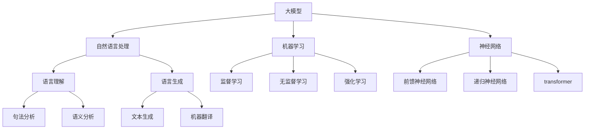

# 语言与思维：大模型的认知困惑

## 1. 背景介绍

### 1.1 问题的由来

人工智能领域的一个重大突破是大型语言模型的出现,如GPT-3、PaLM等。这些模型通过在海量文本数据上进行预训练,展现出惊人的语言生成能力,可以回答各种问题、撰写文章、编写代码等。然而,尽管大模型在语言任务上表现出色,但它们真正理解语言意义的能力仍然存疑。这种"认知困惑"引发了人们对大模型思维方式的质疑和探索。

### 1.2 研究现状  

目前,学术界和工业界对大模型的思维方式存在多种观点和假说。一种观点认为,大模型只是在模拟人类语言,并没有真正理解语义。另一种观点则认为,大模型通过学习语料中的统计规律,掌握了一定程度的语义理解能力。此外,还有研究者提出,大模型可能形成了一种"类似思维"的内部表征,但与人类思维存在根本差异。

### 1.3 研究意义

探索大模型的认知方式,对于推动人工智能的发展具有重要意义。首先,揭示大模型的思维机制,有助于我们更好地理解和利用这一强大的技术。其次,研究大模型与人类思维的异同,将为构建真正具备理解和推理能力的人工智能系统提供借鉴。此外,这一课题也关乎人工智能的伦理和安全性,有助于我们评估大模型的局限性,并规避潜在风险。

### 1.4 本文结构

本文将从多个角度探讨大模型的认知困惑问题。第2节介绍大模型的核心概念及其与人类语言认知的关联;第3节阐述大模型的核心算法原理和具体操作步骤;第4节构建数学模型并推导公式,分析算法的理论基础;第5节通过代码实例演示大模型的实现;第6节探讨大模型在实际应用中的场景;第7节推荐相关工具和学习资源;第8节总结研究成果并展望未来发展趋势和挑战;第9节列出常见问题及解答。

## 2. 核心概念与联系



大模型(Large Model)是一种基于深度学习的人工智能模型,通过在海量数据上进行预训练,获得强大的语言处理能力。它融合了自然语言处理(NLP)、机器学习和神经网络等多个领域的核心概念。

在自然语言处理方面,大模型可用于语言理解和语言生成等任务。语言理解包括句法分析(解析语句的语法结构)和语义分析(理解语句的意义);语言生成则包括文本生成(如写作、问答等)和机器翻译等。

机器学习是大模型的理论基础。大模型通过无监督学习从海量语料中捕捉统计规律,也可通过有监督学习和强化学习进一步优化模型。

神经网络是大模型的核心架构,主要包括前馈神经网络、递归神经网络和Transformer等。其中,Transformer由于其并行化特性和长距离依赖建模能力,成为了大模型的主流选择。

## 3. 核心算法原理 & 具体操作步骤

### 3.1 算法原理概述

大模型的核心算法是Transformer,它基于Self-Attention机制对输入序列建模。与RNN等序列模型不同,Transformer完全放弃了递归结构,而是通过Attention机制直接对序列中任意两个位置的元素建立联系,极大提高了并行能力。

Transformer的主要组件包括编码器(Encoder)和解码器(Decoder)。编码器将输入序列映射为连续的表示,解码器则基于输入表示生成输出序列。两者均由多个相同的层组成,每层包含多头Self-Attention子层和前馈神经网络子层。

### 3.2 算法步骤详解

1. **输入表示**:将输入序列(如文本)映射为embedding向量序列。

2. **位置编码**:因Transformer没有递归或卷积结构,无法直接获取序列位置信息,因此需要对序列添加位置编码。

3. **编码器**:
    - 多头Self-Attention层对输入进行编码,计算出查询向量与键向量的注意力权重,并将加权的值向量求和作为输出。
    - 前馈神经网络对每个位置的表示进行个别转换,为模型引入非线性。
    - 层归一化和残差连接确保梯度稳定传播。

4. **解码器(maskSelf-Attention)**:
    - 第一个子层与编码器类似,但使用Mask防止关注后面的位置。
    - 第二个子层为编码器-解码器注意力层,允许每个位置关注整个输入序列。
    - 最后一个前馈层与编码器相同。

5. **输出**:解码器产生的输出向量序列映射回模型目标,如文本等。

### 3.3 算法优缺点

**优点**:

- 并行计算能力强,能充分利用GPU/TPU等加速硬件。
- 长距离依赖建模能力好,适合捕捉长序列中的模式。
- 无严格顺序限制,可处理各种排列顺序的序列。

**缺点**:

- 计算复杂度高,对长序列建模代价大。
- 缺乏对序列位置和结构的显式建模。
- 容易受到噪声数据的影响,对异常值敏感。

### 3.4 算法应用领域

Transformer及其变体广泛应用于自然语言处理、计算机视觉、语音识别、生成对抗网络等领域,主要包括:

- 文本生成:新闻、小说、诗歌、对话等创作。
- 机器翻译:多语种之间的高质量翻译。
- 问答系统:回答各类问题,如开放域问答、事实型问答等。
- 代码生成:根据需求自动生成计算机程序代码。
- 图像/视频理解:图像/视频描述、视觉问答等。
- 语音识别:将语音转录为文本。

## 4. 数学模型和公式 & 详细讲解 & 举例说明

### 4.1 数学模型构建

Transformer的核心是Self-Attention机制,用于计算输入序列中元素之间的相关性。给定一个长度为n的序列 $X = (x_1, x_2, ..., x_n)$,Self-Attention的计算过程如下:

$$\begin{aligned}
    \text{Query} &= X \cdot W^Q\\
    \text{Key} &= X \cdot W^K\\
    \text{Value} &= X \cdot W^V\\
    \text{Attention}(Q, K, V) &= \text{softmax}(\frac{QK^T}{\sqrt{d_k}})V
\end{aligned}$$

其中,$W^Q, W^K, W^V$分别为查询(Query)、键(Key)和值(Value)的可学习的线性投影矩阵。$d_k$为缩放因子,用于防止点积过大导致梯度消失。

Self-Attention的输出是Value的加权和,权重由Query与所有Key的点积计算得到。这种机制使得序列中的每个元素都可以关注其他元素,捕捉长距离依赖关系。

### 4.2 公式推导过程

为了并行化计算,Transformer采用了多头注意力(Multi-Head Attention)机制,将注意力分成多个子空间,分别计算后再合并结果:

$$\begin{aligned}
    \text{MultiHead}(Q, K, V) &= \text{Concat}(head_1, ..., head_h)W^O\\
    \text{where } head_i &= \text{Attention}(QW_i^Q, KW_i^K, VW_i^V)
\end{aligned}$$

其中,$W_i^Q, W_i^K, W_i^V$为第i个注意力头的线性投影矩阵,$W^O$为最终的线性变换矩阵。多头注意力允许模型关注输入的不同子空间表示,提高了模型的表达能力。

在实际应用中,Transformer通常会堆叠多个编码器/解码器层,每层包含多头注意力子层和前馈子层。前馈子层的计算公式为:

$$\text{FFN}(x) = \max(0, xW_1 + b_1)W_2 + b_2$$

其中,FFN为前馈网络,包含两个线性变换和一个ReLU激活函数。

### 4.3 案例分析与讲解

以机器翻译任务为例,说明Transformer的工作流程:

1. 将源语言句子 $X=(x_1,...,x_n)$ 输入编码器。
2. 编码器计算Self-Attention,得到源句子的上下文表示 $Z=(z_1,...,z_n)$。
3. 将目标语言的起始符<sos>输入解码器。
4. 解码器计算Masked Self-Attention,阻止关注后续位置。
5. 解码器计算编码器-解码器注意力,将目标表示与源句表示 $Z$ 关联。
6. 解码器输出第一个目标词 $y_1$ 的概率分布。
7. 将 $y_1$ 输入解码器,重复4-6,生成下一个目标词,直到生成终止符<eos>。

通过上述过程,Transformer能够同时关注源句和已生成的目标词,捕捉两种语言之间的长距离依赖关系,实现高质量的翻译。

### 4.4 常见问题解答

**Q:Self-Attention是如何计算序列内元素的相关性的?**

A:Self-Attention通过Query、Key和Value向量的点积运算,计算序列中每个元素与其他元素的相关分数。具体来说,Query与所有Key向量的点积得到一个相关性分数向量,通过Softmax函数将其转化为概率分布,最后与Value向量相乘并求和,得到该元素的注意力表示。

**Q:多头注意力有何优势?**

A:单一注意力机制只能关注输入的一个子空间表示,而多头注意力允许模型同时关注不同的子空间表示,增强了模型的表达能力。此外,多头注意力还具有一定的稳定性,即使某些头失效,其他头仍可为模型提供有效信息。

**Q:Transformer如何解决长序列的计算效率问题?**

A:对于长序列输入,Transformer的计算复杂度会迅速增长。一种优化方法是利用局部注意力机制,只关注序列中相邻的部分,降低计算量。另一种方法是分层(Hierarchical)Transformer,先对较短的片段建模,再组合到更高层次。此外,也可以使用近似注意力机制如Reformer等,进一步降低计算开销。

## 5. 项目实践:代码实例和详细解释说明

### 5.1 开发环境搭建

在实现Transformer模型之前,我们需要搭建开发环境。以Python为例,可以使用PyTorch或TensorFlow等深度学习框架。这里我们使用PyTorch,并安装必要的依赖库:

```bash
# 创建虚拟环境
python -m venv env
source env/bin/activate

# 安装PyTorch
pip install torch torchvision

# 安装其他依赖
pip install numpy matplotlib
```

### 5.2 源代码详细实现

```python
import torch
import torch.nn as nn
import math

class MultiHeadAttention(nn.Module):
    def __init__(self, d_model, num_heads):
        super().__init__()
        self.num_heads = num_heads
        self.d_model = d_model
        
        self.depth = d_model // self.num_heads
        
        self.wq = nn.Linear(d_model, d_model)
        self.wk = nn.Linear(d_model, d_model)
        self.wv = nn.Linear(d_model, d_model)
        
        self.dense = nn.Linear(d_model, d_model)
        
    def split_heads(self, x, batch_size):
        x = x.view(batch_size, -1, self.num_heads, self.depth)
        return x.permute(0, 2, 1, 3)