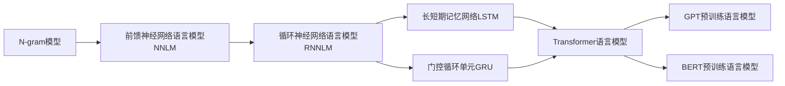

# 语言模型 原理与代码实例讲解

## 1. 背景介绍
### 1.1 问题的由来
随着人工智能技术的飞速发展,自然语言处理(NLP)领域取得了突破性进展。语言模型作为NLP的核心技术之一,在机器翻译、情感分析、文本生成等诸多任务中发挥着关键作用。然而,语言模型的原理和实现对于很多初学者来说仍然是一个难点。本文旨在通过深入浅出的讲解和代码实例,帮助读者全面掌握语言模型的相关知识。

### 1.2 研究现状  
近年来,语言模型技术不断突破,从传统的N-gram模型到神经网络语言模型(NNLM),再到当前大热的Transformer模型,语言模型的表现力和性能都得到了极大提升。以GPT、BERT等为代表的预训练语言模型更是将NLP推向了新的高度。同时,语言模型在工业界也得到了广泛应用,如智能客服、搜索引擎、语音助手等。

### 1.3 研究意义
语言模型是NLP的基础,深入理解语言模型的原理,掌握语言模型的实现方法,对于从事NLP相关工作的研究者和工程师来说至关重要。通过本文的学习,读者可以系统地了解语言模型技术的发展脉络,把握语言模型的核心思想,并能够动手实践,搭建自己的语言模型。这对于进一步学习和应用其他NLP技术也有很大帮助。

### 1.4 本文结构
本文将从以下几个方面展开:
- 介绍语言模型的核心概念与发展历程
- 剖析几种主流语言模型的原理与算法细节
- 结合数学公式与案例分析语言模型的理论基础  
- 提供语言模型的代码实例与详细解读
- 探讨语言模型的实际应用场景与未来发展趋势
- 推荐语言模型相关的学习资源与开发工具

## 2. 核心概念与联系

语言模型的核心思想是:对于一个给定的词序列,估计其概率分布。形式化地说,对于词序列 $w_1, w_2, \dots, w_T$,语言模型的目标是建模联合概率:

$$P(w_1, w_2, \dots, w_T)$$

根据概率论的链式法则,联合概率可以分解为一系列条件概率的乘积:

$$P(w_1, w_2, \dots, w_T) = \prod_{t=1}^T P(w_t | w_1, \dots, w_{t-1})$$

其中 $P(w_t | w_1, \dots, w_{t-1})$ 表示在给定前 $t-1$ 个词的条件下,第 $t$ 个词为 $w_t$ 的条件概率。这就是语言模型的本质:学习一个条件概率分布。

传统的N-gram语言模型基于马尔可夫假设,认为一个词的出现只与前面的 $n-1$ 个词相关:

$$P(w_t | w_1, \dots, w_{t-1}) \approx P(w_t | w_{t-n+1}, \dots, w_{t-1})$$

而神经网络语言模型(NNLM)使用神经网络来建模条件概率,克服了数据稀疏等问题。当前流行的Transformer语言模型使用自注意力机制,可以捕捉词之间的长距离依赖。

下图展示了几种主要语言模型之间的联系与演进:



## 3. 核心算法原理 & 具体操作步骤
### 3.1 算法原理概述
本节我们重点介绍当前NLP领域最为流行的Transformer语言模型。Transformer的核心是自注意力机制(Self-Attention),它可以高效地对词与词之间的关系进行建模。

Transformer由编码器(Encoder)和解码器(Decoder)组成。编码器用于将输入序列编码为隐向量表示,解码器根据编码结果和之前生成的词,预测下一个词的概率分布。

编码器和解码器都由若干个相同的层(Layer)堆叠而成,每一层包含两个子层:自注意力层(Self-Attention)和前馈神经网络层(Feed Forward)。

### 3.2 算法步骤详解

1. 输入表示
   - 将输入序列中的每个词映射为词向量(Word Embedding)
   - 加入位置编码(Positional Encoding)以引入词序信息

2. 编码器
   - 自注意力层:通过计算Query、Key、Value向量,得到每个位置与其他位置的注意力权重,实现信息聚合
   - 前馈神经网络层:使用两层全连接网络,增强特征表示能力
   - 残差连接与Layer Normalization:有助于模型训练

3. 解码器
   - 自注意力层:类似编码器,但使用Masked Self-Attention防止看到未来信息
   - 编码-解码注意力层:将编码器的输出作为Key和Value,解码器的状态作为Query,实现两者信息交互  
   - 前馈神经网络层、残差连接与Layer Normalization:与编码器类似

4. 输出
   - 将解码器的输出通过线性变换和Softmax函数,得到下一个词的概率分布

5. 训练
   - 使用交叉熵损失函数,最大化真实词序列的概率
   - 采用Adam优化器,调整模型参数

6. 推理
   - 根据输入序列,使用训练好的模型生成后续词,直到遇到终止符

### 3.3 算法优缺点
Transformer语言模型的优点包括:
- 并行计算能力强,训练速度快
- 自注意力机制可以捕捉长距离依赖
- 模型容量大,可以处理大规模语料

缺点包括:  
- 计算复杂度高,对硬件要求高
- 推理速度慢,难以应用于实时场景
- 解释性不强,内部工作机制仍不透明

### 3.4 算法应用领域
Transformer语言模型已成为NLP领域的主流技术,广泛应用于以下任务:
- 机器翻译:如Google Translate、微软Translator等
- 文本摘要:自动生成文章摘要
- 对话系统:如智能客服、聊天机器人等  
- 问答系统:回答用户提出的问题
- 文本分类:情感分析、垃圾邮件识别等
- 命名实体识别:识别文本中的人名、地名、机构名等

## 4. 数学模型和公式 & 详细讲解 & 举例说明
### 4.1 数学模型构建
Transformer的数学模型可以用如下公式表示:

编码器第 $l$ 层的第 $i$ 个位置的状态 $h_i^{(l)}$ 为:

$$h_i^{(l)} = \text{LayerNorm}(a_i^{(l)} + \text{FFN}(a_i^{(l)}))$$

其中 $a_i^{(l)}$ 是自注意力层的输出:

$$a_i^{(l)} = \sum_{j=1}^n \alpha_{ij}^{(l)} (h_j^{(l-1)} W_V^{(l)})$$

$\alpha_{ij}^{(l)}$ 是注意力权重,通过Query、Key、Value向量计算得到:

$$\alpha_{ij}^{(l)} = \frac{\exp(e_{ij}^{(l)})}{\sum_{k=1}^n \exp(e_{ik}^{(l)})}$$

$$e_{ij}^{(l)} = \frac{(h_i^{(l-1)} W_Q^{(l)})(h_j^{(l-1)} W_K^{(l)})^T}{\sqrt{d_k}}$$

其中 $W_Q^{(l)}, W_K^{(l)}, W_V^{(l)}$ 是可学习的参数矩阵。

解码器的数学模型与编码器类似,只是在自注意力层使用了Masked Self-Attention,在编码-解码注意力层引入了编码器的输出。

### 4.2 公式推导过程
以自注意力层的计算过程为例,详细推导如下:

1. 将上一层的状态 $h^{(l-1)}$ 通过线性变换得到Query、Key、Value向量:

$$Q^{(l)} = h^{(l-1)} W_Q^{(l)}, K^{(l)} = h^{(l-1)} W_K^{(l)}, V^{(l)} = h^{(l-1)} W_V^{(l)}$$

2. 计算Query与Key的点积,得到注意力分数:

$$e_{ij}^{(l)} = \frac{Q_i^{(l)} {K_j^{(l)}}^T}{\sqrt{d_k}}$$

3. 对注意力分数应用Softmax函数,得到注意力权重:

$$\alpha_{ij}^{(l)} = \text{Softmax}(e_{ij}^{(l)}) = \frac{\exp(e_{ij}^{(l)})}{\sum_{k=1}^n \exp(e_{ik}^{(l)})}$$

4. 将注意力权重与Value向量加权求和,得到自注意力层的输出:

$$a_i^{(l)} = \sum_{j=1}^n \alpha_{ij}^{(l)} V_j^{(l)}$$

### 4.3 案例分析与讲解
下面我们以一个简单的例子来说明Transformer的工作原理。假设输入序列为"I love NLP"。

1. 输入表示
   - 将每个词映射为词向量,假设维度为4:
     - I: [0.1, 0.2, 0.3, 0.4]
     - love: [0.5, 0.6, 0.7, 0.8]  
     - NLP: [0.9, 1.0, 1.1, 1.2]
   - 加入位置编码,引入词序信息

2. 编码器
   - 自注意力层:计算每个词与其他词的注意力权重,得到上下文信息
     - I与love的注意力权重较高,与NLP的注意力权重较低
     - love与I和NLP的注意力权重都较高
     - NLP与love的注意力权重较高,与I的注意力权重较低
   - 前馈神经网络层:进一步提取特征

3. 解码器
   - 自注意力层:类似编码器,但只能看到之前生成的词
   - 编码-解码注意力层:根据编码器的输出和之前生成的词,预测下一个词
     - 假设已生成"I love",预测下一个词为"NLP"的概率较高

4. 输出
   - 将解码器的输出通过Softmax函数,得到下一个词的概率分布
   - 选择概率最高的词作为生成结果

通过这个例子,我们可以看到Transformer如何通过自注意力机制捕捉词与词之间的依赖关系,并根据上下文预测下一个词。

### 4.4 常见问题解答
1. Q: Transformer相比传统的RNN语言模型有什么优势?
   A: Transformer通过自注意力机制实现并行计算,训练速度更快;同时可以捕捉长距离依赖,对语言建模能力更强。

2. Q: Self-Attention的计算复杂度是多少?
   A: Self-Attention的时间复杂度和空间复杂度都是 $O(n^2)$,其中 $n$ 是序列长度。这是Transformer的一个瓶颈所在。

3. Q: Transformer中的位置编码有什么作用?  
   A: 位置编码可以为词向量引入词序信息,使得模型能够区分不同位置的词。这对于自然语言处理任务非常重要。

4. Q: Transformer能否处理变长序列?
   A: Transformer可以处理变长序列,但是由于位置编码的限制,其最大长度是固定的。对于超长序列,需要进行截断或分段处理。

## 5. 项目实践：代码实例和详细解释说明
### 5.1 开发环境搭建
首先,我们需要搭建Transformer语言模型的开发环境。本文使用PyTorch框架进行实现。

安装PyTorch:
```bash
pip install torch
```

其他依赖包:
```bash
pip install numpy matplotlib tqdm
```

### 5.2 源代码详细实现
下面给出Transformer语言模型