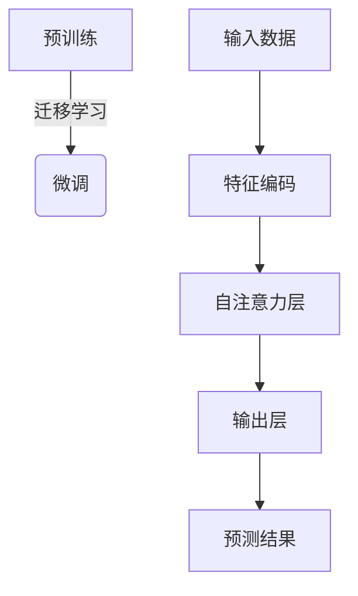

以下是《财经分析中的AI：如何用大模型预测市场趋势》的正文内容:

# 财经分析中的AI：如何用大模型预测市场趋势

## 1. 背景介绍

### 1.1 问题的由来

金融市场的波动性一直是投资者和经济学家关注的焦点。准确预测市场趋势对于制定投资策略、风险管理和政策制定至关重要。然而,金融市场是一个复杂的非线性动态系统,受到众多因素的影响,如经济数据、政治事件、投资者情绪等,这使得准确预测市场走势成为一个巨大的挑战。

### 1.2 研究现状  

传统的市场预测方法主要依赖于技术分析和基本面分析。技术分析利用历史价格数据和交易量等指标,试图识别出价格走势的规律;而基本面分析则关注公司业绩、宏观经济指标等基本因素对价格的影响。然而,这些方法存在局限性,难以全面捕捉影响市场的多种复杂因素。

### 1.3 研究意义

近年来,人工智能(AI)技术在金融领域的应用日益受到重视。AI算法能够从海量数据中发现隐藏的模式和关联,并提供数据驱动的见解和预测。特别是,大型语言模型(Large Language Model,LLM)凭借其强大的自然语言处理能力和知识表示能力,为金融预测带来了新的机遇。

### 1.4 本文结构

本文将探讨如何利用大型语言模型(LLM)进行金融市场预测。我们将介绍LLM在金融预测中的应用、核心算法原理、数学模型、项目实践、应用场景、工具和资源,并总结未来发展趋势和挑战。

## 2. 核心概念与联系

大型语言模型(LLM)是一种基于深度学习的自然语言处理模型,能够从大量文本数据中学习语义和上下文信息。LLM通过自注意力机制捕捉词与词之间的关系,并建立起丰富的语义表示。

在金融预测中,LLM可以处理各种形式的文本数据,如新闻报道、社交媒体、分析报告等,提取其中蕴含的市场信息。此外,LLM还能够整合其他数据源,如历史价格数据、经济指标等,形成全面的特征表示,为预测提供更多维度的输入。

LLM的核心优势在于其强大的语义理解和知识表示能力。通过预训练,LLM可以学习到丰富的领域知识,并在下游任务中进行迁移学习和微调,从而提高预测的准确性和鲁棒性。

## 3. 核心算法原理与具体操作步骤

### 3.1 算法原理概述

LLM在金融预测中的应用通常采用迁移学习的范式。首先,LLM在大量文本数据上进行预训练,学习通用的语言表示。然后,在特定的金融预测任务上进行微调,使模型能够更好地捕捉与该任务相关的模式和知识。

在预测过程中,LLM将各种形式的输入数据(如新闻文本、历史价格数据等)编码为向量表示,然后通过自注意力层捕捉不同特征之间的相互关系。最后,模型输出预测结果,如未来的价格走势、风险评级等。

该算法的关键在于预训练和微调两个阶段。预训练使LLM获得通用的语言理解能力,而微调则让模型专注于特定的金融任务,提高预测的准确性和泛化能力。

### 3.2 算法步骤详解

1. **数据预处理**:收集各种形式的金融数据,如新闻文本、历史价格数据、经济指标等。对文本数据进行清洗和标准化,对数值数据进行归一化等预处理。

2. **预训练**:在大量通用文本数据上训练LLM,使其学习到丰富的语言表示。常用的预训练方法包括掩码语言模型(Masked Language Model)和下一句预测(Next Sentence Prediction)等。

3. **特征工程**:将预处理后的数据转换为LLM可以理解的向量表示,如使用Word2Vec、BERT等模型将文本编码为词向量或句向量。

4. **微调**:在特定的金融预测任务上微调预训练的LLM,使其能够更好地捕捉与该任务相关的模式和知识。微调过程中,模型参数会根据任务目标和训练数据进行优化。

5. **预测**:使用微调后的LLM对新的输入数据进行预测,输出预期的结果,如未来的价格走势、风险评级等。

6. **评估**:使用合适的评估指标(如均方根误差、夏普比率等)对模型的预测性能进行评估,并根据评估结果进行模型优化和调整。

### 3.3 算法优缺点

**优点**:

- 利用预训练和迁移学习,LLM能够有效地融合多源异构数据,提高预测的准确性和鲁棒性。
- 自注意力机制使LLM能够捕捉输入特征之间的长程依赖关系,提高了模型的表达能力。
- LLM具有强大的语义理解能力,能够从文本数据中提取隐含的市场信息和投资者情绪。

**缺点**:

- LLM通常需要大量的计算资源进行预训练和微调,训练成本较高。
- LLM对于一些特殊的金融任务(如高频交易)的实时性要求可能不足。
- LLM的预测结果可解释性较差,决策过程存在"黑箱"问题。

### 3.4 算法应用领域

LLM在金融预测领域有广泛的应用前景,包括但不限于:

- **股票价格预测**:预测个股或指数未来的价格走势,为投资决策提供依据。
- **风险评估**:评估金融产品或投资组合的风险水平,辅助风险管理。
- **情绪分析**:从新闻报道、社交媒体等文本数据中提取投资者情绪,分析其对市场的影响。
- **事件驱动分析**:识别影响金融市场的重大事件,如政策变化、自然灾害等,并预测其对市场的影响。
- **金融报告分析**:自动化分析公司财务报告、研究报告等,为投资决策提供参考。

## 4. 数学模型和公式详细讲解举例说明

### 4.1 数学模型构建

LLM在金融预测中常用的数学模型是基于自注意力机制的Transformer模型。Transformer模型的核心是多头自注意力(Multi-Head Attention)机制,它能够捕捉输入序列中不同位置之间的长程依赖关系。

给定一个输入序列 $X = (x_1, x_2, \dots, x_n)$,其中 $x_i \in \mathbb{R}^{d_x}$ 是 $d_x$ 维的向量表示,自注意力机制计算每个位置 $i$ 对应的注意力向量 $a_i$ 如下:

$$a_i = \text{softmax}\left(\frac{q_iK^\top}{\sqrt{d_k}}\right)V$$

其中 $q_i$、$K$ 和 $V$ 分别表示查询向量(Query)、键向量(Key)和值向量(Value),它们是通过线性变换得到的:

$$\begin{aligned}
q_i &= X_iW^Q \\
K &= XW^K \\
V &= XW^V
\end{aligned}$$

$W^Q$、$W^K$ 和 $W^V$ 是可学习的权重矩阵。$d_k$ 是缩放因子,用于防止点积的值过大或过小。

多头自注意力机制是将多个注意力头的结果进行拼接:

$$\text{MultiHead}(X) = \text{Concat}(a_1, a_2, \dots, a_h)W^O$$

其中 $h$ 是注意力头的数量,而 $W^O$ 是另一个可学习的权重矩阵,用于将拼接后的向量映射回模型的维度空间。

基于自注意力机制,Transformer模型可以构建编码器-解码器(Encoder-Decoder)结构,用于序列到序列(Seq2Seq)的建模任务,如机器翻译、文本生成等。在金融预测任务中,Transformer模型通常作为编码器,将输入数据编码为上下文表示,然后通过解码器输出预测结果。

### 4.2 公式推导过程

我们以单头自注意力机制为例,推导其计算过程。

首先,我们将输入序列 $X$ 通过线性变换得到查询向量 $Q$、键向量 $K$ 和值向量 $V$:

$$\begin{aligned}
Q &= XW^Q \\
K &= XW^K \\
V &= XW^V
\end{aligned}$$

其中 $W^Q$、$W^K$ 和 $W^V$ 是可学习的权重矩阵。

接下来,我们计算查询向量 $Q$ 和键向量 $K$ 的点积,并除以缩放因子 $\sqrt{d_k}$,得到注意力分数矩阵 $S$:

$$S = \frac{QK^\top}{\sqrt{d_k}}$$

然后,我们对注意力分数矩阵 $S$ 的每一行进行 softmax 操作,得到注意力权重矩阵 $A$:

$$A = \text{softmax}(S)$$

最后,我们将注意力权重矩阵 $A$ 与值向量 $V$ 相乘,得到注意力输出向量 $Z$:

$$Z = AV$$

注意力输出向量 $Z$ 就是自注意力机制的最终输出,它捕捉了输入序列中不同位置之间的依赖关系。

### 4.3 案例分析与讲解

我们以一个简单的例子来说明自注意力机制的工作原理。假设输入序列为 $X = (x_1, x_2, x_3)$,其中 $x_1$、$x_2$ 和 $x_3$ 分别表示"苹果"、"香蕉"和"橘子"的词向量。我们希望模型能够捕捉到"苹果"和"橘子"之间的相似性,因为它们都是水果。

首先,我们通过线性变换得到查询向量 $Q$、键向量 $K$ 和值向量 $V$。然后,我们计算查询向量 $Q$ 和键向量 $K$ 的点积,并除以缩放因子 $\sqrt{d_k}$,得到注意力分数矩阵 $S$:

$$S = \begin{bmatrix}
q_1 \cdot k_1 & q_1 \cdot k_2 & q_1 \cdot k_3 \\
q_2 \cdot k_1 & q_2 \cdot k_2 & q_2 \cdot k_3 \\
q_3 \cdot k_1 & q_3 \cdot k_2 & q_3 \cdot k_3
\end{bmatrix}$$

接下来,我们对注意力分数矩阵 $S$ 的每一行进行 softmax 操作,得到注意力权重矩阵 $A$:

$$A = \begin{bmatrix}
\alpha_{11} & \alpha_{12} & \alpha_{13} \\
\alpha_{21} & \alpha_{22} & \alpha_{23} \\
\alpha_{31} & \alpha_{32} & \alpha_{33}
\end{bmatrix}$$

其中,每一行的权重之和为 1,表示该位置对其他位置的注意力分布。

最后,我们将注意力权重矩阵 $A$ 与值向量 $V$ 相乘,得到注意力输出向量 $Z$:

$$Z = \begin{bmatrix}
\alpha_{11}v_1 + \alpha_{12}v_2 + \alpha_{13}v_3 \\
\alpha_{21}v_1 + \alpha_{22}v_2 + \alpha_{23}v_3 \\
\alpha_{31}v_1 + \alpha_{32}v_2 + \alpha_{33}v_3
\end{bmatrix}$$

注意力输出向量 $Z$ 中的每个元素都是输入序列中不同位置的加权和,其中权重由注意力机制自动学习得到。在我们的例子中,如果模型能够捕捉到"苹果"和"橘子"之间的相似性,那么 $\