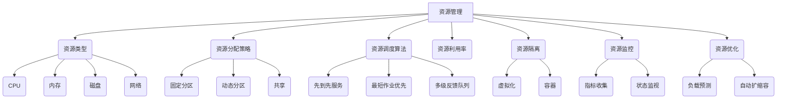

# 资源管理 原理与代码实例讲解

## 1. 背景介绍

### 1.1 问题的由来

在现代计算机系统中,资源管理是一个至关重要的课题。计算机系统需要高效地管理有限的资源,包括CPU时间、内存、磁盘空间、网络带宽等,以确保系统的稳定运行和最佳性能。随着系统规模和复杂性的不断增加,资源管理的挑战也与日俱增。

早期的计算机系统通常采用简单的资源分配策略,如先到先服务(FCFS)或固定分区等。然而,这些策略往往存在资源利用率低下、系统吞吐量有限等问题。为了提高资源利用率和系统性能,需要设计更加智能和高效的资源管理算法和策略。

### 1.2 研究现状

资源管理是操作系统、分布式系统、云计算等领域的核心研究课题之一。研究人员提出了多种资源管理算法和策略,旨在优化资源利用、提高系统性能、保证公平性和可靠性等。

一些经典的资源管理算法包括:

- 进程调度算法(如多级反馈队列调度、最短作业优先调度等)
- 内存管理算法(如分页、分段、虚拟内存等)
- 磁盘调度算法(如电梯算法、最短寻道时间优先等)
- 网络带宽管理算法(如加权公平队列、令牌桶算法等)

此外,还有一些新兴的资源管理技术和方法,如基于机器学习的资源预测和优化、基于容器和微服务的资源隔离和调度等。

### 1.3 研究意义

高效的资源管理对于现代计算机系统的性能、可靠性和可扩展性至关重要。合理的资源管理策略可以:

1. 提高资源利用率,降低资源浪费,从而提升系统性能和吞吐量。
2. 保证系统的公平性和响应性,避免资源饥饿和系统阻塞。
3. 促进资源的弹性分配和动态调整,适应不断变化的工作负载。
4. 简化系统管理,降低运维成本。

因此,研究和设计高效的资源管理算法和策略,对于构建高性能、可靠和可扩展的计算机系统至关重要。

### 1.4 本文结构

本文将全面介绍资源管理的核心概念、算法原理、数学模型、代码实现和实际应用场景。具体内容安排如下:

- 第2章介绍资源管理的核心概念和相关联系。
- 第3章详细阐述资源管理的核心算法原理和具体操作步骤。
- 第4章构建资源管理的数学模型,推导公式并举例说明。
- 第5章提供资源管理的代码实例,并进行详细解释和分析。
- 第6章探讨资源管理在实际应用中的场景和案例。
- 第7章推荐相关的学习资源、开发工具和论文等。
- 第8章总结研究成果,展望未来发展趋势和面临的挑战。
- 第9章列出常见问题并给出解答。

## 2. 核心概念与联系

资源管理涉及多个核心概念,它们相互关联,共同构成了资源管理的理论基础和实践框架。

上图描述了资源管理的核心概念及其关系:

1. **资源类型**: 包括CPU、内存、磁盘、网络等,是资源管理的基本对象。
2. **资源分配策略**: 决定如何将资源分配给不同的任务或进程,包括固定分区、动态分区和共享等策略。
3. **资源调度算法**: 决定资源的分配顺序和优先级,如先到先服务、最短作业优先、多级反馈队列等算法。
4. **资源利用率**: 衡量资源使用效率的指标,是资源管理的重要目标之一。
5. **资源隔离**: 通过虚拟化或容器技术,实现资源的逻辑隔离和独立使用。
6. **资源监控**: 收集和监视资源使用情况的指标和状态,为资源优化提供依据。
7. **资源优化**: 基于监控数据,预测负载变化并自动调整资源分配,提高资源利用率。

这些概念相互关联、相辅相成,共同构成了资源管理的理论体系和实践框架。掌握这些核心概念及其联系,是深入理解和应用资源管理技术的基础。

## 3. 核心算法原理 & 具体操作步骤  

### 3.1 算法原理概述

资源管理涉及多种核心算法,这些算法的原理和思想各不相同,但都旨在提高资源利用率、保证公平性和响应性。本节将概述几种经典的资源管理算法原理。

1. **先到先服务(FCFS)算法**

   FCFS算法是最简单的资源调度算法。它按照请求到达的时间顺序依次分配资源,不考虑任务的优先级或执行时间。FCFS算法公平对待所有任务,但可能导致短任务被长任务阻塞,降低了平均响应时间。

2. **最短作业优先(SJF)算法**  

   SJF算法根据任务的预计执行时间进行调度,优先执行执行时间最短的任务。这样可以最小化平均等待时间,提高系统吞吐量。但SJF算法存在"饥饿"问题,长任务可能永远得不到执行。

3. **优先级调度算法**

   优先级调度算法为每个任务分配一个优先级,优先执行优先级高的任务。这种算法可以满足一些重要任务的优先执行需求,但可能导致低优先级任务永远无法执行。

4. **多级反馈队列调度算法**

   多级反馈队列调度算法将就绪队列分为多个不同优先级的队列。新任务进入最高优先级队列,如果在一个时间片内未能完成,则降低优先级进入下一级队列。这种算法兼顾了响应时间和吞吐量,避免了"饥饿"问题。

5. **伙伴系统算法**

   伙伴系统算法是一种用于动态内存分配的算法。它将可用内存空间视为二叉树,每个节点代表一个内存块。分配时从根节点开始查找第一个足够大的空闲块;释放时将相邻的空闲块合并。这种算法避免了内存碎片,提高了内存利用率。

### 3.2 算法步骤详解

下面以多级反馈队列调度算法为例,详细解释其具体操作步骤。

1. **初始化**

   系统维护多个就绪队列,每个队列对应一个优先级。新到达的任务被插入到最高优先级队列的队尾。每个队列都有一个时间片(时间片从高到低优先级依次增大)。

2. **调度循环**

   调度器按照优先级从高到低,选择最高优先级非空队列中的头节点任务执行。

3. **时间片用尽**

   如果选中的任务在当前时间片内未能完成,则将其移动到下一个较低优先级队列的队尾。

4. **任务完成**

   如果选中的任务在当前时间片内完成,则从就绪队列中移除该任务。

5. **队列为空**

   如果当前优先级队列为空,则转到下一个较低优先级的非空队列。

6. **防止饥饿**

   为防止低优先级队列中的任务永远得不到执行,可以设置一个最大等待时间阈值。如果任务在就绪队列中等待时间超过该阈值,则将其临时升级到更高优先级队列。

该算法通过多级队列和动态优先级调整,实现了响应时间和吞吐量的平衡,避免了"饥饿"现象的发生。

### 3.3 算法优缺点

多级反馈队列调度算法具有以下优缺点:

**优点**:

1. 兼顾响应时间和吞吐量。高优先级队列可以快速响应短任务,低优先级队列可以处理长任务,提高吞吐量。
2. 避免"饥饿"现象。通过动态优先级调整,确保所有任务最终都能得到执行。
3. 算法简单,实现容易。

**缺点**:

1. 需要合理设置时间片长度和队列数量,否则效果不佳。
2. 对于相同类型的任务,可能出现优先级反复切换的情况,引入额外开销。
3. 难以准确估计任务的执行时间,可能导致优先级划分不合理。

总的来说,多级反馈队列调度算法是一种折中的选择,在响应时间、吞吐量和防止"饥饿"之间达到了较好的平衡。但在特定场景下,可能需要结合其他算法进行优化和改进。

### 3.4 算法应用领域

资源管理算法在计算机系统的多个领域得到了广泛应用,包括但不限于:

1. **操作系统**

   操作系统中的进程调度、内存管理、磁盘调度等模块都需要使用各种资源管理算法,以提高系统性能和资源利用率。

2. **数据中心和云计算**

   在数据中心和云计算环境中,需要对大量的计算、存储和网络资源进行智能调度和管理,以满足不同应用的资源需求。

3. **实时系统**

   实时系统对任务的响应时间和可靠性有严格要求,需要使用特殊的资源管理算法(如率单调调度算法)来保证实时性。

4. **多媒体系统**

   多媒体系统需要处理大量的视频、音频和图像数据,对CPU、内存和磁盘I/O等资源有特殊的需求,需要使用适当的资源管理策略。

5. **网络系统**

   网络系统中的带宽、缓冲区等资源需要合理分配和调度,以保证网络通信的质量和公平性。常用的算法包括加权公平队列、令牌桶算法等。

6. **物联网和边缘计算**

   在物联网和边缘计算场景中,需要对分布式的计算资源和网络资源进行高效管理,以支持实时数据处理和低延迟响应。

总之,资源管理算法在各种计算机系统中都扮演着至关重要的角色,是确保系统高效、可靠运行的关键所在。

## 4. 数学模型和公式 & 详细讲解 & 举例说明

### 4.1 数学模型构建

为了更好地理解和优化资源管理算法,我们需要构建数学模型来描述和分析资源管理过程。下面以进程调度为例,构建一个简单的数学模型。

假设有 $n$ 个进程 $P = \{p_1, p_2, \dots, p_n\}$ 需要被调度执行,每个进程 $p_i$ 有以下属性:

- $a_i$: 进程 $p_i$ 的到达时间
- $b_i$: 进程 $p_i$ 的服务时间(执行时间)
- $s_i$: 进程 $p_i$ 的开始执行时间
- $c_i$: 进程 $p_i$ 的完成时间,即 $c_i = s_i + b_i$
- $w_i$: 进程 $p_i$ 的等待时间,即 $w_i = s_i - a_i$
- $t_i$: 进程 $p_i$ 的周转时间,即 $t_i = c_i - a_i = w_i + b_i$

我们的