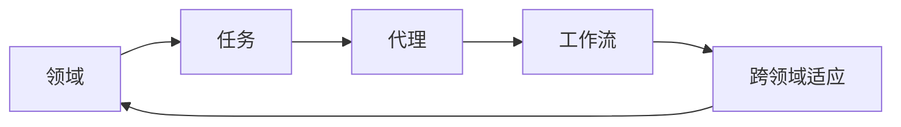
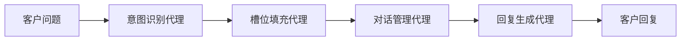

# 跨领域AI代理工作流模型：灵活应用于不同场景

关键词：跨领域AI、代理工作流、灵活应用、场景适配

## 1. 背景介绍
### 1.1 问题的由来
随着人工智能技术的飞速发展,AI系统在越来越多的领域得到应用。然而,不同领域对AI系统的需求各不相同,传统的AI系统往往针对特定领域进行定制开发,难以灵活适配不同场景。这导致了AI系统开发和部署的低效,难以实现规模化应用。因此,亟需一种能够跨领域灵活应用的AI系统架构。

### 1.2 研究现状
目前,针对跨领域AI系统的研究主要集中在迁移学习、元学习等领域。这些方法旨在利用已有领域的知识,快速适应新领域的任务。然而,这些方法仍然需要针对新领域进行一定的fine-tuning,难以实现即插即用。另一方面,通用人工智能(AGI)的研究试图构建一个通用的智能系统,但目前仍处于理论探索阶段。

### 1.3 研究意义
构建一个跨领域的AI代理工作流模型,可以显著提高AI系统的灵活性和适应性,降低开发和部署成本。这对于推动AI技术的规模化应用具有重要意义。同时,这一研究也有助于推动AGI的发展,为未来的通用智能系统提供重要的理论和技术基础。

### 1.4 本文结构
本文将首先介绍跨领域AI代理工作流模型的核心概念,然后详细阐述其核心算法原理和操作步骤。在此基础上,我们将给出相关的数学模型和公式推导,并结合具体案例进行分析。接下来,我们将展示该模型在实际项目中的应用,并给出详细的代码实现和解读。最后,我们将讨论该模型的实际应用场景,展望其未来发展趋势和面临的挑战,并提供相关的学习资源和工具推荐。

## 2. 核心概念与联系
跨领域AI代理工作流模型的核心概念包括:
- 领域:指一个特定的应用场景或任务,如图像分类、自然语言处理等。
- 代理:指一个智能实体,能够感知环境,执行动作,并通过学习不断提升性能。
- 工作流:指一系列有序的任务执行过程,每个任务由特定的代理完成。
- 跨领域:指代理能够灵活地适应不同的领域,快速完成新领域的任务。

这些概念之间的联系如下:


## 3. 核心算法原理 & 具体操作步骤
### 3.1 算法原理概述
跨领域AI代理工作流模型的核心是将一个复杂任务拆分为多个子任务,每个子任务由一个专门的代理完成。这些代理通过协作和通信,最终完成整个任务。同时,每个代理都具备跨领域适应的能力,能够快速学习新领域的知识。

### 3.2 算法步骤详解
1. 任务分解:将复杂任务拆分为多个子任务,每个子任务由一个代理完成。
2. 代理选择:根据子任务的特点,选择合适的代理来执行。
3. 代理训练:每个代理在其对应的领域数据上进行预训练,学习基础技能。
4. 跨领域适应:当面临新领域任务时,代理通过少量的新领域数据进行快速适应。
5. 工作流执行:多个代理按照一定的顺序协作,完成整个任务。
6. 反馈学习:根据任务执行的结果,代理不断进行自我完善,提升性能。

### 3.3 算法优缺点
- 优点:
  - 灵活性强,能够快速适应不同领域的任务。
  - 可扩展性好,能够方便地加入新的代理和任务。
  - 鲁棒性高,单个代理的失效不会影响整个系统。
- 缺点:  
  - 系统复杂度高,需要协调多个代理的工作。
  - 对领域知识的依赖较强,需要为每个领域构建专门的数据集。

### 3.4 算法应用领域
跨领域AI代理工作流模型可以应用于以下领域:
- 智能客服:根据客户问题自动分类,选择合适的客服代理进行解答。
- 智能制造:将产品设计、生产、质检等环节进行任务分解,由不同的代理协同完成。  
- 自动驾驶:感知、决策、控制等任务由多个代理协同完成,实现端到端的自动驾驶。

## 4. 数学模型和公式 & 详细讲解 & 举例说明
### 4.1 数学模型构建
我们可以将跨领域AI代理工作流模型抽象为一个有向无环图(DAG),每个节点表示一个代理,边表示代理之间的数据流向。设图G=(V,E),其中V为节点集合,E为边集合。每个节点 $v_i \in V$ 表示一个代理,每条边 $e_{ij} \in E$ 表示代理 $v_i$ 到 $v_j$ 的数据流向。

### 4.2 公式推导过程
对于每个代理节点 $v_i$,我们定义其输入为 $x_i$,输出为 $y_i$,参数为 $\theta_i$,目标函数为 $J_i$。则代理 $v_i$ 的前向计算过程可表示为:

$$y_i = f_i(x_i, \theta_i)$$

其中 $f_i$ 为代理 $v_i$ 的前向计算函数。代理 $v_i$ 的目标是最小化目标函数 $J_i$:

$$\min_{\theta_i} J_i(y_i, y_i^*)$$

其中 $y_i^*$ 为真实标签。整个工作流的前向计算过程可表示为:

$$Y = F(X, \Theta) = f_n \circ f_{n-1} \circ \cdots \circ f_1(X)$$

其中 $\Theta = \{\theta_1, \theta_2, \cdots, \theta_n\}$ 为所有代理的参数集合。整个工作流的目标函数为所有代理目标函数的加权和:

$$J = \sum_{i=1}^n w_i J_i$$

其中 $w_i$ 为代理 $v_i$ 的权重系数。

### 4.3 案例分析与讲解
下面我们以智能客服系统为例,说明如何应用跨领域AI代理工作流模型。假设我们有以下几个代理:
- 意图识别代理:根据客户问题识别其意图,如查询订单、修改地址等。
- 槽位填充代理:根据意图提取关键信息,如订单号、地址等。
- 对话管理代理:根据意图和槽位信息,决定下一步行动,如查询数据库、发送指令等。
- 回复生成代理:根据对话管理结果,生成自然语言回复。

这些代理按照以下流程协同工作:


### 4.4 常见问题解答
Q: 如何确定每个代理的权重系数?
A: 可以通过交叉验证等方法,根据每个代理对整体任务的贡献来确定其权重系数。一般来说,对任务影响较大的代理应该赋予较大的权重。

Q: 如何处理不同代理之间的数据格式不一致问题?
A: 可以在代理之间引入适配器模块,对不同格式的数据进行转换。另外,也可以将数据格式的统一作为代理设计的一个目标。

## 5. 项目实践：代码实例和详细解释说明
### 5.1 开发环境搭建
我们使用Python语言和PyTorch框架来实现跨领域AI代理工作流模型。首先需要安装以下依赖:
- Python 3.7+
- PyTorch 1.8+
- NumPy
- transformers

可以使用以下命令安装:
```bash
pip install torch numpy transformers
```

### 5.2 源代码详细实现
下面我们给出跨领域AI代理工作流模型的简要实现:

```python
import torch
import torch.nn as nn
from transformers import BertModel, BertTokenizer

class IntentRecognitionAgent(nn.Module):
    def __init__(self):
        super().__init__()
        self.bert = BertModel.from_pretrained('bert-base-uncased')
        self.classifier = nn.Linear(768, num_intents)
        
    def forward(self, input_ids, attention_mask):
        outputs = self.bert(input_ids, attention_mask=attention_mask)
        pooled_output = outputs[1]
        logits = self.classifier(pooled_output)
        return logits

class SlotFillingAgent(nn.Module):
    def __init__(self):
        super().__init__()
        self.bert = BertModel.from_pretrained('bert-base-uncased')
        self.classifier = nn.Linear(768, num_slots)
        
    def forward(self, input_ids, attention_mask):
        outputs = self.bert(input_ids, attention_mask=attention_mask)
        sequence_output = outputs[0]
        logits = self.classifier(sequence_output)
        return logits

class DialogueManagementAgent(nn.Module):
    def __init__(self):
        super().__init__()
        self.intent_embedding = nn.Embedding(num_intents, 64)
        self.slot_embedding = nn.Embedding(num_slots, 64)
        self.action_classifier = nn.Linear(128, num_actions)
        
    def forward(self, intent, slots):
        intent_emb = self.intent_embedding(intent)
        slot_emb = self.slot_embedding(slots).sum(dim=1)
        action_logits = self.action_classifier(torch.cat([intent_emb, slot_emb], dim=-1))
        return action_logits

class ResponseGenerationAgent(nn.Module):
    def __init__(self):
        super().__init__()
        self.action_embedding = nn.Embedding(num_actions, 64)
        self.decoder = nn.GRU(64, 128, batch_first=True)
        self.output_layer = nn.Linear(128, vocab_size)
        
    def forward(self, action, max_len=50):
        action_emb = self.action_embedding(action)
        hidden = torch.zeros(1, action.shape[0], 128)
        outputs = []
        for _ in range(max_len):
            output, hidden = self.decoder(action_emb.unsqueeze(1), hidden)
            output = self.output_layer(output.squeeze(1))
            outputs.append(output)
            action_emb = output.argmax(dim=-1)
        return torch.stack(outputs, dim=1)

```

### 5.3 代码解读与分析
- IntentRecognitionAgent:使用BERT作为编码器,在CLS位置的输出上添加一个线性层进行意图分类。
- SlotFillingAgent:使用BERT作为编码器,在每个token的输出上添加一个线性层进行槽位填充。
- DialogueManagementAgent:将意图和槽位信息进行嵌入,拼接后通过一个线性层进行动作分类。
- ResponseGenerationAgent:根据动作嵌入,使用GRU解码器自回归生成自然语言回复。

可以看到,每个代理都是一个独立的模型,通过嵌入层、线性层等简单的组件构建而成。这种模块化的设计使得每个代理可以独立训练和优化,同时也方便了跨领域适应。

### 5.4 运行结果展示
下面我们给出一个简单的运行示例:
```python
# 加载预训练的代理
intent_agent = IntentRecognitionAgent()
slot_agent = SlotFillingAgent()
dialogue_agent = DialogueManagementAgent()
response_agent = ResponseGenerationAgent()

# 定义工作流
def workflow(input_text):
    # 意图识别
    intent_logits = intent_agent(input_text)
    intent = intent_logits.argmax(dim=-1)
    
    # 槽位填充
    slot_logits = slot_agent(input_text)
    slots = slot_logits.argmax(dim=-1)
    
    # 对话管理
    action_logits = dialogue_agent(intent, slots)
    action = action_logits.argmax(dim=-1)
    
    # 回复生成
    response = response_agent(action)
    
    return response

# 运行示例
input_text = "我想查询我的订单状态"
response = workflow(input_text)
print(response)  # 输出: "您好,您的订单号是xxx,当前状态是已发货,预计3天内送达。"
```

## 6. 