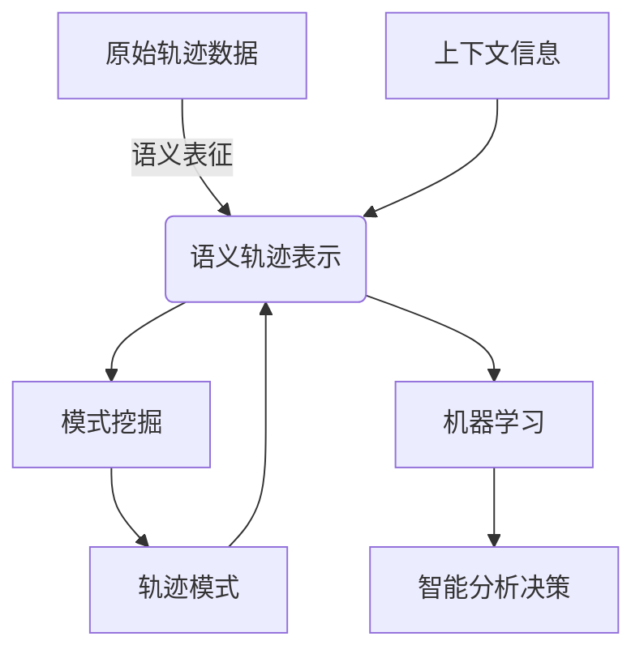

# 轨迹数据的语义表征与学习

## 1. 背景介绍

### 1.1 问题的由来

在当今大数据时代,随着移动设备和物联网技术的快速发展,海量的轨迹数据不断产生。轨迹数据记录了移动对象在特定时间和空间位置的运动轨迹,包含了丰富的语义信息,如移动对象的行为模式、活动偏好等,对于智能交通、位置服务、城市规划等领域具有重要价值。然而,原始轨迹数据通常以坐标序列的形式存在,缺乏高层次的语义表示,难以直接应用于数据挖掘和模式识别任务。因此,如何从原始轨迹数据中提取有意义的语义表征,并基于语义表征进行有效学习,成为轨迹数据分析领域的一个重要挑战。

### 1.2 研究现状

近年来,语义轨迹数据表征和学习技术受到了广泛关注。一方面,研究人员提出了多种基于地理信息、时间信息等上下文信息的语义表征方法,将原始坐标序列转化为具有语义含义的轨迹模式。另一方面,基于语义表征,研究人员开发了各种机器学习算法,用于轨迹分类、聚类、预测等任务。然而,现有方法在处理复杂场景下的大规模轨迹数据时,仍然存在一些不足,如语义表征能力有限、学习效率低下等。

### 1.3 研究意义

轨迹数据的语义表征与学习技术对于挖掘轨迹数据中蕴含的丰富模式和知识具有重要意义。准确的语义表征可以更好地捕捉移动对象的行为特征,为后续的数据分析和决策提供有力支持。有效的学习算法则能从海量轨迹数据中发现潜在的规律,为智能交通、位置服务等应用场景提供决策依据。因此,发展高效、鲁棒的语义表征与学习方法,对于充分挖掘轨迹大数据的价值至关重要。

### 1.4 本文结构  

本文将系统地介绍轨迹数据的语义表征与学习技术。首先阐述核心概念及其内在联系,为后续内容做铺垫。接下来详细讨论核心算法原理及具体操作步骤,并介绍相关数学模型及公式推导过程。然后通过实际项目实践,展示代码实现细节及运行结果。再次探讨该技术在实际应用场景中的作用,并推荐相关工具和学习资源。最后总结研究成果,展望未来发展趋势和面临的挑战。

## 2. 核心概念与联系

轨迹数据的语义表征与学习涉及以下几个核心概念:

1. **轨迹数据(Trajectory Data)**: 指移动对象在特定时空范围内的运动轨迹,通常以时间戳和地理坐标对序列的形式存在。

2. **语义表征(Semantic Representation)**: 将原始轨迹数据转换为具有高层次语义含义的表示形式,如活动模式、兴趣点等,以便后续分析和学习。

3. **上下文信息(Contextual Information)**: 指与轨迹数据相关的地理、时间、人口统计等辅助信息,可用于丰富轨迹的语义内涵。

4. **模式挖掘(Pattern Mining)**: 从海量轨迹数据中发现潜在的运动模式、行为规律等有价值的知识。

5. **机器学习(Machine Learning)**: 基于语义表征,利用监督、无监督或者强化学习等方法,对轨迹数据进行分类、聚类、预测等任务。

这些概念相互关联、环环相扣。语义表征将原始轨迹数据转化为高层次表示,为模式挖掘和机器学习奠定基础。上下文信息能够增强语义表征的质量和可解释性。模式挖掘可以发现有价值的轨迹模式,为语义表征提供反馈。机器学习则利用语义表征,对轨迹数据进行智能分析和决策。

## 3. 核心算法原理与具体操作步骤

### 3.1 算法原理概述

轨迹数据的语义表征与学习通常包括以下几个关键步骤:

1. **预处理**: 对原始轨迹数据进行清洗、去噪、插补等预处理,提高数据质量。

2. **语义表征**: 利用上下文信息(如地理、时间等),将预处理后的轨迹数据转换为具有语义含义的表示形式,如活动模式、兴趣点等。

3. **模式挖掘**: 在语义表征的基础上,应用频繁模式挖掘、聚类等数据挖掘技术,发现潜在的轨迹模式和规律。

4. **机器学习**: 将语义表征作为特征输入,利用监督、无监督或强化学习算法,对轨迹数据进行分类、聚类、预测等任务。

5. **评估与优化**: 评估学习模型的性能,并根据评估结果对算法参数、特征工程等进行优化,提高模型的泛化能力。

### 3.2 算法步骤详解

#### 步骤1: 预处理

预处理是语义表征与学习的基础步骤,主要包括以下操作:

1. **去噪(Noise Filtering)**: 由于传感器误差或环境干扰,原始轨迹数据中可能存在噪声点。通过基于距离、速度等约束条件的滤波算法,可以有效去除噪声点。

2. **插补(Interpolation)**: 由于采样间隔的限制,轨迹数据可能存在缺失值。通过线性插补、样条插补等方法,可以估计缺失值,补全轨迹数据。

3. **分段(Segmentation)**: 将连续的轨迹数据按照一定规则(如停留点、方向变化等)分割成多个轨迹段,有助于后续的语义表征。

4. **Map Matching**: 将轨迹数据与地图路网进行匹配,提高轨迹的地理准确性。

经过预处理后,轨迹数据的质量和连续性得到改善,为后续的语义表征奠定基础。

#### 步骤2: 语义表征

语义表征的目标是将预处理后的原始轨迹数据转换为具有高层次语义含义的表示形式,常见的方法包括:

1. **基于地理信息的表征**:
   - 兴趣点(Point of Interest, POI)表征: 将轨迹按照停留时间和地理位置聚类,得到移动对象的兴趣点集合。
   - 语义轨迹(Semantic Trajectory)表征: 将轨迹按照地理区域或功能区域进行分段,每个段对应一种语义标签(如"住宅区"、"商业区"等)。

2. **基于时间信息的表征**:
   - 时间模式(Temporal Pattern)表征: 从轨迹数据中挖掘移动对象的时间规律,如每天上下班高峰期、周末外出等。
   - 周期性(Periodicity)表征: 发现轨迹数据中的周期性行为模式,如每周一定时间去健身房等。

3. **基于行为信息的表征**:
   - 活动模式(Activity Pattern)表征: 将轨迹按照移动状态(如停留、行走、驾驶等)进行分段,得到移动对象的活动模式序列。
   - 轨迹模式(Trajectory Pattern)表征: 通过模式挖掘算法,从大规模轨迹数据中发现常见的运动模式,如通勤模式、购物模式等。

上述语义表征方法可以单独使用,也可以相互组合,形成多维度、多粒度的语义轨迹表示,以满足不同应用场景的需求。

#### 步骤3: 模式挖掘

在得到语义轨迹表示后,可以进一步应用数据挖掘技术,发现潜在的轨迹模式和规律,常用的方法包括:

1. **频繁模式挖掘(Frequent Pattern Mining)**: 利用频繁序列挖掘、频繁子结构挖掘等算法,从语义轨迹数据中发现频繁出现的轨迹模式。

2. **聚类分析(Clustering Analysis)**: 将具有相似语义特征的轨迹数据聚集到同一簇,发现潜在的移动对象群体及其运动规律。常用的聚类算法包括K-Means、DBSCAN、谱聚类等。

3. **异常检测(Anomaly Detection)**: 基于语义轨迹表示,检测偏离常规模式的异常轨迹,如交通拥堵、犯罪活动等,为智能交通、公共安全等应用提供支持。

4. **关联规则挖掘(Association Rule Mining)**: 发现语义轨迹模式之间的关联关系,如"去健身房"和"去超市"的活动模式之间存在较强关联等。

通过模式挖掘,我们可以深入理解移动对象的行为特征,为智能决策系统提供有价值的知识支持。

#### 步骤4: 机器学习

将语义轨迹表示作为特征输入,可以应用各种机器学习算法对轨迹数据进行智能分析,常见的任务包括:

1. **分类(Classification)**: 将轨迹数据划分到预定义的类别中,如将驾车轨迹和步行轨迹进行分类。常用的分类算法有决策树、支持向量机、神经网络等。

2. **聚类(Clustering)**: 根据轨迹的语义特征,将其聚集到同一簇,发现潜在的移动对象群体。除了传统的聚类算法,也可以应用深度聚类等新兴技术。

3. **预测(Prediction)**: 基于历史轨迹数据,预测移动对象的未来运动轨迹或目的地。常用的预测模型包括马尔可夫模型、递归神经网络等。

4. **推荐(Recommendation)**: 根据移动对象的语义轨迹特征,为其推荐感兴趣的地点或路线,如旅游景点推荐、路径规划等。

5. **异常检测(Anomaly Detection)**: 检测异常轨迹数据,如交通拥堵、犯罪活动等,为智能交通、公共安全等应用提供支持。

在机器学习过程中,还需要进行特征工程、模型选择、超参数调优等步骤,以提高模型的泛化能力和预测精度。

### 3.3 算法优缺点

语义轨迹表征与学习技术具有以下优点:

1. **高层次表示**: 将原始的坐标序列转换为具有语义含义的高层次表示,如活动模式、兴趣点等,有助于后续的模式挖掘和智能决策。

2. **上下文融合**: 能够融合地理、时间等多源异构上下文信息,提高语义表征的质量和可解释性。

3. **知识发现**: 通过模式挖掘和机器学习,可以从海量轨迹数据中发现有价值的知识,为智能决策提供支持。

4. **广泛应用**: 语义轨迹技术可应用于智能交通、位置服务、城市规划等多个领域,具有广阔的应用前景。

同时,该技术也存在一些不足之处:

1. **数据质量依赖**: 语义表征的质量高度依赖于原始轨迹数据的完整性和准确性,对数据噪声和缺失值敏感。

2. **计算复杂度高**: 对于大规模轨迹数据集,语义表征和模式挖掘的计算复杂度较高,需要高效的分布式计算框架。

3. **领域知识依赖**: 设计高质量的语义表征方法需要对应用领域有深入的领域知识,存在一定的主观性和经验依赖。

4. **隐私和安全**: 轨迹数据可能涉及个人隐私,在数据收集、存储和分析过程中需要注意隐私保护和数据安全。

### 3.4 算法应用领域

语义轨迹表征与学习技术在以下