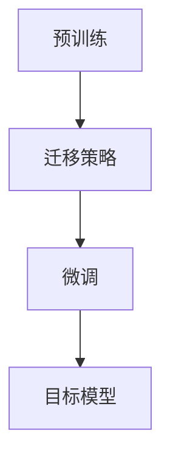

# 迁移学习 原理与代码实例讲解

## 1. 背景介绍

### 1.1 问题的由来

在机器学习和深度学习领域中,我们通常需要大量的标注数据来训练模型,以获得良好的性能。然而,在许多实际应用场景中,获取大量高质量的标注数据往往是一个巨大的挑战,这可能涉及到昂贵的人力成本、专业知识等因素。此外,对于一些新兴领域或特定任务,可能根本无法获得足够的标注数据。

### 1.2 研究现状 

为了解决上述数据不足的问题,研究人员提出了迁移学习(Transfer Learning)的概念。迁移学习的核心思想是利用在源领域学习到的知识,来帮助目标领域的学习任务,从而减少对目标领域标注数据的需求。通过这种方式,我们可以充分利用已有的数据资源,提高模型的泛化能力和学习效率。

在过去几年中,迁移学习在计算机视觉、自然语言处理等多个领域取得了巨大成功,成为了深度学习研究的一个热点方向。著名的迁移学习模型包括BERT、GPT、ResNet等,它们在各自领域取得了卓越的性能表现。

### 1.3 研究意义

迁移学习的研究对于推动人工智能技术的发展具有重要意义:

1. **降低数据需求**:通过迁移学习,我们可以减少对目标领域标注数据的需求,从而降低了数据获取和标注的成本。
2. **提高模型泛化能力**:迁移学习可以帮助模型学习到更加通用的知识表示,提高了模型在不同领域的泛化能力。
3. **加速模型训练**:由于可以利用源领域的预训练模型,迁移学习可以显著加速目标任务的模型训练过程。
4. **促进跨领域协作**:迁移学习为不同领域之间的知识迁移提供了可能,有助于促进跨学科的协作与融合。

### 1.4 本文结构

本文将全面介绍迁移学习的原理、算法和实践。具体内容安排如下:

- 第2部分阐述迁移学习的核心概念和不同类型,并讨论它们之间的联系。
- 第3部分详细解释迁移学习的核心算法原理和具体操作步骤。
- 第4部分构建迁移学习的数学模型,并推导相关公式,辅以案例分析。
- 第5部分提供完整的代码实例,并对关键部分进行详细解释。
- 第6部分介绍迁移学习在实际应用中的场景。
- 第7部分推荐一些有用的工具和学习资源。
- 第8部分总结迁移学习的研究成果、发展趋势和面临的挑战。
- 第9部分列出常见问题并给出解答。

## 2. 核心概念与联系

迁移学习(Transfer Learning)是一种机器学习范式,它允许我们利用在源领域(Source Domain)学习到的知识,来帮助目标领域(Target Domain)的学习任务。这里的"知识"可以是模型参数、特征表示或者任务相关的启发式知识等。

根据源领域和目标领域的任务类型,迁移学习可以分为以下几种情况:

1. **域内迁移(Intra-Domain Transfer)**:源领域和目标领域的任务类型相同,但数据分布不同。例如,利用在ImageNet上预训练的模型,来帮助另一个图像分类任务。

2. **域间迁移(Inter-Domain Transfer)**:源领域和目标领域的任务类型不同,数据分布也不同。例如,利用在自然语言处理任务上预训练的模型,来帮助计算机视觉任务。

3. **任务内迁移(Intra-Task Transfer)**:源领域和目标领域的任务类型相同,数据分布也相同,但是数据标签不同。例如,利用在ImageNet上预训练的模型,来帮助另一个图像分类任务,但类别标签不同。

4. **任务间迁移(Inter-Task Transfer)**:源领域和目标领域的任务类型不同,数据分布也不同。例如,利用在图像分类任务上预训练的模型,来帮助目标检测任务。

上述不同类型的迁移学习有着不同的应用场景和挑战。一般来说,域内迁移和任务内迁移相对更容易实现,而域间迁移和任务间迁移则更加困难,需要设计更加复杂的迁移策略。

迁移学习的核心思想是利用源领域的知识来帮助目标领域的学习,从而减少对目标领域标注数据的需求。这种思想与人类学习过程非常相似:我们通常会利用已有的知识和经验,来帮助学习新的知识和技能。

在深度学习中,迁移学习通常通过以下几种方式实现:

1. **特征表示迁移**:利用源领域预训练模型学习到的特征表示,作为目标领域模型的初始化或者特征提取器。
2. **模型微调(Fine-Tuning)**:在源领域预训练的模型基础上,利用目标领域的数据进行进一步的微调训练。
3. **模型distillation**:利用源领域预训练的大型模型(Teacher Model)来指导目标领域的小型模型(Student Model)的训练。
4. **元学习(Meta-Learning)**:设计能够快速适应新任务的模型,从而实现有效的迁移学习。

上述不同的迁移学习方法各有优缺点,需要根据具体的应用场景和资源约束进行选择和组合使用。

## 3. 核心算法原理 & 具体操作步骤

### 3.1 算法原理概述

迁移学习的核心算法原理可以概括为以下三个步骤:

1. **预训练(Pre-Training)**:在源领域的大规模数据上训练一个基础模型,学习通用的特征表示或知识。
2. **迁移策略(Transfer Strategy)**:设计合适的迁移策略,将源领域的知识迁移到目标领域的模型中。
3. **微调(Fine-Tuning)**:在目标领域的数据上,对迁移后的模型进行进一步的微调训练,使其适应目标任务。

不同的迁移学习算法主要在第二步"迁移策略"上有所不同,我们将在后续章节中详细介绍几种常见的迁移策略。

### 3.2 算法步骤详解

1. **预训练(Pre-Training)步骤**

   在这一步骤中,我们需要在源领域的大规模数据上训练一个基础模型。通常情况下,我们会选择一个在相关任务上表现良好的模型架构,并在源领域的数据上进行充分的预训练。

   预训练的目标是让模型学习到通用的特征表示或知识,这些特征表示或知识可以被迁移到目标领域的任务中。例如,在计算机视觉领域,我们可以在ImageNet数据集上预训练一个卷积神经网络(CNN)模型,让它学习到通用的图像特征表示。

2. **迁移策略(Transfer Strategy)步骤**

   在这一步骤中,我们需要设计合适的迁移策略,将源领域预训练模型中学习到的知识迁移到目标领域的模型中。根据具体的应用场景和资源约束,我们可以选择以下几种常见的迁移策略:

   - **特征表示迁移**:直接利用源领域预训练模型提取的特征表示,作为目标领域模型的输入特征。这种策略通常用于源领域和目标领域任务类型相似的情况。
   - **模型微调(Fine-Tuning)**:在源领域预训练模型的基础上,利用目标领域的数据对模型进行进一步的微调训练。这种策略可以让模型更好地适应目标任务,但需要一定量的目标领域数据。
   - **模型distillation**:利用源领域预训练的大型模型(Teacher Model)来指导目标领域的小型模型(Student Model)的训练。这种策略可以在保持较好性能的同时,降低模型的计算复杂度和内存需求。
   - **元学习(Meta-Learning)**:设计能够快速适应新任务的模型,从而实现有效的迁移学习。这种策略通常需要更复杂的模型架构和训练算法。

   不同的迁移策略各有优缺点,需要根据具体的应用场景和资源约束进行选择和组合使用。

3. **微调(Fine-Tuning)步骤**

   在这一步骤中,我们利用目标领域的数据,对迁移后的模型进行进一步的微调训练,使其更好地适应目标任务。

   微调训练的具体过程如下:

   - 初始化模型参数,通常使用迁移策略得到的模型参数作为初始值。
   - 在目标领域的训练数据上,使用合适的损失函数和优化算法对模型进行训练。
   - 根据验证集的性能,选择合适的超参数(如学习率、正则化强度等)和早停策略。
   - 在测试集上评估模型的最终性能。

   微调训练的目的是让模型在保留源领域知识的同时,进一步适应目标领域的数据分布和任务特征。通过这一步骤,我们可以获得一个在目标任务上表现良好的模型。

### 3.3 算法优缺点

迁移学习算法相比于从头训练模型,具有以下优点:

- **降低数据需求**:通过利用源领域的知识,迁移学习可以显著减少对目标领域标注数据的需求。
- **提高模型泛化能力**:迁移学习可以让模型学习到更加通用的特征表示或知识,从而提高了模型在不同领域的泛化能力。
- **加速模型训练**:由于可以利用源领域的预训练模型,迁移学习可以显著加速目标任务的模型训练过程。

同时,迁移学习算法也存在一些缺点和挑战:

- **负迁移风险**:如果源领域和目标领域存在较大差异,直接迁移可能会导致模型性能下降,出现负迁移(Negative Transfer)的情况。
- **领域差异问题**:不同领域之间的数据分布差异,可能会影响迁移学习的效果。需要设计合适的策略来缓解这一问题。
- **计算资源需求**:一些迁移学习算法(如模型distillation和元学习)可能需要大量的计算资源,增加了训练和部署的难度。

因此,在实际应用中,我们需要权衡迁移学习的优缺点,并根据具体的场景选择合适的算法和策略。

### 3.4 算法应用领域

迁移学习算法在多个领域得到了广泛的应用,包括但不限于:

- **计算机视觉**:利用在ImageNet等大型数据集上预训练的模型,进行图像分类、目标检测、语义分割等任务的迁移学习。
- **自然语言处理**:利用在大规模文本数据上预训练的语言模型(如BERT、GPT等),进行文本分类、机器翻译、问答系统等任务的迁移学习。
- **语音识别**:利用在大规模语音数据上预训练的模型,进行语音识别、语音合成等任务的迁移学习。
- **医疗影像分析**:利用在自然图像上预训练的模型,进行医疗影像分析(如肺部CT分析、病理切片分析等)任务的迁移学习。
- **金融风险管理**:利用在其他领域预训练的模型,进行金融风险评估、欺诈检测等任务的迁移学习。
- **推荐系统**:利用在大规模用户行为数据上预训练的模型,进行个性化推荐等任务的迁移学习。

总的来说,只要存在数据不足或者可以利用其他领域的知识的情况,迁移学习算法就可以发挥作用,提高模型的性能和训练效率。

## 4. 数学模型和公式 & 详细讲解 & 举例说明

### 4.1 数学模型构建

在介绍迁移学习的数学模型之前,我们首先定义一些基本概念:

- **域(Domain)**:由数据和标签构成的集合,表示某个特定的学习环境或领