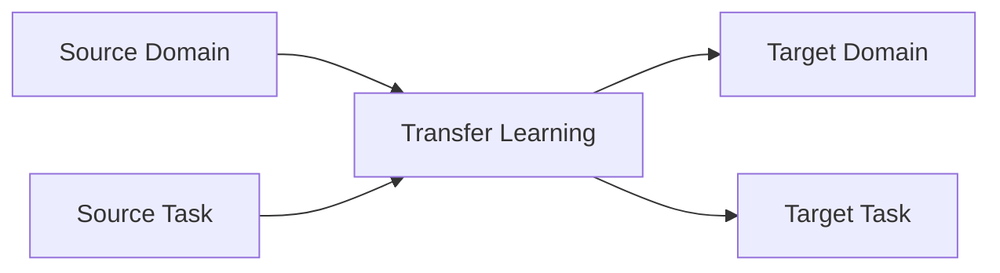
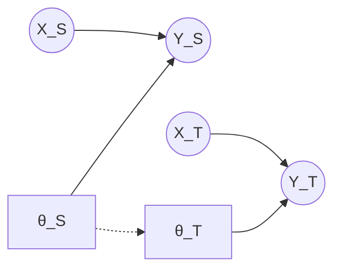
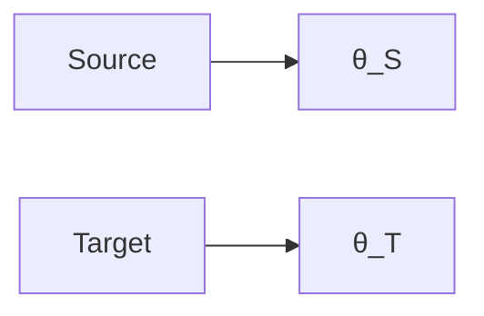
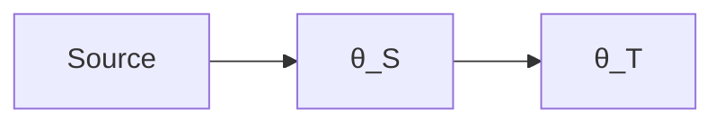

# 迁移学习Transfer Learning原理与代码实例讲解

关键词：迁移学习、深度学习、机器学习、领域自适应、Few-Shot Learning

## 1. 背景介绍
### 1.1 问题的由来
随着人工智能技术的飞速发展,深度学习在计算机视觉、自然语言处理等领域取得了令人瞩目的成就。然而,训练一个高性能的深度学习模型通常需要大量的标注数据和计算资源,这在很多实际应用中难以满足。如何利用已有的知识和模型,快速适应新的任务,成为了一个亟待解决的问题。迁移学习正是为解决这一问题而提出的一种机器学习范式。

### 1.2 研究现状
迁移学习的研究可以追溯到20世纪90年代,但直到近年来,随着深度学习的兴起,迁移学习才得到广泛关注。目前,迁移学习已经在计算机视觉、自然语言处理、语音识别等多个领域取得了显著成果。例如,在计算机视觉领域,利用ImageNet预训练的模型进行迁移学习,可以大幅提升小样本图像分类的性能;在自然语言处理领域,基于BERT等预训练语言模型的迁移学习方法,刷新了多项任务的最佳性能。

### 1.3 研究意义 
迁移学习具有重要的理论意义和实践价值:

1. 降低深度学习的数据需求和计算成本。通过迁移学习,可以利用已有的大规模数据训练的模型,快速适应新任务,减少对标注数据和计算资源的依赖。

2. 提高模型的泛化能力。迁移学习可以帮助模型学习到更加通用的特征表示,提高模型面对新任务时的泛化性能。

3. 探索人工智能的通用智能。迁移学习是实现人工智能通用智能的重要途径之一,有助于揭示人类智能的奥秘。

### 1.4 本文结构
本文将全面介绍迁移学习的原理、方法和应用。第2节介绍迁移学习的核心概念;第3节详细讲解迁移学习的主要算法;第4节给出迁移学习的数学模型;第5节通过代码实例演示如何实现迁移学习;第6节讨论迁移学习的应用场景;第7节推荐迁移学习的学习资源;第8节总结全文并展望未来;第9节列出常见问题解答。

## 2. 核心概念与联系

迁移学习的目标是利用已有的知识,去解决新的但相关的任务。其核心概念包括:

- Domain(领域):由特征空间和边缘概率分布定义,反映了数据的分布特性。例如,在图像分类任务中,Domain可以是不同风格、不同拍摄条件下的图像集合。

- Task(任务):由标签空间和条件概率分布定义,反映了要解决的问题。例如,Task可以是图像分类、目标检测等。

- Source Domain/Task(源领域/任务):已有标注数据的领域/任务,Transfer Learning的知识来源。

- Target Domain/Task(目标领域/任务):缺乏足够标注数据的领域/任务,Transfer Learning的知识迁移对象。

根据Source和Target的Domain、Task是否相同,迁移学习可分为以下三种情况:

1. Domain Adaptation(领域自适应):Source和Target的Domain不同,但Task相同。

2. Multi-Task Learning(多任务学习):Source和Target的Task不同,但Domain相同。

3. Domain Generalization(领域泛化):Source包含多个不同的Domain,Target的Domain与Source都不同。

下图展示了迁移学习核心概念之间的关系:



## 3. 核心算法原理 & 具体操作步骤
### 3.1 算法原理概述
迁移学习的核心思想是找到Source和Target的共同特征表示,并利用这些特征进行知识迁移。根据特征提取和知识迁移的方式不同,迁移学习算法可分为以下四类:

1. Instance-based(基于样本): 通过加权重用Source的样本,来辅助Target任务的学习。代表算法有TrAdaBoost等。

2. Feature-based(基于特征): 学习Source和Target共享的特征表示,并基于这些特征进行迁移。代表算法有MMD、CORAL等。 

3. Model-based(基于模型): 利用Source训练的模型,来初始化或指导Target模型的训练。代表算法有LWF、Fine-tuning等。

4. Relation-based(基于关系): 学习Source和Target样本之间的关系,指导Target任务的学习。代表算法有FSL等。

### 3.2 算法步骤详解
以最常用的Fine-tuning算法为例,其具体步骤如下:

1. 在Source数据上训练一个深度神经网络模型$M_S$。

2. 移除$M_S$的输出层,得到特征提取器$M_S^{'}$。

3. 在$M_S^{'}$之上,添加适用于Target任务的输出层,构成新的模型$M_T$。

4. 利用Target数据,Fine-tune整个$M_T$,或者只训练新添加的输出层,得到最终模型。

可以看出,Fine-tuning本质上是利用Source训练的模型来初始化Target模型,加速Target任务的训练收敛和提升性能。

### 3.3 算法优缺点
Fine-tuning的优点是:
- 实现简单,容易上手。
- 利用了Source模型学习到的通用特征,可以显著提升Target任务的性能。
- 通过控制Fine-tune的层数和学习率,可以灵活平衡知识迁移和Target适应。

Fine-tuning的缺点是:  
- Source和Target的Domain差异过大时,迁移效果有限。
- 需要足够多的Target数据,才能Fine-tune得到满意的结果。

### 3.4 算法应用领域
Fine-tuning在计算机视觉和自然语言处理领域得到了广泛应用。例如:
- 在图像分类任务中,利用ImageNet预训练的模型进行Fine-tuning,可以大幅提升小样本分类的性能。
- 在自然语言处理任务中,基于BERT、GPT等预训练语言模型进行Fine-tuning,可以在多个下游任务上取得领先性能。

## 4. 数学模型和公式 & 详细讲解 & 举例说明
### 4.1 数学模型构建
迁移学习的数学模型可以用概率图来表示。如下图所示,圆圈表示变量,方框表示参数,箭头表示依赖关系。$X_S$、$Y_S$表示Source的样本和标签,$X_T$、$Y_T$表示Target的样本和标签,$\theta_S$、$\theta_T$表示Source和Target的模型参数。



从图中可以看出,迁移学习的目标是利用$\theta_S$来辅助优化目标参数$\theta_T$。形式化地,迁移学习优化的目标函数可以写为:

$$
\min_{\theta_T} \mathcal{L}_T(\theta_T|X_T,Y_T) + \lambda \mathcal{R}(\theta_T,\theta_S) \tag{1}
$$

其中,$\mathcal{L}_T$表示Target任务的损失函数,$\mathcal{R}$表示对$\theta_T$和$\theta_S$施加的正则化项,用于促进参数迁移,$\lambda$为平衡两项的权重系数。

### 4.2 公式推导过程
以L2正则化为例,即$\mathcal{R}(\theta_T,\theta_S)=\|\theta_T-\theta_S\|_2^2$,优化公式(1)等价于:

$$
\min_{\theta_T} \mathcal{L}_T(\theta_T|X_T,Y_T) + \lambda \|\theta_T-\theta_S\|_2^2 \tag{2}
$$

求解公式(2)的梯度,可得:

$$
\nabla_{\theta_T} = \nabla_{\theta_T}\mathcal{L}_T(\theta_T|X_T,Y_T) + 2\lambda(\theta_T-\theta_S) \tag{3}
$$

根据梯度下降法,参数$\theta_T$的更新公式为:

$$
\theta_T \leftarrow \theta_T - \eta (\nabla_{\theta_T}\mathcal{L}_T(\theta_T|X_T,Y_T) + 2\lambda(\theta_T-\theta_S)) \tag{4}
$$

其中,$\eta$为学习率。可以看出,正则化项促使$\theta_T$向$\theta_S$的方向更新,起到了知识迁移的作用。

### 4.3 案例分析与讲解
下面以一个简单的二分类任务为例,直观演示参数迁移的过程。假设$\theta_S$已经学习到Source的最优参数,Target的负样本分布与Source类似,但正样本分布存在一定差异,如下图所示:



不使用迁移学习时,$\theta_T$从随机初始化开始训练,需要较多的迭代次数才能收敛到最优解。

使用参数迁移时,$\theta_T$以$\theta_S$为起点进行Fine-tuning。由于$\theta_S$已经学习到Source的最优参数,因此$\theta_T$只需要少量迭代,就可以适应Target正样本分布的差异,快速收敛到最优解,如下图所示:



### 4.4 常见问题解答
问题1:如何选择合适的正则化方式?

答:常用的正则化方式有L2正则化、L1正则化、MMD等。选择正则化方式需要考虑Source和Target的Domain差异大小、样本数量、特征维度等因素。一般来说,Domain差异小时,L2正则化就足够;Domain差异大时,需要选择更强的正则化方式,如MMD等。

问题2:如何设置正则化系数$\lambda$?

答:$\lambda$控制了知识迁移和Target适应的平衡。$\lambda$太小,会欠迁移,导致Target性能提升有限;$\lambda$太大,会过迁移,导致Target适应能力下降。一般通过交叉验证来选择最优的$\lambda$值。

## 5. 项目实践：代码实例和详细解释说明
### 5.1 开发环境搭建
实验基于PyTorch 1.8.1版本,需要安装以下依赖库:
- numpy
- matplotlib
- torchvision

可以通过以下命令安装:

```bash
pip install torch==1.8.1 torchvision matplotlib numpy
```

### 5.2 源代码详细实现
下面给出Fine-tuning的PyTorch实现代码:

```python
import torch
import torch.nn as nn
import torch.optim as optim
from torchvision import datasets, transforms

# 定义 AlexNet 模型
class AlexNet(nn.Module):
    def __init__(self, num_classes=1000):
        super(AlexNet, self).__init__()
        self.features = nn.Sequential(
            nn.Conv2d(3, 64, kernel_size=11, stride=4, padding=2),
            nn.ReLU(inplace=True),
            nn.MaxPool2d(kernel_size=3, stride=2),
            nn.Conv2d(64, 192, kernel_size=5, padding=2),
            nn.ReLU(inplace=True),
            nn.MaxPool2d(kernel_size=3, stride=2),
            nn.Conv2d(192, 384, kernel_size=3, padding=1),
            nn.ReLU(inplace=True),
            nn.Conv2d(384, 256, kernel_size=3, padding=1),
            nn.ReLU(inplace=True),
            nn.Conv2d(256, 256, kernel_size=3, padding=1),
            nn.ReLU(inplace=True),
            nn.MaxPool2d(kernel_size=3, stride=2),
        )
        self.avgpool = nn.AdaptiveAvgPool2d((6, 6))
        self.classifier = nn.Sequential(
            nn.Dropout(),
            nn.Linear(256 * 6 * 6, 4096),
            nn.ReLU(inplace=True),
            nn.Dropout(),
            nn.Linear(4096, 4096),
            nn.ReLU(inplace=True),
            nn.Linear(4096, num_classes),
        )

    def forward(self, x):
        x = self.features(x)
        x = self.avgpool(x)
        x = torch.flatten(x, 1)
        x = self.classifier