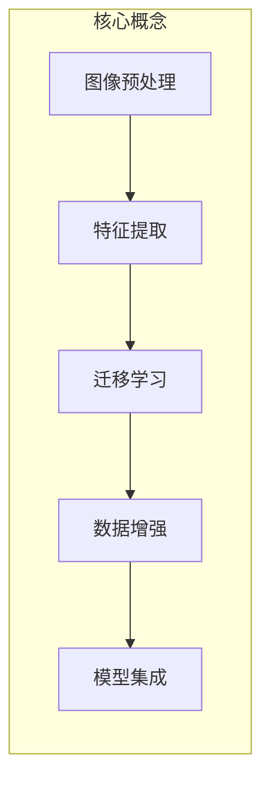

以下是《野生植物识别应用模型的研究》这篇技术博客文章的正文部分：

# 野生植物识别应用模型的研究

## 1. 背景介绍

### 1.1 问题的由来

随着人们对自然环境保护意识的增强,对野生植物的识别与保护备受关注。然而,由于物种繁多、形态相似等原因,准确识别野生植物对普通大众来说是一个巨大的挑战。传统的方式需要依赖专业人士的经验和知识,效率低下且成本高昂。因此,开发一种基于计算机视觉和机器学习技术的自动化野生植物识别系统,具有重要的理论意义和应用价值。

### 1.2 研究现状  

近年来,计算机视觉和深度学习技术在图像识别领域取得了长足进步,为野生植物识别提供了新的解决方案。研究人员提出了多种基于卷积神经网络(CNN)的植物识别模型,如AlexNet、VGGNet、ResNet等,取得了不错的效果。但由于野生植物种类繁多、形态多样、环境复杂等因素,现有模型在准确率、鲁棒性和泛化能力等方面仍有待提高。

### 1.3 研究意义

开发高效准确的野生植物识别系统,可以为生物多样性保护、农林业生产、环境监测等领域提供重要的技术支撑。它不仅能帮助普通大众了解和识别身边的植物,还能为专业人员提供辅助工具,提高工作效率。此外,该研究还将推动计算机视觉、模式识别和机器学习等技术的发展与创新。

### 1.4 本文结构

本文首先介绍野生植物识别的背景和研究现状,阐明研究意义。然后详细讲解核心概念、算法原理和数学模型,并给出代码实例和应用场景分析。最后总结研究成果,并展望未来发展趋势和挑战。

## 2. 核心概念与联系

野生植物识别是一个典型的计算机视觉和模式识别问题,涉及多个核心概念,包括:

1. **图像预处理**: 对输入图像进行标准化、增强等预处理,以提高模型的性能。
2. **特征提取**: 利用卷积神经网络从图像中自动学习特征表示,是识别的关键步骤。
3. **迁移学习**: 由于标注数据有限,常采用在大型数据集(如ImageNet)上预训练的模型,再通过微调(fine-tuning)在目标数据集上进行训练。
4. **数据增强**: 通过旋转、平移、翻转等方式对训练数据进行增强,提高模型泛化能力。
5. **模型集成**: 将多个基础模型(如VGG、ResNet等)的预测结果加权融合,以提升整体性能。

这些概念相互关联、环环相扣,构建了一个完整的植物识别系统。接下来我们将详细介绍其中的核心算法原理和数学模型。

## 3. 核心算法原理 & 具体操作步骤

### 3.1 算法原理概述

野生植物识别的核心算法是基于卷积神经网络(CNN)的深度学习模型。CNN由多个卷积层、池化层和全连接层组成,能够自动从图像数据中学习层次化的特征表示,并在此基础上进行分类或其他任务。

该算法的工作原理可概括为以下几个主要步骤:

1. **图像预处理**:对输入图像进行标准化、调整大小等预处理,以满足模型输入要求。
2. **特征提取**:输入图像经过多个卷积层和池化层,自动学习多尺度的特征表示。
3. **特征编码**:特征图经过全连接层编码为一个固定长度的特征向量。
4. **分类预测**:将特征向量输入到最后一个全连接层(分类层),计算每个类别的概率得分,取分数最高者作为预测结果。

在训练阶段,模型的参数(卷积核权重和偏置项)通过反向传播算法和优化器(如SGD、Adam等)不断更新,使得模型在训练数据上的损失函数(如交叉熵损失)最小化。在测试阶段,则固定模型参数,对新的输入图像进行前向传播计算,得到类别预测结果。

### 3.2 算法步骤详解

我们以ResNet为例,详细介绍植物识别算法的具体步骤:

1. **数据准备**:收集和标注野生植物图像数据集,按照一定比例划分为训练集、验证集和测试集。
2. **数据预处理**:
    - 图像标准化:将像素值缩放到[0,1]区间,以加速收敛。
    - 数据增强:对训练数据进行随机翻转、旋转等增强,提高模型泛化能力。
3. **模型初始化**:加载预训练的ResNet模型权重(如在ImageNet上预训练),并根据需要修改最后一个全连接层,使其输出维度等于植物种类数。
4. **模型训练**:
    - 定义损失函数(如交叉熵损失)和优化器(如SGD with Momentum)。
    - 对训练数据进行小批量采样,并进行前向传播和反向传播计算。
    - 根据损失函数,使用优化器不断更新模型参数。
    - 在验证集上监控模型性能,以防止过拟合。
5. **模型评估**:在测试集上计算模型的分类准确率等指标。
6. **模型微调**:可以根据测试结果,对模型的超参数(如学习率、正则化系数等)进行微调,以进一步提升性能。

通过上述步骤训练得到的模型,即可用于对新的野生植物图像进行识别和分类。

### 3.3 算法优缺点

**优点**:

- 利用深度卷积神经网络自动学习特征表示,无需人工设计特征。
- 通过迁移学习和微调策略,可以在有限的数据上取得较好的性能。
- 模型具有一定的泛化能力,可以识别未见过的植物图像。

**缺点**:

- 需要大量的训练数据和计算资源,模型训练过程耗时较长。
- 对图像的分辨率、背景、光照等条件要求较高,存在一定的环境敏感性。
- 模型的可解释性较差,难以解释内部的特征表示和决策过程。

### 3.4 算法应用领域

基于深度学习的植物识别算法可广泛应用于以下领域:

- **生物多样性保护**:帮助识别和监测珍稀濒危植物。
- **农林业生产**:识别农作物品种、病虫害,为精准农业决策提供支持。
- **环境监测**:对植被覆盖度、入侵物种等进行自动监测。
- **教育科普**:开发互动式植物识别APP,提高公众的自然教育水平。
- **机器人应用**:为农林作业机器人提供植物识别和导航功能。

## 4. 数学模型和公式 & 详细讲解 & 举例说明

### 4.1 数学模型构建

野生植物识别的核心是一个基于卷积神经网络(CNN)的图像分类模型。我们以ResNet为例,介绍其基本数学原理。

ResNet的核心思想是通过引入"残差连接"(Residual Connection),允许网络层之间的直接数据通路,从而缓解了深层网络的梯度消失和梯度爆炸问题,使得网络可以变得更深。

对于一个传统的卷积神经网络,第 $l+1$ 层的输出 $\mathbf{y}_{l+1}$ 是前一层输出 $\mathbf{y}_l$ 经过卷积、非线性激活等操作的结果,即:

$$\mathbf{y}_{l+1} = \mathcal{F}(\mathbf{y}_l, \mathbf{W}_l)$$

其中 $\mathcal{F}$ 表示卷积层的前向传播函数,包括卷积、BN、激活等操作,而 $\mathbf{W}_l$ 是该层的可训练参数(卷积核权重和偏置项)。

而在ResNet中,每一个残差块的输出不仅包括上述的 $\mathcal{F}(\mathbf{y}_l, \mathbf{W}_l)$ 项,还直接加上了输入 $\mathbf{y}_l$ 本身:

$$\mathbf{y}_{l+1} = \mathcal{F}(\mathbf{y}_l, \mathbf{W}_l) + \mathbf{y}_l$$

这种残差连接使得网络只需要学习 $\mathcal{F}(\mathbf{y}_l, \mathbf{W}_l) - \mathbf{y}_l$ 这个残差映射,相比学习整个非线性映射 $\mathcal{F}(\mathbf{y}_l, \mathbf{W}_l)$ 要容易得多,从而提高了训练效率。

### 4.2 公式推导过程

接下来我们推导ResNet中一个基本残差块的前向传播公式。假设残差块的输入为 $\mathbf{x}$,则第一个卷积层的输出为:

$$\mathbf{z}_1 = \mathcal{W}_1 * \mathbf{x} + \mathbf{b}_1$$

其中 $*$ 表示卷积操作,而 $\mathcal{W}_1$ 和 $\mathbf{b}_1$ 分别是该层的卷积核权重和偏置项。

经过BN和ReLU激活后,得到:

$$\mathbf{a}_1 = \text{ReLU}(\text{BN}(\mathbf{z}_1))$$

类似地,第二个卷积层的输出为:

$$\mathbf{z}_2 = \mathcal{W}_2 * \mathbf{a}_1 + \mathbf{b}_2$$
$$\mathbf{a}_2 = \text{ReLU}(\text{BN}(\mathbf{z}_2))$$

根据残差连接的思想,残差块的最终输出 $\mathbf{y}$ 是输入 $\mathbf{x}$ 与 $\mathbf{a}_2$ 的残差之和:

$$\mathbf{y} = \mathbf{a}_2 + \mathcal{P}(\mathbf{x})$$

其中 $\mathcal{P}(\mathbf{x})$ 是一个可选的"投射残差"(Projection Residual)映射,用于调整输入 $\mathbf{x}$ 的维度,使其与 $\mathbf{a}_2$ 的维度相匹配。在某些情况下,如果输入和输出的通道数不同,则需要引入这个映射。

通过上述公式推导,我们可以清楚地看到残差连接是如何在网络中引入直接的数据通路,从而使梯度更易于反向传播。

### 4.3 案例分析与讲解

为了更好地理解ResNet在植物识别任务中的应用,我们给出一个具体的案例分析。

假设我们使用了一个包含4个残差块的ResNet-18模型,用于对常见的10种野生植物进行分类。输入图像的大小为224x224,经过一个普通的卷积层后,进入4个残差块进行特征提取。每个残差块包含两个3x3的卷积层,外加一个投射残差映射(用于调整通道数)。最后通过一个全局平均池化层和一个全连接层得到10个类别的预测分数。

在训练阶段,我们使用交叉熵损失函数,并采用随机梯度下降(SGD)优化算法进行参数更新。具体地,对于一个小批量输入图像 $\{\mathbf{x}_i\}_{i=1}^N$ 及其对应的标签 $\{y_i\}_{i=1}^N$,模型的损失函数为:

$$\mathcal{L} = -\frac{1}{N}\sum_{i=1}^N \log P(y_i|\mathbf{x}_i;\mathbf{W})$$

其中 $P(y_i|\mathbf{x}_i;\mathbf{W})$ 表示模型在当前参数 $\mathbf{W}$ 下,对于输入图像 $\mathbf{x}_i$ 预测为正确类别 $y_i$ 的概率。

通过计算损失函数关于模型参数 $\mathbf{W}$ 的梯度 $\