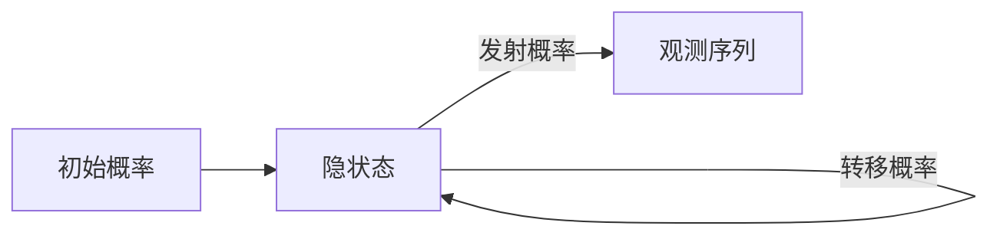

# 隐马尔可夫模型 (Hidden Markov Models, HMM) 原理与代码实例讲解

关键词：隐马尔可夫模型、HMM、概率图模型、时间序列、Viterbi算法、前向算法、后向算法、Baum-Welch算法、EM算法、应用场景

## 1. 背景介绍
### 1.1 问题的由来
在现实世界中,我们经常会遇到一些序列数据,如语音识别、自然语言处理、生物信息学等领域。这些序列数据通常都有一个共同的特点,就是当前状态只与前一个状态有关,而与其他状态无关。为了对这类问题进行建模,科学家们提出了隐马尔可夫模型(Hidden Markov Models, HMM)。HMM是一种概率图模型,它假设系统是一个马尔可夫过程,但状态是不可见的(Hidden)。我们只能通过观测序列来推测隐藏的状态序列。

### 1.2 研究现状
自20世纪60年代以来,隐马尔可夫模型在语音识别、自然语言处理、生物信息学等领域得到了广泛的应用。1966年,Baum等人提出了Baum-Welch算法,用于HMM参数的估计。1989年,Rabiner发表了一篇经典综述,系统地介绍了HMM的基本概念和三个基本问题的解决方法。近年来,随着深度学习的兴起,一些学者将HMM与深度神经网络相结合,提出了深度隐马尔可夫模型(Deep Hidden Markov Models, DHMM),取得了更好的效果。

### 1.3 研究意义
隐马尔可夫模型作为一种重要的概率图模型,在时间序列建模、模式识别等方面有着重要的理论意义和实践价值。深入理解HMM的原理,掌握其训练和推断算法,对于从事人工智能、模式识别等领域的研究人员和工程师来说至关重要。通过本文的讲解,读者可以系统地学习HMM的基本概念、核心算法、代码实现以及实际应用,为进一步研究打下坚实的基础。

### 1.4 本文结构
本文将从以下几个方面对隐马尔可夫模型进行详细讲解：

1. 介绍HMM的背景知识和研究意义
2. 阐述HMM涉及的核心概念,如观测序列、隐状态、初始概率、转移概率、发射概率等
3. 详细推导HMM的三个基本问题(概率计算、学习、预测)的解决算法
4. 给出HMM的数学定义,并结合案例对公式进行详细讲解
5. 提供HMM的代码实现,并对关键代码进行注释说明
6. 介绍HMM的典型应用场景,展望其未来的发展方向
7. 总结全文,并对HMM的研究现状和未来挑战进行展望

## 2. 核心概念与联系
隐马尔可夫模型涉及的核心概念如下：

- 观测序列(Observation Sequence): 对系统状态的观测值构成的序列,用 $O=(o_1,o_2,...,o_T)$ 表示
- 隐状态(Hidden State): 系统真实的内在状态,外部无法直接观测到,用 $Q=(q_1,q_2,...,q_T)$ 表示
- 初始概率(Initial Probability): 初始时刻处于各个隐状态的概率,用 $\pi=(\pi_1,\pi_2,...,\pi_N)$ 表示
- 转移概率(Transition Probability): 从一个隐状态转移到另一个隐状态的概率,用 $A=[a_{ij}]$ 表示 
- 发射概率(Emission Probability): 在某个隐状态下生成某个观测值的概率,用 $B=[b_j(o_t)]$ 表示

一个完整的HMM模型可以用三元组 $\lambda=(A,B,\pi)$ 来表示。HMM的三个基本问题分别是:

1. 概率计算问题:给定模型 $\lambda$ 和观测序列 $O$,计算观测序列出现的概率 $P(O|\lambda)$
2. 学习问题:给定观测序列 $O$,估计模型参数 $\lambda=(A,B,\pi)$ 使得 $P(O|\lambda)$ 最大
3. 预测问题:给定模型 $\lambda$ 和观测序列 $O$,找到最可能的隐状态序列 $Q$

下图展示了HMM涉及的主要概念之间的关系：

## 3. 核心算法原理 & 具体操作步骤
### 3.1 算法原理概述
针对HMM的三个基本问题,有以下几种主要的算法：

- 前向算法(Forward Algorithm):通过递推计算前向概率,解决概率计算问题
- 后向算法(Backward Algorithm):通过递推计算后向概率,与前向算法结合可以计算某个隐状态在某个时刻的概率
- Viterbi算法:通过动态规划解码(Decode)最优隐状态序列,解决预测问题
- Baum-Welch算法:基于EM算法,通过迭代估计模型参数,解决学习问题

### 3.2 算法步骤详解
#### 3.2.1 前向算法
1. 输入:HMM模型 $\lambda=(A,B,\pi)$,观测序列 $O=(o_1,o_2,...,o_T)$
2. 初始化:$\alpha_1(i)=\pi_ib_i(o_1),i=1,2,...,N$
3. 递推:对 $t=1,2,...,T-1$,有
$$\alpha_{t+1}(i)=\left[\sum_{j=1}^N \alpha_t(j)a_{ji}\right]b_i(o_{t+1}),i=1,2,...,N$$
4. 终止:$P(O|\lambda)=\sum_{i=1}^N\alpha_T(i)$

其中,$\alpha_t(i)$ 表示在时刻 $t$ 的隐状态为 $i$ 且观测到 $(o_1,o_2,...,o_t)$ 的概率。

#### 3.2.2 后向算法
1. 输入:HMM模型 $\lambda=(A,B,\pi)$,观测序列 $O=(o_1,o_2,...,o_T)$  
2. 初始化:$\beta_T(i)=1,i=1,2,...,N$
3. 递推:对 $t=T-1,T-2,...,1$,有
$$\beta_t(i)=\sum_{j=1}^Na_{ij}b_j(o_{t+1})\beta_{t+1}(j),i=1,2,...,N$$
4. 终止:$P(O|\lambda)=\sum_{i=1}^N\pi_ib_i(o_1)\beta_1(i)$

其中,$\beta_t(i)$ 表示在时刻 $t$ 的隐状态为 $i$ 且观测到 $(o_{t+1},o_{t+2},...,o_T)$ 的概率。

有了前向概率和后向概率,我们就可以计算:

- 在时刻 $t$ 处于隐状态 $i$ 的概率:
$$\gamma_t(i)=\frac{\alpha_t(i)\beta_t(i)}{\sum_{j=1}^N\alpha_t(j)\beta_t(j)}$$

- 在时刻 $t$ 处于隐状态 $i$ 且在时刻 $t+1$ 处于隐状态 $j$ 的概率:
$$\xi_t(i,j)=\frac{\alpha_t(i)a_{ij}b_j(o_{t+1})\beta_{t+1}(j)}{\sum_{i=1}^N\sum_{j=1}^N\alpha_t(i)a_{ij}b_j(o_{t+1})\beta_{t+1}(j)}$$

#### 3.2.3 Viterbi算法
1. 输入:HMM模型 $\lambda=(A,B,\pi)$,观测序列 $O=(o_1,o_2,...,o_T)$
2. 初始化:
$$\delta_1(i)=\pi_ib_i(o_1),i=1,2,...,N$$
$$\psi_1(i)=0,i=1,2,...,N$$
3. 递推:对 $t=2,3,...,T$,有
$$\delta_t(i)=\max_{1\leq j\leq N}\left[\delta_{t-1}(j)a_{ji}\right]b_i(o_t),i=1,2,...,N$$
$$\psi_t(i)=\arg\max_{1\leq j\leq N}\left[\delta_{t-1}(j)a_{ji}\right],i=1,2,...,N$$
4. 终止:
$$P^*=\max_{1\leq i\leq N}\delta_T(i)$$
$$q_T^*=\arg\max_{1\leq i\leq N}\delta_T(i)$$
5. 最优路径回溯:对 $t=T-1,T-2,...,1$,有
$$q_t^*=\psi_{t+1}(q_{t+1}^*)$$

其中,$\delta_t(i)$ 表示在时刻 $t$ 的隐状态为 $i$ 且观测到 $(o_1,o_2,...,o_t)$ 的最大概率,$\psi_t(i)$ 是在时刻 $t$ 的隐状态为 $i$ 时前一个最优隐状态。

#### 3.2.4 Baum-Welch算法
1. 输入:观测序列 $O=(o_1,o_2,...,o_T)$,迭代次数 $maxIter$
2. 初始化:随机初始化模型参数 $\lambda=(A,B,\pi)$
3. 迭代:重复以下步骤,直到收敛或达到最大迭代次数
   - E步:根据当前模型参数,计算 $\gamma_t(i)$ 和 $\xi_t(i,j)$
   - M步:根据 $\gamma_t(i)$ 和 $\xi_t(i,j)$ 重新估计模型参数
$$\pi_i=\gamma_1(i)$$
$$a_{ij}=\frac{\sum_{t=1}^{T-1}\xi_t(i,j)}{\sum_{t=1}^{T-1}\gamma_t(i)}$$
$$b_j(k)=\frac{\sum_{t=1,o_t=v_k}^T\gamma_t(j)}{\sum_{t=1}^T\gamma_t(j)}$$
4. 输出:估计出的模型参数 $\lambda=(A,B,\pi)$

### 3.3 算法优缺点
- 前向算法和后向算法的时间复杂度都是 $O(N^2T)$,空间复杂度是 $O(NT)$,适合对较短的观测序列进行概率计算。
- Viterbi算法采用了动态规划的思想,其时间复杂度是 $O(N^2T)$,空间复杂度是 $O(NT)$,适合解码较短的隐状态序列。
- Baum-Welch算法是一种无监督学习算法,不需要隐状态的标注信息,但容易陷入局部最优,且收敛速度较慢。

### 3.4 算法应用领域
HMM主要应用于以下领域:

- 语音识别:将语音信号看作观测序列,将语音内容看作隐状态序列
- 中文分词:将字序列看作观测序列,将词序列看作隐状态序列
- 词性标注:将词序列看作观测序列,将词性序列看作隐状态序列
- 命名实体识别:将词序列看作观测序列,将实体标签序列看作隐状态序列
- 生物序列分析:将DNA序列看作观测序列,将功能区域看作隐状态序列

## 4. 数学模型和公式 & 详细讲解 & 举例说明
### 4.1 数学模型构建
隐马尔可夫模型 $\lambda$ 可以用一个三元组 $(A,B,\pi)$ 来表示:

- 状态转移概率矩阵 $A$:
$$A=\begin{bmatrix}
a_{11} & a_{12} & \cdots & a_{1N}\\
a_{21} & a_{22} & \cdots & a_{2N}\\
\vdots & \vdots & \ddots & \vdots\\
a_{N1} & a_{N2} & \cdots & a_{NN}
\end{bmatrix}$$
其中,$a_{ij}=P(i_t=q_j|i_{t-1}=q_i)$ 表示从状态 $q_i$ 转移到状态 $q_j$ 的概率。

- 观测概率矩阵 $B$:
$$B=\begin{bmatrix}
b_1(o_1) & b_1(o_2) & \cdots & b_1(o_