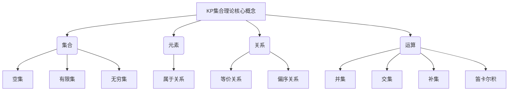

# 集合论导引：KP集合理论

## 1. 背景介绍

### 1.1 问题的由来

集合论是数学的一个基础分支,它研究集合及其之间的关系和运算。集合论在数学、逻辑学、计算机科学等领域扮演着重要角色。然而,传统的集合论存在一些局限性,例如对于无穷集合的处理存在悖论和困难。为了解决这些问题,20世纪60年代,数学家罗纳德·詹金·克劳斯-彼得·巴纳斯基(Ronald Jenkin Fraenkel,Albert Aderhold Kozybski,简称KP)提出了一种新的集合论公理系统,即KP集合理论。

### 1.2 研究现状

KP集合理论在传统的ZFC(Zermelo-Fraenkel集合论与选择公理)集合论的基础上,引入了一些新的概念和公理,旨在解决传统集合论中的悖论和困难。KP集合理论已经成为当代集合论研究的重要分支,并在数学逻辑、计算机科学等领域得到广泛应用。

### 1.3 研究意义

KP集合理论的研究对于数学基础理论的发展具有重要意义。它为处理无穷集合提供了一种新的视角和方法,有助于解决传统集合论中的悖论和困难。同时,KP集合理论在计算机科学领域也有着广泛的应用,例如在形式化验证、程序语义学等方面发挥着重要作用。

### 1.4 本文结构

本文将从KP集合理论的基本概念和公理入手,详细介绍其核心思想和算法原理。接下来,我们将探讨KP集合理论的数学模型和公式,并通过案例分析加深理解。此外,本文还将提供代码实例和实际应用场景,帮助读者更好地掌握KP集合理论的实践应用。最后,我们将总结KP集合理论的发展趋势和面临的挑战,并给出相关资源推荐。

## 2. 核心概念与联系

KP集合理论的核心概念包括集合、元素、关系和运算。

1. **集合**是具有某种特定性质的对象的总体。KP集合理论中的集合可以是空集、有限集或无穷集。

2. **元素**是构成集合的基本单位。一个对象要么属于一个集合,要么不属于该集合,这种关系称为**属于关系**。

3. **关系**描述了集合之间或集合内部元素之间的联系。常见的关系包括等价关系和偏序关系。

4. **运算**是对集合进行的操作,包括并集、交集、补集和笛卡尔积等。

这些核心概念相互联系、相互影响,构成了KP集合理论的基础框架。

## 3. 核心算法原理 & 具体操作步骤

### 3.1 算法原理概述

KP集合理论的核心算法原理是基于一系列公理和推理规则,用于处理集合、元素、关系和运算等概念。这些公理和推理规则旨在解决传统集合论中存在的悖论和困难,同时保持了集合论的一致性和完备性。

KP集合理论的主要公理包括:

- 外在化公理(Exteriorization Axiom)
- 子集公理(Subset Axiom)
- 并集公理(Union Axiom)
- 无穷公理(Infinity Axiom)
- 基础公理(Foundation Axiom)

这些公理为KP集合理论提供了坚实的理论基础,并引入了一些新的概念,如外在化和内在化等,用于处理无穷集合。

### 3.2 算法步骤详解

KP集合理论的算法步骤可以概括为以下几个方面:

1. **定义和构造**
   - 根据公理和定义,构造出所需的集合、元素、关系和运算。
   - 利用外在化公理和内在化概念,处理无穷集合。

2. **推理和证明**
   - 基于公理和推理规则,对集合、元素、关系和运算进行推理和证明。
   - 利用等价关系、偏序关系等概念,建立集合之间的联系。

3. **运算和计算**
   - 对集合进行并集、交集、补集、笛卡尔积等运算。
   - 利用公理和推理规则,计算和简化集合表达式。

4. **应用和实践**
   - 将KP集合理论应用于数学逻辑、计算机科学等领域。
   - 利用KP集合理论解决实际问题,如形式化验证、程序语义学等。

这些步骤相互关联、循环迭代,构成了KP集合理论的完整算法流程。

### 3.3 算法优缺点

**优点:**

1. **解决悖论**: KP集合理论通过引入新的公理和概念,解决了传统集合论中存在的悖论和困难,如无穷集合的处理等。

2. **一致性和完备性**: KP集合理论保持了集合论的一致性和完备性,为处理集合问题提供了坚实的理论基础。

3. **广泛应用**: KP集合理论在数学逻辑、计算机科学等领域有着广泛的应用,为相关领域的发展提供了有力支持。

**缺点:**

1. **复杂性**: 与传统集合论相比,KP集合理论引入了一些新的概念和公理,增加了理论的复杂性,可能会带来一定的学习和理解困难。

2. **局限性**: 尽管KP集合理论解决了一些传统集合论的问题,但它仍然存在一些局限性,无法完全解决所有集合论中的悖论和困难。

3. **接受度**: 由于KP集合理论与传统集合论存在差异,它可能需要一定时间来获得更广泛的接受和认可。

### 3.4 算法应用领域

KP集合理论在以下领域有着广泛的应用:

1. **数学逻辑**: KP集合理论为数学逻辑提供了坚实的理论基础,有助于推动数学逻辑的发展。

2. **计算机科学**:
   - **形式化验证**: KP集合理论可用于软件和硬件系统的形式化验证,确保系统的正确性和安全性。
   - **程序语义学**: KP集合理论为程序语义学提供了理论支持,有助于理解和分析程序的行为和意义。
   - **数据库理论**: KP集合理论在数据库理论中有着重要应用,如关系代数和关系模型等。

3. **理论物理学**: KP集合理论在量子力学、相对论等理论物理学领域也有一定应用。

4. **元数学**: KP集合理论为元数学研究提供了新的视角和工具,有助于探索数学本身的基础和性质。

总的来说,KP集合理论不仅在数学领域具有重要意义,在计算机科学、物理学等其他领域也有着广泛的应用前景。

## 4. 数学模型和公式 & 详细讲解 & 举例说明

### 4.1 数学模型构建

在KP集合理论中,我们可以构建以下数学模型:

1. **集合模型**
   - 集合可以表示为 $A = \{x | x \text{ 满足某种性质 } P(x)\}$
   - 例如: $\mathbb{N} = \{x | x \text{ 是自然数}\}$

2. **关系模型**
   - 二元关系可以表示为 $R \subseteq A \times B$
   - 例如: $\leq \subseteq \mathbb{R} \times \mathbb{R}$ 表示实数集上的小于等于关系

3. **运算模型**
   - 集合运算可以表示为:
     - 并集: $A \cup B = \{x | x \in A \text{ 或 } x \in B\}$
     - 交集: $A \cap B = \{x | x \in A \text{ 且 } x \in B\}$
     - 补集: $A^c = \{x | x \notin A\}$
     - 笛卡尔积: $A \times B = \{(a, b) | a \in A \text{ 且 } b \in B\}$

这些数学模型为KP集合理论提供了形式化的表示方式,有助于进一步的推理和计算。

### 4.2 公式推导过程

在KP集合理论中,我们可以基于公理和推理规则推导出各种公式。以下是一个简单的例子:

**命题**: 对于任意集合 $A$ 和 $B$,有 $A \cup (B \cap A^c) = A \cup B$。

**证明**:
1) 取任意 $x \in A \cup (B \cap A^c)$
2) 若 $x \in A$,则显然 $x \in A \cup B$
3) 若 $x \notin A$,则 $x \in B \cap A^c$,因此 $x \in B$,从而 $x \in A \cup B$
4) 综上所述,对任意 $x$,若 $x \in A \cup (B \cap A^c)$,则 $x \in A \cup B$
5) 因此,有 $A \cup (B \cap A^c) \subseteq A \cup B$

6) 取任意 $x \in A \cup B$
7) 若 $x \in A$,则显然 $x \in A \cup (B \cap A^c)$
8) 若 $x \notin A$,则 $x \in B$,从而 $x \in B \cap A^c$,因此 $x \in A \cup (B \cap A^c)$
9) 综上所述,对任意 $x$,若 $x \in A \cup B$,则 $x \in A \cup (B \cap A^c)$
10) 因此,有 $A \cup B \subseteq A \cup (B \cap A^c)$

11) 由 5) 和 10) 可知,有 $A \cup (B \cap A^c) = A \cup B$

这个推导过程展示了如何利用KP集合理论的公理和推理规则证明一个集合等式。类似的方法可以推导出更多的公式和定理。

### 4.3 案例分析与讲解

考虑以下案例:

**问题**: 设 $A = \{1, 2, 3\}$, $B = \{2, 4, 6\}$, $C = \{3, 4, 5\}$, 求:
1) $A \cup B$
2) $A \cap B$
3) $A \times C$
4) $(A \cup B) \cap C$

**解答**:
1) $A \cup B = \{1, 2, 3, 4, 6\}$
2) $A \cap B = \{2\}$
3) $A \times C = \{(1, 3), (1, 4), (1, 5), (2, 3), (2, 4), (2, 5), (3, 3), (3, 4), (3, 5)\}$
4) $(A \cup B) \cap C = \{3, 4\}$

**分析**:
1) 并集 $A \cup B$ 包含了 $A$ 和 $B$ 中所有不同的元素。
2) 交集 $A \cap B$ 只包含了 $A$ 和 $B$ 中共同的元素 $2$。
3) 笛卡尔积 $A \times C$ 是所有 $A$ 中元素与 $C$ 中元素的有序对的集合。
4) $(A \cup B) \cap C$ 首先求出 $A \cup B$ 的并集,然后与 $C$ 取交集,得到 $\{3, 4\}$。

通过这个案例,我们可以更好地理解并集、交集、笛卡尔积等集合运算的计算方式,以及它们在实际问题中的应用。

### 4.4 常见问题解答

1. **问题**: KP集合理论中的外在化公理是什么意思?

   **解答**: 外在化公理是KP集合理论中的一个重要公理,它引入了"外在化"的概念,用于处理无穷集合。具体来说,对于任意集合 $A$,存在一个集合 $B$,使得 $B$ 包含了 $A$ 以及所有 $A$ 的子集。这个 $B$ 就被称为 $A$ 的外在化。外在化