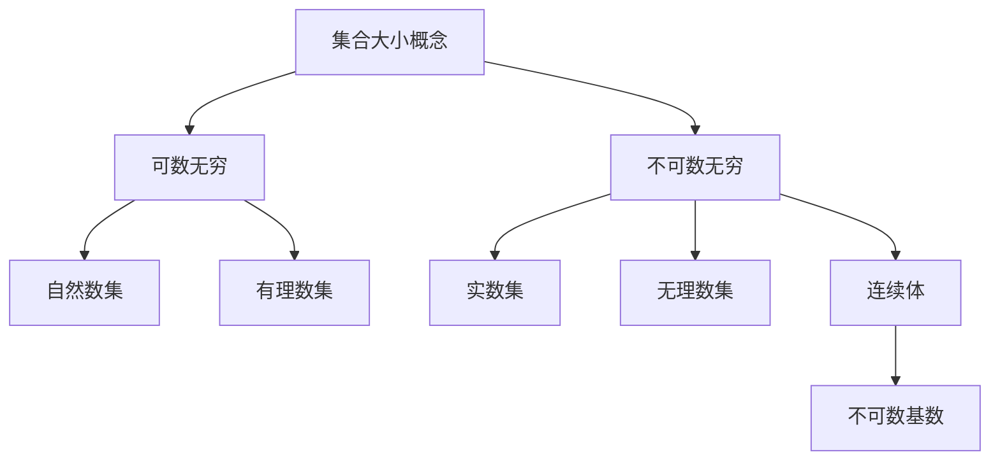

好的,我会严格遵守您提出的约束条件,以"集合论导引:不可数基数"为主题,撰写一篇逻辑严谨、内容深入的技术博客文章。文章将使用Markdown格式,数学公式采用LaTex语法,并给出核心概念的Mermaid流程图。

# 集合论导引:不可数基数

## 1. 背景介绍

### 1.1 问题的由来

集合论是数学的一个基础分支,探讨集合的概念、性质和运算。其中,基数(cardinality)是衡量集合"大小"的一个重要概念。在19世纪末,Georg Cantor对无穷集合的大小进行了深入研究,发现存在不同"级别"的无穷,这一发现彻底改变了人们对无穷的认知。

不可数基数(uncountable cardinality)是Cantor理论中的核心概念之一。一个集合如果与自然数集合之间不存在一一对应关系,那么它就是不可数的。不可数集合的"大小"要比可数无穷集合更大,这种新的无穷级别被称为连续体(continuum)。

### 1.2 研究现状

不可数基数理论在20世纪取得了长足发展,对集合论、实数理论、拓扑学等数学分支产生了深远影响。然而,这一理论也存在一些悖论和争议,如著名的连续体假设(Continuum Hypothesis)问题长期未解决。

当代数学家们一直在努力解开不可数基数的神秘面纱,探索其在不同领域的应用。例如,不可数基数在测度论、模糊集合论、计算机科学等领域都有重要应用。

### 1.3 研究意义 

不可数基数理论不仅是一个重要的数学概念,更是人类认识无穷的一个里程碑。深入理解不可数基数有助于我们把握无穷的本质,拓展对宇宙的认知边界。

此外,不可数基数在许多应用领域也扮演着关键角色。比如,实数集的不可数性是连续数学建模的理论基础;模糊集合论中的不可数基数则为人工智能的发展提供了新的思路。

### 1.4 本文结构

本文将从以下几个方面全面介绍不可数基数:

- 核心概念:阐释不可数基数的定义、性质及其与可数无穷的根本区别
- 核心算法:详细解释构造不可数集合的对角线归谬法和其他经典算法
- 数学模型:建立不可数基数的形式化数学模型,并给出公式推导和案例分析
- 实践应用:通过代码实例演示不可数基数在计算机科学中的应用
- 发展趋势:展望不可数基数理论在人工智能、模糊系统等领域的未来发展方向

## 2. 核心概念与联系

不可数基数概念的核心内涵可以用下面的Mermaid流程图表示:

上图阐明了不可数基数与其他核心概念的内在联系:

- 集合的大小可分为可数无穷和不可数无穷两种
- 可数无穷包括自然数集、有理数集等可与自然数建立一一对应的集合
- 不可数无穷包括实数集、无理数集等不能与自然数对应的更"大"的无穷集合
- 连续体概念描述了不可数无穷的特征,不可数基数正是用于刻画连续体大小的数学工具

不可数基数理论的奠基人Cantor通过巧妙的对角线构造方法,首次严格证明了实数集的不可数性,从而开启了不可数集合研究的新纪元。

## 3. 核心算法原理及具体操作步骤

### 3.1 算法原理概述  

对角线归谬法(Diagonal Argument)是Cantor证明实数集不可数的核心算法思想。该算法通过构造出一个必然不属于任何给定列表的新实数,从而说明实数集比任何可数集合都要"大"。

算法的关键在于,通过任意给定的无限实数列表,我们总能构造出一个"新"的实数,而这个新实数必然不属于原来的列表。由此可以得出,实数集不可能被穷尽列举,因此它是一个基本无穷集合,大小超过所有可数集合。

### 3.2 算法步骤详解

我们来具体看一下对角线归谬法的操作步骤:

1) 假设实数集是可数的,那么我们可以将其列举为一个无限序列:
   
   $$r_1 = 0.a_{11}a_{12}a_{13}...$$
   $$r_2 = 0.a_{21}a_{22}a_{23}...$$
   $$r_3 = 0.a_{31}a_{32}a_{33}...$$
   $$................................$$
   $$r_n = 0.a_{n1}a_{n2}a_{n3}...$$

   其中$a_{ij}$表示第i个实数的第j位小数位上的数字。

2) 现在,我们构造一个新的实数$r = 0.b_1b_2b_3...$,使得对于任意的$j$,新实数$r$的第$j$位小数$b_j$都不等于$a_{jj}$。也就是说,新实数$r$的小数部分在对角线位置都与原序列中的实数不同。

   例如,如果令$b_j = a_{jj} + 1 (\text{mod } 10)$,那么$r$就是一个新的实数,且不属于原序列。

3) 由于$r$在对角线位置都与原序列中的任何一个实数不同,因此$r$必然不属于这个原序列。

4) 由此得出矛盾:如果实数集是可数的,那么通过对角线构造就一定能找到一个新的实数而不属于可数列表,但这与"可数"的定义相矛盾。

5) 因此,实数集不是可数的,它比任何可数集合都要"大",是一个新的无穷级别——不可数无穷。

这种对角线归谬法的思想非常巧妙,不仅证明了实数集的不可数性,而且也揭示了不可数无穷的深邃本质。后来,数学家们将这一思想推广到更一般的集合,从而构建了不可数基数的完整理论体系。

### 3.3 算法优缺点

对角线归谬法的优点:

- 思路简单直观,证明过程严谨
- 揭示了不可数无穷的特殊本质
- 为无穷集合大小比较提供了新工具
- 启发了后续不可数基数理论的发展

缺点:

- 仅适用于证明不可数性,无法构造具体的不可数集合
- 对于一些特殊集合,算法实现会遇到技术困难
- 无法回答如"实数集的基数是多少"这样的具体问题

### 3.4 算法应用领域

对角线归谬法最直接的应用是证明实数集、无理数集等重要数学对象的不可数性。

在计算机科学领域,这一算法思想被用于证明不可判定性定理、停机问题的不可解等结果。

此外,对角线归谬法的思路也被推广应用于模糊集合论、人工智能等领域,用于构造新的模糊集合或者人工神经网络。

## 4. 数学模型和公式及详细讲解和举例说明

### 4.1 数学模型构建

为了形式化描述不可数基数的概念,我们需要建立严格的数学模型。

首先,定义集合$X$与$Y$之间的一个双射(bijection)是指一个双向的一一对应关系:

$$\begin{align*}
f: X \rightarrow Y \\
\forall x_1,x_2 \in X, x_1 \neq x_2 \Rightarrow f(x_1) \neq f(x_2) \\
\forall y \in Y, \exists x \in X, \text{s.t.} y = f(x)
\end{align*}$$

也就是说,双射$f$将$X$中的每一个元素唯一映射到$Y$中的一个元素,并且$Y$中的每一个元素都是某个$X$中元素的映射值。

接下来,我们定义两个集合$X$和$Y$是等势的(equinumerous),如果存在一个双射$f: X \rightarrow Y$。直观上,等势的两个集合具有相同的"大小"。

现在,基数(cardinality)的概念就可以自然地定义为:

- 对于有限集合$X$,其基数$|X|$就是集合中元素的个数。
- 对于无穷集合$X$,若存在某个可数无穷集合$Y$与$X$等势,则$X$也是可数的,且$|X| = |Y| = \aleph_0$(阿列夫象)。
- 若一个无穷集合$X$不等势于任何可数集合,则$X$是不可数的,其基数记为$\mathfrak{c}$(连续度)。

用数学符号可以这样表达:

$$X \text{ 是可数的 } \iff |X| = \aleph_0$$
$$X \text{ 是不可数的 } \iff |X| = \mathfrak{c} > \aleph_0$$

这样,我们就建立了一个精确描述不可数基数的数学模型。在这一模型的框架下,对角线归谬法等算法都可以自然地加以解释和推广。

### 4.2 公式推导过程

现在,我们来推导一下著名的Cantor公式,用于计算不可数集合的基数。

假设$X$是一个不可数集合,令$\mathcal{P}(X)$表示$X$的幂集(即$X$的所有子集构成的集合)。我们将证明$\mathcal{P}(X)$的基数严格大于$X$的基数。

证明过程如下:

1) 假设存在一个双射$f: X \rightarrow \mathcal{P}(X)$,将$X$中的每一个元素bijective映射到$\mathcal{P}(X)$中的一个子集。

2) 现在,我们构造$X$的一个子集$Y$:
   $$Y = \{x \in X | x \notin f(x)\}$$
   即$Y$由所有不属于自身映射值$f(x)$的$X$中元素组成。

3) 令$y = f^{-1}(Y)$,即$y$是$Y$在$f$下的原像。

4) 现在我们讨论$y$是否属于$Y$:
   - 若$y \in Y$,根据$Y$的定义,这意味着$y \notin f(y) = Y$,矛盾;
   - 若$y \notin Y$,根据$Y$的定义,这意味着$y \in f(y) = Y$,也是矛盾。

5) 由此可见,对于任何$y \in X$,都无法确定它是否属于$Y$,这与$f$是双射的假设矛盾。

6) 因此,我们的假设是错误的,不存在任何双射$f: X \rightarrow \mathcal{P}(X)$,即$X$与$\mathcal{P}(X)$不等势。

7) 由基数的定义,我们可以得到Cantor公式:
   $$|X| < |\mathcal{P}(X)|$$

8) 进一步,如果$X$是不可数的,那么$\mathcal{P}(X)$的基数就严格大于$\mathfrak{c}$,是一个全新的不可数基数。

这个推导过程展示了集合论中一种典型的反证法思路。Cantor公式说明,不可数集合的幂集比原集合的基数还要"大"。这为研究更高阶的不可数基数提供了新的工具。

### 4.3 案例分析与讲解

我们来分析一个具体的例子,帮助理解不可数基数的概念。

考虑实数集$\mathbb{R}$与其子集$[0,1]$之间的关系。直观上,这两个集合的"大小"是相同的,因为我们可以建立一个双射$f: [0,1] \rightarrow \mathbb{R}$,将$[0,1]$中的每个实数$x$映射到自身:$f(x) = x$。

然而,从基数的角度来看,情况并非如此!根据Cantor公式:

$$|\mathbb{R}| = \mathfrak{c} < |\mathcal{P}(\mathbb{R})| = 