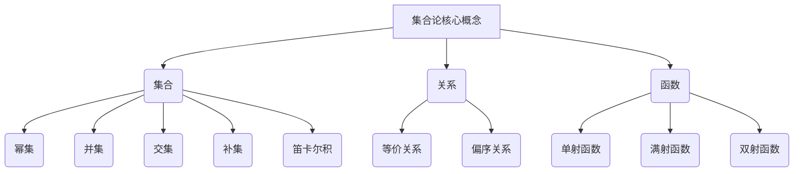

以下是《集合论导引：力迫基本概念》的正文内容:

# 集合论导引：力迫基本概念

## 1. 背景介绍

### 1.1 问题的由来

集合论作为数学的一个基础分支理论,其重要性不言而喻。它为数学奠定了坚实的基础,并在逻辑、计算机科学、人工智能等诸多领域发挥着关键作用。然而,对于初学者来说,集合论的概念和公理体系往往显得晦涩难懂,给学习带来了不小的挑战。

### 1.2 研究现状  

目前,集合论的教材和资料大多着重于严格的数学推导和形式化证明,这对于理解基本概念和思想实在是一大障碍。虽然也有一些努力尝试以更加通俗易懂的方式阐释集合论,但往往流于肤浅,未能深入探讨其内在本质和发展脉络。

### 1.3 研究意义

深入掌握集合论的基本概念对于数学基础的夯实、逻辑思维能力的培养以及相关领域的学习和应用都有着重要意义。本文旨在以浅显易懂的方式引导读者逐步理解集合论的核心思想,为后续更深入的学习奠定坚实基础。

### 1.4 本文结构

本文将从集合论的起源和发展历程出发,循序渐进地介绍集合的基本概念、运算、公理体系等核心内容。在此基础上,将深入探讨集合论在逻辑、计算机科学等领域的应用,并对未来的发展趋势和挑战进行展望。

## 2. 核心概念与联系



集合论的核心概念主要包括集合、关系和函数三大部分,它们之间存在着密切的联系和内在逻辑。

1. **集合**是集合论的基础,是指具有某种特征的元素的总体。集合的基本概念包括:
   - 幂集:由给定集合的所有子集构成的集合
   - 并集:两个或多个集合中所有元素的总和
   - 交集:两个或多个集合中共同包含的元素
   - 补集:属于一个集合但不属于另一个集合的元素
   - 笛卡尔积:两个集合的所有有序对构成的集合

2. **关系**描述了集合之间或集合内部元素之间的某种联系。关系理论包括:
   - 等价关系:具有反身性、对称性和传递性的二元关系
   - 偏序关系:具有反身性、反对称性和传递性的二元关系

3. **函数**是一种特殊的二元关系,将定义域中的每个元素唯一映射到值域中的一个元素。函数理论包括:
   - 单射函数:定义域中不同元素映射到值域中不同元素
   - 满射函数:值域中每个元素至少有一个定义域元素与之对应
   - 双射函数:同时满足单射和满射的函数

这些概念相互关联、相互渗透,共同构成了集合论的理论体系。掌握它们有助于更深入地理解集合论的本质,并为后续的学习和应用奠定基础。

## 3. 核心算法原理 & 具体操作步骤

### 3.1 算法原理概述

集合论中的一些核心算法主要围绕集合的基本运算展开,包括并集、交集、补集、笛卡尔积等操作。这些算法不仅在集合论自身领域具有重要意义,而且在计算机科学、数据处理等领域也有广泛应用。

以集合的并集运算为例,其基本思想是将两个或多个集合中的所有元素合并为一个新的集合,而不存在重复元素。该算法通常采用迭代或递归的方式实现,时间复杂度与输入集合的大小成正比。

### 3.2 算法步骤详解

以下是集合并集运算的具体算法步骤:

1. **初始化**:创建一个新的空集合,用于存储并集的结果。
2. **遍历第一个集合**:对于第一个输入集合中的每个元素,将其添加到结果集合中。
3. **遍历第二个集合**:对于第二个输入集合中的每个元素,如果它不在结果集合中,则将其添加到结果集合中。
4. **返回结果集合**:将包含所有不重复元素的结果集合返回。

以Python为例,该算法可以用以下代码实现:

```python
def union(set1, set2):
    result = set(set1)  # 创建一个新集合,初始化为set1的副本
    for elem in set2:
        if elem not in result:
            result.add(elem)  # 将set2中不在result中的元素添加到result
    return result
```

该算法的时间复杂度为O(n+m),其中n和m分别为两个输入集合的大小。在最坏情况下,即两个集合没有共同元素时,需要遍历所有元素。

### 3.3 算法优缺点

集合并集运算算法的优点在于思路简单、实现直观,可以高效地计算两个集合的并集。然而,它也存在一些不足之处:

- **空间复杂度较高**:需要创建一个新的集合来存储结果,对于大型集合来说,可能会占用较多内存。
- **不支持原地修改**:算法无法直接修改原始输入集合,而是创建了一个新的结果集合。
- **重复计算**:对于具有大量共同元素的集合,算法会重复检查和添加这些元素,效率较低。

针对这些缺点,我们可以采取一些优化策略,例如使用位向量或哈希表来存储和操作集合,减少空间占用和重复计算。另外,也可以考虑原地修改输入集合,避免创建新的结果集合。

### 3.4 算法应用领域

集合的基本运算算法在许多领域都有广泛应用,例如:

- **数据处理**:用于对数据集进行合并、去重、交集计算等操作。
- **信息检索**:在搜索引擎、推荐系统等领域,用于计算相关文档集合的并集或交集。
- **编译原理**:在编译器的符号表管理、类型检查等环节中,需要对标识符集合进行操作。
- **人工智能**:在机器学习、知识表示等领域,集合运算被广泛应用于特征处理、规则匹配等任务。
- **密码学**:在密码系统中,集合运算常被用于密钥管理和加密协议设计。

总的来说,集合论算法虽然看似简单,但在实际应用中扮演着重要角色,是计算机科学和其他领域不可或缺的基础工具。

## 4. 数学模型和公式 & 详细讲解 & 举例说明

### 4.1 数学模型构建

在集合论中,我们通常使用一些数学模型和公式来精确地描述和操作集合。其中,最基础和重要的模型是集合的形式化定义和公理系统。

**集合的形式化定义**:

设 $U$ 是一个非空集合,称为**宇集**。如果存在一个命题 $P(x)$,对于 $U$ 中的每一个元素 $x$,要么 $P(x)$ 为真,要么 $P(x)$ 为假,那么由所有使 $P(x)$ 为真的 $x$ 组成的集合,记作:

$$
A = \{x \in U | P(x)\}
$$

这就是集合 $A$ 的形式化定义。它明确地规定了集合 $A$ 中元素的性质,即满足命题 $P(x)$ 的 $U$ 中的元素。

**公理系统**:

为了在集合论的基础上建立起一个完整、自洽的数学理论体系,我们需要引入一些公理作为出发点。著名的**齐普基公理系统**就是集合论最基本的公理系统之一,它包括以下几个公理:

1. **外延性公理**:两个集合若由完全相同的元素组成,则这两个集合相等。
2. **子集公理**:对于任意给定的集合 $A$ 和命题 $P(x)$,存在一个集合 $B$,它由 $A$ 中所有使 $P(x)$ 为真的元素组成。
3. **并集公理**:对于任意给定的两个集合 $A$ 和 $B$,存在一个集合 $C$,它由 $A$ 和 $B$ 中的所有元素组成。
4. **幂集公理**:对于任意给定的集合 $A$,存在一个集合 $B$,它由 $A$ 的所有子集组成。
5. **无限公理**:存在一个无限集合。

这些公理为集合论奠定了坚实的数学基础,使得我们能够在此基础上进行严格的推理和证明。

### 4.2 公式推导过程

在集合论中,我们常常需要利用一些公式来描述和操作集合。这些公式通常是基于集合的基本概念和公理,通过严格的数学推导而得到的。以下是一些常见公式的推导过程:

1. **集合相等的条件**:

设 $A$ 和 $B$ 是两个集合,如果对于任意元素 $x$,都有 $x \in A \Leftrightarrow x \in B$,则 $A = B$。

**证明**:

$\Rightarrow$ 假设 $A = B$,对于任意 $x$,如果 $x \in A$,根据外延性公理,因为 $A$ 和 $B$ 由完全相同的元素组成,所以 $x \in B$;如果 $x \notin A$,同理可证 $x \notin B$。

$\Leftarrow$ 假设对于任意 $x$,都有 $x \in A \Leftrightarrow x \in B$。根据外延性公理,如果两个集合由完全相同的元素组成,则它们相等,所以 $A = B$。

2. **德摩根律**:

$$
\overline{A \cup B} = \overline{A} \cap \overline{B}
$$
$$
\overline{A \cap B} = \overline{A} \cup \overline{B}
$$

**证明**:

令 $x$ 为任意元素,我们有:

$x \in \overline{A \cup B} \Leftrightarrow x \notin A \cup B \Leftrightarrow x \notin A \ \text{且} \ x \notin B \Leftrightarrow x \in \overline{A} \ \text{且} \ x \in \overline{B} \Leftrightarrow x \in \overline{A} \cap \overline{B}$

$x \in \overline{A \cap B} \Leftrightarrow x \notin A \cap B \Leftrightarrow x \notin A \ \text{或} \ x \notin B \Leftrightarrow x \in \overline{A} \ \text{或} \ x \in \overline{B} \Leftrightarrow x \in \overline{A} \cup \overline{B}$

根据集合相等的条件,我们可以得到德摩根律。

这些公式推导过程体现了集合论的严谨性和逻辑性,为我们进一步探索集合论奠定了坚实基础。

### 4.3 案例分析与讲解

为了更好地理解集合论中的概念和公式,让我们通过一些具体案例来进行分析和讲解。

**案例1:集合的包含关系**

设 $A = \{1, 2, 3\}$, $B = \{2, 4\}$, $C = \{2\}$。

(1) 判断 $C \subseteq A$?

解:
$C = \{2\}$, $A = \{1, 2, 3\}$, 所有 $C$ 中的元素都属于 $A$,所以 $C \subseteq A$。

(2) 判断 $B \subseteq A$?

解:
$B = \{2, 4\}$, $A = \{1, 2, 3\}$, 元素 $2 \in A$,但 $4 \notin A$,所以 $B \not\subseteq A$。

(3) 判断 $A \subseteq B$?

解:
$A = \{1, 2, 