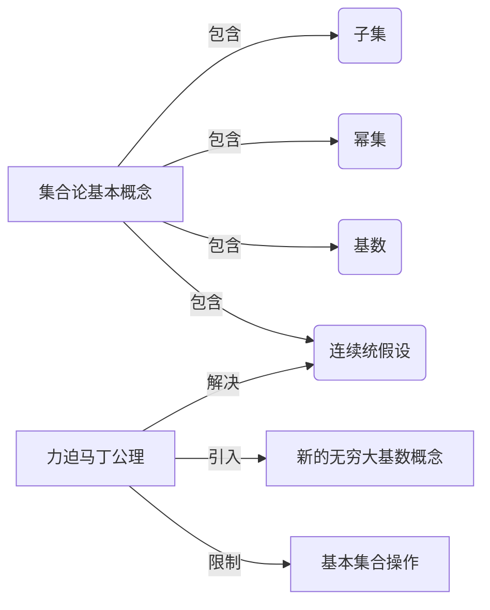

以下是根据您的要求撰写的技术博客文章正文内容：

# 集合论导引：力迫马丁公理与非连续统假设

## 1. 背景介绍

### 1.1 问题的由来

集合论是数学基础理论之一,自从19世纪末20世纪初由Georg Cantor奠基以来,它就成为了现代数学的核心支柱。集合论不仅为数学提供了一个坚实的逻辑基础,更为数学分析、代数、拓扑等诸多分支奠定了基石。然而,在集合论的发展过程中,我们也遇到了一些悖论和困难,比如著名的罗素悖论、布尔悖论等。为了解决这些悖论,数学家们提出了一系列公理化集合论体系,其中最著名的当属泽美尔-弗兰克尔(Zermelo-Fraenkel)公理系统(简称ZF)。

ZF公理系统解决了大部分悖论,但它无法判定著名的连续统假设(Continuum Hypothesis, CH)的真伪。CH假设是由Cantor在1878年提出的,它断言实数集的基数(cardinal)严格大于可数无穷集的基数,但又严格小于它的连续幂集的基数。CH在当时引起了广泛争议,数学家们无法在ZF公理系统中证明或否定它。

### 1.2 研究现状  

20世纪初,数学家们开始探索ZF公理系统的相对一致性问题。1938年,库尔特·哥德尔(Kurt Gödel)证明了如果ZF公理系统是相容的,那么它就不能证明CH的否定。1963年,保罗·科恩(Paul Cohen)则证明了如果ZF公理系统是相容的,那么它就不能证明CH。这两个结果共同表明,CH在ZF公理系统中是无决定的,即无法被证明或被否定。

为了解决CH难题,数学家们提出了各种扩展ZF公理系统的方案,其中最著名的就是力迫马丁公理(Forcing Axiom)。1963年,罗伯特·索洛维(Robert Solovay)首次提出了力迫马丁公理的概念。随后,马丁(Donald Martin)和其他数学家对其进行了深入研究和发展,因此这一公理系统也被称为马丁公理。

### 1.3 研究意义

力迫马丁公理旨在通过增加新的公理来扩展ZF公理系统,从而解决CH等悬而未决的问题。马丁公理的核心思想是引入一个新的无穷大基数概念,并对集合论中的一些基本操作加以限制,使得CH在扩展后的公理系统中变得可判定。

马丁公理不仅在理论上解决了CH难题,更重要的是它为集合论的进一步发展开辟了新的道路。马丁公理为研究高基数集合论提供了强有力的工具,并在数学逻辑、代数拓扑、量子力学等领域产生了深远影响。因此,深入理解力迫马丁公理及其内在机理和应用前景,对于推动集合论和数学基础理论的发展至关重要。

### 1.4 本文结构

本文将全面介绍力迫马丁公理及其在集合论中的应用。我们将从集合论的基本概念出发,逐步深入探讨力迫马丁公理的核心内容、数学模型和公理体系。此外,我们还将通过具体案例,解释力迫马丁公理在数学逻辑、代数拓扑等领域的应用,并对其未来发展趋势进行展望。

## 2. 核心概念与联系

为了深入理解力迫马丁公理,我们首先需要掌握一些集合论的基本概念和符号约定。

**集合(Set)**是数学中最基本的概念之一。一个集合由若干确定的元素(element)构成,通常用大写花括号{}来表示,例如{1,2,3}就是一个包含三个元素的集合。

**子集(Subset)**是指一个集合中所有元素都属于另一个集合。例如,{1,2}是{1,2,3}的子集。

**幂集(Power Set)**是指一个集合的所有子集构成的集合。例如,{1,2}的幂集是{{}, {1}, {2}, {1,2}}。

**基数(Cardinality)**是衡量集合"大小"的一种方式。两个集合如果存在一一对应的双射映射,则它们的基数相等。最小的无穷基数是可数无穷基数$\aleph_0$(阿列夫null),它表示自然数集的基数。

**连续统假设(Continuum Hypothesis)**断言,实数集的基数是最小的不可数基数,即$2^{\aleph_0} = \aleph_1$。

力迫马丁公理旨在通过引入新的公理,使得CH在扩展后的公理系统中变得可判定。它的核心思想是引入一个新的无穷大基数概念,并对集合论中的一些基本操作加以限制。

## 3. 核心算法原理与具体操作步骤

### 3.1 算法原理概述

力迫马丁公理的核心思想是通过"力迫"(forcing)的方式,在一个给定的模型(集合论公理系统)中构造出一个更大的模型,使得在新模型中满足某些所需的性质(如CH的真伪)。这种构造过程被称为"力迫扩张"(forcing extension)。

力迫扩张的基本思路是:首先定义一个特殊的集合P(称为"力迫概念"),其元素被称为"条件"。然后从P中选取一个条件G(称为"真通用条件"),并利用G构造出一个新的模型M[G]。通过适当选择P和G,我们可以使得在M[G]中满足所需的性质。

算法的关键在于如何选择合适的P和G,以及如何利用G构造出新模型M[G]。马丁公理给出了一系列公理,规范了P和G的性质,并指导了构造M[G]的过程。

### 3.2 算法步骤详解

力迫扩张算法可以概括为以下几个步骤:

1. **定义力迫概念P**

   力迫概念P是一个偏序集,其元素被称为条件。P需要满足一些特殊的性质,如可分性(separativity)、正规性(properness)等,这些性质由马丁公理中的公理加以规范。

2. **构造密集子集**

   在P中找到一个密集的子集D,即对于任意条件p∈P,都存在q∈D使得q≤p。D的存在性也由马丁公理保证。

3. **选取真通用条件G**

   从D中选取一个特殊的条件G,称为真通用条件(generic condition)。G需要满足一些特殊性质,如对于任意p∈D,要么p∈G,要么存在q∈G使得q与p是不相容的(incompatible)。

4. **构造新模型M[G]**

   利用G,我们可以在原模型M的基础上构造出一个新的模型M[G]。具体来说,M[G]中的元素是由M中的元素和G中的条件构成的等价类。

5. **验证所需性质**

   最后,我们需要证明在新模型M[G]中满足所需的性质,如CH的真伪等。这通常需要利用马丁公理中的其他公理。

上述步骤看似简单,但是在具体实现时需要处理大量技术细节。例如,如何保证P满足所需的性质?如何有效构造密集子集D?如何选取合适的真通用条件G?如何正确定义M[G]中的元素和集合操作?等等。马丁公理为这些问题提供了一系列精细的公理作为指导。

### 3.3 算法优缺点

**优点:**

1. **解决悬而未决的问题**:力迫马丁公理为解决连续统假设等长期未解决的重大问题提供了有力工具。

2. **拓展集合论研究领域**:马丁公理为研究高基数集合论开辟了新的道路,推动了集合论的进一步发展。

3. **影响广泛**:力迫马丁公理不仅在集合论领域产生了深远影响,更为数学逻辑、代数拓扑、量子力学等领域提供了新的研究视角和方法。

**缺点:**

1. **复杂性较高**:力迫马丁公理的理论体系和具体实现都相对复杂,需要大量的技术细节处理。

2. **潜在不确定性**:虽然马丁公理解决了CH问题,但它本身的相对一致性问题仍然是一个悬而未决的难题。

3. **应用局限性**:目前马丁公理主要应用于纯理论研究,在实际应用领域的应用还有待开发和拓展。

### 3.4 算法应用领域

力迫马丁公理主要应用于以下几个领域:

1. **集合论**:马丁公理为研究高基数集合论提供了强有力的工具,推动了集合论的进一步发展。

2. **数学逻辑**:马丁公理在数学逻辑领域具有重要应用,如研究无穷模型理论、递归理论等。

3. **代数拓扑**:力迫技术在代数拓扑中有广泛应用,如研究特性类、同伦理论等。

4. **量子力学**:近年来,马丁公理在量子力学的数学基础研究中也产生了一些有趣的应用。

5. **组合数学**:力迫技术也被应用于组合数学的一些分支,如图论、Ramsey理论等。

6. **其他领域**:除上述领域外,马丁公理在泛函分析、动力系统理论等领域也有一些初步应用。

总的来说,力迫马丁公理主要应用于纯理论研究领域,特别是那些与无穷概念和高基数集合论相关的领域。未来,如何将马丁公理应用于更多实际问题,将是一个重要的研究方向。

## 4. 数学模型和公式详细讲解与举例说明

### 4.1 数学模型构建

力迫马丁公理的核心是通过构造新的模型来扩展ZF公理系统。我们先介绍一下模型的基本概念。

在集合论中,一个模型M是指一个非空集合A(称为M的基座),以及定义在A上的一系列关系和运算。M需要满足ZF公理系统中规定的一切公理和定理。

给定一个模型M,我们可以在其基础上构造出一个新的模型N,使得N不仅继承了M的一切性质,还满足一些额外的性质。这种从M到N的过渡过程,就是所谓的模型扩张。

力迫扩张是模型扩张的一种特殊形式。在力迫扩张中,我们首先定义一个偏序集P(即力迫概念),然后选取P中的一个特殊元素G(真通用条件),利用G从原模型M构造出一个新模型M[G]。

形式上,M[G]中的元素是由M中的元素和G中的条件构成的等价类。具体来说,对于任意x∈M,我们定义

$$\dot{x}^G = \{(p,y) \in G \times M \mid p \Vdash \dot{x}=y\}$$

其中$\Vdash$是一个强制关系,表示"条件p强制$\dot{x}$等于y"。$\dot{x}^G$就是M[G]中对应于x的元素。

同理,对于任意x,y∈M,我们可以定义M[G]中的集合操作,如并集、交集、幂集等。例如,M[G]中的并集操作可以定义为:

$$\dot{x}^G \cup \dot{y}^G = \{(p,z) \in G \times M \mid \exists q \leq p, \exists u \in \dot{x}^G, \exists v \in \dot{y}^G, q \Vdash z=u \cup v\}$$

通过对M[G]中的元素和集合操作进行适当定义,我们可以保证M[G]继承了M的一切性质,同时又满足了一些额外的性质(如CH的真伪)。这种额外的性质由选取G的方式决