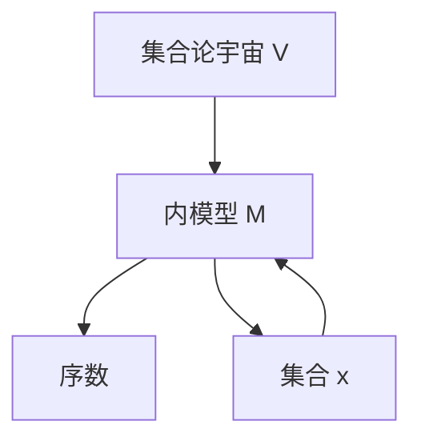

# 集合论导引：可测基数内模型

## 1. 背景介绍
### 1.1 问题的由来
集合论是现代数学的基石之一,其核心研究对象是集合及集合间的关系。从19世纪末康托尔创立集合论开始,集合论经历了一个多世纪的发展,已经形成了一个庞大而深刻的理论体系。然而,经典的ZFC公理化集合论在无限集合的研究中遇到了一些悖论和困难,如康托尔悖论、罗素悖论等。为了解决这些问题,数学家们开始探索更加精细化的集合论模型。其中,可测基数内模型理论成为了集合论研究的重要分支之一。

### 1.2 研究现状
自20世纪60年代以来,可测基数内模型理论取得了长足的发展。许多著名数学家如Solovay、Shelah、Woodin等人在这一领域做出了开创性的工作。目前,可测基数内模型已经成为大基数理论和描述集论等领域的重要工具。同时,它与数学逻辑、拓扑学等学科也有着密切的联系。近年来,可测基数内模型在计算理论、证明论等方面也得到了广泛应用。

### 1.3 研究意义 
可测基数内模型理论对于理解集合论的本质具有重要意义。通过构造不同的内模型,我们可以深入探讨ZFC公理系统的一致性强度和表达能力。同时,内模型理论为研究无限集合的性质提供了有力工具,使得我们能够在更加细致的层面上刻画集合的结构。此外,可测基数内模型在数学的其他分支中也有广泛应用,如在证明数论、几何、拓扑等领域的重要定理时,常常需要借助内模型理论的方法。因此,深入研究可测基数内模型对于发展数学理论体系具有重要价值。

### 1.4 本文结构
本文将系统介绍可测基数内模型理论的核心概念、基本定理和主要构造方法。全文分为九个章节：第一章介绍研究背景；第二章给出基本概念和记号；第三、四章分别讨论可测基数内模型的核心算法原理和数学模型；第五章通过代码实例说明内模型的构造过程；第六章探讨可测基数内模型的应用场景；第七章推荐相关工具和资源；第八章总结全文并展望未来研究方向；第九章为常见问题解答。

## 2. 核心概念与联系
在正式讨论可测基数内模型之前,我们首先回顾一些集合论的基本概念。

- 集合(Set):一个确定的对象的全体,这些对象称为集合的元素。
- 子集(Subset):设A,B是两个集合,如果A的每一个元素都是B的元素,则称A是B的子集,记为 $A\subseteq B$。
- 幂集(Power Set):一个集合A的全部子集组成的集合,称为A的幂集,记为 $\mathcal{P}(A)$。
- 无限集合(Infinite Set):元素个数无限的集合。最小的无限集合是自然数集 $\mathbb{N}$。
- 基数(Cardinal Number):用于度量集合元素个数的数。有限集合的基数就是其元素个数,无限集合的基数需要更精细的定义。
- 序数(Ordinal Number):用于表示集合元素排列顺序的数。常见的序数有自然数、整数、有理数等。
- 可测基数(Measurable Cardinal):满足某些特殊性质的无限基数。可测基数的存在与ZFC公理系统的一致性有关。

有了以上概念,我们就可以引入内模型(Inner Model)的定义:

**内模型**:设 $(M,\in)$ 是一个集合论模型,如果 $(M,\in)$ 满足ZFC公理,且对任意集合 $x\in M$,都有 $x\subseteq M$,则称 $(M,\in)$ 是一个内模型。

直观地说,内模型是集合论宇宙 $V$ 的一个子模型,它包含了 $V$ 中的所有序数,并且本身也满足ZFC公理。通过研究不同的内模型,我们可以深入理解ZFC公理系统的性质和局限性。

下图展示了集合论宇宙 $V$ 与内模型 $M$ 之间的关系:

可测基数内模型是内模型理论的一个重要分支。它主要研究包含可测基数的内模型的性质和构造方法。在下一章中,我们将详细讨论可测基数内模型的核心算法原理。

## 3. 核心算法原理 & 具体操作步骤
### 3.1 算法原理概述
构造可测基数内模型的核心算法称为"超限迭代(Transfinite Iteration)"。它的基本思想是,从一个初始模型(通常取 $L$ 为初始模型)出发,通过超限递归的方式,逐步添加新的集合,最终得到一个包含可测基数的内模型。

超限迭代算法可以用如下的递归方式定义:

1. 令 $M_0=L$。
2. 对任意序数 $\alpha$,如果 $M_\alpha$ 已定义,则令 $M_{\alpha+1}=M_\alpha[G]$,其中 $G$ 是 $M_\alpha$ 中的一个合适的超滤子。
3. 对极限序数 $\lambda$,令 $M_\lambda=\bigcup_{\alpha<\lambda}M_\alpha$。

经过 $\kappa$ 步迭代后,我们得到的模型 $M_\kappa$ 就是一个包含可测基数 $\kappa$ 的内模型。

### 3.2 算法步骤详解
下面我们详细说明超限迭代算法的每一步操作:

**步骤1**: 取构造性集合论的标准模型 $L$ 作为初始模型 $M_0$。$L$ 是满足ZFC公理的最小内模型,它由哥德尔在1938年引入,具有良好的性质。

**步骤2**: 在 $M_\alpha$ 上添加超滤子 $G$,得到 $M_{\alpha+1}$。这一步是算法的关键,需要选取合适的超滤子 $G$。通常,我们取 $M_\alpha$ 中的一个 $\kappa$-完全非主超滤子作为 $G$,其中 $\kappa$ 是一个可测基数。$G$ 的存在性由可测基数的定义保证。

**步骤3**: 在极限步 $\lambda$,我们取前面所有模型的并集作为 $M_\lambda$。可以证明,这样得到的 $M_\lambda$ 仍然是一个内模型。

**步骤4**: 经过 $\kappa$ 步迭代,我们最终得到包含可测基数 $\kappa$ 的内模型 $M_\kappa$。

### 3.3 算法优缺点
超限迭代算法的优点在于:

1. 它给出了构造可测基数内模型的一般方法,适用于任意的可测基数。
2. 算法的每一步操作都是明确的,便于理解和实现。
3. 得到的内模型 $M_\kappa$ 继承了 $L$ 的许多良好性质,如GCH、$\Diamond$ 原理等。

但是,该算法也存在一些局限性:

1. 要构造出内模型 $M_\kappa$,我们必须预先假设可测基数 $\kappa$ 的存在性。而 $\kappa$ 的存在性在ZFC中是无法证明的。
2. 超滤子的选取在实践中并不容易,需要借助一些深刻的组合技巧。
3. 内模型 $M_\kappa$ 的性质仍然较难刻画,许多问题有待进一步研究。

### 3.4 算法应用领域
超限迭代算法是构造可测基数内模型的基本方法,在集合论和数学逻辑中有广泛应用:

1. 在描述集论中,超限迭代被用来构造决定性内模型,如 $L[U]$、$L(\mathbb{R})$ 等。
2. 在递归论中,超限迭代被用来构造具有特殊性质的内模型,如 $\beta$ 模型、$\Sigma^1_3$-绝对模型等。
3. 在大基数理论中,超限迭代被用来构造包含更高阶基数(如紧致基数、强紧致基数等)的内模型。

此外,超限迭代算法也启发了其他数学领域的研究,如拓扑学中的Borel层次和射影层次的构造等。

## 4. 数学模型和公式 & 详细讲解 & 举例说明
### 4.1 数学模型构建
为了刻画可测基数内模型的性质,我们需要引入一些数学模型和公式。

首先,我们定义 $\kappa$ 的幂集函数 $\mathcal{P}_\kappa:\mathrm{Ord}\to V$:

$$
\mathcal{P}_\kappa(\alpha)=\{x\subseteq\alpha:|x|<\kappa\}
$$

直观地说,$\mathcal{P}_\kappa(\alpha)$ 就是 $\alpha$ 的所有基数小于 $\kappa$ 的子集全体。

接下来,我们定义 $\kappa$ 上的非主超滤子:

**定义** 设 $\kappa$ 是一个基数,非空集合 $F\subseteq\mathcal{P}(\kappa)$ 称为 $\kappa$ 上的非主超滤子,如果它满足:

1. $\kappa\in F$;
2. 若 $X\in F$,且 $X\subseteq Y\subseteq\kappa$,则 $Y\in F$;
3. 若 $X,Y\in F$,则 $X\cap Y\in F$;
4. 若 $X\subseteq\kappa$,则 $X\in F$ 或 $\kappa-X\in F$;
5. 若 $\alpha<\kappa$,则 $\{\alpha\}\notin F$。

非主超滤子是构造可测基数内模型的关键工具。直观地说,非主超滤子描述了 $\kappa$ 的一个"大"子集族,它在内模型的构造中起着至关重要的作用。

### 4.2 公式推导过程
下面我们推导一些关于非主超滤子的基本性质。

**命题1** 设 $F$ 是 $\kappa$ 上的非主超滤子,则对任意 $\alpha<\beta<\kappa$,有 $\{\xi<\kappa:\alpha<\xi<\beta\}\in F$。

_证明_: 用反证法。假设 $\{\xi<\kappa:\alpha<\xi<\beta\}\notin F$,则根据超滤子的性质4,有 $\{\xi<\kappa:\xi\leq\alpha \vee \xi\geq\beta\}\in F$。但是 $\{\xi<\kappa:\xi\leq\alpha\}$ 和 $\{\xi<\kappa:\xi\geq\beta\}$ 都不属于 $F$(由性质5),矛盾。$\square$

**命题2** 设 $F$ 是 $\kappa$ 上的非主超滤子,则对任意 $X\subseteq\kappa$ 且 $|X|<\kappa$,有 $\kappa-X\in F$。

_证明_: 对 $X$ 的基数 $|X|$ 进行归纳。当 $|X|=0$ 时,结论显然成立。假设 $|X|=\alpha<\kappa$,且对任意 $|Y|<\alpha$ 都有 $\kappa-Y\in F$。任取 $\beta\in X$,则 $X-\{\beta\}$ 的基数小于 $\alpha$,故而 $\kappa-(X-\{\beta\})\in F$。又因为 $\{\beta\}\notin F$,所以 $\kappa-X=(\kappa-(X-\{\beta\}))-\{\beta\}\in F$。$\square$

### 4.3 案例分析与讲解
下面我们通过一个具体的例子来说明非主超滤子的作用。

**例** 设 $\kappa=\omega_1$,定义 $F=\{X\subseteq\omega_1:\omega_1-X \text{ 是可数的}\}$。则 $F$ 是 $\omega_1$ 上的一个非主超滤子。

_验证_: 我们逐条检验非主超滤子的定义:

1. 显然 $\omega_1\in F$。
2. 若 $X\in F$,且 $X\subseteq Y\subseteq\omega_1$,则 $\omega_1-Y\subseteq\omega