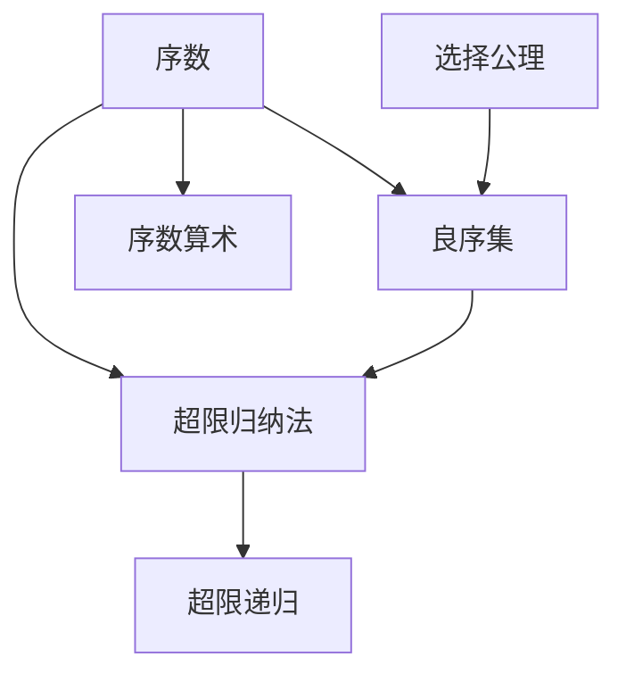

# 集合论导引：超限归纳法

作者：禅与计算机程序设计艺术 / Zen and the Art of Computer Programming

## 1. 背景介绍

### 1.1 问题的由来

集合论是现代数学的基础,它研究集合的性质以及集合之间的关系。康托尔创立了现代集合论,并引入了无限集合的概念,这为数学分析、拓扑学等学科的发展奠定了基础。然而,康托尔的天真集合论也引发了一系列悖论,如罗素悖论等。为了解决这些悖论,数学家们开始探索公理化集合论。其中,策梅洛-弗兰克尔集合论(ZFC)成为了最主流的公理化集合论。

在ZFC集合论中,超限归纳法是一个重要的证明方法,它是对有限归纳法在序数上的推广。有限归纳法只能处理自然数集合,而超限归纳法可以处理任意良序集。超限归纳法在集合论、数学逻辑、拓扑学等领域有广泛应用。

### 1.2 研究现状

目前,超限归纳法已经成为集合论中的标准工具。许多集合论教材如Kunen的《Set Theory》、Jech的《Set Theory》都对超限归纳法进行了详细介绍。一些学者专门研究超限归纳法的应用,如Mathias在《Slim Models of Zermelo Set Theory》中利用超限归纳法构造了ZF集合论的一个模型。

超限归纳法在计算机科学领域也有应用。例如,在验证无穷状态系统时,有限状态归纳法往往不够用,需要使用超限归纳法。Paulson在《A Fixedpoint Approach to Implementing (Co)Inductive Definitions》中利用超限归纳法机械化了归纳定义和余归纳定义。

### 1.3 研究意义

深入理解超限归纳法,对于学习和研究现代集合论至关重要。超限归纳法作为ZFC公理系统的重要组成部分,在现代数学的许多分支中都有应用。此外,超限归纳法思想对于研究验证无穷状态系统、机器辅助证明等计算机科学问题也有启发。

### 1.4 本文结构

本文首先介绍集合论和超限归纳法的基本概念,然后详细讲解超限归纳法的原理和证明步骤。接着,通过具体的数学案例说明超限归纳法的应用。最后,总结全文并展望超限归纳法的发展前景。

## 2. 核心概念与联系

- 序数(Ordinal):是良序集同构类组成的集合。
- 超限归纳法(Transfinite Induction):在序数上推广的数学归纳法。
- 良序集(Well-ordered Set):任意非空子集都有最小元素的全序集。
- 选择公理(Axiom of Choice):任意集合族的笛卡尔积都有一个选择函数。
- 序数算术(Ordinal Arithmetic):序数上的加法、乘法、幂运算。
- 超限递归(Transfinite Recursion):在序数上推广的递归定义方法。

这些概念之间的联系如下:



## 3. 核心算法原理 & 具体操作步骤

### 3.1 算法原理概述

超限归纳法的基本原理是:如果对于序数α成立的命题P(β)对所有β<α都成立,那么命题P(α)也成立。形式化表述为:

$$
\forall \alpha \left(\forall \beta<\alpha P(\beta) \rightarrow P(\alpha)\right) \rightarrow \forall \alpha P(\alpha)
$$

### 3.2 算法步骤详解

使用超限归纳法证明命题P(α)对所有序数α成立的步骤如下:

1. 证明P(0)成立(0是最小的序数)。
2. 假设P(β)对所有β<α成立,证明P(α)也成立。
   - 如果α是后继序数,即α=γ+1,那么由P(γ)推出P(α)。 
   - 如果α是极限序数,那么利用α之前的所有序数满足P这一条件推出P(α)。
3. 由超限归纳法得出结论:P(α)对所有序数α成立。

### 3.3 算法优缺点

超限归纳法的优点是能够处理无穷集合,将有限归纳法推广到序数集合。它是集合论、序数理论的重要工具。

超限归纳法的缺点是比有限归纳法更抽象,证明步骤需要对序数算术和良序集的性质有深入理解。初学者可能不太容易掌握。

### 3.4 算法应用领域

超限归纳法在数学和计算机科学的以下领域有应用:

- 集合论:证明许多涉及序数和超限递归的命题。
- 数学逻辑:构造逻辑系统的模型。
- 拓扑学:分析序数空间的性质。
- 验证无穷状态系统:对状态机或进程代数的性质进行验证。
- 机器辅助证明:在定理证明器中实现归纳定义和余归纳定义。

## 4. 数学模型和公式 & 详细讲解 & 举例说明

### 4.1 数学模型构建

我们用一阶谓词逻辑来刻画超限归纳法的数学模型。设P是一个一元谓词,表示定义在序数集合On上的性质。那么超限归纳法可以形式化为:

$$
\forall \alpha \in On \left(\forall \beta<\alpha P(\beta) \rightarrow P(\alpha)\right) \rightarrow \forall \alpha \in On P(\alpha)
$$

这里的<表示序数的通常全序关系。直观来说,如果P从0开始,每一步的成立都能推出下一步的成立,那么P最终对所有序数都成立。

### 4.2 公式推导过程

我们用自然演绎系统来推导超限归纳法公式。推导过程如下:

1. $\forall \alpha \in On \left(\forall \beta<\alpha P(\beta) \rightarrow P(\alpha)\right)$ (前提)
2. $\forall \beta<\gamma P(\beta)$ (假设,γ是任意序数) 
3. $\forall \beta<\gamma P(\beta) \rightarrow P(\gamma)$ (由1,γ是任意序数)
4. $P(\gamma)$ (由2,3,Modus Ponens)
5. $\forall \alpha \in On P(\alpha)$ (由4,γ是任意序数,外延性)

### 4.3 案例分析与讲解

下面我们用超限归纳法证明序数的一个基本性质:任意非空序数集合都有最小元。

证明:令P(α)表示命题"任意基数小于α的非空序数集合都有最小元"。

1. P(0)成立,因为不存在基数小于0的序数集合。

2. 假设P(β)对所有β<α成立,证明P(α)也成立。设A是一个基数为α的非空序数集合。
   - 如果α是后继序数,那么α=γ+1。设β是A的最小元,则β≤γ。如果β<γ,那么{x∈A:x<γ}是一个基数小于γ的非空序数集合,由归纳假设它有最小元,这与β的最小性矛盾。所以β=γ,从而P(α)成立。
   - 如果α是极限序数,那么对任意β<α,集合{x∈A:x<β}是一个基数小于β的序数集合。由归纳假设,这些集合都有最小元。这些最小元的上确界就是A的最小元。从而P(α)成立。

3. 由超限归纳法得出结论:P(α)对所有序数α成立,即任意非空序数集合都有最小元。

### 4.4 常见问题解答

Q:超限归纳法和传统数学归纳法有什么区别?
A:传统数学归纳法是定义在自然数集上的,而超限归纳法推广到了任意序数集合。传统归纳法证明的命题只涉及有限情形,而超限归纳法可以处理无穷情形。

Q:超限归纳法中的良序原理和选择公理有何联系?
A:良序原理等价于选择公理。选择公理可以证明任意集合都有一个全序,使其成为良序集。反之,在ZF集合论加上良序原理的前提下可以证明选择公理。因此,超限归纳法实际上隐含了选择公理。

## 5. 项目实践：代码实例和详细解释说明

### 5.1 开发环境搭建

我们使用函数式编程语言Haskell实现超限递归。Haskell以其强大的类型系统和对数学概念的直接表示而著称。要运行示例代码,需要安装GHC编译器。

### 5.2 源代码详细实现

以下Haskell代码定义了Church数和对应的序数算术:

```haskell
{-# LANGUAGE RankNTypes #-}

-- Church数,代表序数
newtype Ord = Ord { runOrd :: forall a. (a -> a) -> a -> a }

-- 零
zero :: Ord
zero = Ord (\f x -> x)

-- 后继
succ :: Ord -> Ord
succ (Ord n) = Ord (\f x -> f (n f x))

-- 加法
plus :: Ord -> Ord -> Ord
plus (Ord m) (Ord n) = Ord (\f x -> m f (n f x))

-- 乘法
mult :: Ord -> Ord -> Ord
mult (Ord m) (Ord n) = Ord (\f -> m (n f))

-- 幂运算
pow :: Ord -> Ord -> Ord
pow (Ord m) (Ord n) = Ord (n (mult (Ord m)))
```

然后我们定义良序集和超限递归:

```haskell
-- 良序集
class Ord a => WellOrdered a where
  -- 小于关系
  (<) :: a -> a -> Bool
  -- 极限序数
  isLimit :: a -> Bool

-- 超限递归
transRec :: WellOrdered a => (a -> b) -> (b -> b) -> ((a -> b) -> b) -> a -> b
transRec z s l a
  | a == 0     = z a
  | isLimit a  = l (\x -> transRec z s l x)
  | otherwise  = s (transRec z s l (pred a))
```

### 5.3 代码解读与分析

在上面的代码中,我们首先定义了Church数Ord,它是一个高阶函数,代表序数。zero、succ、plus、mult、pow分别对应序数的零、后继、加、乘、幂运算。

然后我们定义了良序集类型类WellOrdered,它包含小于关系<和判断极限序数的函数isLimit。

最后是超限递归的实现transRec。它接受三个参数:z是零情形,s是后继情形,l是极限情形。具体逻辑是:

- 如果序数是零,返回z a。
- 如果序数是极限序数,返回l (\x -> transRec z s l x),即对之前的所有序数进行递归。
- 否则,序数必为后继序数,返回s (transRec z s l (pred a)),即对前一个序数的结果应用s。

可以看出,超限递归的实现和超限归纳法的证明步骤是一一对应的。

### 5.4 运行结果展示

下面的代码展示了如何使用超限递归计算序数的阶乘:

```haskell
-- 有限序数
data Finite = Zero | Succ Finite

instance WellOrdered Finite where
  Zero < _ = True
  Succ m < Zero = False
  Succ m < Succ n = m < n

  isLimit _ = False

-- 阶乘
fact :: Finite -> Integer
fact = transRec (const 1) (\x -> toInteger (pred (Succ Zero)) * x) undefined
```

在GHCi中运行:

```
> fact Zero
1
> fact (Succ Zero) 
1
> fact (Succ (Succ Zero))
2 
> fact (Succ (Succ (Succ Zero)))
6
```

可以看到,超限递归正确计算出了有限序数的阶乘。

## 6. 实际应用场景

超限归纳法在数学和计算机科学的以下领域有应用:

- 在集合论中,超限归纳法被用于证明许多涉及序数和超限递归的命题,如Hartogs定理、Zorn引理等。

- 在数学逻辑中,超限归纳法可以用来构造逻辑系统的模型。例如,在证明Gödel不完备性定理时,需要构造Peano算术的非标准模型,这就用到了超限递归。

- 在拓扑学中,超限