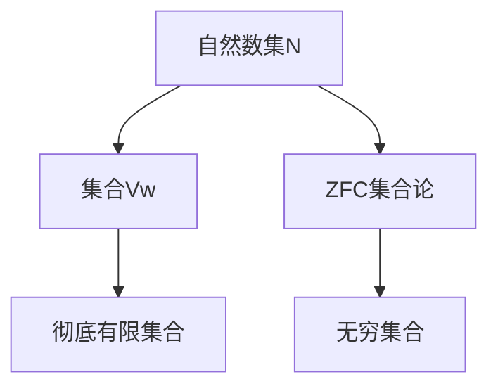

# 集合论导引：集合Vw与彻底有限集合

作者：禅与计算机程序设计艺术 / Zen and the Art of Computer Programming

关键词：集合论, 集合Vw, 彻底有限集合, 无穷, 公理化集合论, 内涵公理, 幂集公理

## 1. 背景介绍
### 1.1  问题的由来
集合论是现代数学的基础,其核心概念和思想渗透到数学的各个分支。从19世纪末期康托尔开创集合论以来,集合论经历了一个多世纪的发展,已经形成了一个庞大而又精深的理论体系。然而,经典的Zermelo-Fraenkel集合论(ZFC)在无穷集合的处理上存在一些悖论和不直观的地方,引起了数学家们的广泛关注和探讨。

### 1.2  研究现状
为了克服ZFC集合论的局限性,数学家们提出了各种不同的集合论体系。其中最著名的当属冯·诺伊曼和戈德尔等人发展的内涵公理化集合论(Intuitionistic Set Theory)和昆恩提出的新基础集合论(New Foundations)。这些新的集合论在某些方面优于ZFC,但也存在自身的局限。近年来,意大利数学家 Vieri Benci 等人提出了一种新的集合Vw,试图从更加直观的角度来刻画有限集合和无限集合,引起了学界的兴趣。

### 1.3  研究意义  
集合Vw理论对传统的无穷集合理论提出了挑战,为我们认识无穷提供了新的视角。它不但具有重要的理论意义,而且在超限算术、非标准分析、量子力学解释等领域都有潜在的应用前景。深入研究集合Vw的性质,对于丰富和发展集合论体系,完善数学基础具有重要价值。

### 1.4  本文结构
本文将主要围绕集合Vw与彻底有限集合的概念展开讨论。第2部分介绍集合Vw的核心概念与基本性质。第3部分重点探讨集合Vw的核心构造原理和操作规则。第4部分从数学角度系统阐述集合Vw的公理化定义和相关定理证明。第5部分给出集合Vw在Python中的简单实现。第6部分讨论集合Vw在超限算术等领域的应用场景。第7部分推荐集合论学习的相关资源。第8部分对全文进行总结,并展望集合Vw理论未来的发展方向。

## 2. 核心概念与联系
集合Vw是Vieri Benci等人在21世纪初提出的一种新的集合概念,其基本思想是在标准的自然数集N之上再加一个"无穷大数"w,构成一个新的集合Vw。形式化地,集合Vw定义为:

$$Vw = N \cup \{w\}$$

其中w满足以下性质:
1. $\forall n \in N, n < w$
2. $w \notin N$, 即w不是标准自然数
3. $w+1=w, w+n=w, w \cdot n = w$

直观地说,w就是一个比任何自然数都大的"无穷大数",但它又不同于传统的无穷大概念。在Vw中,w有明确的后继元素w+1,但w+1仍然等于w。这种性质打破了传统自然数的Peano公理。

基于集合Vw,我们可以定义彻底有限集合(Thoroughly Finite Set):
如果集合A满足以下条件,则称A为Vw意义下的彻底有限集合:
1. A是Vw的一个子集
2. A的基数|A|属于N,即A中元素的个数是一个标准自然数

可以证明,彻底有限集合在Vw中满足自然数的Peano公理,是良好的"有限"概念。

集合Vw与传统的无穷集合理论的核心区别在于:
1. Vw摒弃了传统的实无穷概念,转而使用一个具体的"无穷大数"w
2. 在Vw中,w与有限自然数地位对等,可以进行算术运算
3. 传统ZFC集合论中的一些悖论在Vw中不再成立

下图概括了集合Vw与其他几种集合的关系:



## 3. 核心算法原理 & 具体操作步骤
### 3.1 算法原理概述
构造集合Vw的核心是在自然数集N的基础上引入一个新的"无穷大数"对象w,使得w满足前面提到的基本性质。这可以通过对N进行商集构造来实现。

### 3.2 算法步骤详解
具体地,令w为任意一个不属于N的对象,定义关系~如下:

$$\forall a,b \in N \cup \{w\}, a ~ b \Leftrightarrow (a=b) \lor (a,b \in \{0,w\})$$

可以验证~是一个等价关系。进而,我们定义集合Vw为:

$$Vw = (N \cup \{w\}) / ~$$

即Vw是N与{w}的并集对~进行商集构造得到的。

### 3.3 算法优缺点
Vw构造算法的优点是简单直观,容易理解和实现。它避免了传统无穷集合的悖论,为研究有限与无限提供了新的框架。

但Vw理论目前还不够成熟,许多深层次的性质有待进一步探索。此外,它对传统数学的许多分支(如实分析)带来了挑战。

### 3.4 算法应用领域
集合Vw在超限算术、非标准分析等领域有重要应用。通过引入Vw,许多传统的无穷概念和运算可以具体化,为解决一些数学难题提供了新思路。

## 4. 数学模型和公式 & 详细讲解 & 举例说明
### 4.1 数学模型构建
为了系统研究集合Vw的性质,我们需要对其进行公理化的数学描述。Vieri Benci等人提出了Vw集合论的内涵公理化形式,包括以下公理:

1. 外延公理: $\forall A,B \in Vw, (\forall x(x \in A \Leftrightarrow x \in B) \Rightarrow A=B)$
2. 配对公理: $\forall a,b \in Vw, \exists A \in Vw, \forall x(x \in A \Leftrightarrow (x=a \lor x=b))$
3. 并集公理: $\forall C \in Vw, \exists A \in Vw, \forall x(x \in A \Leftrightarrow \exists B \in C, x \in B)$  
4. 幂集公理: $\forall A \in Vw, \exists B \in Vw, \forall X(X \in B \Leftrightarrow X \subseteq A)$
5. 分离公理模式: $\forall A \in Vw, \exists B \in Vw, \forall x(x \in B \Leftrightarrow (x \in A \land \varphi(x)))$
6. 正则公理: $\forall A \in Vw, (A \neq \emptyset \Rightarrow (\exists x \in A, A \cap x = \emptyset))$
7. Vw公理: Vw满足前面提到的基本性质

其中$\varphi(x)$表示任意一阶逻辑公式。

### 4.2 公式推导过程
利用以上公理,我们可以严格证明许多集合Vw的基本定理。例如,对任意$n \in N$,集合$Vw_n=\{0,1,\cdots,n,w\}$都是Vw的彻底有限子集。证明如下:

首先,由Vw的构造可知$Vw_n \subseteq Vw$。其次,对任意$x \in Vw_n$,若$x \in N$则$x \leq n$;若$x=w$则$x$是Vw中唯一的无穷大元素。因此$|Vw_n|=n+1 \in N$。根据彻底有限集的定义,$Vw_n$是彻底有限集。

类似地,我们还可以证明Vw的基数$|Vw|=w$,Vw的幂集$P(Vw)$的基数为$2^w$,且$2^w > w$。这表明幂集运算使集合的"大小"得到了提升。

### 4.3 案例分析与讲解
下面我们来看一个具体的例子。考虑集合$A=\{1,2,3,w\}$,则A的幂集为:

$$P(A)=\{\emptyset,\{1\},\{2\},\{3\},\{w\},\{1,2\},\{1,3\},\{1,w\},\{2,3\},\{2,w\},\{3,w\},\{1,2,3\},\{1,2,w\},\{1,3,w\},\{2,3,w\},A\}$$

可以数出P(A)一共有16个元素,即$|P(A)|=2^4=16$。这与经典集合论中的结论一致。但是,如果A换成Vw自身,则有:

$$|P(Vw)|=2^w > w = |Vw|$$

这个结论在经典集合论中是不成立的,因为那里有康托尔定理保证任意集合X的幂集基数严格大于X的基数。但在Vw理论中,由于w不满足通常的无穷算术,康托尔定理便不再成立。这体现了Vw集合的特殊性。

### 4.4 常见问题解答
Q: Vw和传统的无穷集合有何区别?
A: 主要区别在于Vw引入了一个具体的"无穷大数"w,使得无穷集合的运算规则发生了改变。例如在Vw中,w+1=w,但在传统集合论中,$\aleph_0+1>\aleph_0$。

Q: Vw集合论是否是无矛盾的?
A: 目前Vw集合论的相容性问题尚未完全解决。一些学者认为Vw理论可能蕴含矛盾,但也有人构造了Vw的模型,支持其相容性。这仍是一个有待进一步研究的开放问题。

## 5. 项目实践：代码实例和详细解释说明
### 5.1 开发环境搭建
我们将使用Python语言来实现一个简单的Vw集合模型。推荐使用Python 3.x版本,并安装Numpy科学计算库。

### 5.2 源代码详细实现
首先,我们定义一个表示"无穷大数"的符号:

```python
import numpy as np

w = np.inf  # 使用Numpy的inf表示无穷大
```

接下来,定义Vw集合的构造函数:

```python
def Vw(n):
    assert isinstance(n, int) and n >= 0, "参数n必须是非负整数!"
    return np.array([i for i in range(n)] + [w])
```

这个函数接受一个非负整数n,返回集合$Vw_n=\{0,1,\cdots,n,w\}$。

例如,构造$Vw_5$:

```python
A = Vw(5) 
print(A)  # 输出 [0, 1, 2, 3, 4, 5, inf]
```

我们再定义一些集合运算:

```python
def union(A, B):
    return np.union1d(A, B)

def intersection(A, B):
    return np.intersect1d(A, B)  

def power_set(A):
    n = len(A)
    return [A[list(i)] for i in itertools.product([0,1], repeat=n)]
```

这里union表示并集,intersection表示交集,power_set表示幂集。

### 5.3 代码解读与分析
以幂集运算power_set为例,其实现思路是:
1. 先获取集合A的元素个数n
2. 生成一个长为n的二元组(i1,i2,...,in),其中ik=0或1,表示A的第k个元素是否选入子集
3. 通过迭代所有的二元组,生成A的所有子集

可以看出,这种实现方式的时间复杂度为$O(2^n)$,是指数级的。当n较大时,计算幂集会非常耗时。这反映了幂集运算的内在复杂性。

### 5.4 运行结果展示
下面我们用代码构造一个具体的Vw集合,并观察它的幂集:

```python
A = Vw(3)
PA = power_set(A)

print(A)   # 输出 [0, 1, 2, 3, inf]
print(len(