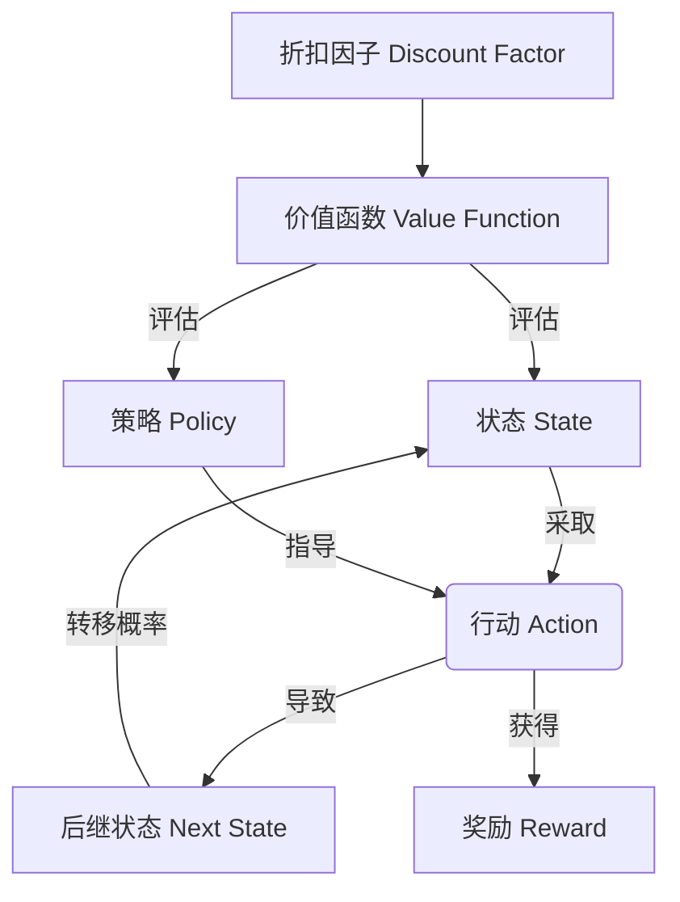

# 马尔可夫决策过程 (Markov Decision Process)

## 1. 背景介绍

### 1.1 问题的由来

在日常生活和工作中,我们经常会面临一系列相互关联的决策问题。比如,我们需要决定何时购买机票、如何投资理财、何时进行设备维修等。这些决策不仅会影响当前的收益或成本,还会影响未来的状态和后续决策。传统的优化方法通常难以解决这类动态决策问题,因为它们无法充分考虑决策的长期影响和不确定性。

马尔可夫决策过程(Markov Decision Process, MDP)作为一种强大的数学框架,为解决这类序列决策问题提供了理论基础和求解方法。MDP将决策过程建模为一系列状态、行动和奖励的交互,旨在找到一个最优策略,使得在满足约束条件的情况下,获得最大的累积奖励。

### 1.2 研究现状

马尔可夫决策过程理论源于20世纪50年代,最早应用于运筹学和控制论领域。随着计算能力的提高和算法的改进,MDP在近几十年得到了广泛的研究和应用,涉及机器人控制、自然语言处理、游戏AI、资源管理等诸多领域。

目前,MDP的研究主要集中在以下几个方面:

1. **算法改进**:提出更高效、更稳定的求解算法,如基于策略迭代的算法、蒙特卡罗树搜索等。
2. **模型扩展**:研究部分可观测MDP、分层MDP等扩展模型,以适应更复杂的决策场景。
3. **理论分析**:深入探讨MDP的收敛性、最优性、鲁棒性等理论问题。
4. **应用拓展**:将MDP应用到新的领域,如智能交通、医疗决策、能源管理等。

### 1.3 研究意义

马尔可夫决策过程具有重要的理论意义和应用价值:

1. **理论基础**:MDP为序列决策问题提供了统一的数学框架,奠定了强化学习等领域的理论基础。
2. **最优决策**:MDP旨在找到最优策略,使决策者在满足约束条件下获得最大累积收益。
3. **不确定性建模**:MDP能够有效地建模和处理状态转移和奖励的不确定性。
4. **广泛应用**:MDP已被广泛应用于机器人控制、自然语言处理、游戏AI等诸多领域。

### 1.4 本文结构

本文将全面介绍马尔可夫决策过程的核心概念、算法原理、数学模型、实际应用等内容。文章结构安排如下:

- 第2章介绍MDP的核心概念,如状态、行动、策略、奖励等,并阐述它们之间的联系。
- 第3章详细讲解MDP的核心算法原理和具体操作步骤,包括价值迭代、策略迭代等经典算法。
- 第4章构建MDP的数学模型,推导相关公式,并通过案例分析加深理解。
- 第5章提供MDP的代码实现示例,并对关键代码段进行解释说明。
- 第6章介绍MDP在机器人控制、自然语言处理等领域的实际应用场景。
- 第7章推荐MDP的学习资源、开发工具和相关论文,以供读者进一步学习和研究。
- 第8章总结MDP的研究成果,展望未来发展趋势和面临的挑战。
- 第9章列出MDP常见问题及解答,帮助读者解决疑惑。

## 2. 核心概念与联系

马尔可夫决策过程(Markov Decision Process, MDP)是一种用于建模序列决策问题的数学框架。它由以下核心概念组成:

1. **状态 (State)**: 描述系统在某个时间点的状况。状态通常用一个向量表示,包含系统的各种特征信息。

2. **行动 (Action)**: 决策者在当前状态下可以采取的操作。不同的行动会导致系统进入不同的后继状态。

3. **转移概率 (Transition Probability)**: 表示在采取某个行动后,系统从当前状态转移到下一个状态的概率。转移概率反映了系统的动态特性和不确定性。

4. **奖励 (Reward)**: 决策者在采取某个行动并进入新状态时获得的即时回报。奖励可以是正值(收益)或负值(惩罚)。

5. **策略 (Policy)**: 一个映射函数,定义了决策者在每个状态下应该采取何种行动。策略是MDP求解的最终目标。

6. **折扣因子 (Discount Factor)**: 一个介于0和1之间的系数,用于平衡当前奖励和未来奖励的重要性。折扣因子越小,表示越关注当前奖励。

7. **价值函数 (Value Function)**: 评估一个状态的好坏,或者评估在某个状态下遵循某个策略所能获得的累积奖励的期望值。

这些概念之间存在紧密的联系,如下图所示:

状态、行动、转移概率和奖励共同定义了MDP的环境动态。决策者根据当前策略在每个状态下选择行动,并获得对应的奖励。价值函数评估每个状态的好坏,或者评估遵循某个策略所能获得的累积奖励。折扣因子控制当前奖励和未来奖励的权重。

MDP的目标是找到一个最优策略,使得在满足约束条件下,获得最大的累积奖励。这个过程需要通过特定的算法来实现,例如价值迭代、策略迭代等。

## 3. 核心算法原理 & 具体操作步骤

### 3.1 算法原理概述

马尔可夫决策过程的核心算法旨在找到一个最优策略,使得在满足约束条件下,获得最大的累积奖励。主要算法包括价值迭代(Value Iteration)和策略迭代(Policy Iteration)。

**价值迭代算法**的核心思想是,通过不断更新每个状态的价值函数,逐步逼近最优价值函数,从而得到最优策略。该算法基于贝尔曼最优方程(Bellman Optimality Equation)进行迭代计算。

**策略迭代算法**则采用两阶段迭代的方式:首先评估当前策略,得到其价值函数;然后对当前策略进行改进,得到一个更好的策略。重复这个过程,直到策略收敛为最优策略。

这两种算法虽然思路不同,但都能够最终收敛到最优策略。它们的优缺点和适用场景也有所区别,需要根据具体问题进行选择和调整。

### 3.2 算法步骤详解

#### 3.2.1 价值迭代算法

价值迭代算法的步骤如下:

1. 初始化价值函数 $V(s)$ ,对于所有状态 $s$ 赋予任意值。
2. 对于每个状态 $s$ ,计算其最优行动值函数 $Q(s,a)$:

$$Q(s,a) = R(s,a) + \gamma \sum_{s'}P(s'|s,a)V(s')$$

其中, $R(s,a)$ 是在状态 $s$ 采取行动 $a$ 获得的即时奖励, $P(s'|s,a)$ 是从状态 $s$ 采取行动 $a$ 转移到状态 $s'$ 的概率, $\gamma$ 是折扣因子, $V(s')$ 是状态 $s'$ 的价值函数。

3. 更新状态 $s$ 的价值函数:

$$V(s) = \max_a Q(s,a)$$

4. 重复步骤2和3,直到价值函数收敛或达到最大迭代次数。
5. 从最终的价值函数中提取最优策略 $\pi^*(s)$:

$$\pi^*(s) = \arg\max_a Q(s,a)$$

#### 3.2.2 策略迭代算法

策略迭代算法的步骤如下:

1. 初始化一个随机策略 $\pi_0$。
2. 对于当前策略 $\pi_k$, 计算其价值函数 $V^{\pi_k}(s)$:

$$V^{\pi_k}(s) = \sum_{a}\pi_k(s,a)\left(R(s,a) + \gamma\sum_{s'}P(s'|s,a)V^{\pi_k}(s')\right)$$

3. 对于每个状态 $s$, 计算其最优行动值函数 $Q^{\pi_k}(s,a)$:

$$Q^{\pi_k}(s,a) = R(s,a) + \gamma\sum_{s'}P(s'|s,a)V^{\pi_k}(s')$$

4. 构建一个新的改进策略 $\pi_{k+1}$:

$$\pi_{k+1}(s) = \arg\max_a Q^{\pi_k}(s,a)$$

5. 如果 $\pi_{k+1} = \pi_k$, 则算法收敛,得到最优策略 $\pi^* = \pi_k$; 否则,令 $k = k+1$, 返回步骤2继续迭代。

### 3.3 算法优缺点

价值迭代和策略迭代算法各有优缺点:

**价值迭代算法**:
- 优点:实现简单,只需要维护一个价值函数。
- 缺点:收敛速度较慢,尤其是在状态空间和行动空间较大的情况下。

**策略迭代算法**:
- 优点:收敛速度较快,每次迭代都会得到一个改进的策略。
- 缺点:需要维护策略和价值函数,计算开销较大。

在实际应用中,通常会根据问题的特点选择合适的算法,或者结合两种算法的优点设计混合算法。例如,可以先使用价值迭代算法快速得到一个较好的初始策略,然后再使用策略迭代算法加速收敛。

### 3.4 算法应用领域

马尔可夫决策过程及其求解算法在许多领域都有广泛的应用:

1. **机器人控制**: 在机器人导航、机械臂控制等场景中,MDP可以用于规划最优路径和动作序列。
2. **自然语言处理**: MDP可以建模对话系统的决策过程,用于选择最佳的响应策略。
3. **游戏AI**: MDP广泛应用于棋类游戏、视频游戏等领域,用于寻找最优的游戏策略。
4. **资源管理**: MDP可以优化资源分配和调度,如网络资源管理、能源管理等。
5. **机器学习**: MDP是强化学习的理论基础,在许多强化学习算法中都有应用。
6. **金融决策**: MDP可以用于投资组合优化、期权定价等金融决策问题。
7. **医疗决策**: MDP可以帮助医生制定最优的诊断和治疗方案。

总的来说,只要涉及序列决策、存在不确定性、需要权衡当前和未来收益的问题,都可以尝试使用马尔可夫决策过程及其算法进行建模和求解。

## 4. 数学模型和公式 & 详细讲解 & 举例说明

### 4.1 数学模型构建

马尔可夫决策过程(MDP)可以用一个五元组 $\langle\mathcal{S}, \mathcal{A}, P, R, \gamma\rangle$ 来形式化描述:

- $\mathcal{S}$ 是状态集合,表示系统可能处于的所有状态。
- $\mathcal{A}$ 是行动集合,表示决策者在每个状态下可以采取的行动。
- $P(s'|s,a)$ 是状态转移概率,表示在状态 $s$ 采取行动 $a$ 后,转移到状态 $s'$ 的概率。
- $R(s,a)$ 是奖励函数,表示在状态 $s$ 采取行动 $a$ 后获得的即时奖励。
- $\gamma \in [0,1)$ 是折扣因子,用于平衡当前奖励和未来奖励的