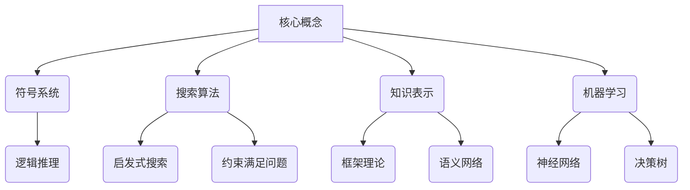

# 麦卡锡与明斯基的研究计划

## 1. 背景介绍

### 1.1 问题的由来

在计算机科学的早期发展阶段,人工智能(AI)的概念开始逐渐形成。作为计算机科学的一个分支,人工智能旨在创建能够模拟人类智能行为的机器系统。然而,在20世纪上半叶,人工智能的研究还处于起步阶段,缺乏系统性的理论基础和技术支撑。

1955年,约翰·麦卡锡(John McCarthy)和马文·明斯基(Marvin Minsky)在达特茅斯学院召开了一次著名的研讨会,这次会议被认为是人工智能领域的里程碑事件。在这次会议上,麦卡锡首次正式提出了"人工智能"(Artificial Intelligence)这个术语,并阐述了人工智能的基本概念和研究目标。

### 1.2 研究现状

在达特茅斯会议之前,已经有一些学者对智能系统的构建进行了初步探索。例如,阿兰·图灵(Alan Turing)在1950年提出了著名的"图灵测试",旨在评估机器是否具有智能。克劳德·香农(Claude Shannon)则在1950年发表了关于程序化棋类游戏的论文,为机器智能奠定了基础。

然而,这些早期的工作大多局限于特定领域,缺乏系统性和整体性。达特茅斯会议的召开,标志着人工智能作为一个独立的研究领域正式形成,为后续的理论发展和技术创新奠定了基础。

### 1.3 研究意义

麦卡锡和明斯基的研究计划对于人工智能领域的发展具有重大意义:

1. **确立了人工智能的研究范畴和目标**。他们将人工智能定义为"让机器做出智能行为的科学与工程",明确了人工智能旨在创建能够模拟人类智能的机器系统。

2. **提出了人工智能的核心理论和技术路线**。他们认为,通过将人类智能行为形式化为符号系统和算法,并在计算机上实现,就可以实现人工智能。这为后续的符号主义人工智能理论奠定了基础。

3. **激发了学术界和产业界对人工智能的广泛兴趣**。达特茅斯会议吸引了来自多个学科的学者参与,引发了对人工智能的热烈讨论和研究热潮。

4. **推动了相关技术的发展和应用**。人工智能的理论和技术在许多领域得到了应用,如机器学习、自然语言处理、机器人技术等,促进了这些领域的快速发展。

### 1.4 本文结构

本文将全面介绍麦卡锡和明斯基的研究计划,包括其背景、核心理论、算法原理、数学模型、实践应用等方面。文章结构如下:

1. 背景介绍
2. 核心概念与联系
3. 核心算法原理与具体操作步骤
4. 数学模型和公式详细讲解与举例说明
5. 项目实践:代码实例和详细解释说明
6. 实际应用场景
7. 工具和资源推荐
8. 总结:未来发展趋势与挑战
9. 附录:常见问题与解答

## 2. 核心概念与联系

麦卡锡和明斯基的研究计划提出了一些核心概念,为后续的人工智能理论和技术发展奠定了基础。这些概念之间存在着密切的联系,构成了一个系统性的理论框架。

1. **符号系统(Symbolic Systems)**:麦卡锡和明斯基认为,智能行为可以被表示为符号操作的过程。他们提出了将智能问题形式化为符号系统的思路,并在计算机上实现符号操作,从而模拟人类智能。这为后续的逻辑推理技术奠定了基础。

2. **搜索算法(Search Algorithms)**:在符号系统中,解决问题的关键在于搜索合适的符号操作序列。因此,搜索算法成为人工智能研究的核心内容之一,包括启发式搜索、约束满足问题等。

3. **知识表示(Knowledge Representation)**:为了在计算机上实现智能行为,需要将人类的知识以某种形式表示出来,以供计算机理解和操作。知识表示技术包括框架理论、语义网络等。

4. **机器学习(Machine Learning)**:除了依赖人工编写的符号系统和知识库,人工智能系统还需要具备自主学习的能力,以适应动态变化的环境。机器学习技术如神经网络、决策树等,为实现这一目标提供了重要手段。

这些核心概念相互关联、相辅相成,共同构建了人工智能的理论基础和技术体系。符号系统、搜索算法、知识表示和机器学习等概念贯穿于人工智能的各个领域和应用中,对后续的理论发展和技术创新产生了深远影响。

## 3. 核心算法原理与具体操作步骤

### 3.1 算法原理概述

在麦卡锡和明斯基的研究计划中,搜索算法是解决人工智能问题的核心手段。搜索算法的基本思路是在一个符号系统中,通过有目标地探索符号操作序列,寻找能够解决给定问题的解。

搜索算法的工作原理可以概括为以下几个步骤:

1. **问题表示**:将待解决的问题形式化为一个符号系统,包括初始状态、目标状态和一组可执行的符号操作。

2. **状态空间构建**:根据初始状态和可执行的符号操作,构建一个状态空间,表示所有可能的状态及其转移关系。

3. **搜索策略**:设计合适的搜索策略,在状态空间中有目标地探索,寻找能够从初始状态到达目标状态的符号操作序列。

4. **路径评估**:对于每一条可能的解路径,评估其质量或代价,以便选择最优解。

5. **解的输出**:当找到满足条件的解路径时,将其输出为问题的解决方案。

不同的搜索算法在具体实现上会有所区别,但它们都遵循这一基本原理。下面将介绍两种典型的搜索算法:启发式搜索和约束满足问题求解。

### 3.2 算法步骤详解

#### 3.2.1 启发式搜索算法

启发式搜索算法是一种常用的搜索策略,它利用启发函数(heuristic function)来估计当前状态到目标状态的距离,从而指导搜索过程朝着更有希望的方向前进。

启发式搜索算法的基本步骤如下:

1. **初始化**:定义问题的初始状态、目标状态和可执行的符号操作。

2. **构建状态空间**:根据初始状态和可执行操作,构建状态空间图。

3. **选择启发函数**:设计一个合适的启发函数,用于评估每个状态到目标状态的估计距离。

4. **初始化优先队列**:将初始状态及其估计距离加入优先队列。

5. **循环搜索**:
   a. 从优先队列中取出估计距离最小的状态。
   b. 如果该状态是目标状态,则返回解路径。
   c. 否则,对该状态进行扩展,生成所有可能的后继状态。
   d. 对每个后继状态计算估计距离,并加入优先队列。
   e. 回到步骤a,继续搜索。

6. **输出解**:如果找到目标状态,则按照路径回溯输出解决方案;否则,报告无解。

常见的启发式搜索算法包括A*算法、IDA*算法、贪心最佳优先搜索等。它们的区别主要在于启发函数的设计和估计距离的计算方式。

#### 3.2.2 约束满足问题求解算法

约束满足问题(Constraint Satisfaction Problem, CSP)是一类常见的人工智能问题,其目标是找到一组变量的赋值,使得所有约束条件都得到满足。约束满足问题求解算法就是专门用于解决这类问题的搜索算法。

约束满足问题求解算法的基本步骤如下:

1. **问题建模**:将约束满足问题形式化为一个CSP模型,包括变量集合、每个变量的取值域,以及约束条件集合。

2. **选择变量顺序**:确定变量实例化的顺序,通常采用最小剩余值(Minimum Remaining Values)或最大约束度(Maximum Constraint Degree)等启发式策略。

3. **实例化变量**:按照选定的顺序,逐个实例化变量,并进行约束传播(Constraint Propagation),剪枝不满足约束的取值。

4. **回溯搜索**:
   a. 如果所有变量都已实例化且满足所有约束,则返回解。
   b. 如果存在无法实例化的变量(取值域为空),则回溯到上一个变量,尝试其他取值。
   c. 否则,继续实例化下一个变量。

5. **输出解**:如果找到满足所有约束的变量赋值,则输出该解;否则,报告无解。

常见的约束满足问题求解算法包括回溯搜索算法、前向检查算法、约束传播算法等。它们的区别在于约束检查和剪枝策略的不同。

### 3.3 算法优缺点

#### 3.3.1 启发式搜索算法

**优点**:

- 通过启发函数的引导,能够有效减小搜索空间,提高搜索效率。
- 算法具有通用性,可以应用于各种搜索问题。
- 算法具有可解释性,搜索过程和结果都可以被解释和理解。

**缺点**:

- 启发函数的设计对算法的性能有很大影响,需要针对不同问题进行调优。
- 对于大规模的搜索问题,算法可能会遇到空间和时间上的瓶颈。
- 算法无法处理动态变化的问题,需要在变化发生时重新搜索。

#### 3.3.2 约束满足问题求解算法

**优点**:

- 能够有效地解决各种约束满足问题,具有广泛的应用场景。
- 通过约束传播和剪枝策略,可以显著减小搜索空间。
- 算法具有可解释性,求解过程和结果都可以被解释和理解。

**缺点**:

- 对于高度约束的问题,算法可能会遇到组合爆炸的问题,导致效率低下。
- 算法的性能heavily依赖于变量选择策略和值选择策略,需要针对不同问题进行调优。
- 对于动态变化的约束条件,算法需要重新求解,无法在线适应变化。

### 3.4 算法应用领域

搜索算法在人工智能的多个领域都有广泛的应用,包括但不限于以下几个方面:

1. **规划与决策**:在自动规划、决策支持系统等领域,搜索算法被用于寻找最优的行动序列或决策方案。

2. **游戏与博弈**:在国际象棋、围棋等游戏中,搜索算法被用于评估局面并选择最佳走法。

3. **组合优化**:在工程优化、资源调度等领域,搜索算法可以用于求解各种组合优化问题。

4. **推理与诊断**:在专家系统、故障诊断等领域,搜索算法被用于进行逻辑推理和原因分析。

5. **机器人技术**:在机器人路径规划、运动控制等领域,搜索算法被用于寻找最优的运动轨迹。

6. **自然语言处理**:在语言理解、机器翻译等领域,搜索算法可以用于寻找最佳的语义解析和生成方案。

总的来说,搜索算法为解决各种人工智能问题提供了有力的工具,是人工智能系统的