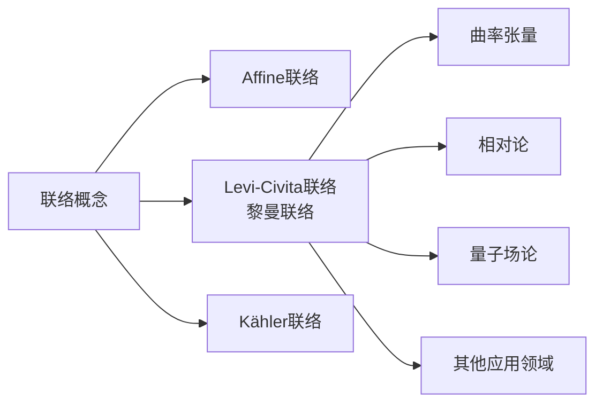

# 黎曼几何引论：联络和黎曼联络

## 1. 背景介绍

### 1.1 问题的由来

在探索物理世界的奥秘时,我们经常会遇到各种几何形式。从牛顿经典力学中研究物体在欧几里得空间中的运动,到爱因斯坦相对论揭示了时空的曲率性质,再到当代理论物理学家试图构建一个统一的理论来描述所有的基本相互作用,几何学一直扮演着重要的角色。

在这个过程中,黎曼(Riemann)几何成为了一个关键的数学工具。它不仅为相对论奠定了基础,也为其他许多领域提供了强有力的建模方法,如引力理论、量子场论、弦理论等。黎曼几何的核心概念之一就是"联络"(Connection),它描述了在曲面上平移向量的方式,是研究曲面上的平行输运和曲率的基础。

### 1.2 研究现状

黎曼几何的发展可以追溯到19世纪,当时黎曼提出了著名的"黎曼曲面"概念,并为非欧几何奠定了基础。20世纪初,黎曼的学生们如Christoffel、Ricci和Levi-Civita等人进一步发展了联络和黎曼曲率张量的理论。

爱因斯坦在构建广义相对论时,利用了黎曼几何来描述时空的曲率,从而揭示了引力与时空弯曲之间的内在联系。此后,黎曼几何在理论物理学中扮演着越来越重要的角色,例如在量子场论、弦理论和其他统一场论的研究中。

同时,黎曼几何也在数学和其他应用领域获得了广泛的应用,如计算机图形学、计算机视觉、机器人学、材料科学等。随着计算能力的提高,人们能够更精确地模拟和可视化各种几何对象和过程。

### 1.3 研究意义

深入理解联络和黎曼联络对于把握现代物理学和数学的核心概念至关重要。它不仅是相对论的数学基础,也为探索更基本的理论(如量子引力)提供了有力的工具。

此外,黎曼几何在许多应用领域也发挥着重要作用,如计算机图形学、计算机视觉、机器人学等。通过对曲面和流形的精确建模,我们能够更好地模拟和理解现实世界中的各种几何过程。

因此,掌握联络和黎曼联络的概念及其在各个领域的应用,对于拓展我们对自然界规律的认识,以及推动相关技术的发展,都具有重要意义。

### 1.4 本文结构  

本文将从黎曼几何的基本概念出发,逐步深入探讨联络和黎曼联络的本质,并阐述它们在物理学和其他领域的应用。

文章首先介绍联络的基本概念,包括它的几何意义和在流形上的定义。接下来重点阐述黎曼联络,揭示它与曲率张量之间的内在联系,并讨论它在相对论中的应用。

此后,文章将详细解释联络和黎曼联络的数学模型,推导相关公式,并通过具体案例加以说明。同时,也会介绍一些实际应用场景,如计算机图形学、机器人学等。

最后,文章将总结联络和黎曼联络的研究现状,展望未来的发展趋势和面临的挑战,并给出常见问题的解答。

## 2. 核心概念与联系

联络(Connection)和黎曼联络(Riemann Connection)是黎曼几何的核心概念,它们描述了在曲面或流形上平移向量的方式,是研究曲率等几何性质的基础。

联络的本质是定义了在流形上平移向量场的规则,使得在平移过程中,向量的大小和方向都能够保持不变。这种平移过程被称为"平行移动"或"平行输运"。

联络可以看作是将切向量从一点平移到相邻点的"运输规则"。在欧几里得空间中,这种运输规则是平凡的,即只需要保持向量的大小和方向不变。但在一般的曲面或流形上,由于存在曲率,向量在平移过程中需要作出相应的调整,以保持其与曲面的"平行"关系。

联络的数学定义是在流形的切丛上引入一个线性微分算子,满足一定的条件。根据引入的额外结构的不同,可以得到不同类型的联络,如:

1. **Affine联络**: 最一般的联络形式,不加任何额外条件。
2. **Levi-Civita联络(黎曼联络)**: 在Affine联络的基础上,加入了无扭曲和度规保持的条件,使得联络具有对称性和保持度量不变性。这种联络也被称为"黎曼联络"。
3. **Kähler联络**: 在复流形上定义的一种特殊联络,保持了Hermite度量。

其中,黎曼联络是最重要和最常用的一种联络形式。它不仅是研究曲面和流形几何性质的关键工具,也是相对论等现代物理理论的数学基础。

联络与曲率张量存在内在的联系。曲率张量描述了在平移过程中,向量发生的"扭曲"或"变形"程度。当曲率张量为零时,联络就是平凡的,向量在平移过程中保持不变;而非零曲率意味着存在曲率,向量需要作出调整。因此,曲率张量可以通过联络来刻画和计算。

总的来说,联络概念为我们提供了一种在曲面和流形上研究几何性质的强有力工具,而黎曼联络则是最常用和最重要的一种特殊形式,在相对论、量子场论等领域发挥着关键作用。

## 3. 核心算法原理 & 具体操作步骤

### 3.1 算法原理概述

联络和黎曼联络的核心算法原理是定义了在流形上平移向量场的规则,使得在平移过程中,向量的大小和方向都能够保持不变。这种平移过程被称为"平行移动"或"平行输运"。

具体来说,联络通过在流形的切丛上引入一个线性微分算子来实现这一目标。这个微分算子满足一定的条件,根据引入的额外结构的不同,可以得到不同类型的联络。

其中,黎曼联络(Levi-Civita联络)是最常用和最重要的一种联络形式。它在Affine联络的基础上,加入了无扭曲和度规保持的条件,使得联络具有对称性和保持度量不变性。

黎曼联络的算法原理可以概括为以下三个步骤:

1. **定义切向量场的导数**: 在流形上定义切向量场的导数,即平移切向量场时的变化率。
2. **引入无扭曲条件**: 要求切向量场的导数满足无扭曲条件,即导数的对换关系只与度规张量有关。
3. **保持度规不变性**: 要求切向量场的导数保持度规张量不变,即平移过程中,向量的长度保持不变。

通过这三个步骤,我们就可以唯一地确定黎曼联络的表达式,并用它来研究流形的几何性质,如曲率等。

### 3.2 算法步骤详解

现在,我们来详细解释黎曼联络算法的具体步骤。

#### 步骤1: 定义切向量场的导数

设$M$是一个流形,$TM$是其切丛。对于任意切向量场$X,Y \in \Gamma(TM)$,我们定义它们的导数为:

$$\nabla_X Y = X(Y^i)\frac{\partial}{\partial x^i} + Y^i\frac{\partial X^j}{\partial x^i}\frac{\partial}{\partial x^j}$$

其中,$x^i$是流形$M$上的局部坐标,而$Y^i$和$X^i$分别是向量场$Y$和$X$在该坐标系下的分量。

这个导数的定义看似复杂,但它描述了切向量场$Y$沿着$X$方向的变化率。第一项$X(Y^i)\frac{\partial}{\partial x^i}$表示$Y$在$X$方向上的方向导数,而第二项$Y^i\frac{\partial X^j}{\partial x^i}\frac{\partial}{\partial x^j}$则描述了$Y$在平移过程中的变形。

#### 步骤2: 引入无扭曲条件

我们要求导数算子$\nabla$满足无扭曲条件,即对于任意的向量场$X,Y,Z \in \Gamma(TM)$,有:

$$\nabla_X(Y+Z) = \nabla_X Y + \nabla_X Z$$
$$\nabla_X(fY) = X(f)Y + f\nabla_X Y$$
$$\nabla_X Y - \nabla_Y X - [X,Y] = 0$$

其中,$f$是流形上的光滑函数,$[X,Y]$表示$X$和$Y$的李括号(Lie Bracket)。

这些条件保证了导数算子是一个线性微分算子,并且满足张量场的变换规则。最后一个条件被称为"无扭曲条件",它要求导数算子的对换关系只与向量场的李括号有关,而与具体的表示无关。

#### 步骤3: 保持度规不变性

最后,我们要求导数算子$\nabla$保持流形上的度规张量$g$不变,即对于任意向量场$X,Y \in \Gamma(TM)$,有:

$$X(g(Y,Z)) = g(\nabla_X Y, Z) + g(Y, \nabla_X Z)$$

这个条件保证了在平移过程中,向量的长度保持不变。

通过上述三个步骤,我们就可以唯一地确定黎曼联络的表达式。具体来说,黎曼联络可以写成:

$$\nabla_X Y = X(Y^i)\frac{\partial}{\partial x^i} + Y^j\frac{\partial X^i}{\partial x^j}\frac{\partial}{\partial x^i} + \Gamma^i_{jk}X^jY^k\frac{\partial}{\partial x^i}$$

其中,$\Gamma^i_{jk}$是黎曼联络系数,它可以由度规张量$g$唯一确定:

$$\Gamma^i_{jk} = \frac{1}{2}g^{il}(g_{lj,k} + g_{lk,j} - g_{jk,l})$$

这里,$g_{jk}$是度规张量$g$在局部坐标系下的分量,$g^{jk}$是其逆矩阵,而$g_{jk,l}$表示$g_{jk}$关于$x^l$的偏导数。

通过上述算法步骤,我们就可以计算出黎曼联络,并将其应用于研究流形的几何性质,如曲率等。

### 3.3 算法优缺点

黎曼联络算法的主要优点如下:

1. **唯一性**: 通过引入无扭曲和度规保持条件,黎曼联络在给定流形和度规张量时是唯一确定的。这为研究流形几何性质提供了坚实的基础。

2. **保持度量性质**: 黎曼联络保证了在平移过程中,向量的长度保持不变。这一性质对于许多应用领域(如相对论)是至关重要的。

3. **对称性**: 黎曼联络系数$\Gamma^i_{jk}$是对称的,即$\Gamma^i_{jk} = \Gamma^i_{kj}$。这种对称性简化了计算,并与物理定律的对称性相吻合。

4. **协变性**: 黎曼联络在不同坐标系下的表达式具有协变性,这意味着它是一个真正的几何对象,而不依赖于特定的坐标选择。

然而,黎曼联络算法也存在一些缺点和局限性:

1. **计算复杂度**: 尽管算法原理简单,但在实际计算中,求解黎曼联络系数往往是一个非常复杂的过程,尤其是在高维流形上。

2. **局部性**: 黎曼联络是在局部坐标系下定义的