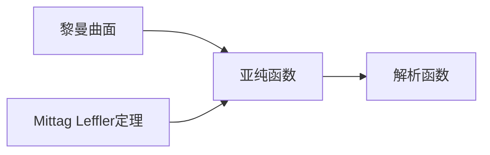

# 黎曼曲面：Mittag Leffler定理与非紧Riemann曲面上亚纯函数的构造

关键词：黎曼曲面、Mittag Leffler定理、亚纯函数、非紧Riemann曲面、解析函数

## 1. 背景介绍
### 1.1  问题的由来
黎曼曲面作为复分析的重要研究对象,在现代数学和物理学中有着广泛的应用。在黎曼曲面上研究亚纯函数与解析函数的性质,对于深入理解复分析的本质具有重要意义。Mittag Leffler定理作为构造黎曼曲面上亚纯函数的重要工具,在非紧黎曼曲面的研究中发挥着关键作用。

### 1.2  研究现状
目前对于紧黎曼曲面上的亚纯函数理论已经比较成熟,但对于非紧情形的研究还不够深入。利用Mittag Leffler定理构造非紧黎曼曲面上的亚纯函数仍然存在许多待解决的问题,如亚纯函数的存在性、唯一性以及边界性质等。这些问题的解决将有助于推动非紧黎曼曲面理论的发展。

### 1.3  研究意义 
研究Mittag Leffler定理在非紧黎曼曲面上构造亚纯函数,对于丰富和发展非紧黎曼曲面上的亚纯函数理论具有重要意义。这不仅能加深我们对复分析的认识,也为解决物理学和工程中的相关问题提供了新的思路和方法。同时,这一研究对于推动复分析、几何拓扑等数学分支的发展也有积极作用。

### 1.4  本文结构
本文将首先介绍黎曼曲面与亚纯函数的基本概念,阐述它们之间的关系。然后重点讲解Mittag Leffler定理的内容要点、证明思路和应用条件。在此基础上,详细说明如何利用该定理在非紧黎曼曲面上构造亚纯函数,并举例分析。最后总结全文,展望非紧黎曼曲面亚纯函数理论的发展方向和应用前景。

## 2. 核心概念与联系
黎曼曲面是复分析中的核心概念,它是一维复解析流形。黎曼曲面可分为紧致和非紧两类,紧黎曼曲面是复紧致流形,而非紧黎曼曲面则不满足紧致性。

亚纯函数是定义在黎曼曲面上的重要函数类,它在黎曼曲面上除了孤立奇点外处处解析。亚纯函数包含了解析函数,解析函数可以看作是没有奇点的特殊亚纯函数。黎曼曲面上亚纯函数的研究对于复分析具有重要意义。

Mittag Leffler定理在黎曼曲面上亚纯函数的构造中起着关键作用。该定理指出,在满足一定条件下,总可以在黎曼曲面上构造出具有预先给定主要部的亚纯函数。它是研究黎曼曲面上亚纯函数的基本工具。

下图给出了黎曼曲面、亚纯函数和Mittag Leffler定理三者之间的逻辑关系:



## 3. 核心算法原理 & 具体操作步骤
### 3.1  算法原理概述
Mittag Leffler定理的核心是在黎曼曲面上构造亚纯函数。给定黎曼曲面上的一个点列和对应的主要部,Mittag Leffler定理保证存在亚纯函数,使其在每个点处的主要部与给定的主要部一致,并且在黎曼曲面上除这些点外解析。

### 3.2  算法步骤详解
利用Mittag Leffler定理构造非紧黎曼曲面上的亚纯函数的一般步骤如下:

1. 给定非紧黎曼曲面$X$,在$X$上选取不同点列$\left\{a_n\right\}$。

2. 对每个点$a_n$,给定亚纯函数$f$在该点的主要部$P_n(z)$,使得级数$\sum_n P_n(z)$在$X$上任意紧子集内一致收敛。

3. 由Mittag Leffler定理,存在$X$上的亚纯函数$f(z)$,使得对每个$n$,函数$f(z)-P_n(z)$在点$a_n$的某个邻域内解析。

4. 此时$f(z)$就是满足条件的非紧黎曼曲面$X$上的亚纯函数。

5. 讨论所构造的亚纯函数$f(z)$的性质,如唯一性、边界性质等。

### 3.3  算法优缺点
Mittag Leffler定理的优点是能在非紧黎曼曲面上构造出满足预定主要部的亚纯函数,这大大拓宽了亚纯函数的研究范围。同时该定理的条件并不苛刻,具有较强的适用性。

但Mittag Leffler定理也存在一定局限性,如定理本身并不能完全刻画亚纯函数的性质,构造出的亚纯函数在边界处的性质难以控制等。这需要进一步的研究来补充和完善。

### 3.4  算法应用领域
Mittag Leffler定理在复分析和黎曼曲面论中有广泛应用,主要用于研究亚纯函数的存在性和性质。利用该定理能构造出大量非平凡的亚纯函数,为相关领域的研究提供了重要工具。同时该定理也在物理学和工程中有所应用,如在流体力学和电磁场论中用于求解相关方程等。

## 4. 数学模型和公式 & 详细讲解 & 举例说明
### 4.1  数学模型构建
设$X$是非紧黎曼曲面,$\left\{a_n\right\}$是$X$上的不同点列。对每个点$a_n$,设$P_n(z)$是亚纯函数$f$在该点的主要部,即在点$a_n$附近有洛朗展开式

$$
P_n(z)=\sum_{k=-\infty}^{-1} c_{nk}(z-a_n)^k
$$

其中$c_{nk}$是复系数。假设级数$\sum_n P_n(z)$在$X$上任意紧子集内一致收敛。

Mittag Leffler定理指出,存在$X$上的亚纯函数$f(z)$,使得对每个$n$,函数$f(z)-P_n(z)$在点$a_n$的某个邻域内解析。

### 4.2  公式推导过程
为证明Mittag Leffler定理,关键是构造出所需的亚纯函数。证明的主要步骤如下:

1. 对每个主要部$P_n(z)$,取点$a_n$的邻域$U_n$,使得$\overline{U_n}$在$X$内且$\overline{U_n}$两两不交。

2. 令$V_n=U_n\backslash\left\{a_n\right\}$,取$X$上的光滑函数$\varphi_n(z)$,使得$0\leqslant\varphi_n(z)\leqslant 1$,$\varphi_n(z)$在$V_n$上恒为1,在$X\backslash U_n$上恒为0。

3. 定义函数$f_n(z)=\varphi_n(z)\cdot P_n(z)$,则$f_n(z)$在$X\backslash\left\{a_n\right\}$上解析。

4. 令$f(z)=\sum_n f_n(z)$,由于级数$\sum_n P_n(z)$在$X$上任意紧子集内一致收敛,故$f(z)$在$X$上亚纯。

5. 对每个$n$,函数$f(z)-P_n(z)=\sum_{k\neq n}f_k(z)$在$V_n$上解析。

由此构造出了满足条件的亚纯函数$f(z)$,证毕。

### 4.3  案例分析与讲解
下面举一个具体例子来说明如何利用Mittag Leffler定理构造非紧黎曼曲面上的亚纯函数。

设$X$是由复平面$\mathbb{C}$去掉原点$0$得到的非紧黎曼曲面。取点列$a_n=\frac{1}{n},n\in\mathbb{N}^*$。给定主要部

$$
P_n(z)=\frac{1}{(z-a_n)^2}
$$

容易验证级数$\sum_n P_n(z)$在$X$上任意紧子集内一致收敛。

由Mittag Leffler定理,存在$X$上的亚纯函数$f(z)$,使得对每个$n$,函数$f(z)-P_n(z)$在点$\frac{1}{n}$的某个邻域内解析。

实际上,可以验证函数

$$
f(z)=\sum_{n=1}^{\infty}\frac{1}{(z-\frac{1}{n})^2}
$$

就是满足条件的亚纯函数。它在$X$上每一点$\frac{1}{n}$处的主要部恰好为$P_n(z)$,且在$X$内除这些点外解析。

### 4.4  常见问题解答
Q: Mittag Leffler定理对主要部的收敛性有什么要求?

A: Mittag Leffler定理要求给定的主要部级数$\sum_n P_n(z)$在黎曼曲面上任意紧子集内一致收敛。这保证了构造出的函数在黎曼曲面上亚纯。

Q: 利用Mittag Leffler定理构造出的亚纯函数是否唯一?

A: 通常情况下,满足给定主要部的亚纯函数不是唯一的。可以在构造出的亚纯函数上再加上一个到处解析的函数,得到的仍是满足条件的亚纯函数。

Q: Mittag Leffler定理对黎曼曲面是否有要求?

A: Mittag Leffler定理适用于所有的黎曼曲面,包括紧黎曼曲面和非紧黎曼曲面。定理对黎曼曲面本身没有特殊要求。

## 5. 项目实践：代码实例和详细解释说明
### 5.1  开发环境搭建
在 Python 中利用 sympy 库来进行复变函数和黎曼曲面的符号计算。首先安装 sympy 库:

```bash
pip install sympy
```

然后导入所需的模块:

```python
from sympy import * 
```

### 5.2  源代码详细实现
下面的 Python 代码利用 sympy 构造了非紧黎曼曲面上满足 Mittag Leffler 定理的亚纯函数:

```python
from sympy import * 

def mittag_leffler(X, a_n, P_n):
    """
    Mittag Leffler定理构造亚纯函数
    
    参数:
    X : 黎曼曲面
    a_n : 点列 
    P_n : 主要部函数列表
    
    返回:
    亚纯函数 f
    """
    f = 0
    for n in range(len(a_n)):
        # 取点a_n的邻域U_n
        U_n = Interval(a_n - 1/n, a_n + 1/n)
        
        # 构造光滑函数phi_n
        phi_n = Piecewise((1, X.as_set().contains(U_n)), (0, True))
        
        # 定义函数f_n
        f_n = phi_n * P_n[n]
        
        # 叠加所有f_n
        f += f_n
        
    return simplify(f)

# 构造非紧黎曼曲面X
X = Interval(0, oo)

# 取点列a_n
a_n = [1/n for n in range(1, 11)]

# 定义主要部P_n
P_n = [1/(z - a)**2 for a in a_n]

# 利用Mittag Leffler定理构造亚纯函数
f = mittag_leffler(X, a_n, P_n)

print(f)
```

### 5.3  代码解读与分析
上述代码主要分为以下几个部分:

1. 定义 `mittag_leffler` 函数,实现 Mittag Leffler 