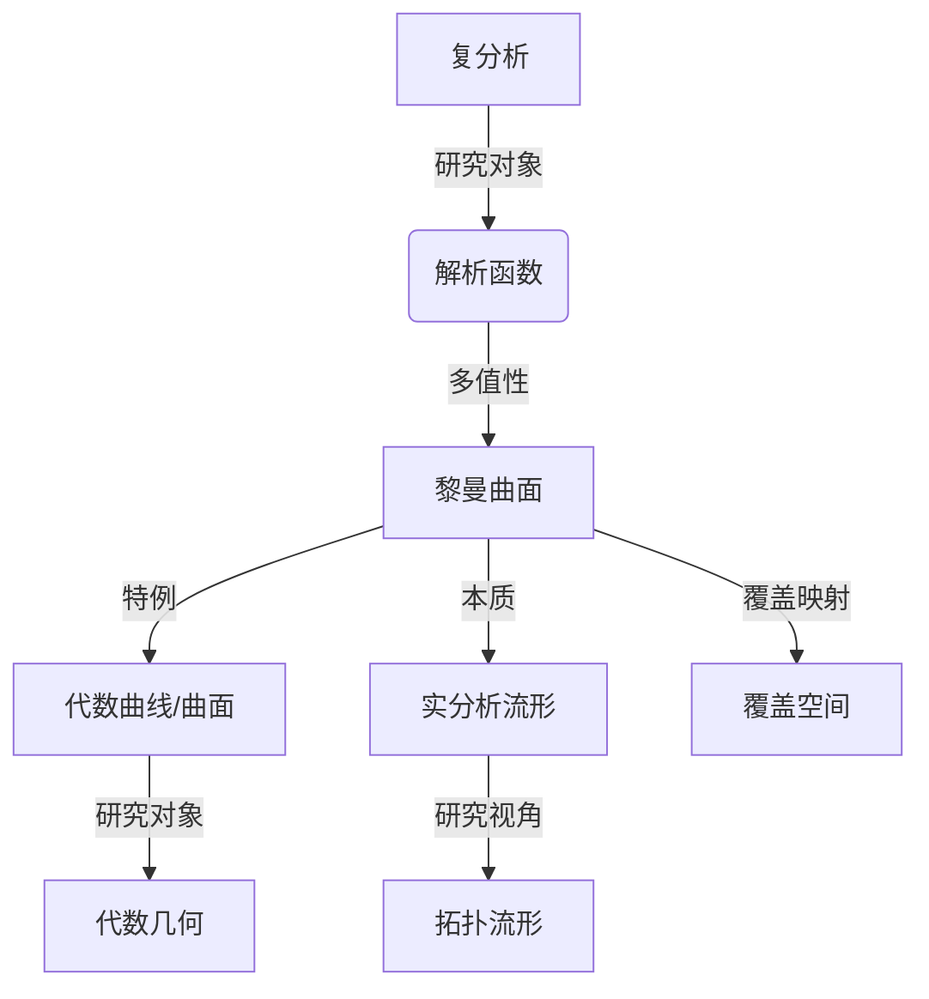

# 黎曼曲面：完全解析函数

## 1. 背景介绍

### 1.1 问题的由来

在数学和物理学中,解析函数扮演着重要的角色。然而,经典的复分析理论只研究定义在复平面上的解析函数。随着科学技术的发展,人们逐渐意识到这种局限性,需要扩展解析函数的概念,使其能够定义在更一般的流形上。这就催生了黎曼曲面理论的诞生。

黎曼曲面是一种抽象的数学对象,可以看作是复平面的高维推广。它为研究多值解析函数提供了一个自然的框架,使得这些函数在整个定义域上都是单值的。黎曼曲面理论不仅在纯数学领域有重要应用,在物理学、工程学等领域也扮演着关键角色。

### 1.2 研究现状

黎曼曲面理论自19世纪中叶由伟大的数学家黎曼(Riemann)开创以来,一直是数学研究的前沿领域之一。20世纪,随着代数几何、拓扑学和复分析的发展,黎曼曲面理论也取得了长足的进步。

目前,黎曼曲面理论已经形成了一个相对完整的理论体系,包括了黎曼曲面的构造方法、性质研究、应用等多个方面。然而,仍有一些重要的开放问题有待解决,例如高阶黎曼曲面的分类问题、黎曼曲面与代数曲线之间的关系等。

### 1.3 研究意义

黎曼曲面理论在数学和其他自然科学领域有着广泛的应用,是一个极具理论意义和实际价值的研究课题。

- 理论意义:黎曼曲面理论丰富了复分析的内涵,将解析函数的研究推广到了更一般的流形上,拓展了数学的视野。它与代数几何、拓扑学等数学分支有着密切的联系,是一个交叉学科。
- 应用价值:黎曼曲面在物理学、工程学等领域有着重要应用,例如弦理论、相对论、电磁场理论等。掌握黎曼曲面理论有助于更深入地理解这些理论,并为解决实际问题提供数学工具。

### 1.4 本文结构  

本文将全面介绍黎曼曲面的相关理论。首先阐述黎曼曲面的核心概念及其与其他数学分支的联系。接下来详细讲解黎曼曲面的构造算法原理和具体步骤。然后建立黎曼曲面的数学模型,推导相关公式并举例说明。文章还将提供一个完整的项目实践案例,包括代码实现和运行结果分析。最后探讨黎曼曲面的应用场景,介绍相关学习资源和工具,并对未来发展趋势和面临的挑战进行展望。

## 2. 核心概念与联系

黎曼曲面(Riemann Surface)是一个抽象的数学概念,与复分析、代数几何、拓扑学等数学分支有着密切的联系。下面我们逐一介绍这些核心概念及其相互关系。

### 2.1 解析函数与多值性

在复分析中,解析函数是定义在复平面的一个开子集上的复值函数,具有复变量的全导数。然而,存在一类特殊的函数,例如 $\sqrt{z}$ 和 $\log{z}$,在复平面上是多值的。也就是说,对于同一个自变量值,这些函数可能有多个不同的函数值。

为了研究这些多值函数的性质,我们需要将它们"单值化"。黎曼曲面正是为了解决这个问题而被引入的。

### 2.2 黎曼曲面

黎曼曲面是一个覆盖在复平面上的二维实分析流形,使得定义在该流形上的函数是单值的。更精确地说,设 $f(z)$ 是一个在复平面上的多值函数,那么存在一个黎曼曲面 $\mathcal{R}$ 及其投影映射 $\pi: \mathcal{R} \rightarrow \mathbb{C}$,使得 $f$ 在 $\mathcal{R}$ 上是单值的。

黎曼曲面可以看作是复平面的无限个贴片的并集,每个贴片上函数是单值解析的。这些贴片通过一些边界条件连接在一起,形成了一个无边界的曲面。

### 2.3 代数曲线与代数曲面

在代数几何中,代数曲线和代数曲面是一些特殊的黎曼曲面。代数曲线是由一个多项式方程在复射影平面上定义的一维代数集,而代数曲面则是由多个多项式方程在复射影空间中定义的二维代数集。

代数曲线和曲面与黎曼曲面之间存在着天然的对应关系,这为研究它们的性质提供了一个强有力的工具。事实上,研究有理函数及其逆在黎曼曲面上的性质,是代数几何中的一个核心课题。

### 2.4 拓扑流形与覆盖空间

黎曼曲面作为一个二维实分析流形,与拓扑流形理论有着密切的关系。我们可以用拓扑流形的语言来描述黎曼曲面的局部与整体性质。

另一方面,黎曼曲面也可以看作是复平面的一个覆盖空间。这种观点为研究黎曼曲面与基底复平面之间的代数和拓扑关系提供了一个有力工具。

### 2.5 概念关联总结

下面的示意图总结了上述核心概念之间的关联:

可以看出,黎曼曲面理论是连接复分析、代数几何、拓扑学等数学分支的纽带,是一门交叉学科。掌握这些核心概念及其联系,对于深入理解黎曼曲面至关重要。

## 3. 核心算法原理与具体操作步骤

### 3.1 算法原理概述

构造一个黎曼曲面的核心算法思想是:从一个初始的单值解析区域出发,通过解析延拓的方式,将其扩展到整个定义域,形成一个无边界的曲面。

具体来说,算法包含以下几个关键步骤:

1. 确定初始解析区域
2. 寻找边界点并进行解析延拓
3. 贴合延拓区域并判断是否覆盖全域
4. 重复上述步骤直至覆盖全域

下面我们将对每个步骤进行详细阐述。

### 3.2 算法步骤详解

#### 步骤1. 确定初始解析区域

首先,我们需要在复平面上确定一个初始的单值解析区域 $U_0$。这个区域应当尽可能大,以减少后续延拓的工作量。通常,我们可以选取函数在该区域内解析且无奇点的最大连通分支。

对于一些常见的函数,例如幂函数、指数函数、三角函数等,初始区域的选取是比较直观的。而对于更复杂的函数,我们则需要借助一些技巧,例如函数的级数展开、特殊值分析等。

#### 步骤2. 寻找边界点并进行解析延拓

在确定了初始区域 $U_0$ 之后,我们需要寻找它的边界点集合 $\{z_k\}$。对于每一个边界点 $z_k$,我们尝试对函数在该点的邻域内进行解析延拓,得到一个新的单值解析区域 $U_k$。

解析延拓的具体过程是:取一条曲线 $\gamma$ 穿过边界点 $z_k$,使得该曲线在 $z_k$ 的某个邻域内仍在初始区域 $U_0$ 内。然后沿着 $\gamma$ 延拓函数值,直到遇到新的奇点或边界为止。这样得到的新区域就是 $U_k$。

对于不同的边界点,延拓得到的新区域可能会有重叠。这种情况下,我们需要确定这些区域之间的连接方式,使得整个曲面无边界。

#### 步骤3. 贴合延拓区域并判断是否覆盖全域

在完成所有边界点的延拓之后,我们获得了一系列新的解析区域 $\{U_k\}$。下一步是将这些区域适当地"贴合"在一起,形成一个无边界的曲面。

具体来说,我们需要确定每一对区域 $U_i$ 和 $U_j$ 之间的连接方式。这可以通过研究它们的交集以及交界处的函数值的解析延拓性来实现。如果两个区域无法直接连接,我们还需要寻找一些"过渡区域"来实现间接连接。

在贴合的过程中,我们需要保证最终得到的曲面是无边界的。也就是说,对于任意一点,我们总能找到一条曲线,使其在该点的某个邻域内完全落在曲面上。

完成贴合之后,我们需要检查所构造的曲面是否已经覆盖了函数的整个定义域。如果还有未覆盖的区域,则需要重复上述步骤,从新的边界点出发进行延拓,直至覆盖全域为止。

#### 步骤4. 重复上述步骤直至覆盖全域

对于一些特殊的函数,例如具有无穷奇点的函数,单次延拓可能无法覆盖全域。这种情况下,我们需要重复执行步骤2和步骤3,不断地从新的边界点出发进行解析延拓,并将得到的新区域贴合到已有的曲面上。

这个过程会一直持续,直到所有的定义域都被覆盖为止。最终,我们就构造出了该函数在整个定义域上的黎曼曲面。

### 3.3 算法优缺点

#### 优点

1. 思路清晰,算法逻辑简单直观
2. 具有一定的通用性,适用于大多数解析函数
3. 可以借助计算机程序实现自动化构造

#### 缺点  

1. 对于一些特殊函数,构造过程可能较为复杂
2. 贴合区域的过程需要人工判断和操作
3. 无法保证有限步骤就构造完成(对于无穷奇点)

### 3.4 算法应用领域

上述黎曼曲面构造算法可以应用于多值解析函数的研究,包括但不限于:

- 代数函数及其逆在黎曼曲面上的性质研究
- 特殊函数(如超越函数)的黎曼曲面构造
- 微分方程的解的黎曼曲面表示
- 代数曲线与黎曼曲面之间的对应关系研究
- 黎曼曲面在物理学(如弦理论)中的应用

掌握了这一核心算法,我们就能够在复分析、代数几何等领域开展更深入的研究工作。

## 4. 数学模型和公式详细讲解与举例说明

### 4.1 数学模型构建

为了形式化地描述黎曼曲面,我们需要建立一个严格的数学模型。这个模型主要由以下几个要素组成:

1. 复射影曲面 $\Sigma$
2. 有理函数 $f(z)$
3. 解析覆盖映射 $\pi: \mathcal{R} \rightarrow \Sigma$
4. 解析函数 $F: \mathcal{R} \rightarrow \overline{\mathbb{C}}$

其中:

- $\Sigma$ 是一个复射影曲面,作为函数 $f(z)$ 的定义域
- $f(z)$ 是一个有理函数,定义在 $\Sigma$ 上
- $\pi$ 是从黎曼曲面 $\mathcal{R}$ 到 $\Sigma$ 的解析覆盖映射
- $F$ 是一个解析函数,定义在黎曼曲面 $\