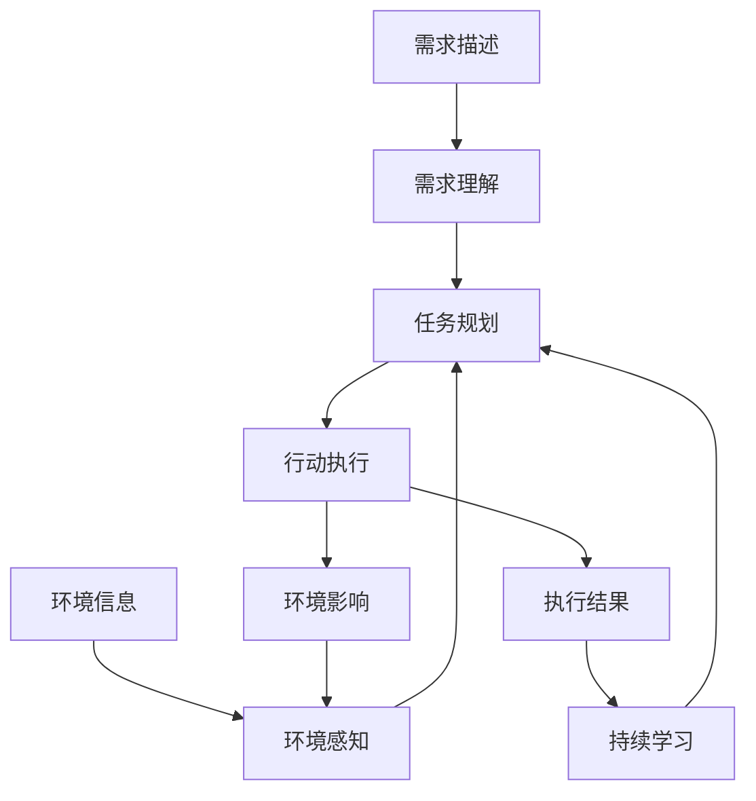

# AI Agent: AI的下一个风口 AutoGPT：通过自然语言的需求描述执行自动化任务

## 1. 背景介绍
### 1.1 问题的由来
人工智能(Artificial Intelligence, AI)技术的迅猛发展，正在深刻改变着我们的生活和工作方式。从智能语音助手、自动驾驶汽车，到智能推荐系统和自动化办公，AI应用无处不在。然而，目前大多数AI系统仍然是针对特定任务设计和训练的，缺乏通用性和自主性。如何让AI系统能够像人一样，根据自然语言描述的需求，自主地完成各种任务，是AI领域亟待解决的重要问题。

### 1.2 研究现状
近年来，AI领域涌现出一批代表性的通用人工智能(Artificial General Intelligence, AGI)研究项目，如OpenAI的GPT系列语言模型[1]、DeepMind的AlphaFold蛋白质结构预测系统[2]等。这些系统展现出了惊人的通用智能，在多个领域取得了超越人类的成就。然而，它们大多还是基于特定任务的训练，缺乏执行复杂任务的能力。最近，AutoGPT[3]的出现，为解决这一问题带来了新的思路。

### 1.3 研究意义
AutoGPT作为一种全新的AI Agent框架，让AI系统能够根据自然语言描述的需求，自主规划和执行任务，有望成为未来AGI的关键技术之一。一方面，AutoGPT将大大提升AI系统的适用范围和易用性，使非专业用户也能便捷地使用AI的力量。另一方面，AutoGPT也为AI安全和伦理研究提供了新的视角，如何保证自主AI系统的行为安全和可控，是一个亟待研究的重要课题。

### 1.4 本文结构
本文将围绕AutoGPT技术展开深入探讨。第2部分介绍AutoGPT的核心概念和工作原理。第3部分重点阐述AutoGPT的核心算法。第4部分从数学角度对AutoGPT的建模和优化进行分析。第5部分通过代码实例，演示AutoGPT的实现和应用。第6部分讨论AutoGPT在实际场景中的应用前景。第7部分推荐AutoGPT相关的学习资源和工具。第8部分对AutoGPT的研究进行总结，并展望其未来发展方向。

## 2. 核心概念与联系
AutoGPT的核心理念是:赋予AI系统以自主完成复杂任务的能力。传统的AI系统通常是为特定任务设计和训练的，如图像分类、语音识别等，它们只能被动地响应输入，执行预定的计算，而无法主动分析和求解问题。AutoGPT则致力于创造一种通用的AI Agent，能够像人一样，根据自然语言描述的需求，自主地感知环境、规划任务、采取行动。

具体而言，AutoGPT主要包含以下几个核心组件和概念:

- 需求理解(Requirement Understanding):通过自然语言处理技术，理解用户输入的需求描述，提取关键信息，构建任务表示。 
- 环境感知(Environment Perception):通过多模态感知技术，如计算机视觉、语音识别等，感知和理解当前的任务环境，获取必要的上下文信息。
- 任务规划(Task Planning):根据需求理解和环境感知的结果，自主地分解任务目标，制定多步骤的执行计划。
- 行动执行(Action Execution):根据任务规划产生的行动序列，调用相应的执行器(Actuator)，如语言生成、代码编写、API调用等，完成具体的行动。
- 持续学习(Continual Learning):在执行任务的过程中，不断地收集反馈信息，优化自身的策略和知识，实现持续学习和自我完善。

下图展示了AutoGPT的系统架构和核心组件之间的关系:

AutoGPT的工作流程如下:首先，用户通过自然语言输入任务需求描述，AutoGPT对其进行理解和结构化表示。同时，AutoGPT通过多模态感知获取当前的环境信息。然后，AutoGPT结合需求理解和环境感知的结果，进行任务规划，生成一系列的行动序列。接着，AutoGPT执行规划好的行动，并将执行结果返回给用户。在执行过程中，行动可能会对环境产生影响，进而影响后续的环境感知。最后，AutoGPT根据执行结果，优化自身的策略和知识，实现持续学习。

## 3. 核心算法原理 & 具体操作步骤
### 3.1 算法原理概述
AutoGPT的核心算法可以概括为:基于强化学习的自主任务规划和执行。具体而言，AutoGPT将任务规划和执行看作一个序贯决策过程(Sequential Decision Process)，通过强化学习(Reinforcement Learning, RL)的方法，让AI Agent学习最优的决策策略。

在AutoGPT中，任务规划被建模为一个部分可观察马尔可夫决策过程(Partially Observable Markov Decision Process, POMDP)[4]。POMDP是一种用于描述序贯决策问题的数学框架，它包含以下几个核心要素:

- 状态(State):表示Agent所处的环境状态，包括需求描述、已执行的行动、环境感知信息等。
- 行动(Action):表示Agent可以采取的行动，如生成语言、编写代码、调用API等。
- 观察(Observation):表示Agent能够观察到的信息，通常是状态的一个子集。
- 转移概率(Transition Probability):表示在某个状态下采取某个行动后，环境转移到另一个状态的概率。
- 奖励(Reward):表示Agent采取某个行动后，环境给予的即时奖励值。
- 折扣因子(Discount Factor):表示未来奖励相对于当前奖励的重要程度。

AutoGPT的目标是学习一个最优策略(Optimal Policy)，使得Agent能够根据当前的状态和观察，选择最优的行动，从而最大化累积奖励。这可以通过多种RL算法来实现，如Q-Learning、策略梯度(Policy Gradient)、Actor-Critic等。

### 3.2 算法步骤详解
以下是AutoGPT的核心算法步骤:

1. 初始化 Agent 的策略网络和价值网络，分别用于生成行动和估计状态价值。
2. 获取用户输入的需求描述，进行自然语言理解，提取关键信息，构建初始状态表示 $s_0$。
3. 设置最大步数 $T$，开始迭代:
   
   for $t=0$ to $T-1$ do:
   - 根据当前状态 $s_t$，使用策略网络生成一个行动 $a_t$。
   - 执行行动 $a_t$，获得即时奖励 $r_t$ 和新的状态 $s_{t+1}$。
   - 将 $(s_t, a_t, r_t, s_{t+1})$ 添加到经验回放缓冲区(Experience Replay Buffer)中。
   - 从缓冲区中随机采样一批经验数据，使用价值网络计算每个状态的估计值。
   - 根据 Bellman 方程，计算每个状态-行动对的期望Q值:
     $$Q(s_t,a_t) = r_t + \gamma \max_{a'} Q(s_{t+1},a')$$
     其中 $\gamma$ 为折扣因子。
   - 使用估计的Q值和实际Q值之间的差异，构造损失函数，通过梯度下降算法更新策略网络和价值网络的参数。
   - 将当前状态更新为 $s_t \leftarrow s_{t+1}$。

4. 输出规划得到的最优行动序列 $\{a_0, a_1, ..., a_{T-1}\}$。

### 3.3 算法优缺点
AutoGPT算法的主要优点包括:

- 通用性强:AutoGPT可以应用于各种类型的任务，不限于特定领域。
- 自主性强:AutoGPT能够根据需求自主规划和执行任务，不需要人工干预。
- 可扩展性好:AutoGPT可以方便地集成各种感知、规划、执行模块，灵活应对不同需求。

同时，AutoGPT算法也存在一些局限性:

- 样本效率低:RL算法通常需要大量的交互数据才能学习到良好的策略，样本效率较低。
- 探索问题:在复杂的任务环境中，Agent可能难以探索到最优路径，容易陷入局部最优。
- 安全性问题:自主的Agent可能产生一些不可控的行为，需要加强约束和监管机制。

### 3.4 算法应用领域
AutoGPT算法可以应用于多个领域，包括但不限于:

- 智能办公:自动完成文档撰写、信息检索、日程安排等办公任务。
- 智能客服:自动理解客户问题，提供智能问答和任务处理。  
- 智能家居:根据用户需求，自动控制家电设备，提供个性化服务。
- 自动编程:根据需求描述，自动编写代码，生成软件应用。

## 4. 数学模型和公式 & 详细讲解 & 举例说明
### 4.1 数学模型构建
将AutoGPT的任务规划和执行过程建模为一个POMDP，形式化定义如下:

- 状态空间 $\mathcal{S}$:所有可能的环境状态的集合。
- 行动空间 $\mathcal{A}$:Agent可以采取的所有行动的集合。
- 观察空间 $\mathcal{O}$:Agent可以观察到的所有信息的集合。
- 转移函数 $\mathcal{T}: \mathcal{S} \times \mathcal{A} \to \Delta(\mathcal{S})$:定义状态之间的转移概率。
- 奖励函数 $\mathcal{R}: \mathcal{S} \times \mathcal{A} \to \mathbb{R}$:定义每个状态-行动对的即时奖励值。
- 观察函数 $\mathcal{Z}: \mathcal{S} \times \mathcal{A} \to \Delta(\mathcal{O})$:定义每个状态-行动对产生观察的概率。
- 折扣因子 $\gamma \in [0,1]$:定义未来奖励的折扣系数。

其中，$\Delta(\cdot)$ 表示一个集合上的概率分布。

AutoGPT的目标是学习一个最优策略 $\pi^*: \mathcal{O} \to \mathcal{A}$，使得期望累积奖励最大化:

$$\pi^* = \arg\max_{\pi} \mathbb{E}\left[\sum_{t=0}^{\infty} \gamma^t r_t | \pi \right]$$

其中，$r_t$ 表示在时间步 $t$ 获得的即时奖励。

### 4.2 公式推导过程
为了求解最优策略 $\pi^*$，定义状态-行动值函数 $Q^\pi(s,a)$，表示在状态 $s$ 下采取行动 $a$，并在之后都遵循策略 $\pi$ 的情况下，期望获得的累积奖励:

$$Q^\pi(s,a) = \mathbb{E}\left[\sum_{t=0}^{\infty} \gamma^t r_t | s_0=s, a_0=a, \pi \right]$$

根据Bellman方程，最优值函数 $Q^*(s,a)$ 满足:

$$Q^*(s,a) = \mathcal{R}(s,a) + \gamma \sum_{s' \in \mathcal{S}} \mathcal{T}(s'|s,a) \max_{a'} Q^*(s',a')$$

即在状态 $s$ 下采取行动 $a$ 的最优Q值等于即时奖励加上下一状态的最大Q值的折扣和。

最优策略 $\pi^*$ 可以通过最优值函数 $Q^*$ 得到:

$$\pi^*(s) = \arg\max_{a} Q^*(s,a)$$

即在每个状态下选择Q值最大的行动。

在实际应用中，由于状态空间和行动空间可能很大，Q值函数通常用函数逼近的方法来表示，如深度神经网络。令 $Q_\theta(