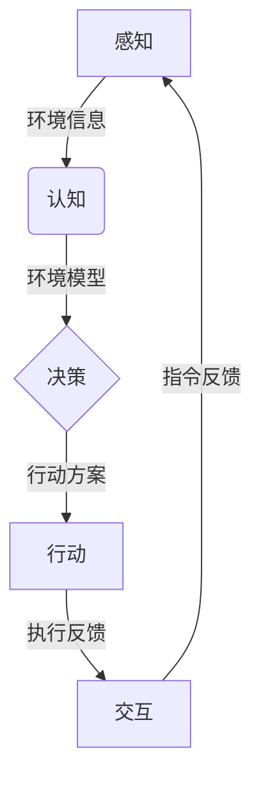

好的,我会严格按照要求,以"AI Agent: AI的下一个风口 具身机器人在工业领域的应用"为主题,写一篇专业的技术博客文章。

# AI Agent: AI的下一个风口 具身机器人在工业领域的应用

## 1. 背景介绍

### 1.1 问题的由来

随着人工智能(AI)技术的不断发展,机器人技术也在快速进步。传统的工业机器人主要用于重复性的操作任务,如装配、焊接等,但它们缺乏灵活性和智能化。而具身机器人(Embodied AI Agents)正在成为AI技术的一个新的应用前沿,有望彻底改变工业生产方式。

具身机器人是将人工智能技术与机器人硬件相结合,赋予机器人感知环境、做出决策和执行行动的能力。它们可以在复杂的工业环境中自主导航、操作和完成各种任务,大大提高了生产的灵活性和效率。

### 1.2 研究现状  

目前,具身机器人技术仍处于初级阶段,主要应用于一些特定的场景,如物流配送、检测维修等。但随着人工智能算法的进步,特别是深度学习、强化学习等技术的发展,具身机器人的能力将得到极大增强。

一些科技公司和研究机构已经开始探索具身机器人在工业领域的应用前景。例如,波士顿动力公司开发了可以在复杂环境中行走的Atlas机器人;伯克利人工智能研究中心(BAIR)则专注于开发可以执行物体操作任务的机器人系统。

### 1.3 研究意义

将具身机器人应用于工业生产具有重大意义:

1. 提高生产效率和质量:具身机器人可以自主完成复杂的操作任务,减少人工干预,提高生产效率和一致性。

2. 降低生产成本:机器人可以在恶劣环境下工作,减少人力成本,也可避免人员伤害。

3. 增强生产灵活性:具身机器人可快速适应新产品和新工艺,缩短产品上市时间。

4. 推动制造业智能化转型:具身机器人是实现智能制造的关键技术之一。

### 1.4 本文结构

本文将全面介绍具身机器人在工业领域的应用。首先阐述核心概念和技术原理,然后详细解释关键算法和数学模型,并通过代码示例展示具体实现。接下来探讨实际应用场景、挑战和发展趋势,最后给出相关工具和学习资源的推荐。

## 2. 核心概念与联系

具身机器人技术涉及多个领域的知识,包括机器人硬件、计算机视觉、自然语言处理、决策规划、控制等。其核心概念主要有:

1. **感知**:通过传感器获取环境信息,如视觉、深度、触觉等。
2. **认知**:基于感知信息,对环境进行理解和建模。
3. **决策**:根据认知结果,规划和选择行动方案。
4. **行动**:通过机械执行器实施决策的行动方案。
5. **交互**:与人或其他智能体进行自然语言交互。

这些概念之间存在紧密联系,构成一个闭环系统,如下面的Mermaid流程图所示:



## 3. 核心算法原理 & 具体操作步骤  

### 3.1 算法原理概述

具身机器人系统的核心算法主要包括:

1. **计算机视觉算法**:用于从视觉传感器数据中检测和识别物体、人等,建立环境模型。
2. **自然语言处理算法**:用于理解和生成自然语言指令,实现人机交互。
3. **决策规划算法**:根据认知结果和任务目标,生成行动方案序列。
4. **控制算法**:将决策方案转化为可执行的机器人运动控制指令。

这些算法相互协作,共同实现具身机器人的智能行为。

### 3.2 算法步骤详解

以视觉导航和操作任务为例,具身机器人的工作流程如下:

1. **感知**:使用RGB-D相机和其他传感器获取环境数据。
2. **目标识别**:运用目标检测和实例分割算法识别出感兴趣的物体。
3. **语义理解**:将识别结果与语义知识库相结合,建立环境的3D语义模型。
4. **任务理解**:通过自然语言处理,将用户指令转化为具体的任务目标和条件。
5. **路径规划**:基于环境模型和任务目标,运用采样/搜索等规划算法生成导航路径。
6. **动作规划**:针对操作目标物体,生成机械臂的动作序列。  
7. **运动控制**:将规划好的路径和动作序列转化为可执行的控制指令。
8. **执行监控**:实时监控执行过程,根据反馈做出相应调整。

### 3.3 算法优缺点

上述算法的优点是:

- 端到端的处理流程,能够从原始感知数据直接生成可执行的控制指令。
- 融合了多种AI技术,如计算机视觉、自然语言处理、规划与控制等。
- 具有一定的通用性,可以应用于不同类型的任务和环境。

但也存在一些缺点和挑战:

- 算法复杂度高,需要大量的计算资源和训练数据。
- 对环境的变化和异常情况的鲁棒性有待提高。
- 缺乏长期的记忆和学习能力,难以累积经验。

### 3.4 算法应用领域

除了工业制造,上述算法还可广泛应用于:

- 服务机器人:如家居服务、医疗护理等。
- 物流配送:无人机、自动导引车等。 
- 勘探与救援:在危险环境中执行任务。
- 虚拟现实/增强现实:提供身临其境的交互体验。

## 4. 数学模型和公式 & 详细讲解 & 举例说明

### 4.1 数学模型构建

在具身机器人系统中,需要构建数学模型来描述环境、机器人和任务,为算法的设计和分析提供理论基础。

1. **环境模型**

可以使用占据网格地图(Occupancy Grid Map)来表示环境的几何结构,每个网格的值表示是否被占据。基于传感器数据,可以使用高斯过程占据地图(Gaussian Process Occupancy Maps)等概率模型来估计占据概率。

$$
P(m|x_1,\ldots,x_n,z_1,\ldots,z_n)=\frac{1}{Z}\prod_{i=1}^nP(z_i|x_i,m)P(m)
$$

其中$m$是占据网格地图,$(x_i,z_i)$是第$i$个观测的位姿和测量数据,$P(z_i|x_i,m)$是观测似然函数,$P(m)$是先验概率。

2. **机器人模型**

机器人的运动可以用运动学和动力学方程来描述。对于全向移动机器人,其位姿$x=(x,y,\theta)$的运动方程为:

$$
\begin{cases}
\dot{x} = v\cos\theta\\
\dot{y} = v\sin\theta\\
\dot{\theta} = \omega
\end{cases}
$$

其中$v$是线速度,$\omega$是角速度。对于机械臂等多关节机器人,可以使用更复杂的运动学和动力学模型。

3. **任务模型**

任务可以用目标状态和约束条件来形式化描述。例如搬运任务的目标是将物体从起点移动到终点,约束条件包括避障、稳定抓取等。目标状态可以用期望的机器人和物体的位姿来表示,用代价函数衡量目标的达成程度。

### 4.2 公式推导过程

以机器人的轨迹规划为例,介绍一种常用的基于采样的规划算法RRT(Rapidly-exploring Random Tree)的公式推导过程。

RRT算法通过在配置空间中随机采样点,并不断延长树枝来探索未知区域,最终找到连接起点和终点的路径。其核心思想是使用Voronoi图来均匀覆盖配置空间。

设$\mathcal{C}$为配置空间,$\mathcal{C}_{obs}$为障碍物占据区域,$\mathcal{C}_{free}=\mathcal{C}\backslash\mathcal{C}_{obs}$为可行空间。RRT算法的步骤如下:

1. 初始化树$\mathcal{T}=(V,E)$,其中$V=\{x_{init}\}$是树的节点集,$E=\emptyset$是边集。$x_{init}$是机器人的初始配置。

2. 在$\mathcal{C}_{free}$中随机采样一个点$x_{rand}$。

3. 在$\mathcal{T}$中找到距离$x_{rand}$最近的节点$x_{near}$:

$$
x_{near}=\arg\min_{x\in V}\rho(x,x_{rand})
$$

其中$\rho(x,x')$是两个配置之间的距离度量。

4. 从$x_{near}$出发,朝$x_{rand}$方向延长一个最大步长为$\eta$的新节点$x_{new}$:

$$
x_{new}=x_{near}+\eta\frac{x_{rand}-x_{near}}{\rho(x_{rand},x_{near})}
$$

如果$x_{new}\in\mathcal{C}_{free}$,则将其加入$\mathcal{T}$的节点集$V$,并将$(x_{near},x_{new})$加入边集$E$。

5. 重复步骤2-4,直到找到连接起点和终点的路径,或达到最大迭代次数。

RRT算法的关键在于通过随机采样和局部延长的方式,快速探索配置空间。它的优点是简单高效,可以应用于高维空间;缺点是找到的路径可能并不是最优的。

### 4.3 案例分析与讲解

我们以一个简单的机器人导航案例,说明上述模型和算法的具体应用。

假设有一个二维平面环境,其中有多个障碍物,机器人需要从起点导航到终点。我们使用占据网格地图来表示环境,每个网格的值为0(空闲)或1(占据)。下面是一个示例地图:

```
0 0 0 0 0 0 0 0 0
0 0 0 1 1 1 0 0 0    
0 0 0 1 0 1 0 0 0
0 0 0 1 0 1 0 0 0
0 0 0 1 0 1 0 0 0
0 0 0 1 0 1 1 1 0
0 0 0 1 0 0 0 1 0
0 0 0 1 1 1 0 1 0
0 0 0 0 0 0 0 1 0
```

机器人的起点为(0,0),终点为(8,8)。我们使用RRT算法来规划路径:

1. 初始化树只有起点(0,0)。
2. 随机采样一个点(6,7)。
3. 距离(6,7)最近的树节点是(0,0),延长出新节点(1,1)并加入树。
4. 重复上述步骤,最终得到如下路径:

```
(0,0) -> (1,1) -> (2,2) -> (3,3) -> (4,4) -> (5,5) 
-> (6,5) -> (7,6) -> (7,7) -> (8,8)
```

该路径如下图所示:

```mermaid
graph TD
    s[起点(0,0)]-->a((1,1))
    a-->b((2,2))
    b-->c((3,3))
    c-->d((4,4))
    d-->e((5,5))
    e-->f((6,5))
    f-->g((7,6))
    g-->h((7,7))
    h-->t[终点(8,8)]
```

可以看出,RRT算法能够快速找到一条可行的路径,但由于其随机性,得到的路径可能不是全局最优的。在实际应用中,还需要结合其他优化算法来改善路径质量。

### 4.4 常见问题解答

1. **RRT算法如何处理动态障碍物?**

   RRT本身是一种静态环境下的规划算法