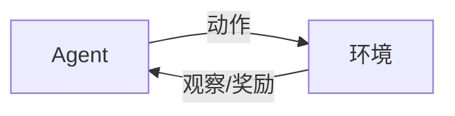
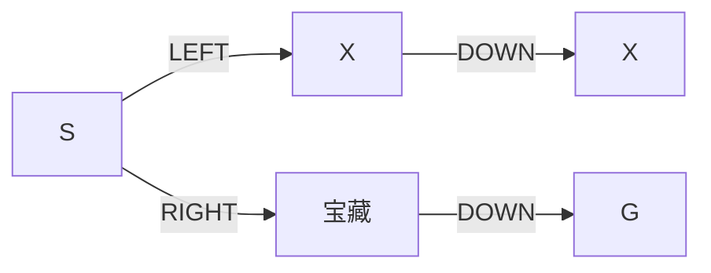

# AI Agent: AI的下一个风口 智能体的潜能与机遇

## 1. 背景介绍
### 1.1 问题的由来
人工智能(Artificial Intelligence, AI)技术的飞速发展正在深刻改变着我们的生活和工作方式。从智能助理、无人驾驶汽车到智能制造,AI已经渗透到各行各业。然而,传统的AI系统大多是基于特定任务和场景设计的,缺乏通用性和自主学习能力。为了进一步拓展AI的应用边界,研究者们开始探索一种新的AI范式——AI Agent(智能体)。

### 1.2 研究现状
目前,AI Agent的研究还处于起步阶段,但已经引起了学术界和工业界的广泛关注。谷歌DeepMind、OpenAI等知名机构都在积极布局AI Agent领域。一些前沿的研究成果,如AlphaGo、GPT-3等,展现了AI Agent的巨大潜力。不过,当前的AI Agent还存在诸多局限,如泛化能力不足、缺乏常识推理等,亟需更多的理论和技术突破。

### 1.3 研究意义 
AI Agent代表了人工智能发展的新方向,对学术研究和产业应用都具有重要意义:

1. 推动AI从"弱人工智能"向"强人工智能"演进,实现更加通用和智能的系统。
2. 促进多学科交叉融合,如机器学习、认知科学、心理学等,催生颠覆性创新。
3. 拓展AI应用场景,助力智慧城市、智能制造、自动驾驶等领域的技术进步。
4. 引发对AI哲学、伦理、安全等问题的深入思考,推动AI健康有序发展。

### 1.4 本文结构
本文将围绕AI Agent的核心概念、关键技术、应用实践等方面展开论述:
- 第2部分:介绍AI Agent的定义、特点及其与传统AI系统的区别。
- 第3部分:重点阐述AI Agent的核心算法原理,包括强化学习、元学习等。 
- 第4部分:建立AI Agent的数学模型,推导相关公式,并给出案例说明。
- 第5部分:通过代码实例,演示如何实现一个简单的AI Agent系统。
- 第6部分:分析AI Agent在智能助理、自动驾驶等领域的应用前景。
- 第7部分:推荐AI Agent领域的学习资源、开发工具和相关文献。
- 第8部分:总结全文,展望AI Agent的未来发展趋势和面临的挑战。

## 2. 核心概念与联系
AI Agent是一种能够感知环境、自主学习、动态决策的智能系统。与传统AI系统相比,AI Agent具有以下显著特点:

- 自主性:能够根据环境反馈自主调整策略,不依赖人工设定的规则。
- 通用性:可以学习和适应不同的任务和环境,具备一定的迁移能力。
- 持续学习:能够在与环境的持续交互中不断积累知识和经验,实现增量学习。
- 涌现智能:通过多个Agent的相互作用,涌现出高层次的群体智能。

下图展示了AI Agent与环境之间的交互过程:



AI Agent通过传感器获取环境状态(Observation),根据当前策略(Policy)采取行动(Action),环境对行动做出反馈,并给予奖励(Reward)。Agent根据环境反馈不断更新策略,以获得更高的累积奖励,从而表现出智能行为。

从认知科学的角度看,AI Agent可以视为人类智能的一种计算模型。它模拟了人脑感知、决策、学习的过程。同时,AI Agent也吸收了心理学、神经科学等学科的研究成果,如强化学习理论就源自于行为主义心理学。

## 3. 核心算法原理 & 具体操作步骤
### 3.1 算法原理概述
AI Agent的核心算法主要包括强化学习(Reinforcement Learning)和元学习(Meta Learning)。

强化学习是一种基于奖励反馈的学习方法。它通过试错探索,不断优化行为策略,以获得最大化的累积奖励。常见的强化学习算法有Q-Learning、策略梯度(Policy Gradient)、Actor-Critic等。

元学习则是一种"学会学习"的方法。它旨在学习一种通用的学习策略,使Agent能够快速适应新的任务和环境。元学习可以显著提升Agent的泛化和迁移能力。典型的元学习算法包括MAML、Reptile等。

### 3.2 算法步骤详解
以Q-Learning为例,详细阐述其算法步骤:

1. 初始化Q表格Q(s,a),存储状态-动作值函数。
2. 重复以下步骤,直到收敛:
   1) 根据ε-greedy策略,选择一个动作a。
   2) 执行动作a,观察奖励r和下一状态s'。 
   3) 更新Q(s,a)值:
      $Q(s,a) \leftarrow Q(s,a)+\alpha [r+\gamma \max _{a'} Q(s',a')-Q(s,a)]$
   4) s ← s'
3. 输出最优策略π*。

其中,α是学习率,γ是折扣因子。ε-greedy策略以ε的概率随机选择动作,以1-ε的概率选择Q值最大的动作,以平衡探索和利用。

### 3.3 算法优缺点
Q-Learning的优点是:
- 简单易实现,适用于小规模问题。
- 能够收敛到最优策略。
- 通过离线学习,减少了与环境的交互次数。

缺点包括:
- 状态空间过大时,Q表格难以存储。
- 难以处理连续状态和动作空间。
- 收敛速度慢,样本效率低。

### 3.4 算法应用领域
强化学习被广泛应用于以下领域:
- 游戏AI:代表性成果有AlphaGo系列、OpenAI Five等。
- 机器人控制:如Boston Dynamics的机器狗。
- 推荐系统:如阿里巴巴的淘宝推荐。
- 自然语言处理:如对话系统、文本生成等。

## 4. 数学模型和公式 & 详细讲解 & 举例说明
### 4.1 数学模型构建
马尔可夫决策过程(Markov Decision Process, MDP)是描述强化学习问题的经典数学模型。一个MDP由以下元素组成:

- 状态空间S:Agent所处的环境状态集合。
- 动作空间A:Agent可执行的动作集合。
- 状态转移概率P(s'|s,a):在状态s下执行动作a,转移到状态s'的概率。
- 奖励函数R(s,a):在状态s下执行动作a,获得的即时奖励。
- 折扣因子γ:未来奖励的衰减系数,取值范围[0,1]。

MDP的目标是寻找一个最优策略π*(s),使得期望累积奖励最大化:

$$\pi^*=\arg\max_\pi \mathbb{E}\left[\sum_{t=0}^{\infty} \gamma^t r_t | \pi \right]$$

其中,r_t表示t时刻获得的奖励。

### 4.2 公式推导过程
Q-Learning算法基于值迭代(Value Iteration)的思想,通过不断更新状态-动作值函数Q(s,a),逼近最优Q*函数。

根据贝尔曼最优方程(Bellman Optimality Equation),最优Q*函数满足:

$$Q^*(s,a)=R(s,a)+\gamma \sum_{s'\in S} P(s'|s,a) \max_{a'} Q^*(s',a')$$

Q-Learning通过随机采样的方式,逼近上述期望:

$$Q(s,a) \leftarrow Q(s,a)+\alpha [r+\gamma \max _{a'} Q(s',a')-Q(s,a)]$$

可以证明,当采样次数趋于无穷时,Q(s,a)以概率1收敛到Q*(s,a)。

### 4.3 案例分析与讲解
考虑一个简单的迷宫寻宝问题。如下图所示,Agent需要在迷宫中寻找宝藏,每走一步获得-1的奖励,找到宝藏获得+10的奖励。



我们可以用Q-Learning算法求解这个问题。假设折扣因子γ=0.9,学习率α=0.1。经过多轮迭代,Q表格收敛到:

| 状态s | LEFT | RIGHT |
|------|------|-------|
| S    | -1.9 | 8.1   |
| X    | -1.0 | -1.0  |
| 宝藏  | 0.0  | 0.0   |
| X    | -1.0 | -1.0  |
| G    | 0.0  | 0.0   |

根据Q表格,我们可以得到最优策略:在状态S时选择RIGHT动作,即可最短路径到达宝藏。

### 4.4 常见问题解答
Q: Q-Learning能否处理部分可观测马尔可夫决策过程(POMDP)?
A: 传统Q-Learning假设环境是完全可观测的,无法直接求解POMDP问题。但我们可以利用记忆机制(如LSTM)来建模观测历史,将POMDP转化为MDP,再应用Q-Learning求解。

Q: 如何解决Q-Learning的探索-利用困境?
A: 可以使用以下策略平衡探索和利用:
1. ε-greedy策略:以ε概率随机探索,1-ε概率利用当前最优动作。
2. Upper Confidence Bound(UCB):选择Q值与不确定性都高的动作。
3. Thompson Sampling:根据后验分布采样,平衡探索利用。

## 5. 项目实践：代码实例和详细解释说明
### 5.1 开发环境搭建
我们使用Python语言和PyTorch库来实现Q-Learning算法。首先安装必要的依赖:

```bash
pip install torch numpy matplotlib
```

### 5.2 源代码详细实现
下面给出Q-Learning算法的简要实现:

```python
import torch
import numpy as np

class QLearning:
    def __init__(self, state_dim, action_dim, lr, gamma, epsilon):
        self.state_dim = state_dim
        self.action_dim = action_dim
        self.lr = lr  # 学习率
        self.gamma = gamma  # 折扣因子
        self.epsilon = epsilon  # ε-greedy探索率
        self.Q = torch.zeros(state_dim, action_dim)  # Q表格
        
    def choose_action(self, state):
        if np.random.uniform() < self.epsilon:
            action = np.random.choice(self.action_dim)
        else:
            action = self.Q[state].argmax().item()
        return action
        
    def update(self, state, action, reward, next_state):
        td_error = reward + self.gamma * self.Q[next_state].max() - self.Q[state, action]
        self.Q[state, action] += self.lr * td_error
```

### 5.3 代码解读与分析
- `__init__`方法初始化了Q-Learning的超参数,包括状态维度、动作维度、学习率、折扣因子和探索率,并创建了Q表格。
- `choose_action`方法根据ε-greedy策略选择动作,以ε的概率随机探索,1-ε的概率选择Q值最大的动作。
- `update`方法根据TD误差更新Q表格,实现了Q-Learning的核心迭代过程。

我们可以将Q-Learning应用于各种强化学习环境,如OpenAI Gym。下面是一个训练CartPole的示例:

```python
import gym
env = gym.make('CartPole-v1')
agent = QLearning(state_dim=env.observation_space.shape[0], 
                  action_dim=env.action_space.n,
                  lr=0.1, gamma=0.95, epsilon=0.1)

for episode in range(500):
    state = env.reset()
    done = False
    while not done:
        action = agent.choose_action(state)
        next_state, reward, done, _ = env.step(action)
        agent.update(state, action, reward, next_state)
        state = next_state
        
    print(f"Episode {episode}, Reward: {env.total_reward}")
```

### 5.4 运行结果展示
训练结束后,我们可以可视化Agent的测试表现:

```python
state = env.reset()
done = False
while not done:
    action = agent.choose_action(state)
    state, _, done, _ = env.step(action)
    env.render()