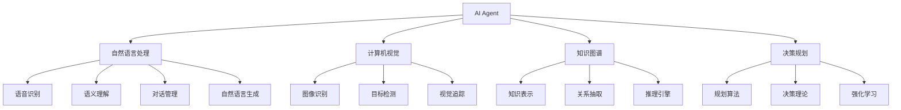

以下是根据您提供的要求和模板撰写的技术博客文章正文部分:

# AI Agent: AI的下一个风口 自然语言带来交互革命

## 1. 背景介绍

### 1.1 问题的由来

人工智能(AI)技术在过去几十年中取得了长足的进步,尤其是在计算机视觉、自然语言处理、决策系统等领域。然而,与人类的自然交互仍然是一个巨大的挑战。传统的人机交互方式,如键盘、鼠标等,存在较大的认知负担和使用障碍,难以实现高效、自然、无缝的人机交互体验。

### 1.2 研究现状  

为了解决这一问题,研究人员一直在探索新的人机交互范式。近年来,benefiting from 受益于深度学习等技术的快速发展,AI Agent(智能代理)作为一种新兴的人机交互方式备受关注。AI Agent通过自然语言处理、计算机视觉、知识图谱等技术,旨在实现更加智能、人性化的人机交互体验。

### 1.3 研究意义

AI Agent的出现有望彻底改变人机交互的方式,打破传统人机交互的束缚,为各行业带来革命性的变革。在这一新范式下,人们将能够以自然语言的方式与计算机系统进行交流和指令,大大降低使用门槛,提高工作效率。同时,AI Agent也能够主动分析用户需求,提供个性化的服务和建议,为人类生活和工作带来全新的体验。

### 1.4 本文结构

本文将全面介绍AI Agent的核心概念、关键技术、实现原理和应用场景。首先阐述AI Agent的核心概念及其与其他AI技术的关联;然后深入探讨AI Agent的核心算法原理和数学模型;接着通过实例项目解析代码实现细节;最后总结AI Agent的现实应用,并对未来发展趋势和挑战进行展望。

## 2. 核心概念与联系

AI Agent是一种智能代理系统,旨在代表用户执行特定任务,并与用户进行自然语言交互。它融合了自然语言处理(NLP)、计算机视觉(CV)、知识图谱、决策规划等多种AI技术,构建了一个智能化的人机交互系统。

AI Agent系统通常包含以下几个关键模块:

1. **自然语言处理(NLP)模块**:用于理解和生成自然语言,包括语音识别、语义理解、对话管理和自然语言生成等技术。
2. **计算机视觉(CV)模块**:用于感知和理解视觉信息,如图像识别、目标检测和视觉追踪等。
3. **知识图谱模块**:存储结构化的知识库,用于知识表示、关系抽取和推理等任务。  
4. **决策规划模块**:根据用户需求和系统状态,制定合理的行动计划,涉及规划算法、决策理论和强化学习等技术。

这些模块紧密协作,共同构建了一个智能化的交互系统,能够通过自然语言、视觉信息等多模态输入与用户进行自然交互,并基于知识库和决策引擎作出智能响应。

## 3. 核心算法原理 & 具体操作步骤  

### 3.1 算法原理概述

AI Agent系统的核心算法原理可概括为以下三个主要步骤:

1. **输入理解**:通过自然语言处理和计算机视觉技术,对用户的自然语言指令和视觉信息进行理解和解析。
2. **知识推理**:基于知识图谱,结合用户的语境和需求,进行知识推理和决策规划,制定行动计划。
3. **行动执行**:根据制定的行动计划,通过自然语言生成、控制外部设备等方式,执行相应的动作或响应。

### 3.2 算法步骤详解

1. **输入理解**
   - 语音识别:将用户的语音输入转换为文本。
   - 语义理解:分析文本的语义含义,构建语义表示。
   - 视觉理解:对图像、视频等视觉信息进行识别和理解。

2. **知识推理**  
   - 知识库查询:根据语义表示,在知识库中查找相关信息。  
   - 上下文建模:融合用户历史交互、场景等上下文信息。
   - 决策规划:基于知识、上下文,运用规划算法制定行动计划。

3. **行动执行**
   - 自然语言生成:将行动计划转化为自然语言响应。  
   - 控制执行:发出指令,控制外部设备执行相应动作。
   - 人机交互:通过多模态输出(语音、图像等)与用户交互。

### 3.3 算法优缺点

**优点**:
- 实现自然、高效的人机交互方式。
- 融合多种AI技术,提供智能化的响应和服务。  
- 降低使用门槛,提高工作效率。

**缺点**:  
- 算法复杂度高,需要大量计算资源。
- 依赖高质量的训练数据和知识库。
- 存在潜在的安全和隐私风险。

### 3.4 算法应用领域

AI Agent技术可广泛应用于以下领域:

- 智能助手:如Siri、Alexa等智能语音助手。
- 客户服务:提供自动化的客户咨询和问题解答。
- 智能家居:通过语音指令控制家电和智能设备。  
- 机器人控制:实现自然语言控制机器人执行任务。
- 智能驾驶:通过语音交互控制车辆导航和功能。

## 4. 数学模型和公式 & 详细讲解 & 举例说明

### 4.1 数学模型构建

AI Agent系统中的自然语言处理、计算机视觉、决策规划等模块都涉及复杂的数学模型。以自然语言处理为例,常用的数学模型包括:

1. **N-gram语言模型**

   N-gram语言模型是一种基于统计的语言模型,用于估计一个词序列的概率。对于一个长度为m的句子$W=w_1,w_2,...,w_m$,其概率可以用链式法则表示为:

   $$P(W)=\prod_{i=1}^{m}P(w_i|w_1,...,w_{i-1})$$

   为了简化计算,通常使用N-gram近似:

   $$P(w_i|w_1,...,w_{i-1})\approx P(w_i|w_{i-N+1},...,w_{i-1})$$

   其中N是N-gram的阶数。常用的是三元模型(N=3)和四元模型(N=4)。

2. **神经网络语言模型**

   基于神经网络的语言模型能够更好地捕捉语言的深层次结构,常用的模型包括循环神经网络(RNN)、长短期记忆网络(LSTM)和Transformer等。以LSTM为例,对于时间步t,其隐藏状态$h_t$可表示为:

   $$\begin{aligned}
   i_t &= \sigma(W_{xi}x_t+W_{hi}h_{t-1}+b_i)\\
   f_t &= \sigma(W_{xf}x_t+W_{hf}h_{t-1}+b_f)\\
   o_t &= \sigma(W_{xo}x_t+W_{ho}h_{t-1}+b_o)\\
   c_t &= f_t\odot c_{t-1}+i_t\odot\tanh(W_{xc}x_t+W_{hc}h_{t-1}+b_c)\\
   h_t &= o_t\odot\tanh(c_t)
   \end{aligned}$$

   其中$i_t,f_t,o_t$分别为输入门、遗忘门和输出门,用于控制信息流动;$c_t$为细胞状态;$\sigma$为sigmoid激活函数;$\odot$为元素wise乘积。

### 4.2 公式推导过程  

以N-gram语言模型为例,推导其概率计算公式:

已知一个长度为m的句子$W=w_1,w_2,...,w_m$,我们需要计算该句子的概率$P(W)$。根据链式法则:

$$\begin{aligned}
P(W)&=P(w_1,w_2,...,w_m)\\
     &=P(w_1)P(w_2|w_1)P(w_3|w_1,w_2)...P(w_m|w_1,w_2,...,w_{m-1})\\
     &=\prod_{i=1}^{m}P(w_i|w_1,...,w_{i-1})
\end{aligned}$$

由于直接计算$P(w_i|w_1,...,w_{i-1})$的复杂度很高,我们引入N-gram近似:

$$P(w_i|w_1,...,w_{i-1})\approx P(w_i|w_{i-N+1},...,w_{i-1})$$

将近似带入原始公式,得到N-gram语言模型的计算公式:

$$P(W)\approx\prod_{i=1}^{m}P(w_i|w_{i-N+1},...,w_{i-1})$$

该公式的计算复杂度大大降低,可以通过统计语料库中N-gram的频率来估计相应的条件概率。

### 4.3 案例分析与讲解

假设我们需要构建一个简单的三元语言模型,给定一个语料库:

"the cat sat on the mat 
the dog played with a ball
a kid kicked the ball"

我们可以统计语料库中所有三元组的频率,作为条件概率的估计:

$$P(w_i|w_{i-2},w_{i-1})=\frac{count(w_{i-2},w_{i-1},w_i)}{count(w_{i-2},w_{i-1})}$$

例如:

$$\begin{aligned}
P(cat|the,the)&=\frac{0}{2}=0\\
P(sat|the,cat)&=\frac{1}{1}=1\\
P(on|cat,sat)&=\frac{1}{1}=1\\
&...
\end{aligned}$$

对于一个新句子"the cat sat on a"的概率为:

$$\begin{aligned}
P(the,cat,sat,on,a)&=P(the|<s>,<s>)P(cat|<s>,the)P(sat|the,cat)\\
                   &\quad\times P(on|cat,sat)P(a|sat,on)\\
                   &=\frac{2}{3}\times\frac{1}{2}\times 1\times 1\times\frac{1}{2}\\
                   &=\frac{1}{3}
\end{aligned}$$

其中$<s>$表示句子起始符。

通过这个简单的例子,我们可以看到N-gram语言模型是如何基于统计数据估计句子概率的。在实际应用中,我们还需要平滑、回退等技术来处理数据稀疏问题。

### 4.4 常见问题解答

1. **为什么需要N-gram近似?**

   直接计算$P(w_i|w_1,...,w_{i-1})$的复杂度过高,数据也容易过度稀疏。N-gram近似通过只考虑有限个历史词,大大降低了计算复杂度,并缓解了数据稀疏问题。

2. **N-gram模型的缺陷是什么?**

   N-gram模型无法有效捕捉长距离依赖关系,且是基于统计数据的,难以泛化到未见过的数据。因此在实际应用中,神经网络语言模型表现通常更好。

3. **神经网络语言模型的优缺点是什么?**

   优点是能够学习深层次的语言结构,泛化能力更强;缺点是计算复杂度高,需要大量数据和计算资源。

4. **不同的语言模型在不同场景下的应用?**

   对于任务相对简单、数据量较小的场景,N-gram等统计语言模型可能就足够了。