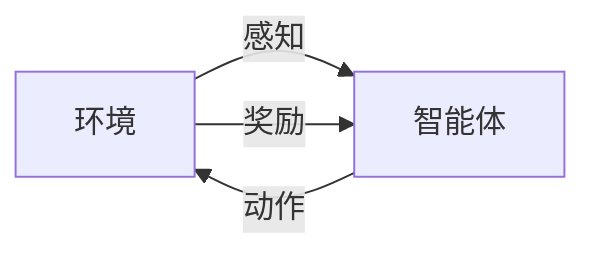

以下是标题为《AI Agent: AI的下一个风口 解决方案与研究方向》的技术博客文章正文内容:

# AI Agent: AI的下一个风口 解决方案与研究方向

## 1. 背景介绍

### 1.1 问题的由来

随着人工智能(AI)技术的不断发展和应用领域的不断扩大,传统的人工智能系统面临着诸多挑战。这些挑战包括:

1. **局限性**: 传统AI系统通常被设计为解决特定任务,缺乏通用性和适应性。
2. **缺乏交互**: 大多数AI系统无法与人类进行自然的交互和协作。
3. **缺乏自主性**: AI系统通常被动地执行预定义的任务,缺乏主动性和自主决策能力。

为了解决这些挑战,AI Agent(智能代理)的概念应运而生。

### 1.2 研究现状

AI Agent是一种新兴的人工智能范式,旨在创建具有自主性、交互性和适应性的智能系统。近年来,AI Agent领域取得了长足的进步,包括:

1. **多智能体系统**: 多个AI Agent可以协作完成复杂任务。
2. **人机交互**: AI Agent可以通过自然语言或其他模态与人类进行交互。
3. **强化学习**: AI Agent可以通过与环境的交互来学习和优化其行为。

然而,AI Agent领域仍然面临着诸多挑战,例如决策理论、知识表示、规划和推理等。

### 1.3 研究意义

AI Agent具有广阔的应用前景,包括:

1. **智能助手**: AI Agent可以作为个人助理,协助人类完成日常任务。
2. **自动化系统**: AI Agent可以在工业、农业等领域实现智能自动化。
3. **智能机器人**: AI Agent可以驱动智能机器人,在服务、探索等领域发挥作用。

研究和开发AI Agent技术,有助于推动人工智能的发展,提高智能系统的智能水平和实用性。

### 1.4 本文结构

本文将首先介绍AI Agent的核心概念和理论基础,然后深入探讨AI Agent的核心算法原理和数学模型。接下来,将通过实际项目实践和代码示例,展示AI Agent的实现过程和应用场景。最后,本文将总结AI Agent的发展趋势和面临的挑战,并提供相关资源推荐。

## 2. 核心概念与联系

AI Agent是一种具有自主性、适应性和交互性的智能系统。它能够感知环境,基于感知信息做出决策,并通过执行动作来影响环境。AI Agent的核心概念包括:

1. **智能体(Agent)**: 指具有自主性和决策能力的实体。
2. **环境(Environment)**: 指智能体所处的外部世界,包括物理环境和虚拟环境。
3. **感知(Perception)**: 指智能体获取环境信息的过程。
4. **动作(Action)**: 指智能体对环境产生影响的行为。
5. **奖励(Reward)**: 指智能体在执行动作后获得的正面或负面反馈。

这些概念之间存在着紧密的联系,如下图所示:

智能体通过感知获取环境信息,基于这些信息做出决策并执行相应的动作。动作会影响环境的状态,环境会根据智能体的动作给予相应的奖励或惩罚,作为反馈信号。智能体的目标是通过学习,优化其决策策略,以获得最大的累积奖励。

## 3. 核心算法原理 & 具体操作步骤

### 3.1 算法原理概述

AI Agent的核心算法原理是基于强化学习(Reinforcement Learning)。强化学习是一种机器学习范式,它允许智能体通过与环境的交互来学习如何采取最优行动,以最大化预期的累积奖励。

强化学习算法通常包括以下关键组成部分:

1. **策略(Policy)**: 定义了智能体在给定状态下应采取的行动。
2. **奖励函数(Reward Function)**: 定义了智能体获得奖励或惩罚的标准。
3. **价值函数(Value Function)**: 估计智能体在给定状态下采取特定策略所能获得的预期累积奖励。
4. **模型(Model)**: 描述了环境的转移概率和奖励函数。

强化学习算法的目标是找到一个最优策略,使得智能体在环境中采取该策略时,能够获得最大的预期累积奖励。

### 3.2 算法步骤详解

强化学习算法的基本步骤如下:

1. **初始化**: 初始化智能体的策略、价值函数和环境模型。
2. **交互**: 智能体与环境进行交互,采取行动并观察环境的反馈(状态转移和奖励)。
3. **更新**: 根据观察到的状态转移和奖励,更新策略、价值函数和环境模型。
4. **迭代**: 重复步骤2和3,直到策略收敛或达到预定的迭代次数。

更新策略、价值函数和环境模型的具体方法取决于所使用的强化学习算法。常见的强化学习算法包括Q-Learning、Sarsa、策略梯度等。

### 3.3 算法优缺点

强化学习算法的优点包括:

1. **通用性**: 可以应用于各种决策问题,无需人工设计复杂的规则或策略。
2. **自适应性**: 算法可以根据环境的变化自动调整策略。
3. **高效性**: 通过与环境的交互,算法可以有效地学习最优策略。

然而,强化学习算法也存在一些缺点:

1. **样本效率低**: 需要大量的交互数据才能学习到有效的策略。
2. **稀疏奖励**: 在某些环境中,奖励信号可能很稀疏,导致学习过程缓慢。
3. **探索与利用权衡**: 算法需要在探索新的行动和利用已学习的知识之间做出权衡。

### 3.4 算法应用领域

强化学习算法在以下领域有广泛的应用:

1. **机器人控制**: 用于训练机器人执行各种任务,如导航、操作等。
2. **游戏AI**: 用于训练AI代理人在各种游戏中采取最优策略。
3. **自动驾驶**: 用于训练自动驾驶系统在复杂的交通环境中做出正确决策。
4. **资源管理**: 用于优化资源分配和调度,如能源系统、网络流量等。
5. **金融交易**: 用于开发自动化交易策略,以获取最大利润。

## 4. 数学模型和公式 & 详细讲解 & 举例说明

### 4.1 数学模型构建

为了形式化描述强化学习问题,我们需要构建一个数学模型。该模型通常被称为马尔可夫决策过程(Markov Decision Process, MDP)。

一个MDP可以用一个五元组 $(S, A, P, R, \gamma)$ 来表示,其中:

- $S$ 是状态空间,表示环境可能处于的所有状态。
- $A$ 是动作空间,表示智能体可以采取的所有动作。
- $P(s'|s,a)$ 是状态转移概率,表示在状态 $s$ 下采取动作 $a$ 后,转移到状态 $s'$ 的概率。
- $R(s,a,s')$ 是奖励函数,表示在状态 $s$ 下采取动作 $a$ 并转移到状态 $s'$ 时获得的奖励。
- $\gamma \in [0,1)$ 是折现因子,用于权衡即时奖励和长期累积奖励的重要性。

在MDP框架下,强化学习算法的目标是找到一个最优策略 $\pi^*(s)$,使得在任意状态 $s$ 下采取该策略所获得的预期累积折现奖励最大化,即:

$$
\max_\pi \mathbb{E}_\pi \left[ \sum_{t=0}^\infty \gamma^t R(s_t, a_t, s_{t+1}) \right]
$$

其中 $\mathbb{E}_\pi$ 表示在策略 $\pi$ 下的期望值。

### 4.2 公式推导过程

为了找到最优策略,我们可以定义一个价值函数 $V^\pi(s)$,表示在状态 $s$ 下采取策略 $\pi$ 所获得的预期累积折现奖励:

$$
V^\pi(s) = \mathbb{E}_\pi \left[ \sum_{t=0}^\infty \gamma^t R(s_t, a_t, s_{t+1}) \mid s_0 = s \right]
$$

根据贝尔曼方程(Bellman Equation),价值函数可以通过以下递归方式计算:

$$
V^\pi(s) = \sum_{a \in A} \pi(a|s) \sum_{s' \in S} P(s'|s,a) \left[ R(s,a,s') + \gamma V^\pi(s') \right]
$$

其中 $\pi(a|s)$ 表示在状态 $s$ 下采取动作 $a$ 的概率。

同样,我们可以定义一个行动价值函数 $Q^\pi(s,a)$,表示在状态 $s$ 下采取动作 $a$,然后遵循策略 $\pi$ 所获得的预期累积折现奖励:

$$
Q^\pi(s,a) = \mathbb{E}_\pi \left[ \sum_{t=0}^\infty \gamma^t R(s_t, a_t, s_{t+1}) \mid s_0 = s, a_0 = a \right]
$$

行动价值函数和价值函数之间存在以下关系:

$$
Q^\pi(s,a) = \sum_{s' \in S} P(s'|s,a) \left[ R(s,a,s') + \gamma V^\pi(s') \right]
$$

$$
V^\pi(s) = \sum_{a \in A} \pi(a|s) Q^\pi(s,a)
$$

如果我们知道了最优行动价值函数 $Q^*(s,a)$,那么最优策略 $\pi^*(s)$ 可以通过以下方式获得:

$$
\pi^*(s) = \arg\max_{a \in A} Q^*(s,a)
$$

因此,强化学习算法的核心就是估计最优行动价值函数 $Q^*(s,a)$。

### 4.3 案例分析与讲解

为了更好地理解强化学习算法的原理和应用,我们将通过一个经典的网格世界(GridWorld)案例进行分析和讲解。

在网格世界中,智能体(代理)需要从起点出发,找到终点(目标)。网格中可能存在障碍物和陷阱,智能体需要学习如何避开这些障碍,以最短路径到达终点。每次移动都会获得一定的负奖励(代价),到达终点时会获得正奖励。

我们将使用Q-Learning算法来训练智能体。Q-Learning算法的核心思想是通过不断与环境交互,更新行动价值函数 $Q(s,a)$,直到收敛到最优行动价值函数 $Q^*(s,a)$。

Q-Learning算法的更新规则如下:

$$
Q(s_t, a_t) \leftarrow Q(s_t, a_t) + \alpha \left[ R(s_t, a_t, s_{t+1}) + \gamma \max_{a'} Q(s_{t+1}, a') - Q(s_t, a_t) \right]
$$

其中 $\alpha$ 是学习率,控制了更新步长的大小。

通过不断地探索和利用,智能体最终会学习到一个近似最优的策略,能够有效地从起点到达终点。

### 4.4 常见问题解答

**Q1: 强化学习算法如何处理连续状态和动作空间?**

对于连续状态和动作空间,我们可以使用函数近似技术,如神经网络或核方法,来近似价值函数或策略函数。这种方法被称为深度强化学习(Deep Reinforcement Learning)。

**Q2: 如何解决稀疏奖励问题?**

稀疏奖励问题可以通过以下几种方式缓解:

1. 使用启发式奖励函数,为智能体提供更多的中间奖励信号。
2. 采用层次强化学习(Hierarchical Reinforcement Learning),将复杂任务分解为多个子任务。
3. 使用示范学习(Imitation Learning),让智能体从人类专家的示范中学习。

**Q3: 如何平衡探索与利用的权衡?**

探索与利用的权