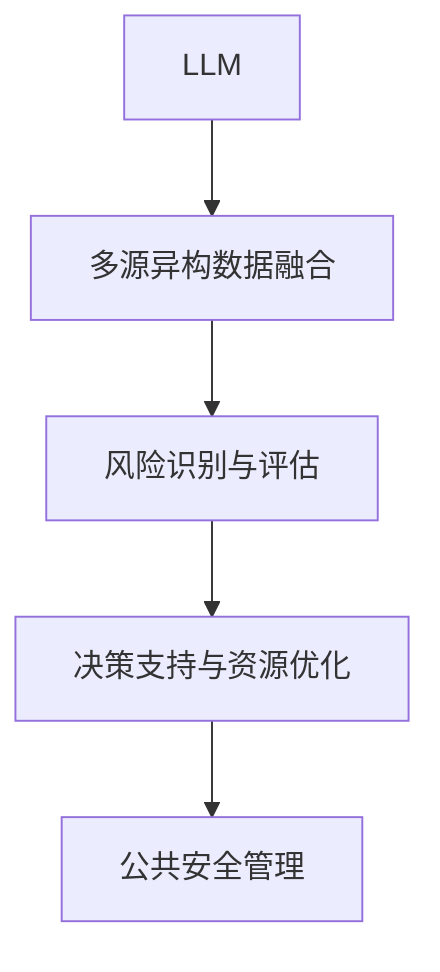

# AI LLM在公共安全领域的应用：预测与预防

## 1. 背景介绍

### 1.1 问题的由来

在当今社会中,公共安全问题日益受到重视。无论是自然灾害、恐怖主义活动、网络犯罪还是其他形式的威胁,都可能给人民生命财产安全带来严重危害。传统的公共安全管理方式主要依赖人工经验和有限的数据资源,难以及时有效地预测和防范各种风险。

随着人工智能(AI)和大数据技术的快速发展,基于AI的大规模语言模型(LLM)在自然语言处理(NLP)领域展现出了巨大的潜力。LLM能够从海量文本数据中学习知识,并具备出色的语言理解、生成和推理能力。利用LLM技术,我们可以构建智能化的公共安全预测与预防系统,实现风险的提前识别、评估和应对,从而保障公众的生命财产安全。

### 1.2 研究现状

近年来,AI在公共安全领域的应用研究日益活跃。一些学者尝试利用机器学习和深度学习技术分析社交媒体数据,以预测犯罪热点区域和发生概率。另一些研究则集中在利用计算机视觉技术提高视频监控的智能化水平,实现行人重识别、异常行为检测等功能。

然而,现有研究大多局限于特定场景或数据类型,缺乏对多源异构数据的综合利用能力。此外,大部分方法仅关注事件发生的预测,缺乏对事件发生原因和影响范围的深入分析,难以为决策者提供全面的决策支持。

LLM技术的出现为解决上述问题带来了新的契机。LLM能够同时处理结构化数据(如数字、表格)和非结构化数据(如文本、图像、视频),并对复杂的语义信息进行深层次理解和推理。通过LLM技术,我们可以构建覆盖全流程的智能化公共安全管理系统,实现风险的提前预警、原因分析和应对决策支持,从而全面提升公共安全的管理水平。

### 1.3 研究意义

基于LLM的智能公共安全预测与预防系统具有重要的理论意义和应用价值:

- 理论意义
  - 推动AI技术在公共安全领域的创新应用,拓展AI在社会治理中的作用。
  - 促进多源异构数据的融合分析,探索LLM在异构信息处理中的能力。
  - 深化LLM在复杂问题求解中的理解和推理能力研究。

- 应用价值
  - 提高公共安全风险的提前预警和防范能力,保障人民生命财产安全。
  - 为决策者提供全面的决策支持,优化公共安全资源配置。
  - 降低人工分析和决策的工作强度,提高管理效率。

### 1.4 本文结构

本文将全面介绍基于LLM的智能公共安全预测与预防系统的理论和实践。

第2章阐述系统的核心概念,包括LLM、多源异构数据融合、风险预测与决策支持等。

第3章详细解释系统的核心算法原理和具体操作步骤。

第4章构建系统的数学模型,并通过公式推导和案例分析加深理解。

第5章提供系统的代码实现示例,并对关键模块进行解读和分析。

第6章探讨系统在实际应用场景中的使用,并对未来应用前景进行展望。

第7章推荐相关的学习资源、开发工具和研究论文等。

第8章总结研究成果,分析未来发展趋势和面临的挑战,并对后续工作进行展望。

第9章列出常见问题及其解答,以帮助读者更好地理解和运用本系统。

## 2. 核心概念与联系

本系统的核心概念包括:

1. **大规模语言模型(LLM)**: 利用海量文本数据训练的深度神经网络模型,具备出色的自然语言理解、生成和推理能力。常用的LLM包括GPT、BERT、XLNet等。

2. **多源异构数据融合**: 将来自不同来源(如社交媒体、新闻报道、政府数据等)和不同格式(如文本、图像、视频等)的数据进行融合,为风险识别和评估提供全面的信息支持。

3. **风险识别与评估**: 基于LLM对多源异构数据进行语义理解和推理,识别潜在的公共安全风险,并对风险的发生概率、原因和影响范围等进行评估。

4. **决策支持与资源优化**: 根据风险评估结果,为决策者提供应对策略建议,并优化公共安全资源的配置和调度。

5. **公共安全管理**: 通过上述模块的协同工作,实现对自然灾害、恐怖主义活动、网络犯罪等各类公共安全风险的智能化管理。

这些核心概念相互关联、环环相扣,共同构建了一个完整的智能公共安全预测与预防体系。

## 3. 核心算法原理 & 具体操作步骤  

### 3.1 算法原理概述

本系统的核心算法原理可概括为三个主要步骤:

1. **多源异构数据融合**
   - 利用LLM对不同来源和格式的数据进行语义理解和表示,将其映射到同一语义空间。
   - 采用注意力机制捕捉不同模态数据之间的相关性,实现多源数据的融合。

2. **风险识别与评估**
   - 基于融合后的语义表示,利用LLM的推理能力识别潜在的公共安全风险事件。
   - 对识别出的风险事件进行概率评估、原因分析和影响范围预测。

3. **决策支持与优化**
   - 根据风险评估结果,结合历史案例和专家知识,为决策者生成应对策略建议。
   - 利用优化算法(如整数规划)对公共安全资源进行合理配置和调度。

该算法的关键在于利用LLM强大的语义理解、推理和生成能力,实现多源异构数据的融合和综合分析,从而提供全面的风险管理支持。

### 3.2 算法步骤详解

1. **数据预处理**
   - 对文本数据进行分词、词性标注、命名实体识别等预处理。
   - 对图像和视频数据进行目标检测、语义分割等预处理。
   - 将结构化数据(如表格、数字)转换为文本形式。

2. **LLM语义编码**
   - 利用预训练的LLM(如BERT)对预处理后的数据进行语义编码,得到各模态数据的语义表示向量。

3. **多模态融合**
   - 采用自注意力机制捕捉不同模态数据之间的相关性。
   - 将不同模态的语义表示向量融合为统一的语义表示。

4. **风险识别**
   - 基于融合后的语义表示,利用LLM的推理能力识别潜在的公共安全风险事件。
   - 对识别出的风险事件进行过滤和聚类,消除冗余和噪声。

5. **风险评估**
   - 对识别出的风险事件进行概率评估,预测其发生的可能性。
   - 利用LLM对风险事件的原因进行推理和解释。
   - 预测风险事件的影响范围,包括地理区域、人员数量等。

6. **决策支持**
   - 根据风险评估结果,结合历史案例和专家知识库,为决策者生成应对策略建议。
   - 利用优化算法(如整数规划)对公共安全资源进行合理配置和调度。

7. **系统更新**
   - 将实际应对结果作为反馈,用于持续优化LLM模型和决策知识库。
   - 定期对系统进行在线学习,以适应新的数据模式和风险形式。

### 3.3 算法优缺点

**优点**:

- 能够同时处理多源异构数据,提供全面的信息支持。
- 利用LLM的语义理解和推理能力,实现风险的提前识别和深入分析。
- 为决策者提供个性化的应对策略建议,并优化资源配置。
- 具有一定的可解释性,决策过程可追溯。
- 算法具有在线学习和自我优化的能力,可持续提升性能。

**缺点**:

- 对大规模高质量的训练数据有较高要求,否则LLM的性能会受到限制。
- 算法的计算复杂度较高,需要强大的硬件支持。
- 存在一定的黑箱风险,LLM的内部工作机理有待进一步研究。
- 面临隐私和安全风险,需要采取有效的数据脱敏和模型防护措施。

### 3.4 算法应用领域

该算法不仅可应用于公共安全领域,也可推广到其他需要对多源异构数据进行综合分析和决策支持的领域,如:

- 金融风险管理
- 智能交通管控
- 突发事件应急响应
- 社会舆情监测与分析
- 医疗健康决策支持等

## 4. 数学模型和公式 & 详细讲解 & 举例说明

### 4.1 数学模型构建

我们将公共安全风险预测与预防问题建模为一个序列标注和生成任务。

给定一个由多源异构数据构成的序列 $X = \{x_1, x_2, \ldots, x_n\}$,其中 $x_i$ 可以是文本、图像、视频或其他模态的数据。我们的目标是:

1. 对序列 $X$ 中的每个元素 $x_i$ 进行标注,判断其是否与公共安全风险相关,得到标注序列 $Y = \{y_1, y_2, \ldots, y_n\}$,其中 $y_i \in \{0, 1\}$。

2. 对于标注为 $1$ 的风险相关元素,生成其风险类型 $r_i$、发生概率 $p_i$、原因解释 $c_i$ 和影响范围预测 $e_i$,得到风险描述序列 $Z = \{(r_1, p_1, c_1, e_1), (r_2, p_2, c_2, e_2), \ldots\}$。

我们将这一过程建模为条件生成,即在给定输入序列 $X$ 的条件下,生成相应的标注序列 $Y$ 和风险描述序列 $Z$:

$$P(Y, Z | X) = \prod_{i=1}^n P(y_i | X, y_{<i}) \prod_{j=1}^m P(r_j, p_j, c_j, e_j | X, y, r_{<j}, p_{<j}, c_{<j}, e_{<j})$$

其中 $m$ 为标注为 $1$ 的风险相关元素的个数。

我们将采用基于Transformer的LLM作为核心模型,利用其强大的序列建模能力来实现上述条件生成过程。

### 4.2 公式推导过程

我们先介绍LLM中的自注意力机制(Self-Attention),这是实现序列建模的关键。

对于输入序列 $X = \{x_1, x_2, \ldots, x_n\}$,我们首先将每个元素 $x_i$ 映射为一个连续的向量表示 $\boldsymbol{e}_i \in \mathbb{R}^{d_\text{model}}$,得到矩阵 $\boldsymbol{E} = [\boldsymbol{e}_1, \boldsymbol{e}_2, \ldots, \boldsymbol{e}_n] \in \mathbb{R}^{n \times d_\text{model}}$。

然后,我们计算每个元素 $\boldsymbol{e}_i$ 与所有其他元素的注意力权重:

$$\begin{aligned}
\boldsymbol{Q} &= \boldsymbol{E} \boldsymbol{W}^Q \\
\boldsymbol{K} &= \boldsymbol{E} \boldsymbol{W}^K \\
\boldsymbol{V} &= \boldsymbol{E} \boldsymbol{W}^V \\
\text{Attention}(\boldsymbol{Q}, \boldsymbol{K}, \boldsymbol{V}) &= \text{