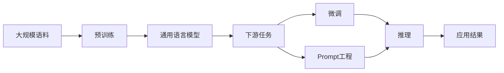

# AI 大模型应用最佳实践

## 1. 背景介绍
### 1.1 问题的由来
近年来，人工智能领域取得了突飞猛进的发展，尤其是以 Transformer 为代表的大模型（Large Language Model, LLM）的出现，掀起了 AI 研究和应用的新浪潮。从 GPT-3 到 ChatGPT，再到最新的 GPT-4，大模型展现出了惊人的自然语言理解和生成能力，引发了学术界和产业界的广泛关注。然而，如何将这些强大的大模型高效地应用到实际场景中，仍然存在诸多挑战。

### 1.2 研究现状
目前，学术界和工业界都在积极探索大模型的应用。微软、谷歌、OpenAI 等科技巨头纷纷推出了基于大模型的智能助手和对话系统，如微软的 Copilot、谷歌的 Bard 等。同时，许多研究者也在不同领域尝试利用大模型解决实际问题，如医疗诊断、金融预测、教育辅助等。尽管取得了一些进展，但大模型的应用仍处于起步阶段，缺乏成熟的最佳实践指南。

### 1.3 研究意义
探索 AI 大模型的应用最佳实践具有重要意义。首先，它可以帮助研究者和开发者更高效、更规范地使用大模型，避免走弯路，提高应用效果。其次，总结最佳实践经验有助于推动大模型在各个领域的落地应用，加速 AI 技术的产业化进程。最后，研究大模型应用实践也为未来的 AI 系统设计和优化提供了重要参考，对人工智能的长远发展具有指导意义。

### 1.4 本文结构
本文将围绕 AI 大模型应用最佳实践展开深入探讨。第二部分介绍大模型应用涉及的核心概念及其内在联系。第三部分重点阐述 Prompt 工程的核心原理和具体操作步骤。第四部分从数学角度对大模型的原理进行建模分析。第五部分通过代码实例演示大模型的实践应用。第六部分总结大模型的典型应用场景。第七部分推荐了一些有助于大模型应用的工具和学习资源。第八部分对全文进行总结，并展望大模型技术的未来发展趋势和面临的挑战。

## 2. 核心概念与联系

在探讨 AI 大模型应用最佳实践之前，我们需要理清几个核心概念：

- **大模型**：指参数量极大（通常在数亿到上千亿）的深度学习模型，主要应用于自然语言处理任务。当前最著名的大模型包括 GPT 系列、BERT、T5 等。
- **预训练**：利用大规模无标注数据，通过自监督学习的方式训练神经网络模型，使其学习到通用的语言表征。这是大模型的基础。
- **微调**：在特定任务上，利用少量有标注数据对预训练模型进行训练，使其适应具体应用场景。这可以显著提升模型性能，是应用大模型的关键。
- **Prompt**：输入给大模型的文本序列，包含任务描述、指令、示例等，引导模型进行特定响应。设计优质的 Prompt 是大模型应用的核心。
- **推理**：利用训练好的模型，根据输入的 Prompt 生成相应的输出结果。这是应用大模型的最后一步。

这些概念环环相扣，构成了 AI 大模型应用的基本范式。预训练奠定了模型的基础，微调和 Prompt 工程是应用的关键，推理则是大模型发挥作用的最终阶段。掌握这些概念之间的内在联系，对理解和应用大模型至关重要。



## 3. 核心算法原理 & 具体操作步骤
### 3.1 算法原理概述
大模型的核心算法主要基于 Transformer 架构和自注意力机制。Transformer 通过编码器和解码器的堆叠，实现了并行计算和长程依赖捕获。自注意力机制则让模型能够自适应地关注输入序列的不同部分，提取关键信息。

### 3.2 算法步骤详解
1. **Embedding**：将离散的词元映射为连续的向量表示，作为模型的输入。
2. **位置编码**：为每个词元的向量添加位置信息，使模型能够捕捉序列的顺序特征。
3. **多头自注意力**：通过多个注意力头并行计算词元之间的相关性，提取不同角度的语义信息。
4. **前馈神经网络**：对自注意力的输出进行非线性变换，增强模型的表达能力。
5. **Layer Norm & 残差连接**：归一化层输入，并引入残差支路，有助于深层网络的优化。
6. **Softmax**：将模型输出转化为概率分布，用于生成或预测任务。

### 3.3 算法优缺点
Transformer 的优点在于：
- 并行计算，训练和推理效率高
- 长程依赖捕获能力强
- 可扩展性好，适合训练超大模型

但它也存在一些局限：
- 计算和存储开销大，对硬件要求高
- 样本效率较低，需要大量数据进行预训练
- 解释性和可控性有待提高

### 3.4 算法应用领域
基于 Transformer 的大模型已在多个领域取得了广泛应用，包括：
- 自然语言处理：机器翻译、对话系统、文本摘要、问答等
- 代码生成与理解：代码补全、代码搜索、代码文档生成等
- 多模态学习：图像描述、视觉问答、语音识别等
- 知识图谱：实体链接、关系抽取、知识推理等

随着算法的不断进步和计算能力的提升，大模型有望在更多领域发挥重要作用。

## 4. 数学模型和公式 & 详细讲解 & 举例说明
### 4.1 数学模型构建
为了刻画 Transformer 的工作原理，我们可以建立如下数学模型：

令输入序列为 $\mathbf{X}=(\mathbf{x}_1, \mathbf{x}_2, \cdots, \mathbf{x}_n)$，其中 $\mathbf{x}_i \in \mathbb{R}^d$ 表示第 $i$ 个词元的 $d$ 维嵌入向量。Transformer 的目标是学习一个映射函数 $f(\cdot)$，将输入序列 $\mathbf{X}$ 转化为输出序列 $\mathbf{Y}=(\mathbf{y}_1, \mathbf{y}_2, \cdots, \mathbf{y}_m)$，即：

$$
\mathbf{Y} = f(\mathbf{X})
$$

其中，$f(\cdot)$ 由 Transformer 的编码器和解码器共同组成。

### 4.2 公式推导过程
Transformer 的核心是自注意力机制，它可以通过如下公式计算得到：

$$
\text{Attention}(Q, K, V) = \text{softmax}(\frac{QK^T}{\sqrt{d_k}})V
$$

其中，$Q$、$K$、$V$ 分别表示查询、键、值矩阵，$d_k$ 为键向量的维度。这一公式可以理解为：每个查询向量 $q_i$ 与所有键向量 $k_j$ 进行点积，得到它们的相似度分数，然后经过 softmax 归一化，得到注意力权重，最后与值向量 $v_j$ 加权求和，得到 $q_i$ 的注意力表示。

多头自注意力则是将 $Q$、$K$、$V$ 线性投影到 $h$ 个不同的子空间，分别进行自注意力计算，再将结果拼接起来：

$$
\begin{aligned}
\text{MultiHead}(Q, K, V) &= \text{Concat}(\text{head}_1, \cdots, \text{head}_h)W^O \\
\text{head}_i &= \text{Attention}(QW_i^Q, KW_i^K, VW_i^V)
\end{aligned}
$$

其中，$W_i^Q$、$W_i^K$、$W_i^V$、$W^O$ 为可学习的投影矩阵。

Transformer 的编码器和解码器都是由多个自注意力层和前馈层交替堆叠而成。前馈层可以表示为：

$$
\text{FFN}(x) = \max(0, xW_1 + b_1)W_2 + b_2
$$

其中，$W_1$、$W_2$、$b_1$、$b_2$ 为可学习的参数矩阵和偏置向量。

### 4.3 案例分析与讲解
下面我们以机器翻译任务为例，说明 Transformer 的工作流程。

假设输入序列为英文句子 "I love AI"，目标是将其翻译为中文 "我爱人工智能"。

首先，英文句子通过 Embedding 层和位置编码，转化为一系列向量。然后，这些向量依次通过编码器的自注意力层和前馈层，提取句子的语义表示。

在解码阶段，模型根据编码器的输出和已生成的中文词元，通过自注意力和编码-解码注意力，预测下一个中文词元。例如，在生成 "人工智能" 时，模型会重点关注英文句子中的 "AI"，并结合之前生成的 "我爱" 的语义，预测出 "人工智能" 的概率最大。

通过这种自回归的方式，Transformer 逐步生成整个目标序列，完成翻译任务。

### 4.4 常见问题解答
**Q**: Transformer 能处理变长序列吗？

**A**: 可以。Transformer 在训练时可以通过设置最大长度、padding 等方式来处理变长序列。在推理时，可以使用 "greedy search" 或 "beam search" 等策略，根据生成概率动态决定序列的长度。

**Q**: Transformer 是否适合处理时间序列数据？

**A**: 尽管 Transformer 最初是为文本数据设计的，但它也可以用于时间序列建模。这通常需要对输入数据进行一些预处理，如时间窗口划分、时间编码等。一些变体模型，如 Informer、Autoformer 等，对 Transformer 进行了改进，以更好地适应时间序列任务。

**Q**: Transformer 的计算复杂度如何？

**A**: Transformer 的时间和空间复杂度均为 $O(n^2 \cdot d)$，其中 $n$ 为序列长度，$d$ 为嵌入维度。这主要是由自注意力机制中的点积操作引起的。一些优化方法，如稀疏注意力、低秩近似等，可以在一定程度上缓解这一问题。但总的来说，Transformer 对计算资源的要求还是比较高的，尤其是在处理长序列时。

## 5. 项目实践：代码实例和详细解释说明
### 5.1 开发环境搭建
要使用 Transformer 进行开发，我们首先需要搭建一个适合的环境。这里我们以 PyTorch 为例。

安装 PyTorch：
```bash
pip install torch
```

安装 transformers 库，它提供了多种预训练的 Transformer 模型：
```bash
pip install transformers
```

### 5.2 源代码详细实现
下面我们实现一个基于 GPT-2 的文本生成器。

首先，加载预训练的 GPT-2 模型和分词器：
```python
from transformers import GPT2LMHeadModel, GPT2Tokenizer

model = GPT2LMHeadModel.from_pretrained('gpt2')
tokenizer = GPT2Tokenizer.from_pretrained('gpt2')
```

然后，定义生成函数：
```python
def generate_text(prompt, max_length=50, num_return_sequences=1):
    input_ids = tokenizer.encode(prompt, return_tensors='pt')
    
    output = model.generate(
        input_ids, 
        max_length=max_length,
        num_return_sequences=num_return_sequences,
        no_repeat_ngram_size=2,
        early_stopping=True
    )
    
    return tokenizer.decode(output[0], skip_special_tokens=True)
```

这里我们使用了 `model.generate()` 函数来生成文本。它的主