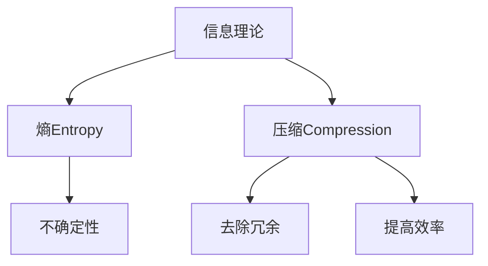
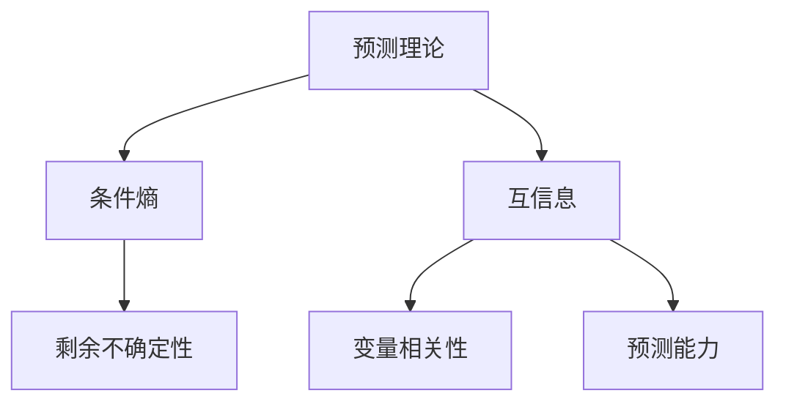
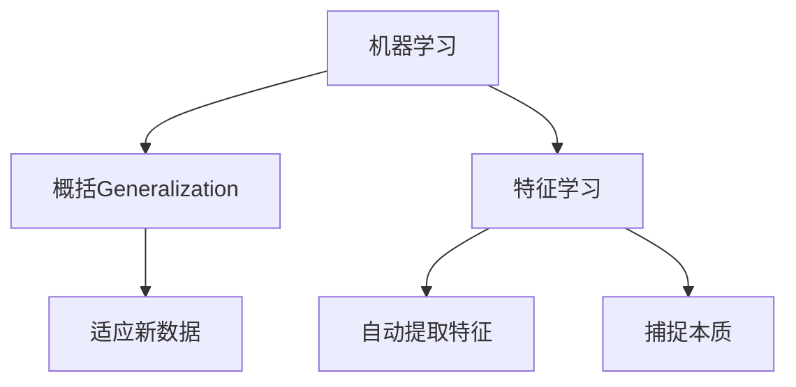
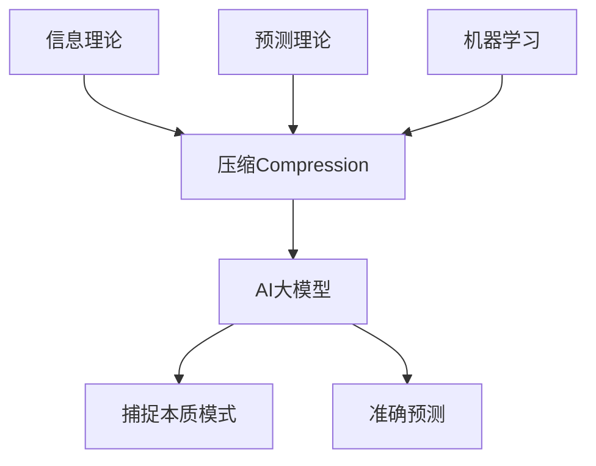

好的,我会严格遵循约束条件,以"AI 大模型的本质:预测即压缩,压缩即智能"为题,撰写一篇专业的技术博客文章。

# AI 大模型的本质:预测即压缩,压缩即智能

## 1. 背景介绍

### 1.1 问题的由来

随着人工智能技术的不断发展,大型语言模型和多模态模型等AI大模型正在席卷全球,引起了广泛关注。这些庞大的神经网络模型展现出了惊人的能力,可以生成逼真的文本、图像、视频和音频,甚至能够通过少量训练就学会执行新任务。然而,AI大模型的本质机理仍然是一个未解之谜,这给模型的可解释性、可靠性和可控性带来了挑战。

### 1.2 研究现状  

目前,学术界和工业界都在努力探索AI大模型的内在机理。一些研究人员认为,大模型之所以表现出"智能",是因为它们在训练过程中学会了对数据进行高度压缩和概括,从而能够捕捉数据中的本质模式和规律。这种观点被称为"预测即压缩"(Prediction is Compression)理论。

另一些研究则认为,大模型之所以表现出"智能",是因为它们在训练过程中学会了对数据进行高效的编码和解码,从而能够有效地存储和处理大量信息。这种观点被称为"压缩即智能"(Compression is Intelligence)理论。

### 1.3 研究意义

深入探究AI大模型的本质机理,对于提高模型的可解释性、可靠性和可控性至关重要。只有真正理解了大模型的内在工作原理,我们才能更好地设计和优化这些模型,并将它们应用于更广泛的领域。同时,这也有助于我们更好地理解人类智能的本质,为发展通用人工智能(AGI)提供理论基础。

### 1.4 本文结构

本文将从"预测即压缩"和"压缩即智能"的角度,深入探讨AI大模型的本质机理。我们将介绍相关的核心概念和理论,分析大模型的核心算法原理和数学模型,并通过实际案例和代码实现进行说明。最后,我们将探讨大模型的实际应用场景、未来发展趋势和面临的挑战。

## 2. 核心概念与联系

在探讨AI大模型的本质之前,我们需要先了解一些核心概念和理论。

### 2.1 信息理论

信息理论是研究信息存储、传输和处理的数学理论,它为理解AI大模型的本质奠定了基础。信息理论中的一个核心概念是"熵"(Entropy),它衡量了一个信息源的不确定性或随机性。熵越高,信息源的不确定性就越大,需要更多的比特来对其进行编码。

另一个重要概念是"压缩"(Compression),它指的是通过去除数据中的冗余信息,从而使用更少的比特来表示同样的信息。压缩可以提高信息的传输和存储效率,是信息理论的核心应用之一。

### 2.2 预测理论

预测理论是研究如何基于过去的观测数据来预测未来的理论。它与信息理论密切相关,因为预测的本质就是减少未来的不确定性,从而降低所需的信息量。

在预测理论中,一个核心概念是"条件熵"(Conditional Entropy),它衡量了在已知某些条件的情况下,信息源的剩余不确定性。条件熵越低,意味着我们对未来的预测就越准确。

另一个重要概念是"互信息"(Mutual Information),它衡量了两个随机变量之间的相关性。互信息越高,意味着这两个变量之间的预测能力就越强。

### 2.3 机器学习

机器学习是人工智能的一个重要分支,它研究如何让计算机从数据中自动学习和建模。机器学习模型通过观察大量数据,自动发现其中的模式和规律,从而对未见过的新数据进行预测或决策。

在机器学习中,一个核心概念是"概括"(Generalization),它指的是模型能够很好地适应训练数据之外的新数据的能力。概括能力越强,模型就越"智能"。

另一个重要概念是"特征学习"(Feature Learning),它指的是模型自动从原始数据中学习出有意义的特征表示,而不需要人工设计特征。特征学习能力越强,模型就越能捕捉数据的本质特征。

### 2.4 核心联系

信息理论、预测理论和机器学习之间存在着紧密的联系。它们都涉及到对数据进行压缩和预测的过程,只不过是从不同的角度出发。

具体来说,机器学习模型通过观察大量数据,自动学习出数据的内在模式和规律,从而对新数据进行预测。这个过程实际上就是在压缩数据,因为模型捕捉了数据中的本质信息,去除了冗余和噪声。

同时,机器学习模型的预测能力也反映了它对数据的压缩程度。如果模型能够很好地预测新数据,说明它已经学会了高度压缩数据,提取出了数据的本质特征。

因此,我们可以将"预测即压缩"和"压缩即智能"这两个理论结合起来,认为AI大模型之所以表现出"智能",是因为它们在训练过程中学会了对数据进行高度压缩和概括,从而能够捕捉数据中的本质模式和规律,对新数据进行准确预测。

## 3. 核心算法原理与具体操作步骤

### 3.1 算法原理概述

AI大模型通常采用基于自注意力机制的Transformer架构,它能够有效地捕捉输入数据的长程依赖关系,从而学习出数据的深层次表示。

在Transformer的训练过程中,模型会不断迭代地对输入数据进行编码和解码,试图最小化编码后的数据与原始数据之间的差异。这个过程实际上就是在压缩数据,因为模型需要学习如何去除输入数据中的冗余和噪声,只保留最有用的信息。

同时,Transformer还需要学习如何从压缩后的数据中恢复原始信息,这个过程就是解码。通过不断地编码和解码,模型逐渐学会了如何高效地表示和处理数据,从而提高了对新数据的预测能力。

因此,Transformer的核心算法原理可以概括为:通过自注意力机制捕捉输入数据的长程依赖关系,并通过不断的编码和解码过程,学习如何高效压缩和表示数据,从而提高对新数据的预测能力。

### 3.2 算法步骤详解

Transformer算法的具体步骤如下:

1. **输入embedding**: 将输入数据(如文本序列或图像)映射为向量表示,作为模型的输入。

2. **位置编码**: 为输入向量添加位置信息,让模型能够捕捉输入数据的顺序和位置关系。

3. **多头自注意力**: 通过自注意力机制,计算输入向量之间的相关性得分,并根据这些得分对向量进行加权求和,生成新的向量表示。这个过程能够有效地捕捉输入数据的长程依赖关系。

4. **前馈神经网络**: 将自注意力层的输出通过一个前馈神经网络,进一步提取和转换特征。

5. **规范化和残差连接**: 对每一层的输出进行归一化处理,并与输入进行残差连接,以缓解梯度消失问题。

6. **编码器-解码器结构**: 对于序列生成任务,Transformer采用编码器-解码器的结构。编码器对输入序列进行编码,生成其压缩表示;解码器则根据编码器的输出和前一步的预测结果,生成下一个token。

7. **掩码自注意力**: 在解码器的自注意力层中,使用掩码机制确保每个token只能关注之前的token,以保证生成序列的自回归性质。

8. **交叉注意力**: 解码器中的交叉注意力层允许每个生成token关注编码器的全部输出表示,从而融合输入序列的信息。

9. **损失函数和优化**: 使用交叉熵损失函数衡量模型预测与真实标签之间的差异,并通过梯度下降等优化算法不断调整模型参数,最小化损失函数。

通过上述步骤,Transformer模型能够学习到输入数据的高效压缩表示,并基于这些表示对新数据进行准确预测。

### 3.3 算法优缺点

Transformer算法的主要优点包括:

- 并行计算能力强,训练速度快
- 能够有效捕捉长程依赖关系
- 灵活的编码器-解码器结构,可应用于多种任务
- 无需复杂的循环或卷积结构,结构简单

主要缺点包括:

- 计算量大,对GPU资源要求高
- 对长序列的处理能力有限
- 缺乏一些归纳偏置,如局部性偏置
- 生成的结果可能缺乏一致性和连贯性

### 3.4 算法应用领域

Transformer及其变体算法已被广泛应用于自然语言处理、计算机视觉、语音识别、推荐系统等多个领域,取得了卓越的成绩。一些典型的应用包括:

- **机器翻译**: 如谷歌的GNMT、微软的Levenshtein Transformer等
- **文本生成**: 如OpenAI的GPT系列、谷歌的LaMDA、DeepMind的Gopher等
- **语音识别**: 如谷歌的Listen Transformer、微软的Speech Transformer等
- **图像分类**: 如谷歌的Vision Transformer、Meta的Data-efficient Image Transformer等
- **推荐系统**: 如YouTube的视频推荐、亚马逊的商品推荐等

总的来说,Transformer算法凭借其强大的表示学习能力和灵活的结构,正在推动人工智能各个领域的发展。

## 4. 数学模型和公式详细讲解与举例说明

### 4.1 数学模型构建

为了更好地理解Transformer的工作原理,我们需要构建其数学模型。假设输入序列为$X = (x_1, x_2, \dots, x_n)$,目标输出序列为$Y = (y_1, y_2, \dots, y_m)$。我们的目标是最大化条件概率$P(Y|X)$,即给定输入$X$时,输出$Y$的概率。

根据贝叶斯公式,我们有:

$$P(Y|X) = \frac{P(X|Y)P(Y)}{P(X)}$$

其中$P(X)$是输入$X$的边缘概率,对于给定的输入是一个常数,所以我们只需要最大化$P(X|Y)P(Y)$这一项。

在自回归语言模型中,我们可以将$P(Y)$进一步分解为:

$$P(Y) = \prod_{t=1}^m P(y_t|y_1, y_2, \dots, y_{t-1})$$

将其代入上式,我们得到:

$$P(Y|X) \propto P(X|Y)\prod_{t=1}^m P(y_t|y_1, y_2, \dots, y_{t-1})$$

这就是Transformer需要最大化的目标函数。在训练过程中,模型会不断调整参数,试图最小化输出序列$Y$与真实标签之间的交叉熵损失,从而最大化上