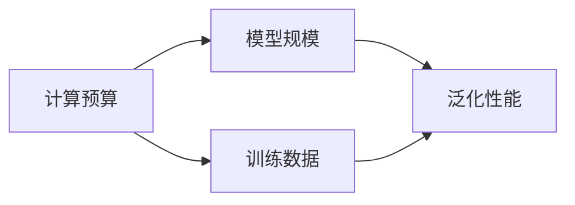

# AI 大模型计算机科学家群英传：AI 大模型的规模定律 Scaling Law 

## 1. 背景介绍
### 1.1  问题的由来
近年来,人工智能领域出现了一股AI大模型的热潮。从OpenAI的GPT-3到DeepMind的Gopher和Chinchilla,再到最近Google的PaLM等,各大科技巨头和研究机构纷纷推出了自己的超大规模语言模型。这些模型参数量动辄上百亿甚至上千亿,在多个自然语言处理任务上取得了超越人类的性能,展现出了令人惊叹的能力。

然而,训练这些超大规模模型需要投入大量的计算资源和训练数据,成本高昂。同时,模型规模越大,训练和推理的时间也越长,给实际应用带来不便。因此,研究AI大模型的规模与性能之间的关系,找到最佳的模型规模,成为了一个重要的研究问题。

### 1.2  研究现状  
为了探索AI大模型的规模与性能之间的关系,研究者提出了一个重要概念——规模定律(Scaling Law)。规模定律描述了模型规模(如参数量、计算量等)与性能之间的数学关系。通过对大量不同规模模型的实验数据进行拟合,可以得到一个描述规模与性能关系的数学公式。

目前,已经有不少研究工作探索了AI大模型的规模定律。比较有代表性的工作包括:

- Kaplan等人[1]研究了Transformer语言模型在不同规模下的性能表现,发现对数损失与模型规模呈幂律关系。 
- Henighan等人[2]研究了不同模态(如语言、视觉等)下的规模定律,发现不同任务的最佳模型规模不尽相同。
- Hoffmann等人[3]研究了模型规模、数据规模与计算预算之间的关系,提出了一个统一的框架来指导模型扩展。

这些研究工作为理解AI大模型的行为和发展趋势提供了重要的理论基础。但目前对规模定律的研究还处于起步阶段,还有许多问题有待进一步探索,如跨模态规模定律、规模定律的理论解释等。

### 1.3  研究意义
研究AI大模型的规模定律有着重要的理论和实践意义:

1. 指导模型设计。规模定律可以帮助我们预测不同规模下模型的性能,从而指导我们如何设计和优化模型架构,以在给定的计算预算下获得最佳性能。

2. 加速模型开发。了解规模定律,可以帮助我们快速估计达到目标性能所需的模型规模和计算资源,从而加速模型的开发和迭代过程。 

3. 降低训练成本。通过规模定律,我们可以找到性能和成本的最佳平衡点,用最小的模型规模达到理想的性能,从而大幅降低训练和部署的成本。

4. 理解认知机理。AI大模型展现出了一定的类人智能,研究其规模定律可以帮助我们从计算的角度理解人类认知能力的局限和增长规律。

5. 预测未来发展。规模定律可以外推预测AI大模型未来的发展趋势和极限,为相关研究和产业发展提供前瞻性的指引。

### 1.4  本文结构
本文将全面探讨AI大模型的规模定律。第2部分介绍相关的核心概念。第3部分讨论规模定律的核心算法原理和操作步骤。第4部分给出规模定律的数学模型和公式推导。第5部分通过代码实例演示如何实践规模定律。第6部分讨论规模定律在实际应用中的场景。第7部分推荐相关工具和资源。第8部分总结全文并展望未来。第9部分附录了常见问题解答。

## 2. 核心概念与联系

在讨论AI大模型的规模定律之前,我们首先需要明确几个核心概念:

- 模型规模:通常用参数量、计算量(如FLOPs)等指标来衡量模型的规模。
- 训练数据:模型在训练过程中使用的数据集的规模,通常用样本数、token数等来衡量。  
- 计算预算:训练模型所消耗的计算资源,如GPU/TPU时间、能耗等。
- 泛化性能:模型在新任务上的表现,如在下游任务上的精度、在零样本/少样本任务上的性能等。

这几个概念之间有着密切的联系,构成了影响模型性能的几个关键因素。下图展示了它们之间的关系:

可以看到,模型规模和训练数据都会影响模型的泛化性能,而计算预算又会制约模型规模和训练数据的规模。规模定律要研究的就是在给定计算预算下,如何权衡模型规模和训练数据,以达到最优的泛化性能。

## 3. 核心算法原理 & 具体操作步骤
### 3.1  算法原理概述
规模定律的核心思想是通过实验数据拟合出模型规模与性能之间的数学关系。具体来说,主要分为以下几个步骤:

1. 构建不同规模的模型(如不同参数量、深度、宽度等)
2. 在固定的训练数据集上训练这些模型
3. 在固定的测试集上评估这些模型的性能
4. 收集模型规模和性能的数据对
5. 用数学函数对数据对进行拟合,得到规模定律方程

得到规模定律方程后,我们就可以用它来预测任意规模下模型的性能,指导模型的设计和优化。

### 3.2  算法步骤详解

下面我们详细讲解每个步骤的实现要点。

步骤1: 构建不同规模的模型
- 首先要选择一个基础模型架构,如Transformer、ResNet等 
- 然后通过调节模型的参数量、深度、宽度等超参数,构建一系列不同规模的模型
- 注意模型规模的跨度要足够大,覆盖不同量级,如百万到百亿参数量级
- 也可以考虑不同的模型变体,如稀疏模型、压缩模型等

步骤2: 训练模型
- 选择一个固定的训练数据集,保证所有模型使用相同的训练数据
- 对每个模型进行训练,直到收敛或达到预设的迭代轮数
- 训练过程中使用相同的优化算法和超参数设置(如学习率、batch size等) 
- 记录每个模型的训练时间和计算量(如FLOPs)

步骤3: 评估模型性能  
- 选择一个固定的测试集,保证所有模型在相同的测试集上评估
- 评估每个模型在测试集上的性能,如精度、F1值、交叉熵损失等
- 对于生成任务,可以考虑使用BLEU、ROUGE等指标
- 对于零样本/少样本任务,可以评估模型的泛化和适应能力

步骤4: 收集数据对
- 将每个模型的规模(如参数量)和性能(如测试集精度)组成数据对(x,y)
- 收集所有模型的数据对,形成一个数据集
- 对数据进行清洗和预处理,如去除异常点、归一化等

步骤5: 函数拟合 
- 观察数据的分布趋势,选择合适的函数形式,如幂函数、对数函数等
- 用最小二乘法等方法对数据进行拟合,得到函数的参数
- 评估拟合的优度,如计算R平方、均方误差等
- 不断调整函数形式和参数,直到得到最优的拟合结果

### 3.3  算法优缺点

规模定律算法的主要优点包括:
- 简单易懂:算法思路清晰,容易实现
- 通用性强:适用于各种类型的模型和任务
- 可解释性好:拟合得到的函数能清晰刻画规模和性能的关系

同时,该算法也有一些局限和不足:
- 依赖经验:函数形式的选择需要一定的先验知识和经验
- 数据质量要求高:异常数据点会极大影响拟合结果
- 外推风险大:在数据范围之外的外推预测可能有较大偏差

### 3.4  算法应用领域
规模定律算法已经在多个领域得到了成功应用,包括:

- 自然语言处理:如语言模型、机器翻译、问答系统等
- 计算机视觉:如图像分类、目标检测、语义分割等  
- 语音识别:如声学模型、语言模型等
- 推荐系统:如协同过滤、矩阵分解等
- 强化学习:如策略网络、价值网络等

此外,该算法还可以应用于神经网络架构搜索、自动机器学习等领域,指导最优模型的设计和选择。

## 4. 数学模型和公式 & 详细讲解 & 举例说明
### 4.1  数学模型构建
构建规模定律的数学模型,需要选择合适的函数形式来描述模型规模和性能之间的关系。根据前人的研究和经验,幂函数是一个很好的选择:

$$
P = a \cdot S^b + c
$$

其中,$P$表示模型性能,$S$表示模型规模,$a$、$b$、$c$为待拟合的参数。该函数形式有以下优点:
- 能够很好地描述规模和性能的非线性关系
- 参数具有明确的物理意义:$a$控制曲线的整体高度,$b$控制曲线的增长速率,$c$表示性能的下界
- 便于求导和优化,数学性质良好

当然,也可以考虑其他函数形式,如对数函数:

$$
P = a \cdot \log(S) + b
$$

或分段函数:

$$
P = 
\begin{cases}
a_1 \cdot S + b_1, & S \leq S_0 \\
a_2 \cdot S^{b_2} + c_2, & S > S_0
\end{cases}
$$

具体选择哪种函数形式,需要根据数据的分布特点和先验知识来决定。

### 4.2  公式推导过程
以幂函数为例,我们详细推导拟合参数$a$、$b$、$c$的计算公式。

假设我们收集了$n$个模型的规模和性能数据对$(S_i,P_i),i=1,2,\cdots,n$,我们要找到最优的参数值,使得函数曲线与数据点的误差最小。采用最小二乘法,定义误差函数:

$$
E(a,b,c) = \sum_{i=1}^n (P_i - (a \cdot S_i^b + c))^2
$$

要最小化误差函数,需要对参数$a$、$b$、$c$分别求偏导,并令偏导数为0:

$$
\frac{\partial E}{\partial a} = -2 \sum_{i=1}^n (P_i - (a \cdot S_i^b + c)) \cdot S_i^b = 0 \\
\frac{\partial E}{\partial b} = -2a \sum_{i=1}^n (P_i - (a \cdot S_i^b + c)) \cdot S_i^b \log S_i = 0 \\
\frac{\partial E}{\partial c} = -2 \sum_{i=1}^n (P_i - (a \cdot S_i^b + c)) = 0
$$

化简整理后得到:

$$
a \sum_{i=1}^n S_i^{2b} + c \sum_{i=1}^n S_i^b = \sum_{i=1}^n P_i \cdot S_i^b \\
a \sum_{i=1}^n S_i^b \log S_i + c \sum_{i=1}^n \log S_i = \sum_{i=1}^n P_i \cdot \log S_i \\  
a \sum_{i=1}^n S_i^b + nc = \sum_{i=1}^n P_i
$$

这是一个非线性方程组,没有解析解,需要用数值优化方法求解,如梯度下降法、牛顿法等。

### 4.3  案例分析与讲解

下面我们以一个具体的例子来说明规模定律的应用。假设我们收集了5个语言模型在不同参数量下的测试集perplexity:

| 参数量(百万) | Per