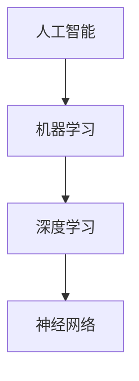
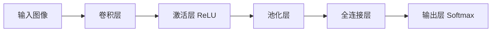
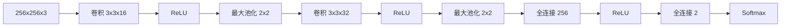

# AI 大模型计算机科学家群英传：OpenAI首席科学家 Ilya Sutskever

## 1. 背景介绍

### 1.1 问题的由来

人工智能(Artificial Intelligence, AI)的发展在近年来取得了突飞猛进的进步,尤其是以深度学习(Deep Learning)为代表的AI技术,在计算机视觉、自然语言处理、语音识别等领域取得了一系列重大突破。而推动AI发展的重要力量,除了海量数据和强大算力外,更离不开一批顶尖的AI科学家。他们以非凡的洞察力和创新精神,不断突破AI技术的边界,推动着人工智能从理论走向应用。

### 1.2 研究现状

在当前AI领域的众多科学家中,Ilya Sutskever无疑是最耀眼的明星之一。作为OpenAI的联合创始人兼首席科学家,Sutskever带领团队在AI基础研究和应用落地方面取得了一系列标志性成果。尤其是近期推出的大型语言模型GPT-4,再次引发了业界对AI技术前景的广泛讨论和憧憬。

### 1.3 研究意义

深入了解Sutskever的学术背景和研究工作,对于我们洞察AI技术发展脉络,把握未来AI走向具有重要意义。通过分析Sutskever在AI领域的重要贡献,我们可以一窥当前AI技术的最新进展,思考AI未来可能的突破方向。同时Sutskever的成长历程和研究风格,也为有志于投身AI事业的青年学子提供了宝贵的学习榜样。

### 1.4 本文结构

本文将从以下几个方面展开对Ilya Sutskever的介绍和分析:

- 第2部分介绍Sutskever的教育和学术背景,梳理其研究生涯的重要节点。 
- 第3部分重点分析Sutskever在AI领域的代表性工作,尤其是在计算机视觉、自然语言处理等方面的突破性贡献。
- 第4部分讨论Sutskever作为OpenAI首席科学家,在推动大模型研发和产业化落地方面的重要举措。
- 第5部分总结Sutskever的学术特点和研究风格,分析其成功背后的关键因素。
- 第6部分展望在Sutskever引领下的OpenAI未来发展,并对AI技术的未来趋势做出预判。

## 2. 核心概念与联系

要深入理解Sutskever的研究工作,首先需要厘清几个AI领域的核心概念:

- 人工智能(Artificial Intelligence):让机器具备类似人类智能的技术,使其能够模拟、延伸和扩展人的智力。
- 机器学习(Machine Learning):一种实现人工智能的方法,通过学习算法,使机器能够从数据中自动分析获得规律,并利用规律对未知数据进行预测。
- 深度学习(Deep Learning):机器学习的一个分支,通过构建多层神经网络,模拟人脑学习和决策过程,让机器可以直接从数据中学习特征。
- 神经网络(Neural Network):一种模拟生物神经网络的计算模型,由大量的节点(神经元)通过相互连接构成网络,每个节点可以对输入信号进行基于权重的计算。

这些概念之间的关系如下图所示:

深度学习作为机器学习的一个重要分支,是Sutskever研究工作的核心。他在改进深度神经网络结构、提升模型训练效率等方面做出了诸多贡献。

## 3. 核心算法原理 & 具体操作步骤

### 3.1 算法原理概述

Sutskever在深度学习领域的一个重要贡献是优化了深度神经网络的训练算法。传统的神经网络训练面临梯度消失(Vanishing Gradient)的问题,导致网络难以优化。Sutskever提出了两种改进方法:

1. 引入ReLU激活函数,替代Sigmoid函数,缓解梯度消失问题。
2. 采用随机梯度下降(SGD)算法,加速模型收敛。

### 3.2 算法步骤详解

以采用ReLU和SGD训练神经网络为例,其主要步骤如下:

1. 定义神经网络结构,确定网络层数、每层神经元个数。
2. 初始化神经元权重参数,通常采用Xavier初始化方法。  
3. 前向传播,逐层计算每个神经元的输出:
   
$$
a_j^l = \sigma(\sum_{i=1}^{n^{l-1}} w_{ij}^l a_i^{l-1} + b_j^l)
$$

其中$a_j^l$为第$l$层第$j$个神经元的输出,$w_{ij}^l$为第$l-1$层第$i$个神经元到第$l$层第$j$个神经元的权重,$b_j^l$为第$l$层第$j$个神经元的偏置项,$\sigma$为激活函数,ReLU定义为:

$$
ReLU(x) = max(0, x)
$$

4. 计算损失函数,例如均方误差损失:

$$
J(w,b) = \frac{1}{2m} \sum_{k=1}^m (h_{w,b}(x^k) - y^k)^2
$$

5. 反向传播,计算损失函数对每层权重和偏置的梯度:

$$
\frac{\partial J}{\partial w_{ij}^l} = a_i^{l-1} \delta_j^l
$$
$$  
\frac{\partial J}{\partial b_{j}^l} = \delta_j^l
$$

其中$\delta_j^l$为第$l$层第$j$个神经元的误差项。

6. 采用SGD算法更新权重和偏置:

$$
w_{ij}^l := w_{ij}^l - \alpha \frac{\partial J}{\partial w_{ij}^l} 
$$
$$
b_j^l := b_j^l - \alpha \frac{\partial J}{\partial b_j^l}
$$

其中$\alpha$为学习率。 

7. 重复步骤3-6,直到损失函数收敛或达到预设的训练轮数。

### 3.3 算法优缺点

Sutskever优化的深度学习算法相比传统方法有以下优点:

- ReLU激活函数有效缓解了梯度消失问题,使得训练更深层网络成为可能。
- SGD算法通过小批量训练数据,可以加速模型收敛,提高训练效率。

但该算法也存在一些局限:

- 对参数初始化和学习率较为敏感,需要进行反复调试。
- 仍然面临梯度爆炸、过拟合等风险,需要采取正则化等措施。

### 3.4 算法应用领域

Sutskever改进的深度学习算法已在多个领域得到广泛应用,例如:

- 计算机视觉:图像分类、目标检测、语义分割等
- 自然语言处理:机器翻译、文本分类、情感分析等  
- 语音识别:声学模型、语言模型的建模与优化

这些应用有力地推动了人工智能在现实世界中的落地,展现了深度学习技术的巨大潜力。

## 4. 数学模型和公式 & 详细讲解 & 举例说明

### 4.1 数学模型构建

以图像分类任务为例,说明如何应用Sutskever优化的深度学习算法构建数学模型。假设我们要构建一个识别猫狗图像的分类器,输入为图像像素矩阵$X$,输出为图像类别(猫或狗)的概率分布$\hat{y}$。我们采用卷积神经网络(CNN)作为分类模型:

### 4.2 公式推导过程

模型的前向传播过程可以用以下公式表示:

1. 卷积层:

$$
z_{i,j,k}^l = \sum_{m=0}^{M-1} \sum_{n=0}^{N-1} \sum_{c=0}^{C-1} w_{m,n,c,k}^l \cdot a_{i+m,j+n,c}^{l-1} + b_k^l
$$

其中$z_{i,j,k}^l$为第$l$层第$k$个卷积核在位置$(i,j)$的输出,$w_{m,n,c,k}^l$为卷积核的权重参数,$a_{i,j,c}^{l-1}$为上一层第$c$个特征图在位置$(i,j)$的输出。

2. 激活层(ReLU):

$$
a_{i,j,k}^l = max(0, z_{i,j,k}^l)
$$

3. 池化层(Max Pooling):

$$
a_{i,j,k}^l = \max_{m=0,n=0}^{s-1} a_{si+m,sj+n,k}^{l-1}
$$

其中$s$为池化窗口大小。

4. 全连接层:

$$
z_j^l = \sum_{i=0}^{M-1} w_{ij}^l a_i^{l-1} + b_j^l
$$
$$
a_j^l = max(0, z_j^l)
$$

5. 输出层(Softmax):

$$
\hat{y}_j = \frac{e^{z_j^L}}{\sum_{k=1}^K e^{z_k^L}}
$$

其中$\hat{y}_j$为第$j$类的预测概率,$z_j^L$为最后一层第$j$个神经元的输出,$K$为类别总数。

模型的训练过程就是通过SGD算法,最小化交叉熵损失函数:

$$
J(w,b) = -\frac{1}{m} \sum_{i=1}^m \sum_{j=1}^K y_j^{(i)} \log \hat{y}_j^{(i)}
$$

其中$y_j^{(i)}$为第$i$个样本的真实标签(独热编码)。

### 4.3 案例分析与讲解

我们用一个简单的例子来说明模型的工作原理。假设输入是一张256x256的猫的图像,我们用一个简化版的CNN模型进行分类:

前向传播过程如下:

1. 第一个卷积层将图像卷积为64x64x16的特征图。
2. ReLU层对特征图进行非线性变换。
3. 最大池化层将特征图下采样为32x32x16。
4. 第二个卷积层将特征图卷积为16x16x32。
5. ReLU层对特征图进行非线性变换。
6. 最大池化层将特征图下采样为8x8x32。
7. 全连接层将特征图展平为256维向量。
8. ReLU层对特征向量进行非线性变换。
9. 全连接层将特征向量映射为2维logits向量。
10. Softmax层将logits向量归一化为概率分布[0.9, 0.1],表示输入图像有90%的概率是猫,10%的概率是狗。

反向传播时,我们将真实标签[1, 0](猫)与预测概率分布的交叉熵损失进行梯度计算,并用SGD优化算法更新每一层的权重,最终得到一个训练好的猫狗分类器。

### 4.4 常见问题解答

Q: 深度学习需要大量的训练数据和算力,对于中小企业是否有应用门槛?

A: 得益于迁移学习和云计算的发展,中小企业也可以用较低成本开展深度学习应用。可以利用预训练模型(如ImageNet上训练的ResNet)进行微调,或者在云平台上按需购买GPU资源,降低深度学习的应用门槛。

Q: 深度学习模型是个黑盒子,如何解释其决策过程?

A: 这是目前深度学习面临的一个重要挑战。可解释性研究正试图从可视化、属性归因等角度,来揭示深度学习模型的工作机制。不过就目前而言,深度学习还不能完全替代人类的决策,在一些