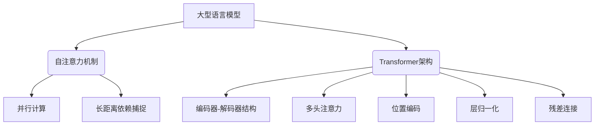

以下是根据您提供的要求和模板，撰写的技术博客文章正文内容：

# AI 大模型计算机科学家群英传：图灵

## 1. 背景介绍

### 1.1 问题的由来

在人工智能发展的浪潮中，大型语言模型的出现引发了广泛关注和讨论。作为当前AI领域的焦点，这些庞大的神经网络系统展现出了令人惊叹的语言理解和生成能力。然而，它们的内部机理仍然是一个未解之谜,对于这些"黑箱"系统的工作原理了解甚少。

### 1.2 研究现状  

目前,学术界和工业界都在努力探索和解开大型语言模型的奥秘。一些研究人员试图通过可视化和解释技术来窥探模型内部,而另一些则专注于优化和提高这些模型的性能。然而,由于这些系统的复杂性和规模,揭示它们内在的计算机科学原理仍然是一个巨大的挑战。

### 1.3 研究意义

深入理解大型语言模型的内在机制对于充分发挥它们的潜力至关重要。通过揭示驱动这些系统的核心概念和算法,我们不仅可以更好地解释和控制它们的行为,还可以为未来的AI系统设计提供指导。此外,这一研究还可能产生对计算机科学其他领域同样有价值的见解和发现。

### 1.4 本文结构

本文将探讨大型语言模型背后的核心计算机科学原理。我们将首先介绍一些关键概念,如自注意力机制和transformer架构。然后,我们将深入探讨这些模型的核心算法,包括训练过程和推理过程。接下来,我们将解析支撑这些算法的数学模型和公式。此外,我们还将提供实际的代码示例和实现细节。最后,我们将讨论这些模型在实际应用中的作用,并展望它们未来的发展方向和挑战。

## 2. 核心概念与联系

大型语言模型的核心概念主要包括自注意力机制和Transformer架构。

### 2.1 自注意力机制

自注意力机制是一种用于捕捉输入序列中长距离依赖关系的关键技术。不同于传统的序列模型(如RNN和LSTM),自注意力允许模型直接关注整个输入序列中的任何位置,而不受位置距离的限制。这使得模型能够更好地建模长期依赖关系,提高了对长序列的处理能力。

自注意力机制的一个关键优势是它支持高度并行计算,这使得在GPU和TPU等硬件加速器上的训练和推理变得高效。与RNN相比,自注意力不需要按序列顺序计算,从而避免了传统序列模型中的计算瓶颈。

### 2.2 Transformer架构

Transformer是第一个广泛采用自注意力机制的序列模型架构。它完全放弃了RNN的递归结构,而是依赖于自注意力层来捕捉输入和输出序列之间的依赖关系。

Transformer架构由编码器(Encoder)和解码器(Decoder)两个主要部分组成,它们都由多个相同的层堆叠而成。每一层都包含一个多头自注意力子层和一个前馈神经网络子层。

除了自注意力机制之外,Transformer还引入了一些其他关键技术,如位置编码(Position Encoding)、层归一化(Layer Normalization)和残差连接(Residual Connection),它们共同赋予了Transformer强大的建模能力。

## 3. 核心算法原理 & 具体操作步骤

大型语言模型的核心算法包括两个主要部分:训练算法和推理(生成)算法。

### 3.1 算法原理概述

**训练算法**的目标是通过大量文本数据对模型进行有监督的训练,使其学习到语言的统计规律。这通常采用自监督的方式,即模型需要预测被掩蔽(masked)的词元。训练过程中,模型的参数通过反向传播算法和优化器(如AdamW)进行不断更新,以最小化预测误差。

**推理算法**则是在给定的文本提示(prompt)的基础上,通过模型生成连贯、自然的后续文本。这是一个自回归(auto-regressive)的过程,其中每个新生成的词元都将作为输入传递回模型,以生成下一个词元。

### 3.2 算法步骤详解

#### 3.2.1 训练算法

1. **数据预处理**:将大量文本语料进行标记化(tokenization)、词元化(wordpiece)等预处理,构建训练数据集。
2. **掩蔽策略**:在训练样本中随机选择一些词元进行掩蔽(masked),作为模型需要预测的目标。
3. **前向传播**:将掩蔽后的输入序列传递给Transformer模型,计算出对掩蔽位置的预测分布。
4. **损失计算**:将预测分布与实际标签(被掩蔽的词元)进行比较,计算损失(如交叉熵损失)。
5. **反向传播**:根据损失对模型参数进行梯度更新,使用优化器(如AdamW)最小化损失。
6. **迭代训练**:重复上述步骤,持续消化新的训练数据,直至模型收敛。

#### 3.2.2 推理算法

1. **输入处理**:将用户提供的文本提示(prompt)进行标记化和词元化处理。
2. **上下文编码**:将处理后的提示输入到Transformer的编码器,获得其上下文表示。
3. **起始状态**:将编码器的输出作为解码器的初始状态。
4. **自回归生成**:
    a. 将特殊的起始词元(start token)输入解码器
    b. 解码器根据当前输入和状态,输出下一个词元的概率分布
    c. 从概率分布中采样(或选择最大值)获得下一个词元
    d. 将新词元附加到已生成序列,并回到步骤a,重复该过程
    e. 直到达到最大长度或遇到终止词元(end token)

### 3.3 算法优缺点

**优点**:

- 并行性:自注意力机制支持高度并行计算,加速训练和推理。
- 长期依赖建模:能够有效捕捉长距离依赖关系。
- 无偏见:Transformer的架构没有序列长度的内在偏差。

**缺点**:

- 计算开销大:自注意力需要计算输入序列的每对元素之间的相似度,计算量随长度的平方增长。
- 缺乏归纳偏置:与RNN等序列模型相比,Transformer缺乏对序列的归纳偏置。
- 生成不连贯:生成的长文本可能出现不连贯、矛盾的情况。

### 3.4 算法应用领域

大型语言模型及其核心算法在自然语言处理的多个领域都有广泛应用,包括但不限于:

- 机器翻译
- 文本生成(如新闻、故事、诗歌等)
- 问答系统
- 文本摘要
- 情感分析
- 代码生成(如代码自动补全)
- 知识图谱构建

## 4. 数学模型和公式 & 详细讲解 & 举例说明

大型语言模型的核心数学模型是基于自注意力机制和Transformer架构。我们将详细介绍其中的关键公式,并通过具体示例加深理解。

### 4.1 数学模型构建

自注意力机制的核心是计算查询(Query)与键(Key)之间的相似性分数,并将其与值(Value)相结合以产生注意力加权的表示。具体来说,给定一个输入序列$X = (x_1, x_2, \ldots, x_n)$,我们首先通过三个不同的线性投影将其映射到查询(Query)、键(Key)和值(Value)空间,得到$Q = (q_1, q_2, \ldots, q_n)$、$K = (k_1, k_2, \ldots, k_n)$和$V = (v_1, v_2, \ldots, v_n)$。

然后,对于每个查询$q_i$,我们计算其与所有键$k_j$的相似性分数:

$$\text{Score}(q_i, k_j) = q_i^T k_j$$

这些分数通过SoftMax函数归一化,得到注意力权重:

$$\alpha_{ij} = \frac{\exp(\text{Score}(q_i, k_j))}{\sum_{l=1}^n \exp(\text{Score}(q_i, k_l))}$$

最后,通过将注意力权重与值(Value)相结合,我们可以获得注意力加权的表示:

$$\text{Attention}(q_i) = \sum_{j=1}^n \alpha_{ij} v_j$$

在Transformer中,自注意力机制被应用于编码器和解码器的每一层。编码器的自注意力用于捕捉输入序列内的依赖关系,而解码器则包含两种自注意力:一种用于捕捉已生成输出序列内的依赖关系,另一种则用于关注输入序列,实现编码器-解码器的交互。

### 4.2 公式推导过程

我们将通过一个简单的例子,逐步推导自注意力机制中的关键公式。假设我们有一个长度为3的输入序列$X = (x_1, x_2, x_3)$,我们希望计算第二个位置$x_2$的注意力加权表示。

1. 线性投影:
   $$\begin{aligned}
   q_2 &= W_Q x_2 \\
   k_1, k_2, k_3 &= W_K x_1, W_K x_2, W_K x_3 \\
   v_1, v_2, v_3 &= W_V x_1, W_V x_2, W_V x_3
   \end{aligned}$$

2. 计算相似性分数:
   $$\begin{aligned}
   \text{Score}(q_2, k_1) &= q_2^T k_1 \\
   \text{Score}(q_2, k_2) &= q_2^T k_2 \\
   \text{Score}(q_2, k_3) &= q_2^T k_3
   \end{aligned}$$

3. 计算注意力权重:
   $$\begin{aligned}
   \alpha_{21} &= \frac{\exp(\text{Score}(q_2, k_1))}{\exp(\text{Score}(q_2, k_1)) + \exp(\text{Score}(q_2, k_2)) + \exp(\text{Score}(q_2, k_3))} \\
   \alpha_{22} &= \frac{\exp(\text{Score}(q_2, k_2))}{\exp(\text{Score}(q_2, k_1)) + \exp(\text{Score}(q_2, k_2)) + \exp(\text{Score}(q_2, k_3))} \\
   \alpha_{23} &= \frac{\exp(\text{Score}(q_2, k_3))}{\exp(\text{Score}(q_2, k_1)) + \exp(\text{Score}(q_2, k_2)) + \exp(\text{Score}(q_2, k_3))}
   \end{aligned}$$

4. 计算注意力加权表示:
   $$\text{Attention}(q_2) = \alpha_{21} v_1 + \alpha_{22} v_2 + \alpha_{23} v_3$$

通过这个例子,我们可以清楚地看到自注意力机制是如何捕捉输入序列内的依赖关系,并产生注意力加权的表示。

### 4.3 案例分析与讲解

让我们通过一个具体的案例来进一步理解自注意力机制。假设我们有一个简单的英语句子"The cat sat on the mat"。我们将展示自注意力如何帮助模型捕捉单词之间的依赖关系。

1. 输入embedding:
   $$X = (\text{The}, \text{cat}, \text{sat}, \text{on}, \text{the}, \text{mat})$$

2. 线性投影:
   $$\begin{aligned}
   Q &= (q_\text{The}, q_\text{cat}, q_\text{sat}, q_\text{on}, q_\text{the}, q_\text{mat}) \\
   K &= (k_\text{The}, k_\text{cat}, k_\text{sat}, k_\text{on