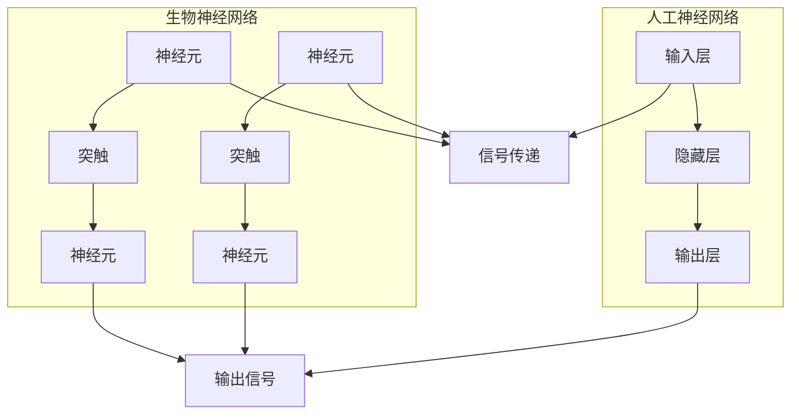

# AI 神经网络计算艺术之禅：如何把大自然亿万年进化训练出的生物神经网络作为新一代人工神经网络的蓝本

## 1. 背景介绍

### 1.1 问题的由来

人工智能领域的发展一直是科技界的热门话题。在过去几十年中,神经网络作为一种强大的机器学习模型,已经在图像识别、自然语言处理、推荐系统等诸多领域展现出了卓越的性能。然而,现有的人工神经网络模型在很大程度上仍然是基于数学和工程领域的知识,与生物神经系统有着天壤之别。大自然在漫长的进化过程中,已经"训练"出了高度优化的生物神经网络,这些网络不仅具有强大的计算能力,而且在能耗、鲁棒性和自适应性等方面都展现出了卓越的性能。如何借鉴大自然的智慧,将生物神经网络的优势融入到人工智能系统中,成为了一个极具吸引力的研究方向。

### 1.2 研究现状

生物神经网络的研究可以追溯到20世纪60年代,当时的神经生物学家开始探索大脑中神经元的工作原理。随着科学技术的进步,研究人员能够更加深入地观察和分析生物神经网络的结构和功能。近年来,一些先驱性的研究工作已经开始尝试将生物神经网络的原理应用到人工智能领域,例如:

- 斯坦福大学的研究人员设计了一种基于生物神经元的神经网络芯片,模拟了生物神经元的"滞后"行为,展现出了更高的能效和鲁棒性。

- 麻省理工学院的科学家们开发了一种名为"反向生物学"的方法,通过对生物神经网络的深入研究,提取出可应用于人工智能的原理和算法。

- 加州大学伯克利分校的研究团队则着眼于大脑中的"奖赏预测错误"机制,设计出了一种新型的强化学习算法。

这些研究工作为将生物神经网络的优势融入人工智能系统奠定了基础,但仍然存在诸多挑战有待克服。

### 1.3 研究意义

将生物神经网络的原理应用到人工智能领域,不仅可以推动人工智能技术的发展,还有助于我们更好地理解大脑的工作机制。具体来说,这一研究方向具有以下重要意义:

1. **提高人工神经网络的性能**。生物神经网络在能耗、鲁棒性、自适应性等方面都展现出了卓越的性能。借鉴这些优势,有望显著提升人工神经网络的计算能力和效率。

2. **开辟新的人工智能发展道路**。目前的人工智能系统主要基于数学和工程领域的知识,而生物神经网络则提供了一种全新的计算范式。探索这一范式,有望开辟人工智能发展的新道路。

3. **促进人工智能与神经科学的交叉融合**。这一研究方向将人工智能与神经科学紧密结合,有助于两个学科互相促进、相得益彰。

4. **加深对大脑的理解**。通过模拟和分析生物神经网络的工作原理,我们能够更好地理解人脑这一复杂系统的运作机制。

5. **推动相关技术的发展**。为了实现生物神经网络原理在人工智能领域的应用,必将推动神经科学、材料科学、纳米技术等相关领域的进步。

总的来说,将生物神经网络的原理应用到人工智能领域,不仅是一个极具吸引力的科研方向,也是推动人工智能、神经科学乃至整个科技事业发展的重要途径。

### 1.4 本文结构

本文将从以下几个方面全面探讨如何将生物神经网络的原理应用到人工智能领域:

1. 介绍生物神经网络与人工神经网络的核心概念,分析两者的联系和区别。

2. 阐述生物神经网络中的核心算法原理,并详细讲解具体的操作步骤。

3. 构建数学模型,推导相关公式,并结合案例进行详细讲解和常见问题解答。

4. 通过项目实践,提供代码实例并进行详细解释说明。

5. 探讨生物神经网络原理在实际应用场景中的前景。

6. 推荐相关的学习资源、开发工具和论文等。

7. 总结研究成果,展望未来发展趋势并分析面临的挑战。

8. 在附录部分,回答常见的问题。

## 2. 核心概念与联系

生物神经网络和人工神经网络虽然在本质上存在着一些相似之处,但它们之间也有着显著的区别和联系。

首先,让我们来看一下两者的核心概念:

**生物神经网络**由大量的神经元和突触组成。神经元是生物神经网络的基本计算单元,它可以接收来自其他神经元的输入信号,并根据这些信号的强度和突触的权重进行计算,最终决定是否产生输出信号并将其传递给下一个神经元。突触则是神经元之间的连接,它决定了信号在神经网络中的传播路径和强度。

**人工神经网络**则是对生物神经网络的数学抽象和模拟。它通常由输入层、隐藏层和输出层组成。输入层接收外部数据,隐藏层对数据进行处理和特征提取,输出层则产生最终的结果。每一层之间都由大量的连接权重相连,这些权重决定了信号在网络中的传播强度。

虽然两者在结构和工作机制上存在一定区别,但它们也有着内在的联系:

1. **信号传递**。无论是生物神经网络还是人工神经网络,都是通过信号的传递来实现计算和信息处理的。

2. **网络拓扑**。两种网络都是由大量的节点(神经元或神经元层)和连接(突触或权重)组成的复杂网络结构。

3. **学习和自适应**。生物神经网络和人工神经网络都能够通过学习和训练来自适应环境,提高计算能力。

4. **并行计算**。两种网络都能够利用大量的节点同时进行并行计算,提高计算效率。

5. **分布式存储**。信息在两种网络中都是以分布式的方式存储和表示的,而不是集中存储在某个特定位置。

总的来说,人工神经网络虽然是对生物神经网络的模拟和抽象,但两者在本质上都是复杂的信息处理系统,具有许多相似之处。通过深入研究生物神经网络的工作原理,我们有望为人工智能系统的设计和优化提供新的思路和启发。

## 3. 核心算法原理 & 具体操作步骤

### 3.1 算法原理概述

生物神经网络中的核心算法原理主要包括以下几个方面:

1. **信号传递与积分**

   在生物神经网络中,神经元通过树突接收来自其他神经元的输入信号。这些信号会在神经元的细胞体内进行积分,当积分值超过一定阈值时,神经元就会产生动作电位,并通过轴突将信号传递给下一个神经元。

2. **突触可塑性**

   突触是神经元之间的连接,它决定了信号在网络中的传播路径和强度。突触的强度(即权重)并不是固定不变的,而是会根据神经元的活动模式发生变化,这种现象被称为突触可塑性。突触可塑性是生物神经网络学习和记忆的基础。

3. **奖赏预测误差**

   大脑中的一种重要机制是奖赏预测误差,它描述了实际获得的奖赏与预期奖赏之间的差异。这种误差信号会通过突触可塑性的作用,调整神经网络的连接强度,从而实现强化学习。

4. **注意力机制**

   生物神经网络能够有选择地关注感兴趣的信息,而忽略无关的信息,这种机制被称为注意力机制。注意力机制有助于提高信息处理的效率,并且在视觉、语言等认知过程中扮演着重要角色。

5. **并行分布式处理**

   生物神经网络是一种高度并行和分布式的计算系统。信息不是集中存储在某个特定位置,而是以分布式的方式编码在整个网络中。这种并行分布式处理机制赋予了生物神经网络强大的容错能力和鲁棒性。

这些核心算法原理为生物神经网络赋予了独特的计算能力和优势,也为我们设计新一代人工智能系统提供了宝贵的启发。

### 3.2 算法步骤详解

接下来,我们将详细介绍生物神经网络中的核心算法步骤:

1. **信号传递与积分**

   - 步骤1:神经元通过树突接收来自其他神经元的输入信号。
   - 步骤2:输入信号在神经元的细胞体内进行时间和空间上的积分。
   - 步骤3:当积分值超过一定阈值时,神经元会产生动作电位。
   - 步骤4:动作电位通过轴突传递给下一个神经元。

2. **突触可塑性**

   - 步骤1:初始时,突触的强度(权重)是随机分布的。
   - 步骤2:当前神经元和后继神经元同时被激活时,它们之间突触的强度会发生变化(长期增强或长期抑制)。
   - 步骤3:突触强度的变化遵循赫布规则(Hebbian rule),即"神经元之间在同步活动时,连接它们的突触就会加强"。
   - 步骤4:通过不断的学习和训练,突触强度会逐渐收敛到一个稳定的分布,从而编码输入模式与输出模式之间的映射关系。

3. **奖赏预测误差**

   - 步骤1:大脑会根据当前状态和过去的经验,预测未来可能获得的奖赏。
   - 步骤2:当实际获得的奖赏与预期不符时,会产生一个奖赏预测误差信号。
   - 步骤3:奖赏预测误差信号会通过突触可塑性的作用,调整相关神经元之间突触的强度。
   - 步骤4:通过不断的试错和调整,神经网络可以学会预测奖赏,并作出最优决策。

4. **注意力机制**

   - 步骤1:神经元会对不同的输入信号赋予不同的注意力权重。
   - 步骤2:具有较高注意力权重的信号会被优先处理和传递。
   - 步骤3:注意力权重的分配受到自上而下(基于任务目标)和自下而上(基于刺激特征)两种机制的共同调控。
   - 步骤4:通过动态调整注意力权重,神经网络可以有选择地关注重要信息,提高计算效率。

5. **并行分布式处理**

   - 步骤1:信息以分布式的方式编码在整个神经网络中,而不是集中存储在某个特定位置。
   - 步骤2:网络中的大量神经元同时参与计算和信息处理,实现高度并行化。
   - 步骤3:即使部分神经元或连接发生损坏,网络也能够通过其他通路继续工作,具有很强的容错能力。
   - 步骤4:网络可以根据输入的模式自动调整内部连接,实现自适应和自组织能力。

通过上述步骤,我们可以看到生物神经网络中蕴含着许多独特而有趣的算法原理,这些原理不仅解释了大脑的工作机制,也为设计新一代人工智能系统提供了宝贵的启发