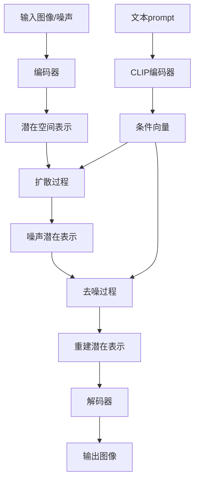

# AIGC从入门到实战：专注：Stable Diffusion，更专业的人物绘画 AI

## 1. 背景介绍

### 1.1 问题的由来

人工智能生成内容(AIGC)已经成为当前科技领域的一股重要力量。在视觉创作领域,AIGC技术可以根据文本描述生成逼真的图像,为艺术创作和视觉设计带来了全新的可能性。其中,Stable Diffusion作为一种先进的AIGC模型,在人物绘画方面表现出卓越的能力,引起了广泛关注。

### 1.2 研究现状  

Stable Diffusion是一种基于扩散模型的生成式AI模型,由Stability AI公司开发。它可以根据给定的文本prompt生成高质量、高分辨率的图像。与其他AIGC模型相比,Stable Diffusion在人物绘画方面表现出色,能够生成逼真的人物形象,捕捉细节和表情,同时保持整体的和谐性。

然而,尽管取得了令人瞩目的成就,Stable Diffusion在人物绘画方面仍然存在一些挑战和局限性。例如,生成图像的质量和一致性可能会受到prompt描述的影响;对于复杂的人物姿态和细节,模型的表现可能不尽如人意;此外,如何更好地控制生成图像的风格和细节也是一个值得探索的课题。

### 1.3 研究意义

深入探讨Stable Diffusion在人物绘画领域的应用,不仅可以帮助我们更好地理解和利用这一先进的AIGC技术,还可以为艺术创作和视觉设计带来全新的灵感和工具。通过研究Stable Diffusion的核心原理、算法细节和实践应用,我们可以发现其潜力和局限性,进而推动模型的改进和创新。

此外,人物绘画是一个富有挑战的领域,需要捕捉人物的细节、表情和姿态,同时保持整体的和谐性。探索Stable Diffusion在这一领域的应用,可以为其他视觉创作领域提供有价值的启示,推动AIGC技术的进一步发展。

### 1.4 本文结构

本文将全面探讨Stable Diffusion在人物绘画领域的应用。我们将首先介绍Stable Diffusion的核心概念和原理,包括扩散模型和潜在扩散等关键技术。接下来,我们将深入探讨Stable Diffusion在人物绘画中的核心算法和数学模型,并通过实例和案例分析来详细说明其工作原理。

此外,我们还将介绍如何使用Stable Diffusion进行人物绘画的实践操作,包括开发环境搭建、代码实现和运行结果展示。我们还将探讨Stable Diffusion在实际应用场景中的潜力和前景,以及未来可能面临的挑战和发展趋势。

最后,我们将为读者提供丰富的学习资源和工具推荐,包括相关论文、开发工具和其他有用资源,以帮助读者进一步深入学习和实践Stable Diffusion在人物绘画领域的应用。

## 2. 核心概念与联系

在深入探讨Stable Diffusion在人物绘画领域的应用之前,我们需要先了解一些核心概念和技术,以便更好地理解其工作原理和实现细节。

### 2.1 扩散模型(Diffusion Models)

扩散模型是一种生成式模型,它通过学习数据的噪声分布,从噪声中生成新的样本。与其他生成模型(如VAE和GAN)不同,扩散模型不需要直接学习数据的复杂分布,而是通过一系列的噪声添加和去噪步骤来生成样本。

扩散模型的基本思想是,将一个干净的数据样本(如图像)逐步添加噪声,直到它完全变成纯噪声。然后,模型学习如何从纯噪声中逆向推断出原始的干净样本。这个过程被称为"逆扩散"或"去噪"过程。

扩散模型的优点在于它们可以生成高质量的样本,并且训练过程相对简单和稳定。然而,它们也存在一些缺点,如生成速度较慢,并且需要大量的计算资源。

### 2.2 潜在扩散(Latent Diffusion)

潜在扩散是一种改进的扩散模型,它在潜在空间(而不是像素空间)中进行扩散和去噪过程。具体来说,它首先将输入数据(如图像)编码为一个潜在表示,然后在这个潜在空间中进行扩散和去噪,最后将去噪后的潜在表示解码为输出样本。

相比于在像素空间中操作,在潜在空间中进行扩散和去噪可以带来一些优势,例如:

- 潜在空间通常具有更低的维度,从而减少了计算复杂度。
- 潜在表示往往更加结构化和语义化,有利于模型捕捉数据的高层次特征。
- 在潜在空间中操作可以更好地保留输入数据的细节和结构信息。

Stable Diffusion就是一种基于潜在扩散的模型,它在CLIP(对比语言-图像预训练模型)的潜在空间中进行扩散和去噪,从而实现了基于文本描述生成高质量图像的能力。

### 2.3 CLIP模型

CLIP(Contrastive Language-Image Pre-training)是一种大规模的对比语言-图像预训练模型,由OpenAI开发。它通过对大量的图像-文本对进行对比学习,学习到了一个强大的视觉-语义表示空间,能够捕捉图像和文本之间的语义关联。

CLIP模型的核心思想是,将图像和文本映射到同一个潜在空间中,使得相关的图像-文本对在该空间中彼此靠近,而不相关的对则相距较远。通过这种对比学习方式,CLIP可以学习到一个强大的视觉-语义表示,能够理解图像的内容和文本的语义含义。

Stable Diffusion利用了CLIP模型的这种视觉-语义表示能力。它在CLIP的潜在空间中进行扩散和去噪,从而实现了基于文本prompt生成图像的能力。具体来说,Stable Diffusion将文本prompt编码为一个条件向量,并将其作为条件引入到扩散和去噪过程中,从而使生成的图像与给定的文本描述相符。

通过将扩散模型与CLIP模型相结合,Stable Diffusion成功地实现了基于文本描述生成高质量图像的能力,在人物绘画等领域表现出色。

### 2.4 Mermaid 流程图

上图使用Mermaid流程图展示了Stable Diffusion的核心工作流程。首先,输入图像或噪声经过编码器转换为潜在空间表示。然后,在潜在空间中进行扩散过程,将潜在表示转换为噪声潜在表示。接下来,在去噪过程中,将噪声潜在表示重建为重建潜在表示,最后通过解码器生成输出图像。

与此同时,文本prompt经过CLIP编码器转换为条件向量,并将其作为条件引入到扩散和去噪过程中,从而使生成的图像与给定的文本描述相符。

通过这一流程,Stable Diffusion实现了基于文本prompt生成高质量图像的能力,并在人物绘画等领域表现出色。

## 3. 核心算法原理 & 具体操作步骤  

### 3.1 算法原理概述

Stable Diffusion的核心算法原理基于扩散概率模型和潜在扩散技术。具体来说,它包括以下几个关键步骤:

1. **编码器**:将输入图像或噪声编码为潜在空间表示。
2. **扩散过程**:在潜在空间中,通过添加高斯噪声,将潜在表示逐步扩散为噪声潜在表示。
3. **条件引入**:将文本prompt编码为条件向量,并将其作为条件引入到扩散和去噪过程中。
4. **去噪过程**:从噪声潜在表示出发,通过反向扩散过程,逐步去噪并重建潜在表示。
5. **解码器**:将重建的潜在表示解码为输出图像。

在扩散和去噪过程中,Stable Diffusion利用了一种基于扩散概率模型的去噪算法,称为扩散去噪概率模型(Denoising Diffusion Probabilistic Model, DDPM)。DDPM通过学习从噪声中恢复原始数据的过程,实现了高质量的图像生成。

### 3.2 算法步骤详解

Stable Diffusion算法的具体步骤如下:

1. **编码输入**:将输入图像或噪声通过编码器(如U-Net)编码为潜在空间表示 $\mathbf{z}_0$。

2. **扩散过程**:通过添加高斯噪声,将潜在表示 $\mathbf{z}_0$ 逐步扩散为噪声潜在表示 $\mathbf{z}_T$,其中 $T$ 是扩散步数。具体来说,在每个扩散步骤 $t$,我们有:

   $$\mathbf{z}_{t+1} = \sqrt{\alpha_t}\mathbf{z}_t + \sqrt{1-\alpha_t}\epsilon_t$$

   其中 $\alpha_t$ 是方差schedual,控制噪声的强度;$\epsilon_t$ 是高斯噪声。

3. **条件引入**:将文本prompt编码为条件向量 $\mathbf{c}$,并将其作为条件引入到扩散和去噪过程中。

4. **去噪过程**:从噪声潜在表示 $\mathbf{z}_T$ 出发,通过反向扩散过程,逐步去噪并重建潜在表示 $\mathbf{z}_0$。具体来说,在每个去噪步骤 $t$,我们有:

   $$\mathbf{z}_{t-1} = \frac{1}{\sqrt{\alpha_t}}\left(\mathbf{z}_t - \frac{1-\alpha_t}{\sqrt{1-\bar{\alpha}_t}}\epsilon_\theta(\mathbf{z}_t, t, \mathbf{c})\right) + \sigma_t\mathbf{n}$$

   其中 $\epsilon_\theta(\mathbf{z}_t, t, \mathbf{c})$ 是一个神经网络,用于预测噪声 $\epsilon_t$;$\sigma_t$ 是方差schedual;$\mathbf{n}$ 是新添加的高斯噪声,用于提高样本多样性。

5. **解码输出**:将重建的潜在表示 $\mathbf{z}_0$ 通过解码器(如U-Net)解码为输出图像。

在上述过程中,条件向量 $\mathbf{c}$ 被用作额外的输入,引导去噪过程生成与文本prompt相符的图像。通过学习从噪声中恢复原始数据的过程,Stable Diffusion能够生成高质量、与文本描述相符的图像。

### 3.3 算法优缺点

Stable Diffusion算法具有以下优点:

- 能够生成高质量、高分辨率的图像,尤其在人物绘画方面表现出色。
- 通过文本prompt控制生成内容,提供了灵活的创作方式。
- 训练过程相对简单和稳定,不需要对抗训练。
- 基于潜在扩散技术,降低了计算复杂度。

然而,它也存在一些缺点和局限性:

- 生成速度较慢,需要大量的计算资源。
- 对于复杂的人物姿态和细节,生成质量可能不尽如人意。
- 生成图像的质量和一致性可能会受到prompt描述的影响。
- 难以精确控制生成图像的风格和细节。

### 3.4 算法应用领域

Stable Diffusion算法在以下领域具有广泛的应用前景:

- **艺术创作**:可用于生成各种风格的艺术作品,为艺术家提供创作灵感和辅助工具。
- **视觉设计**: