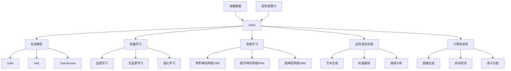

# AIGC从入门到实战：人工智能应用大规模涌现的原因

关键词：AIGC、人工智能、机器学习、深度学习、自然语言处理、计算机视觉、人工智能应用

## 1. 背景介绍
### 1.1  问题的由来
人工智能生成内容（AIGC）技术的快速发展和普及,正在改变我们的生活和工作方式。越来越多的企业和个人开始尝试将AIGC技术应用到各个领域,人工智能应用呈现出大规模涌现的趋势。这引发了人们的思考:是什么原因导致了人工智能应用的大规模涌现?

### 1.2  研究现状
近年来,AIGC技术取得了突破性进展。以ChatGPT、Midjourney、Stable Diffusion等为代表的AIGC应用,展现了令人惊叹的生成能力,引发了业界的广泛关注。各大科技公司纷纷布局AIGC领域,投入大量资源进行研发。学术界也在AIGC领域开展了深入研究,取得了一系列重要成果。

### 1.3  研究意义
探究人工智能应用大规模涌现的原因,对于把握人工智能发展趋势,推动人工智能技术落地应用具有重要意义。通过分析AIGC技术发展的驱动因素,总结人工智能应用的发展规律,可以为企业制定人工智能战略、开展人工智能实践提供参考和指导。

### 1.4  本文结构
本文将从以下几个方面探讨人工智能应用大规模涌现的原因:

1. AIGC的核心概念与技术基础
2. AIGC的核心算法原理与工作流程
3. AIGC的数学模型与关键公式
4. AIGC的代码实现与开源框架
5. AIGC的典型应用场景与案例分析
6. AIGC的学习资源与开发工具推荐
7. AIGC未来的发展趋势与面临的挑战
8. AIGC常见问题解答

## 2. 核心概念与联系
人工智能生成内容(AIGC)是指利用人工智能技术自动生成文本、图像、音频、视频等内容的技术。它涉及多个人工智能领域,包括机器学习、深度学习、自然语言处理、计算机视觉等。

AIGC的核心是生成模型(Generative Model),它可以学习数据的分布特征,并根据学习到的知识生成新的内容。常见的生成模型包括生成对抗网络(GAN)、变分自编码器(VAE)、Transformer等。

AIGC技术的发展离不开海量数据的支撑。通过在大规模数据集上训练,AIGC模型可以学习到丰富的知识和规律,从而具备强大的内容生成能力。同时,AIGC还依赖于算力的提升。随着GPU、TPU等高性能计算设备的普及,AIGC模型的训练和推理效率大大提高,推动了AIGC技术的快速发展。

下图展示了AIGC技术的核心概念与相互联系:



## 3. 核心算法原理 & 具体操作步骤
### 3.1  算法原理概述
AIGC的核心算法主要包括生成对抗网络(GAN)、变分自编码器(VAE)、Transformer等。

GAN由生成器(Generator)和判别器(Discriminator)组成,通过两个网络的对抗学习,生成器可以生成接近真实数据分布的内容。

VAE通过编码器(Encoder)将输入数据映射到隐空间,再通过解码器(Decoder)从隐空间重构出输入数据,从而学习数据的概率分布。

Transformer利用自注意力机制(Self-Attention)建模输入数据内部的依赖关系,并通过位置编码(Positional Encoding)引入序列信息,在并行计算的同时捕捉全局依赖。

### 3.2  算法步骤详解
以GAN为例,详细介绍其工作步骤:

1. 随机初始化生成器和判别器的参数
2. 从真实数据集中采样一批数据样本
3. 从随机噪声中采样一批噪声样本
4. 利用生成器将噪声样本转换为生成样本
5. 利用判别器对真实样本和生成样本进行二分类
6. 计算判别器的损失函数,并通过反向传播更新判别器参数
7. 计算生成器的损失函数,并通过反向传播更新生成器参数
8. 重复步骤2-7,直到模型收敛或达到预设的迭代次数

VAE和Transformer的训练过程与GAN类似,通过定义损失函数,利用反向传播算法优化模型参数,不断提高模型的生成质量。

### 3.3  算法优缺点
GAN的优点是生成效果逼真,但训练过程不稳定,容易出现模式崩溃问题。

VAE的优点是训练稳定,且可以控制生成内容的风格,但生成质量略逊于GAN。

Transformer的优点是可以建模长距离依赖,且计算效率高,但需要大量数据进行预训练。

### 3.4  算法应用领域
GAN广泛应用于图像生成、风格迁移、超分辨率等任务。

VAE在文本生成、语音合成、推荐系统等领域有广泛应用。

Transformer是自然语言处理的主流模型,在机器翻译、文本摘要、问答系统等任务上取得了突破性进展。

## 4. 数学模型和公式 & 详细讲解 & 举例说明
### 4.1  数学模型构建
以GAN为例,其数学模型可以表示为一个二人零和博弈问题:

$$\min_G \max_D V(D,G) = \mathbb{E}_{x \sim p_{data}(x)}[\log D(x)] + \mathbb{E}_{z \sim p_z(z)}[\log (1 - D(G(z)))]$$

其中,$G$表示生成器,$D$表示判别器,$x$表示真实样本,$z$表示随机噪声,$p_{data}$表示真实数据分布,$p_z$表示噪声分布。

生成器的目标是最小化$\log (1 - D(G(z)))$,即希望生成的样本能够欺骗判别器。判别器的目标是最大化$\log D(x) + \log (1 - D(G(z)))$,即希望能够准确区分真实样本和生成样本。

### 4.2  公式推导过程
根据博弈论,GAN的优化目标可以表示为:

$$\min_G \max_D V(G,D) = \int_x p_{data}(x) \log D(x) dx + \int_z p_z(z) \log (1 - D(G(z))) dz$$

将积分转换为期望,可以得到:

$$V(G,D) = \mathbb{E}_{x \sim p_{data}(x)}[\log D(x)] + \mathbb{E}_{z \sim p_z(z)}[\log (1 - D(G(z)))]$$

在实际训练中,我们通过最小化判别器的损失函数来最大化$V(G,D)$,损失函数定义为:

$$L_D = -\frac{1}{m} \sum_{i=1}^m [\log D(x^{(i)}) + \log (1 - D(G(z^{(i)})))]$$

其中,$m$表示一个批次的样本数量,$x^{(i)}$表示第$i$个真实样本,$z^{(i)}$表示第$i$个噪声样本。

生成器的损失函数定义为:

$$L_G = -\frac{1}{m} \sum_{i=1}^m \log D(G(z^{(i)}))$$

生成器通过最小化$L_G$来欺骗判别器,使生成样本尽可能接近真实样本。

### 4.3  案例分析与讲解
下面以一个简单的例子来说明GAN的工作原理。假设我们要生成手写数字图像,真实数据集为MNIST。

首先,我们随机初始化生成器和判别器的参数。然后,从MNIST中采样一批真实手写数字图像,记为$x$。同时,从高斯分布中采样一批随机噪声,记为$z$。

接下来,我们利用生成器将噪声$z$转换为生成图像$\tilde{x} = G(z)$。生成器可以是一个多层感知机或卷积神经网络。

判别器接收真实图像$x$和生成图像$\tilde{x}$,对它们进行二分类,输出一个0到1之间的概率值,表示输入图像为真实图像的概率。判别器也可以是一个多层感知机或卷积神经网络。

我们计算判别器在真实图像上的损失$\log D(x)$和在生成图像上的损失$\log (1 - D(G(z)))$,然后通过反向传播算法更新判别器的参数,使其能够尽可能准确地区分真实图像和生成图像。

接着,我们计算生成器的损失$\log D(G(z))$,通过反向传播算法更新生成器的参数,使其能够生成更加逼真的图像来欺骗判别器。

不断重复上述步骤,直到判别器无法区分真实图像和生成图像,或达到预设的训练轮数。

### 4.4  常见问题解答
1. GAN训练不稳定的原因是什么?

GAN训练不稳定主要有以下几个原因:

- 生成器和判别器的能力不平衡,导致训练过程难以收敛
- 梯度消失或梯度爆炸问题,导致参数更新困难
- 模式崩溃问题,即生成器只生成少数几种样本
- 训练数据量不足,导致生成器难以学习到真实数据分布

2. 如何评估GAN的生成质量?

评估GAN的生成质量主要有以下几种方法:

- 主观评估,即人工观察生成样本的真实性和多样性
- Inception Score(IS),利用预训练的分类模型评估生成样本的质量
- Frechet Inception Distance(FID),计算生成样本和真实样本在特征空间的距离
- Perceptual Path Length(PPL),度量生成样本在潜在空间的平滑度

3. GAN可以应用于哪些领域?

GAN可以应用于以下领域:

- 图像生成,如人脸生成、场景生成、风格迁移等
- 视频生成,如视频预测、视频插帧、视频超分辨率等
- 语音合成,如语音转换、语音去噪、歌声合成等
- 文本生成,如对话生成、故事生成、诗歌生成等
- 其他领域,如药物发现、材料设计、游戏生成等

## 5. 项目实践：代码实例和详细解释说明
### 5.1  开发环境搭建
本节我们将使用PyTorch实现一个简单的GAN模型,用于生成手写数字图像。首先,我们需要搭建开发环境。

安装PyTorch:

```bash
pip install torch torchvision
```

安装其他依赖库:

```bash
pip install numpy matplotlib
```

### 5.2  源代码详细实现
下面是GAN模型的PyTorch实现代码:

```python
import torch
import torch.nn as nn
import torch.optim as optim
import torchvision
import torchvision.datasets as datasets
import torchvision.transforms as transforms
import numpy as np
import matplotlib.pyplot as plt

# 定义生成器
class Generator(nn.Module):
    def __init__(self, latent_dim):
        super(Generator, self).__init__()
        self.latent_dim = latent_dim
        self.model = nn.Sequential(
            nn.Linear(latent_dim, 256),
            nn.LeakyReLU(0.2),
            nn.Linear(256, 512),
            nn.LeakyReLU(0.2),
            nn.Linear(512, 1024),
            nn.LeakyReLU(0.2),
            