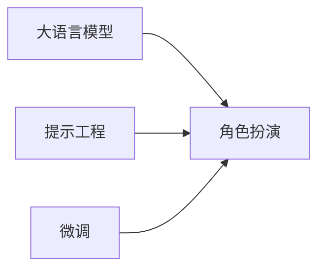

# AIGC从入门到实战：测试：ChatGPT 能扮演什么角色？

关键词：AIGC, ChatGPT, 角色扮演, 人工智能, 自然语言处理, 对话系统

## 1. 背景介绍

### 1.1 问题的由来

人工智能生成内容(AIGC)技术的快速发展,尤其是以ChatGPT为代表的大语言模型的出现,引发了人们对AI在内容创作领域应用前景的广泛关注和讨论。ChatGPT凭借其强大的自然语言理解和生成能力,展现出了在对话交互、知识问答、创意写作等方面的惊人表现,这使得人们开始思考:ChatGPT究竟能扮演什么样的角色?它的能力边界在哪里?未来又将如何影响我们的工作和生活?

### 1.2 研究现状

目前,国内外已有不少研究者和机构对ChatGPT的应用场景和角色扮演能力进行了初步的探索和测试。一些研究发现,ChatGPT在客户服务、教育辅导、心理咨询等领域展现出了良好的应用潜力,能够与人进行富有同理心的对话互动,提供有针对性的解答和建议。同时,ChatGPT在文案撰写、代码开发、数据分析等任务上的出色表现,也让人们看到了其在知识工作领域的巨大前景。

### 1.3 研究意义

深入探究ChatGPT的角色扮演能力,对于认识大语言模型的能力边界、把握AIGC技术的发展方向具有重要意义。一方面,这有助于我们理性地认识ChatGPT的优势和局限,在实际应用中扬长避短,更好地利用其赋能各行各业;另一方面,对ChatGPT角色扮演能力的系统测试,也为后续大语言模型的改进完善提供了重要参考和启示,推动AIGC技术不断迭代升级,创造更大价值。

### 1.4 本文结构

本文将围绕"ChatGPT能扮演什么角色"这一核心问题展开系统探讨。首先,介绍ChatGPT角色扮演的核心概念和内在机理;然后,重点测试分析ChatGPT在不同领域和任务中的角色扮演表现,总结其能力边界;接着,讨论ChatGPT角色扮演的实际应用场景和未来趋势;最后,提出ChatGPT角色扮演能力提升的挑战和展望。

## 2. 核心概念与联系

要理解ChatGPT的角色扮演能力,首先需要厘清几个核心概念:

- 大语言模型:这是ChatGPT的技术基础,指通过海量文本数据训练的深度神经网络模型,具备强大的自然语言理解和生成能力。
- 角色扮演:是指ChatGPT根据用户输入的角色设定,以该角色的身份、风格、知识背景等与人进行对话互动的过程。
- 提示工程:指通过设计优化输入给ChatGPT的文本提示,引导其生成符合特定角色和任务要求的回复内容。
- 微调:指在特定领域数据上对预训练好的ChatGPT模型进行二次训练,使其更好地适应该领域的对话任务。

这几个概念之间环环相扣:大语言模型是ChatGPT角色扮演的基石,高超的提示工程是发挥其角色扮演能力的关键,而微调则是进一步提升ChatGPT在特定领域角色扮演效果的有效手段。只有深入把握这些概念之间的联系,才能真正理解ChatGPT角色扮演的内在机理。

## 3. 核心算法原理 & 具体操作步骤

### 3.1 算法原理概述

ChatGPT角色扮演的核心算法是基于Transformer的自回归语言模型。它通过自注意力机制建模文本序列的长程依赖,并利用掩码多头注意力实现双向编码。在预训练阶段,模型以自回归的方式学习文本序列的概率分布,即根据前面的词预测下一个词。而在微调和应用阶段,模型则根据输入的提示信息,生成符合目标角色特征的文本响应。

### 3.2 算法步骤详解

1. 将输入文本进行分词和编码,转化为模型可处理的向量序列。
2. 通过词嵌入层将离散的词向量映射为连续的低维稠密向量。
3. 向量序列通过多层Transformer编码器进行特征提取和语义建模:
   - 通过自注意力机制计算序列中各位置之间的关联度,实现全局信息融合。
   - 通过前馈神经网络实现特征变换和非线性映射。
   - 通过残差连接和层归一化保证模型训练的稳定性。
4. 解码阶段根据编码器输出和之前生成的词,通过注意力机制预测下一个词:
   - 通过掩码自注意力实现解码阶段的自回归生成。
   - 通过编码-解码注意力实现编码信息到解码过程的传递。
5. 重复解码过程,直到生成结束标记或达到最大长度,输出最终的生成文本。

### 3.3 算法优缺点

优点:
- 通过自注意力机制有效捕获文本的长程依赖,生成连贯、语义丰富的文本。
- 端到端的生成方式,避免了传统的模板化、规则化生成方法的局限性。
- 通过海量语料的预训练,模型具备强大的常识性知识和语言理解能力。

缺点:
- 模型参数量巨大,训练和推理成本高,对计算资源要求较高。
- 生成质量不稳定,易出现语法错误、逻辑矛盾、事实性错误等问题。
- 容易生成有偏见、有害或违法的内容,在实际应用中存在安全隐患。

### 3.4 算法应用领域

ChatGPT的角色扮演算法在以下领域具有广泛的应用前景:

- 智能客服:通过扮演客服角色,为用户提供个性化、全天候的咨询服务。
- 教育辅导:通过扮演教师、助教角色,为学生提供互动式的学习指导。
- 医疗健康:通过扮演医生助理角色,为患者提供初步的诊断和健康建议。
- 金融投资:通过扮演投资顾问角色,为用户提供个性化的投资组合和策略。
- 娱乐游戏:通过扮演游戏角色,为玩家提供沉浸式的交互体验和剧情生成。

## 4. 数学模型和公式 & 详细讲解 & 举例说明

### 4.1 数学模型构建

ChatGPT的核心是基于Transformer的自回归语言模型,其数学形式可表示为:

$$ P(x_1, ..., x_n) = \prod_{i=1}^n P(x_i | x_1, ..., x_{i-1}) $$

其中,$x_1, ..., x_n$表示文本序列,$P(x_1, ..., x_n)$表示该序列的概率,$P(x_i | x_1, ..., x_{i-1})$表示在给定前$i-1$个词的条件下,第$i$个词为$x_i$的条件概率。模型的目标是学习这个条件概率分布,从而根据前文生成后续的词。

### 4.2 公式推导过程

Transformer的核心是自注意力机制和前馈神经网络,其数学推导如下:

1. 自注意力机制:

$$ Attention(Q, K, V) = softmax(\frac{QK^T}{\sqrt{d_k}})V $$

其中,$Q$,$K$,$V$分别表示查询、键、值向量,$d_k$为键向量的维度。自注意力通过查询向量与所有键向量的点积计算相似度,然后将相似度作为权重对值向量进行加权求和,实现序列内部的信息融合。

2. 多头注意力:

$$ MultiHead(Q, K, V) = Concat(head_1, ..., head_h)W^O $$
$$ head_i = Attention(QW_i^Q, KW_i^K, VW_i^V) $$

其中,$W_i^Q$,$W_i^K$,$W_i^V$,$W^O$为可学习的线性变换矩阵。多头注意力通过并行计算多个自注意力,然后将结果拼接并线性变换,提高了模型的表达能力。

3. 前馈神经网络:

$$ FFN(x) = max(0, xW_1 + b_1)W_2 + b_2 $$

其中,$W_1$,$b_1$,$W_2$,$b_2$为可学习的参数矩阵和偏置项。前馈神经网络通过两层线性变换和ReLU激活,实现特征变换和非线性映射。

### 4.3 案例分析与讲解

下面以一个简单的对话为例,说明ChatGPT的角色扮演过程:

用户:请你扮演一位心理咨询师,我最近感到很焦虑,不知道该怎么办。

ChatGPT:我理解你最近感到焦虑的心情。焦虑是一种常见的情绪反应,通常源于对未来的担忧和不确定性。作为你的心理咨询师,我建议你可以尝试以下方法来缓解焦虑:

1. 深呼吸放松:当感到焦虑时,试着慢慢吸气,保持几秒钟,然后缓慢呼气。重复几次,有助于放松身心。

2. 转移注意力:将注意力从焦虑的事情上转移开,尝试做一些让自己放松的活动,如听音乐、散步、阅读等。

3. 与他人交流:与信任的家人、朋友倾诉你的焦虑,获得他们的支持和建议,能够减轻心理负担。

4. 接纳不确定性:接受生活中总有一些无法掌控的不确定因素,学会放下执念,专注当下。

5. 寻求专业帮助:如果焦虑严重影响到日常生活,建议咨询专业的心理治疗师,进行系统的心理治疗。

记住,焦虑是可以缓解和克服的。你并不孤单,有很多人和资源可以提供帮助。如果需要进一步的支持,欢迎随时与我沟通。

在这个例子中,ChatGPT根据用户提供的角色设定,以心理咨询师的身份进行回复。它首先表达了对用户焦虑情绪的理解和共情,然后提供了缓解焦虑的多个建议,包括深呼吸、转移注意力、寻求支持等。最后,ChatGPT鼓励用户面对焦虑,表达了提供进一步帮助的意愿,体现了心理咨询师的专业态度和关怀。

从这个过程可以看出,ChatGPT通过语言模型实现了对用户需求的理解,并根据心理咨询师的角色知识,生成了符合该角色特点的回复内容,展现了较强的角色扮演能力。当然,这只是一个简单示例,ChatGPT在实际应用中还需要更多的微调和引导,以提供更加专业和有针对性的咨询服务。

### 4.4 常见问题解答

问:ChatGPT能否完全取代人类心理咨询师?

答:目前ChatGPT在心理咨询领域虽然表现出色,但仍然存在局限性。它更多是作为辅助工具,为用户提供情绪支持和一般性建议,而对于复杂的心理问题诊断和系统的治疗,仍需要专业的人类心理咨询师的参与。未来,ChatGPT可能与人类咨询师形成协同,提供更加高效、个性化的心理健康服务。

问:如何避免ChatGPT产生有害或错误的心理咨询内容?

答:为确保ChatGPT提供安全、专业的心理咨询,需要在以下方面进行规范和把控:1)在模型训练数据中加入心理学专业知识和咨询伦理准则;2)对模型生成内容进行识别和过滤,屏蔽有害、错误信息;3)加强人工审核和监督,对高风险对话设置人工介入机制;4)明确ChatGPT心理咨询的边界和免责声明,防止用户过度依赖。

## 5.