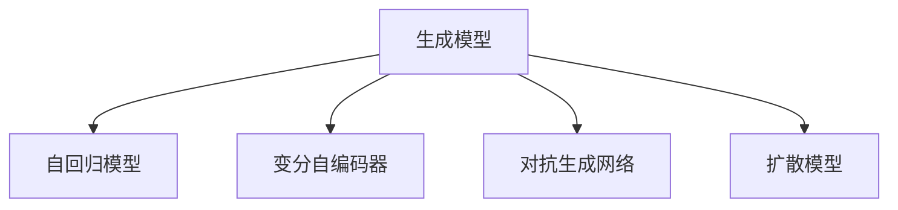

# AIGC从入门到实战：算法、算力、数据三驾马车的发力狂奔

## 1. 背景介绍

### 1.1 问题的由来

人工智能生成内容(AIGC)技术的快速发展正在重塑内容创作行业。从文本、图像到音视频，AIGC正以前所未有的效率和质量生成各种内容。然而，AIGC的发展仍面临诸多挑战，如算法创新、算力提升、高质量数据获取等。这些问题亟需从业者和研究者的共同努力来解决。

### 1.2 研究现状

目前，AIGC技术已经在多个领域取得了突破性进展。在自然语言处理领域，GPT-3、ChatGPT等大语言模型展现了惊人的文本生成能力。在计算机视觉领域，DALL-E、Stable Diffusion等模型能够根据文本描述生成逼真的图像。而在语音合成领域，WaveNet、SampleRNN等模型也实现了高质量的语音生成。

### 1.3 研究意义

深入研究AIGC技术，对于推动人工智能领域的发展具有重要意义。一方面，AIGC可以极大提升内容创作的效率，为创作者提供更多灵感和素材。另一方面，AIGC技术的进步也将促进人工智能在更多领域的应用，如虚拟助手、智能客服、数字人等。同时，AIGC的发展也将带来新的伦理和法律挑战，需要社会各界的共同关注和应对。

### 1.4 本文结构

本文将从算法、算力、数据三个方面深入探讨AIGC技术的发展现状和未来趋势。第二部分将介绍AIGC的核心概念和技术原理。第三部分将重点分析AIGC算法的原理和实现步骤。第四部分将建立AIGC的数学模型并给出详细推导。第五部分将通过代码实例展示AIGC的实现过程。第六部分将讨论AIGC的实际应用场景。第七部分将推荐AIGC相关的学习资源和开发工具。第八部分将总结AIGC的发展趋势和面临的挑战。最后，附录部分将解答AIGC领域的常见问题。

## 2. 核心概念与联系

AIGC的核心概念包括生成模型、自回归、变分自编码器、对抗生成网络、扩散模型等。这些概念之间存在着紧密的联系：

- 生成模型是AIGC的理论基础，旨在学习数据分布并生成新样本。
- 自回归模型通过建模数据的序列依赖关系来生成连续的内容。
- 变分自编码器引入了隐变量，能够捕捉数据的高级语义特征。
- 对抗生成网络通过生成器和判别器的博弈学习，生成高质量的内容。
- 扩散模型通过迭代的噪声估计和去噪过程，逐步生成清晰、连贯的内容。

下图展示了这些核心概念之间的关系：

## 3. 核心算法原理 & 具体操作步骤

### 3.1 算法原理概述

AIGC的核心算法包括Transformer、GAN、VAE、Diffusion Model等。其中，Transformer凭借其强大的并行计算能力和自注意力机制，成为大模型的首选架构。GAN通过生成器和判别器的对抗学习，生成逼真的图像和视频。VAE引入隐变量，能够捕捉数据的语义特征并支持可控生成。Diffusion Model通过迭代的正向和逆向扩散过程，生成高质量、多样化的内容。

### 3.2 算法步骤详解

以Transformer为例，其核心步骤如下：

1. 输入嵌入：将输入token映射为连续向量表示。
2. 位置编码：为每个token添加位置信息，以捕捉序列依赖。
3. 自注意力：通过Query、Key、Value计算token之间的注意力权重，实现全局建模。
4. 前馈网络：通过两层全连接网络，增强特征表示能力。
5. 残差连接和Layer Norm：稳定训练过程，加速收敛。
6. 解码器：根据编码器输出和已生成内容，自回归地预测下一个token。

### 3.3 算法优缺点

Transformer的优点包括：
- 并行计算能力强，训练效率高。
- 自注意力机制能够捕捉长距离依赖，全局建模能力强。
- 通用性好，适用于各种类型的序列数据。

缺点包括：
- 计算复杂度随序列长度平方增长，难以处理超长序列。
- 解码阶段仍是串行过程，生成速度受限。
- 需要大量数据和算力支持，训练成本高。

### 3.4 算法应用领域

Transformer已成为AIGC领域的主流架构，广泛应用于以下场景：

- 自然语言处理：机器翻译、文本摘要、对话系统等。
- 计算机视觉：图像字幕、视觉问答、图像生成等。
- 语音处理：语音识别、语音合成、音乐生成等。
- 多模态学习：视听语言理解、跨模态检索、多模态融合等。

## 4. 数学模型和公式 & 详细讲解 & 举例说明

### 4.1 数学模型构建

以VAE为例，其数学模型如下：

给定数据集 $\mathcal{D} = \{x^{(1)}, \cdots, x^{(N)}\}$，VAE的目标是最大化边际似然 $p(x)$：

$$\log p(x) = \log \int p(x|z)p(z)dz$$

其中，$p(z)$ 为先验分布，通常假设为标准正态分布 $\mathcal{N}(0, I)$。$p(x|z)$ 为解码器，用于从隐变量 $z$ 生成 $x$。

由于边际似然的直接计算和优化很困难，VAE引入了变分下界(ELBO)：

$$\log p(x) \geq \mathbb{E}_{q(z|x)}[\log p(x|z)] - D_{KL}(q(z|x)||p(z)) := \mathcal{L}(x)$$

其中，$q(z|x)$ 为编码器，用于从数据 $x$ 推断隐变量 $z$ 的后验分布。$D_{KL}$ 为KL散度，用于度量编码器的后验分布与先验分布的差异。

VAE的训练过程就是最大化ELBO，即最小化重构误差和KL散度：

$$\max_{\phi, \theta} \mathcal{L}(x) = \max_{\phi, \theta} \mathbb{E}_{q_{\phi}(z|x)}[\log p_{\theta}(x|z)] - D_{KL}(q_{\phi}(z|x)||p(z))$$

其中，$\phi$ 和 $\theta$ 分别为编码器和解码器的参数。

### 4.2 公式推导过程

为了优化ELBO，VAE采用了重参数技巧(Reparameterization Trick)。具体地，假设编码器的后验分布为正态分布：

$$q_{\phi}(z|x) = \mathcal{N}(z|\mu_{\phi}(x), \sigma_{\phi}^2(x))$$

其中，$\mu_{\phi}(x)$ 和 $\sigma_{\phi}^2(x)$ 为编码器网络的输出，分别表示后验分布的均值和方差。

重参数技巧将隐变量 $z$ 表示为：

$$z = \mu_{\phi}(x) + \sigma_{\phi}(x) \odot \epsilon, \quad \epsilon \sim \mathcal{N}(0, I)$$

其中，$\odot$ 表示逐元素相乘。这样，随机采样过程就可以移到编码器网络之外，使得ELBO的梯度可以通过标准的反向传播算法计算。

最终，VAE的损失函数可以写为：

$$\mathcal{L}(\phi, \theta) = -\mathbb{E}_{q_{\phi}(z|x)}[\log p_{\theta}(x|z)] + D_{KL}(q_{\phi}(z|x)||p(z))$$

$$= -\mathbb{E}_{\epsilon \sim \mathcal{N}(0, I)}[\log p_{\theta}(x|z=\mu_{\phi}(x) + \sigma_{\phi}(x) \odot \epsilon)] + \frac{1}{2}\sum_{j=1}^{d}(\mu_{\phi}^2(x)_j + \sigma_{\phi}^2(x)_j - \log \sigma_{\phi}^2(x)_j - 1)$$

其中，第一项为重构误差，第二项为KL散度的解析表达式。$d$ 为隐变量的维度。

### 4.3 案例分析与讲解

下面以手写数字生成为例，说明VAE的工作原理。

假设我们要训练一个VAE模型，用于生成 $28 \times 28$ 的手写数字图像。输入数据 $x$ 为像素值在 $[0, 1]$ 范围内的实数向量，隐变量 $z$ 的维度为 $20$。

编码器网络 $q_{\phi}(z|x)$ 可以设计为多层感知机(MLP)，输入为 $784$ 维的图像向量，输出为 $20$ 维的均值向量 $\mu_{\phi}(x)$ 和对数方差向量 $\log \sigma_{\phi}^2(x)$。

解码器网络 $p_{\theta}(x|z)$ 也可以设计为MLP，输入为 $20$ 维的隐变量 $z$，输出为 $784$ 维的图像重构向量。为了得到 $[0, 1]$ 范围内的像素值，可以在输出层使用Sigmoid激活函数。

在训练过程中，我们从数据集中采样一批图像 $\{x^{(i)}\}_{i=1}^{B}$，然后执行以下步骤：

1. 将图像输入编码器网络，得到后验分布的参数 $\mu_{\phi}(x^{(i)})$ 和 $\log \sigma_{\phi}^2(x^{(i)})$。
2. 从标准正态分布 $\mathcal{N}(0, I)$ 中采样噪声 $\epsilon^{(i)}$，然后通过重参数技巧得到隐变量 $z^{(i)} = \mu_{\phi}(x^{(i)}) + \exp(\log \sigma_{\phi}^2(x^{(i)}) / 2) \odot \epsilon^{(i)}$。
3. 将隐变量 $z^{(i)}$ 输入解码器网络，得到重构图像 $\hat{x}^{(i)} = p_{\theta}(x|z^{(i)})$。
4. 计算重构误差 $-\log p_{\theta}(x^{(i)}|z^{(i)})$ 和KL散度 $D_{KL}(q_{\phi}(z|x^{(i)})||p(z))$，然后对批次数据取平均得到损失函数 $\mathcal{L}(\phi, \theta)$。
5. 通过反向传播算法计算损失函数关于编码器和解码器参数的梯度，然后用优化器(如Adam)更新参数。

重复以上步骤，直到模型收敛或达到预设的迭代次数。

在测试阶段，我们可以从先验分布 $p(z) = \mathcal{N}(0, I)$ 中采样隐变量 $z$，然后将其输入解码器网络，得到生成的手写数字图像 $\hat{x} = p_{\theta}(x|z)$。通过改变隐变量 $z$ 的值，我们可以得到不同风格和内容的数字图像。

### 4.4 常见问题解答

**Q**: VAE和GAN有什么区别？

**A**: VAE和GAN都是生成模型，但原理不同。VAE通过最大化边际似然的变分下界来学习生成过程，而GAN通过生成器和判别器的对抗学习来逼近真实数据分布。VAE的优点是可以显式地建模数据的语义特征，并支持可控生成。GAN的优点是生成质量高，但训练不稳定，且缺乏可解释性。

**Q**: VAE的隐变量有什么作用？

**A**: VAE的隐变量可以看作是数据的压缩表示，捕捉了数据的高级语义特征。通过改变隐变量的值，我们可以生成不同风格和内容的样本。此外，隐变量还可以用于数据插值、属性编辑、无监督聚类等任务。

**Q**: VAE的