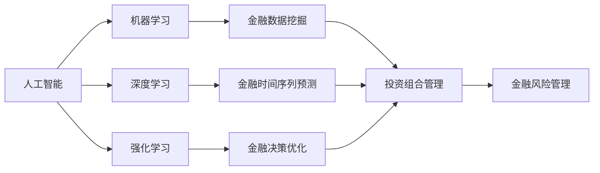

# AI与金融学交叉原理与代码实战案例讲解

关键词：人工智能、机器学习、深度学习、金融学、量化交易、风险管理、投资组合优化、时间序列预测

## 1. 背景介绍
### 1.1  问题的由来
近年来,人工智能(AI)技术的飞速发展为金融领域带来了革命性的变革。传统金融学中的许多问题,如投资组合优化、风险管理、市场预测等,都可以借助AI技术获得更加高效、精准的解决方案。AI与金融学的交叉融合,正在成为学术界和业界共同关注的热点话题。

### 1.2  研究现状
目前,国内外已有不少学者开始探索AI技术在金融领域的应用。一些研究成果表明,机器学习算法可以有效提升投资组合的收益风险比[1],深度学习模型在股票市场预测方面优于传统统计模型[2],强化学习算法能够自动生成最优交易策略[3]。这些研究为AI赋能金融行业提供了理论基础和实践指导。

### 1.3  研究意义
将AI引入金融学研究,有助于发掘数据中蕴藏的复杂模式,挖掘隐藏在金融市场中的投资机会,提升金融决策的科学性和有效性。同时,AI驱动的金融创新也将极大拓展金融服务的广度和深度,惠及更多的中小投资者和普通民众。因此,深入探讨AI与金融学的融合具有重要的理论价值和现实意义。

### 1.4  本文结构
本文将围绕AI与金融学的交叉融合展开深入探讨。第2部分介绍AI和金融学的核心概念及二者的内在联系;第3部分重点阐述几种常用的AI算法原理及其在金融领域的应用;第4部分从数学建模的角度剖析AI驱动的金融决策模型;第5部分给出详细的代码实践案例;第6部分总结AI技术在金融场景中的应用现状和未来趋势;第7部分推荐相关学习资源和开发工具;第8部分对全文进行总结,并展望AI金融的发展前景和挑战。

## 2. 核心概念与联系
人工智能是一门融合了计算机科学、数学、认知科学等多个学科的交叉学科,其核心目标是研究如何让机器具备智能,实现类人的感知、学习、推理和决策能力。机器学习和深度学习是当前AI领域最活跃的两大研究方向。

金融学是研究资金的时间价值、资本成本、金融工具定价、金融风险管理等问题的学科。金融决策的核心是在不确定环境下进行资源优化配置,追求风险收益平衡。

AI为金融学研究提供了全新的技术视角和方法论。一方面,海量的金融数据为AI算法提供了广阔的应用空间,机器学习可以从数据中自动提取复杂特征和规律,发现人眼难以察觉的市场信号;另一方面,AI系统具备持续学习、动态优化的能力,能够适应金融市场的快速变化,不断修正决策偏差,提高资金配置效率。因此,AI与金融学的结合具有天然的互补优势和协同效应。

## 3. 核心算法原理 & 具体操作步骤
### 3.1  算法原理概述
本节重点介绍几种在AI金融领域广泛使用的核心算法,包括支持向量机(SVM)、长短期记忆网络(LSTM)和深度强化学习(DRL)。

SVM是一种经典的机器学习算法,其基本思想是在特征空间中寻找一个最优分类超平面,使得不同类别的样本能够被超平面正确划分,并且离超平面最近的样本点(支持向量)到超平面的距离最大化。SVM不仅可以处理线性可分问题,还可以通过核技巧解决非线性分类问题。

LSTM是一种特殊的循环神经网络(RNN),专门用于处理序列数据。与普通RNN相比,LSTM引入了门控机制,包括输入门、遗忘门和输出门,可以有效缓解梯度消失和梯度爆炸问题,捕捉序列数据中的长期依赖关系。LSTM在语音识别、机器翻译、时间序列预测等任务上取得了广泛成功。

DRL是近年来备受关注的一个研究热点,它将深度学习和强化学习巧妙结合,使得智能体能够在复杂环境中通过自主学习获得最优策略。DRL的核心是值函数近似和策略梯度两大类算法,前者通过深度神经网络拟合状态-动作值函数,后者则直接优化策略函数。DRL在Go、Atari游戏、机器人控制等领域展现出了超越人类的决策能力。

### 3.2  算法步骤详解
以SVM为例,其主要步骤如下:
1. 数据预处理:对原始数据进行清洗、归一化、特征选择等操作,得到规范化的训练集和测试集。
2. 选择核函数:根据数据的特点选择合适的核函数,如线性核、多项式核、高斯核等,将原始数据映射到高维特征空间。
3. 构建优化问题:基于支持向量的思想,构建一个凸二次规划问题,目标是最大化分类间隔,同时满足一定的约束条件。
4. 求解优化问题:运用优化理论和算法(如SMO、内点法等)求解上述优化问题,得到最优分类超平面的参数。
5. 模型评估:用训练好的SVM模型对测试集进行预测,计算分类准确率、精确率、召回率、F1值等评价指标,评估模型性能。

LSTM和DRL的训练过程与此类似,都需要经过数据准备、网络构建、参数优化、模型评估等环节,只是在算法细节和网络结构上有所差异。限于篇幅,这里不再赘述。

### 3.3  算法优缺点
SVM的优点是理论基础严谨,泛化能力强,适用于小样本、非线性、高维数据,对噪声和异常点也有较好的鲁棒性。但其缺点是计算复杂度高,训练时间长,对参数调优较为敏感,可解释性较差。

LSTM克服了RNN的缺陷,能够有效建模长期依赖,在处理时序数据方面具有独特优势。但其训练过程复杂,计算资源消耗大,调参难度高,并且容易出现过拟合。

DRL兼具深度学习和强化学习的优点,能够直接从原始数据中学习策略,不需要人工设计特征,在面对未知环境时表现出色。但DRL对数据量和计算力要求极高,样本效率低,训练不稳定,难以收敛,目前还缺乏成熟的理论支撑。

### 3.4  算法应用领域
在金融领域,SVM可用于股票涨跌预测、信用评分、金融风险分类等任务;LSTM擅长处理金融时间序列数据,可用于股票价格预测、波动率估计、异常检测等;DRL则在投资组合优化、动态资产配置、高频交易策略方面大放异彩。此外,一些前沿的研究还尝试将不同AI算法融合应用,如将LSTM和强化学习结合进行多因子选股[4],将SVM和DRL结合进行动态对冲交易[5]等。

## 4. 数学模型和公式 & 详细讲解 & 举例说明
### 4.1  数学模型构建
本节以均值-方差(MV)投资组合模型为例,展示如何用数学语言刻画金融决策问题。MV模型由Markowitz[6]提出,其核心思想是在给定风险水平下追求收益最大化,或在给定收益水平下追求风险最小化。该模型为现代投资组合理论奠定了基础。

考虑一个由$n$个风险资产构成的投资组合,令$r_i$表示第$i$项资产的随机收益率,$x_i$表示分配给第$i$项资产的权重,则投资组合的收益率$r_p$为:

$$
r_p=\sum_{i=1}^n x_i r_i
$$

投资组合的期望收益率$\mu_p$为:

$$
\mu_p=E(r_p)=\sum_{i=1}^n x_i \mu_i
$$

其中$\mu_i=E(r_i)$为第$i$项资产的期望收益率。

投资组合的风险用收益率的方差$\sigma_p^2$度量:

$$
\sigma_p^2=\sum_{i=1}^n\sum_{j=1}^n x_i x_j \sigma_{ij}
$$

其中$\sigma_{ij}=Cov(r_i,r_j)$为资产$i$和$j$的收益率协方差。

MV模型的目标是求解如下优化问题:

$$
\begin{aligned}
\min \quad & \sigma_p^2=\sum_{i=1}^n\sum_{j=1}^n x_i x_j \sigma_{ij}\\
\text{s.t.} \quad & \mu_p=\sum_{i=1}^n x_i \mu_i \geq \mu_0 \\
& \sum_{i=1}^n x_i=1 \\ 
& x_i \geq 0, \quad i=1,2,\dots,n
\end{aligned}
$$

其中$\mu_0$为目标收益率,$\sum_{i=1}^n x_i=1$为资金预算约束,$x_i \geq 0$为非负约束。

### 4.2  公式推导过程
为了求解MV模型,我们引入拉格朗日乘子$\lambda_1,\lambda_2$,构建拉格朗日函数$L$:

$$
L(x,\lambda_1,\lambda_2)=\sum_{i=1}^n\sum_{j=1}^n x_i x_j \sigma_{ij}+\lambda_1(\mu_0-\sum_{i=1}^n x_i \mu_i)+\lambda_2(1-\sum_{i=1}^n x_i)
$$

对$L$求偏导并令其等于0,得到最优性条件:

$$
\begin{aligned}
\frac{\partial L}{\partial x_i}&=2\sum_{j=1}^n x_j \sigma_{ij}-\lambda_1 \mu_i-\lambda_2=0, \quad i=1,2,\dots,n \\
\frac{\partial L}{\partial \lambda_1}&=\mu_0-\sum_{i=1}^n x_i \mu_i=0 \\
\frac{\partial L}{\partial \lambda_2}&=1-\sum_{i=1}^n x_i=0
\end{aligned}
$$

联立上述$n+2$个方程,即可求得最优解$x^*=(x_1^*,\dots,x_n^*)$。

### 4.3  案例分析与讲解
下面我们以一个简单的两资产投资组合为例,演示MV模型的求解过程。

假设两项资产的期望收益率分别为$\mu_1=0.1,\mu_2=0.2$,收益率的协方差矩阵为:

$$
\Sigma=\begin{bmatrix}
0.04 & 0.01 \\ 
0.01 & 0.09
\end{bmatrix}
$$

目标收益率$\mu_0=0.12$。

根据最优性条件,我们有:

$$
\begin{aligned}
0.08x_1+0.02x_2-0.1\lambda_1-\lambda_2&=0 \\
0.02x_1+0.18x_2-0.2\lambda_1-\lambda_2&=0 \\
0.1x_1+0.2x_2&=0.12 \\
x_1+x_2&=1
\end{aligned}
$$

求解上述方程组,得到:

$$
x_1^*=0.6, \quad x_2^*=0.4, \quad \lambda_1^*=0.8, \quad \lambda_2^*=-0.02
$$

因此,最优投资组合为60%的资产1和40%的资产2,此时投资组合的期望收益率为12%,方差最小。

### 4.4  常见问题解答
Q: MV模型有哪些局限性?

A: MV模型假设投资者是风险厌恶者,只关心收益的均值和方差,这