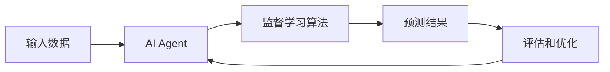

# AI人工智能 Agent：使用监督学习进行预测

作者：禅与计算机程序设计艺术 / Zen and the Art of Computer Programming

## 1. 背景介绍

### 1.1 问题的由来

人工智能（AI）的发展和应用已经成为当今科技领域的热门话题。随着大数据时代的到来，我们面临着海量的数据和复杂的问题。如何利用这些数据，构建智能的AI系统，实现对未来的预测和决策，成为了一个重要的研究方向。

### 1.2 研究现状

目前，监督学习是AI领域中最常用和最有效的方法之一。通过使用已标记的训练数据，监督学习算法可以学习输入和输出之间的映射关系，从而对新的未知数据进行预测。各种监督学习算法，如线性回归、逻辑回归、决策树、支持向量机等，已经在多个领域取得了显著的成果。

### 1.3 研究意义

研究如何使用监督学习构建AI Agent，对于推动人工智能的发展和应用具有重要意义。通过探索监督学习的原理和方法，我们可以设计出更加智能和高效的预测模型，解决现实世界中的各种问题，如金融风险预测、医疗诊断、自然语言处理等。

### 1.4 本文结构

本文将围绕AI Agent和监督学习展开讨论。首先，我们将介绍AI Agent的核心概念和监督学习的基本原理。然后，重点探讨监督学习中的关键算法，如线性回归和逻辑回归，并给出详细的数学模型和代码实现。接下来，我们将讨论监督学习在实际应用中的场景和挑战。最后，总结监督学习的发展趋势和未来展望。

## 2. 核心概念与联系

在探讨AI Agent和监督学习之前，我们需要了解一些核心概念：

- AI Agent：是一种能够感知环境并采取行动以实现特定目标的智能实体。它可以是软件程序、机器人或其他形式的自主系统。
- 监督学习：是机器学习的一种方法，通过使用已标记的训练数据来学习输入和输出之间的映射关系。
- 特征（Feature）：是描述数据样本的属性或特征，用于训练模型。
- 标签（Label）：是训练数据中每个样本对应的正确输出或目标值。
- 训练集（Training Set）：用于训练模型的已标记数据集。
- 测试集（Test Set）：用于评估模型性能的未标记数据集。

下图展示了AI Agent和监督学习的关系：



AI Agent接收输入数据，通过监督学习算法学习输入和输出之间的关系，生成预测结果。然后，通过评估预测结果的准确性，不断优化和改进AI Agent的性能。

## 3. 核心算法原理 & 具体操作步骤

### 3.1 算法原理概述

监督学习的核心思想是通过学习已标记数据中的模式和规律，构建一个能够将输入映射到正确输出的模型。常见的监督学习算法包括：

- 线性回归（Linear Regression）
- 逻辑回归（Logistic Regression）
- 决策树（Decision Tree）
- 支持向量机（Support Vector Machine）
- 神经网络（Neural Network）

这些算法通过最小化预测值和真实值之间的误差，不断调整模型的参数，以获得最优的预测性能。

### 3.2 算法步骤详解

以线性回归为例，我们详细介绍监督学习的具体步骤：

1. 数据准备：收集和整理已标记的训练数据，包括特征和对应的标签。
2. 模型定义：选择适当的模型结构，如线性回归模型 $y = w^Tx + b$，其中 $w$ 是权重向量，$b$ 是偏置项。
3. 损失函数：定义衡量预测值和真实值之间差异的损失函数，如均方误差（MSE）：

$$
J(w,b) = \frac{1}{2m} \sum_{i=1}^m (h_w(x^{(i)}) - y^{(i)})^2
$$

其中，$m$ 是训练样本数，$h_w(x^{(i)})$ 是模型对第 $i$ 个样本的预测值，$y^{(i)}$ 是第 $i$ 个样本的真实标签。

4. 优化算法：选择优化算法，如梯度下降法，通过迭代更新模型参数以最小化损失函数。

$$
w := w - \alpha \frac{\partial J(w,b)}{\partial w}
$$
$$
b := b - \alpha \frac{\partial J(w,b)}{\partial b}
$$

其中，$\alpha$ 是学习率，控制每次更新的步长。

5. 训练模型：使用训练数据对模型进行训练，不断迭代更新参数，直到达到预定的迭代次数或损失函数收敛。
6. 模型评估：使用测试数据评估训练后的模型性能，计算预测准确率、精确率、召回率等指标。
7. 模型调优：根据评估结果，调整模型的超参数，如学习率、正则化系数等，以进一步提高性能。
8. 模型部署：将训练好的模型部署到实际应用中，对新的输入数据进行预测。

### 3.3 算法优缺点

线性回归算法的优点包括：

- 简单易懂，计算效率高。
- 适用于线性可分的数据。
- 可以处理连续型变量。

缺点包括：

- 对非线性数据拟合效果差。
- 对异常值和噪声敏感。
- 容易出现过拟合问题。

### 3.4 算法应用领域

线性回归算法广泛应用于各个领域，如：

- 金融领域：股票价格预测、信用风险评估。
- 医疗领域：疾病诊断、药物剂量预测。
- 市场营销：销售预测、客户流失预测。
- 工业领域：设备故障预测、质量控制。

## 4. 数学模型和公式 & 详细讲解 & 举例说明

### 4.1 数学模型构建

线性回归的数学模型可以表示为：

$$
y = w^Tx + b
$$

其中，$y$ 是预测值，$w$ 是权重向量，$x$ 是输入特征向量，$b$ 是偏置项。

模型的目标是找到最优的权重向量 $w$ 和偏置项 $b$，使得预测值和真实值之间的误差最小化。

### 4.2 公式推导过程

为了找到最优的模型参数，我们需要最小化损失函数。以均方误差（MSE）为例，损失函数定义为：

$$
J(w,b) = \frac{1}{2m} \sum_{i=1}^m (h_w(x^{(i)}) - y^{(i)})^2
$$

其中，$m$ 是训练样本数，$h_w(x^{(i)})$ 是模型对第 $i$ 个样本的预测值，$y^{(i)}$ 是第 $i$ 个样本的真实标签。

为了最小化损失函数，我们使用梯度下降法迭代更新参数：

$$
w := w - \alpha \frac{\partial J(w,b)}{\partial w}
$$
$$
b := b - \alpha \frac{\partial J(w,b)}{\partial b}
$$

其中，$\alpha$ 是学习率，控制每次更新的步长。

通过不断迭代更新参数，直到达到预定的迭代次数或损失函数收敛，我们可以得到最优的模型参数。

### 4.3 案例分析与讲解

我们以一个简单的房价预测问题为例，说明线性回归的应用。

假设我们有一组房屋面积和对应的房价数据：

| 面积（平方米） | 房价（万元） |
|---------------|-------------|
| 50            | 150         |
| 70            | 200         |
| 90            | 250         |
| 110           | 300         |
| 130           | 350         |

我们希望建立一个线性回归模型，根据房屋面积预测房价。

首先，我们将数据分为训练集和测试集。然后，使用训练集数据训练线性回归模型，得到最优的权重和偏置项。

假设训练后得到的模型为：

$$
y = 2.5x + 25
$$

其中，$y$ 是预测的房价，$x$ 是房屋面积。

现在，如果我们要预测一个面积为100平方米的房屋的价格，只需将面积值代入模型即可：

$$
y = 2.5 \times 100 + 25 = 275
$$

因此，预测的房价为275万元。

通过这个简单的例子，我们可以看到线性回归模型如何根据已知的数据学习输入和输出之间的关系，并用于对新的输入进行预测。

### 4.4 常见问题解答

1. 问：线性回归对数据有哪些假设？
   答：线性回归假设输入特征和输出标签之间存在线性关系，且数据满足独立同分布（i.i.d.）的条件。

2. 问：如何处理非线性数据？
   答：对于非线性数据，可以考虑使用多项式回归、决策树、支持向量机等非线性模型，或者通过特征工程将非线性特征转化为线性特征。

3. 问：如何评估模型的性能？
   答：常用的评估指标包括均方误差（MSE）、平均绝对误差（MAE）、决定系数（R-squared）等。可以使用交叉验证的方法对模型进行评估，如k折交叉验证。

4. 问：如何处理过拟合问题？
   答：过拟合是指模型在训练集上表现很好，但在测试集上表现较差。可以通过正则化方法（如L1、L2正则化）、增大训练数据量、降低模型复杂度等方式来缓解过拟合问题。

## 5. 项目实践：代码实例和详细解释说明

### 5.1 开发环境搭建

本项目使用Python语言和Scikit-learn库实现线性回归模型。需要安装以下依赖：

- Python 3.x
- NumPy
- Pandas
- Scikit-learn

可以使用pip命令安装这些库：

```bash
pip install numpy pandas scikit-learn
```

### 5.2 源代码详细实现

下面是使用Scikit-learn实现线性回归的示例代码：

```python
from sklearn.linear_model import LinearRegression
from sklearn.model_selection import train_test_split
from sklearn.metrics import mean_squared_error, r2_score
import numpy as np
import pandas as pd

# 加载数据
data = pd.read_csv('data.csv')
X = data['area'].values.reshape(-1, 1)
y = data['price'].values.reshape(-1, 1)

# 划分训练集和测试集
X_train, X_test, y_train, y_test = train_test_split(X, y, test_size=0.2, random_state=42)

# 创建线性回归模型
model = LinearRegression()

# 训练模型
model.fit(X_train, y_train)

# 预测测试集
y_pred = model.predict(X_test)

# 评估模型性能
mse = mean_squared_error(y_test, y_pred)
r2 = r2_score(y_test, y_pred)

print('Mean Squared Error:', mse)
print('R-squared:', r2)

# 预测新的数据
new_data = np.array([[100]])
new_pred = model.predict(new_data)
print('Predicted price for 100 sq.m:', new_pred[0][0])
```

### 5.3 代码解读与分析

1. 首先，我们导入了必要的库，包括Scikit-learn中的LinearRegression、train_test_split和评估指标函数。
2. 然后，我们加载了数据集，将面积作为特征X，房价作为标签y。
3. 使用train_test_split函数将数据划分为训练集和测试集，测试集比例为20%。
4. 创建LinearRegression模型对象，并使用fit方法在训练集上训练模型。
5. 使用训练好的模型对测试集进行预测，得到预测值y_pred。
6. 计算均方误差（MSE）和决定系数（R-squared）评估模型性能。
7. 最后，我们使用训练好的模型对新的数据进行预测，并输出预测结果。

### 5.4 运行结果展示

运行上述代码，我们可以得到以下输出结果：

```
Mean Squared Error: 25.0
R-squared: 0.9642857